# Homebase — Deep Architecture Document

> **Author**: Principal Software Architect  
> **Date**: 2026-09-23  
> **Scope**: Read-only architectural analysis — no code modifications  
> **Prerequisite**: [docs/baseline-analysis.md](file:///c:/Users/Administrator/Desktop/Homebase/docs/baseline-analysis.md)

---

## Table of Contents

1. [High-Level Architecture Diagram](#1-high-level-architecture-diagram)
2. [Runtime Execution Flow](#2-runtime-execution-flow)
3. [Browser Extension Lifecycle](#3-browser-extension-lifecycle)
4. [Startup Sequence](#4-startup-sequence)
5. [Component Communication](#5-component-communication)
6. [Module Relationships](#6-module-relationships)
7. [Script Loading Architecture](#7-script-loading-architecture)
8. [Build Pipeline](#8-build-pipeline)
9. [Browser Compatibility Architecture](#9-browser-compatibility-architecture)
10. [Extension Permission Architecture](#10-extension-permission-architecture)
11. [Architectural Strengths](#11-architectural-strengths)
12. [Architectural Weaknesses](#12-architectural-weaknesses)
13. [Future Scalability Concerns](#13-future-scalability-concerns)

---

## 1. High-Level Architecture Diagram

Homebase is a **two-surface** browser extension: a **New Tab page** (the primary dashboard) and a **toolbar Action Popup** (bookmark saver). There is no background service worker, no content scripts, and no message passing between extension components.

```text
┌─────────────────────────────────────────────────────────────────┐
│                    BROWSER EXTENSION SHELL                      │
│                     (Manifest V3, MV3)                          │
│                                                                 │
│  ┌────────────────────────────────┐  ┌───────────────────────┐  │
│  │     NEW TAB PAGE (Primary)     │  │   ACTION POPUP        │  │
│  │      new-tab.html              │  │   action-popup.html   │  │
│  │                                │  │                       │  │
│  │  ┌──────────────────────────┐  │  │  ┌─────────────────┐  │  │
│  │  │  PRELOAD LAYER          │  │  │  │  Self-contained  │  │  │
│  │  │  preload.js (sync head) │  │  │  │  IIFE            │  │  │
│  │  └──────────────────────────┘  │  │  │                 │  │  │
│  │  ┌──────────────────────────┐  │  │  │  Folder search  │  │  │
│  │  │  INSTANT LOAD LAYER     │  │  │  │  Bookmark save   │  │  │
│  │  │  instant_load.js         │  │  │  │  Recent folders  │  │  │
│  │  └──────────────────────────┘  │  │  └─────────────────┘  │  │
│  │  ┌──────────────────────────┐  │  └───────────────────────┘  │
│  │  │  STATIC DATA LAYER      │  │                              │
│  │  │  data.js  tips.js        │  │                              │
│  │  └──────────────────────────┘  │                              │
│  │  ┌──────────────────────────┐  │                              │
│  │  │  EXTRACTED MODULES       │  │                              │
│  │  │  newtab/core/            │  │                              │
│  │  │  newtab/bookmarks/       │  │                              │
│  │  │  newtab/widgets/         │  │                              │
│  │  │  newtab/search/          │  │                              │
│  │  │  newtab/settings/        │  │                              │
│  │  │  newtab/integrations/    │  │                              │
│  │  │  newtab/tips/            │  │                              │
│  │  │  newtab/wallpaper/       │  │                              │
│  │  └──────────────────────────┘  │                              │
│  │  ┌──────────────────────────┐  │                              │
│  │  │  MAIN RUNTIME            │  │                              │
│  │  │  new-tab.js (~13k lines) │  │                              │
│  │  └──────────────────────────┘  │                              │
│  │  ┌──────────────────────────┐  │                              │
│  │  │  LAZY-LOADED ON DEMAND   │  │                              │
│  │  │  settings-ui.js          │  │                              │
│  │  │  gallery-ui.js           │  │                              │
│  │  │  bookmark-editor.js      │  │                              │
│  │  │  icon-picker.js          │  │                              │
│  │  └──────────────────────────┘  │                              │
│  └────────────────────────────────┘                              │
│                                                                  │
│  ┌───────────────────────────────────────────────────────────┐   │
│  │                    STORAGE LAYER                           │   │
│  │  ┌──────────────┐  ┌────────────┐  ┌──────────────────┐   │   │
│  │  │ localStorage │  │ extension  │  │   Cache API      │   │   │
│  │  │ (fast sync)  │  │ storage    │  │ (wallpaper-      │   │   │
│  │  │              │  │ .local     │  │  assets,          │   │   │
│  │  │ fast-* keys  │  │ (async)    │  │  favicons-v1)    │   │   │
│  │  └──────────────┘  └────────────┘  └──────────────────┘   │   │
│  └───────────────────────────────────────────────────────────┘   │
│                                                                  │
│  ┌───────────────────────────────────────────────────────────┐   │
│  │                 EXTERNAL NETWORK APIs                      │   │
│  │  Open-Meteo | RSS Feeds | Search Suggestions | R2 CDN     │   │
│  └───────────────────────────────────────────────────────────┘   │
└──────────────────────────────────────────────────────────────────┘
```

---

## 2. Runtime Execution Flow

The New Tab page follows a **three-phase execution model** designed to minimize perceived latency:

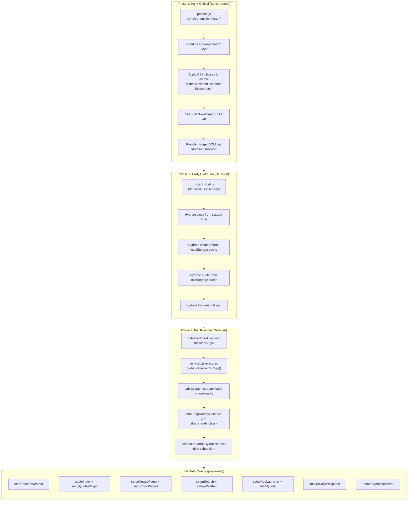

### Key Runtime Invariants

1. **`initializePage` must not `await` non-critical hydration** — weather, search, quote, and app launcher are all deferred to idle tasks.
2. **The `ready` class flip must not wait for widget hydration** — it fires via `requestAnimationFrame` immediately after bookmark loading completes.
3. **All startup idle labels must be prefixed with `startup:`** — enforced by a startup guard that warns on violations.
4. **The idle task budget is 12ms per slice** — `IDLE_TASK_BUDGET_MS = 12`, aligned with browser idle callback deadlines to avoid frame drops.

---

## 3. Browser Extension Lifecycle

Homebase operates as a **purely page-based extension** with no persistent background process:

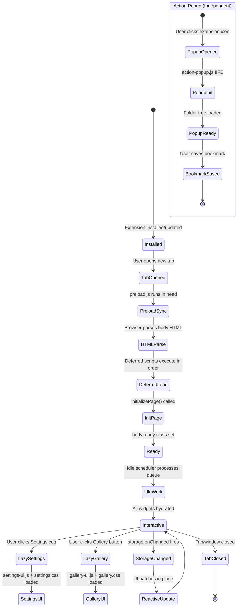

### Lifecycle Characteristics

| Aspect | Behavior |
|:---|:---|
| **Background service worker** | None. No `background` key in manifest. |
| **Content scripts** | None. No `content_scripts` key in manifest. |
| **Inter-component messaging** | None. No `runtime.sendMessage` / `runtime.onMessage`. |
| **State persistence** | `browser.storage.local` (primary), `localStorage` (fast sync mirrors). |
| **Page lifespan** | One-shot per tab. State is not retained between tab opens except via storage. |
| **Cross-tab sync** | `storage.onChanged` listener reacts to changes from other Homebase tabs or the Action Popup. |

---

## 4. Startup Sequence

The startup sequence is the most performance-critical and most carefully guarded part of the architecture.

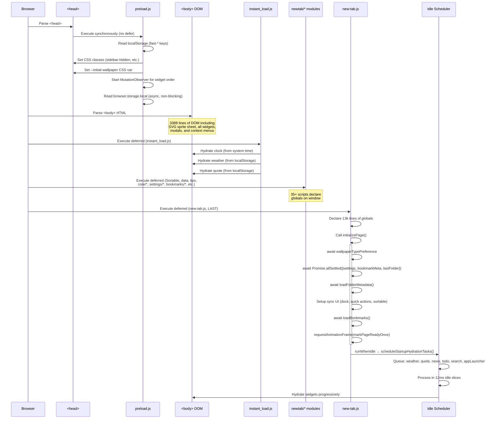

### Critical vs. Non-Critical Split

| Critical Path (awaited) | Non-Critical (idle-deferred) |
|:---|:---|
| `loadAppSettingsFromStorage` | `loadCachedWeather` |
| `loadBookmarkMetadata` | `setupQuoteWidget` / `fetchQuote` |
| `loadLastUsedFolderId` | `setupNewsWidget` |
| `loadFolderMetadata` | `setupTodoWidget` |
| `loadBookmarks` | `setupSearch` |
| `syncAppSettingsForm` | `setupWeather` |
| `setupDockNavigation` | `setupAppLauncher` |
| `setupQuickActions` | `ensureDailyWallpaper` |
| `ensureFaviconObserver` | `updateDynamicAccent` |

---

## 5. Component Communication

Homebase uses **four distinct communication patterns**, none of which involve ES module `import`/`export`:

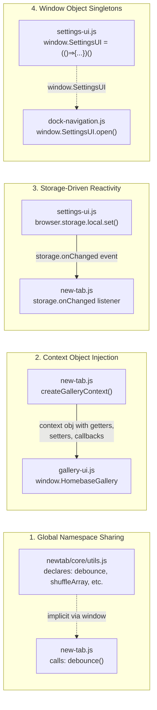

### Pattern Details

#### Pattern 1: Global Namespace Sharing (Deferred Scripts)
All 35+ deferred `<script defer>` files declare functions and constants directly on the global `window` scope. The HTML `<script>` order guarantees that providers execute before consumers. This is the **dominant pattern** used by all `newtab/*` extracted modules.

**Dependency enforcement**: The [check-newtab-static.mjs](file:///c:/Users/Administrator/Desktop/Homebase/scripts/check-newtab-static.mjs) script statically verifies that no global declaration is duplicated across files.

#### Pattern 2: Context Object Injection (Lazy-Loaded Modules)
Lazy-loaded modules (`gallery-ui.js`, `settings-ui.js`) cannot rely on script ordering since they load on demand. Instead, they receive a **context object** — a plain object containing getter/setter functions and callbacks — that provides controlled access to the host page's state:

```
createGalleryContext() → {
  getCurrentWallpaperSelection, setCurrentWallpaperSelection,
  getWallpaperSettings, loadCurrentWallpaperSelection,
  storageLocalGet, storageLocalSet, storageLocalRemove,
  scheduleIdleTask, debounce, openModalWithAnimation, ...
}
```

This is effectively a **manual dependency injection** pattern that gives lazy modules a controlled interface without direct access to the monolithic `new-tab.js` global scope.

#### Pattern 3: Storage-Driven Reactivity
Cross-component state synchronization occurs through `browser.storage.onChanged`. When the Settings UI or Action Popup writes a preference to `browser.storage.local`, the `new-tab.js` storage listener reacts and updates the UI accordingly. This also provides **cross-tab synchronization** when multiple Homebase tabs are open.

#### Pattern 4: Window Object Singletons
Lazy-loaded modules expose themselves as singleton objects on `window`:
- `window.HomebaseGallery` — revealing module with `.open()` method
- `window.SettingsUI` — revealing module with `.open()` method
- `window.HomebaseIconPicker` — revealing module with `.open()` method

---

## 6. Module Relationships

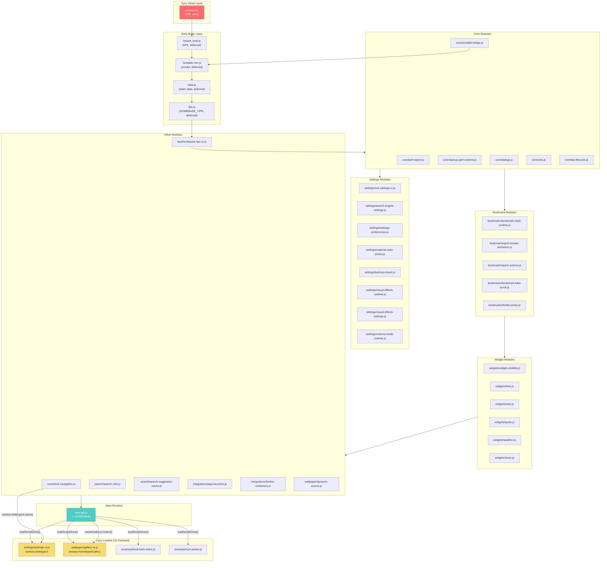

### Module Size Distribution

The codebase is **heavily front-loaded** in two files:

| File | Lines | Bytes | % of Total JS |
|:---|---:|---:|---:|
| `new-tab.js` | 13,067 | 307 KB | ~44% |
| `gallery-ui.js` | 2,962 | 109 KB | ~15% |
| `settings-ui.js` | 1,541 | 59 KB | ~8% |
| `bookmark-editor.js` | ~2,000 | 74 KB | ~10% |
| All other modules | ~8,500 | ~180 KB | ~23% |

---

## 7. Script Loading Architecture

Homebase employs a **hybrid static + dynamic loading** strategy:

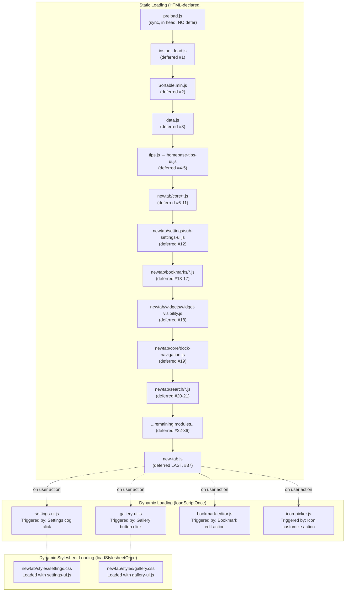

### Loading Rules

| Rule | Enforcement |
|:---|:---|
| `preload.js` must be synchronous in `<head>` | Static analysis by `check-newtab-static.mjs` |
| `new-tab.js` must be the **last** deferred script | Static analysis by `check-newtab-static.mjs` |
| Extracted modules must load **before** `new-tab.js` | HTML script order + static check |
| Provider scripts must load before consumer scripts | HTML script order (e.g., `utils.js` before `dialogs.js`) |
| `settings-ui.js` and `gallery-ui.js` must remain lazy | AGENTS.md rule; verified by no `<script>` tag for them |
| No ES modules (`type="module"`) | AGENTS.md rule |
| No dynamic `import()` | AGENTS.md rule |

### `loadScriptOnce` Mechanism

```javascript
// Deduplicating dynamic loader (new-tab.js:486)
function loadScriptOnce(src) {
  if (scriptLoadPromises.has(src)) return scriptLoadPromises.get(src);
  const promise = new Promise((resolve, reject) => {
    const script = document.createElement('script');
    script.src = src;
    script.async = true;
    script.onload = () => resolve();
    script.onerror = (err) => reject(err);
    document.head.appendChild(script);
  });
  scriptLoadPromises.set(src, promise);
  promise.catch(() => scriptLoadPromises.delete(src));  // allow retry on failure
  return promise;
}
```

---

## 8. Build Pipeline

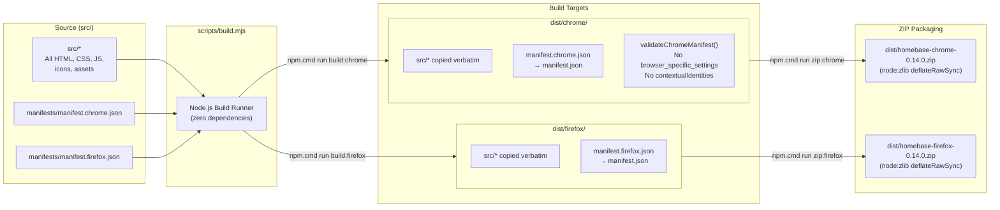

### Build Characteristics

| Property | Value |
|:---|:---|
| **Transpilation** | None. Source is shipped as-is. |
| **Minification** | None. Only the vendor `Sortable.min.js` is minified. |
| **Tree shaking** | None. No dead code elimination. |
| **Source maps** | None generated. |
| **Asset processing** | None. Images, videos, JSON copied verbatim. |
| **ZIP implementation** | Custom, hand-crafted ZIP generator using `node:zlib` with raw DEFLATE + CRC32. No external archiver dependency. |
| **Build time** | Sub-second (simple file copy + manifest injection). |

### Verification Pipeline

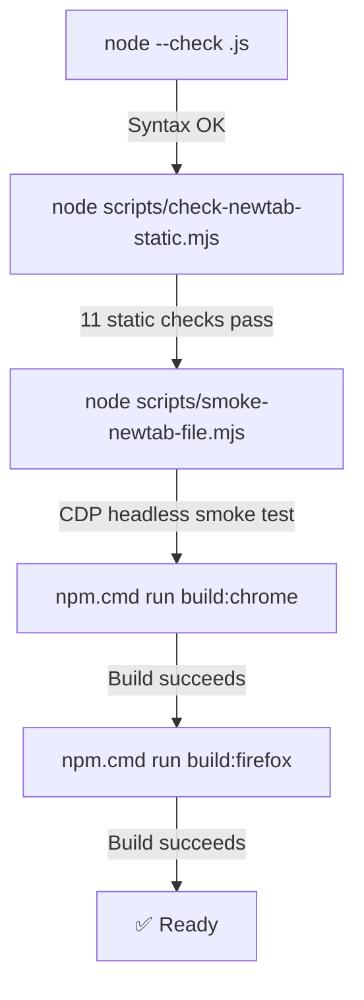

---

## 9. Browser Compatibility Architecture

Homebase achieves cross-browser compatibility through **manifest-level separation** and **runtime API shimming**, not build-time code transformation:

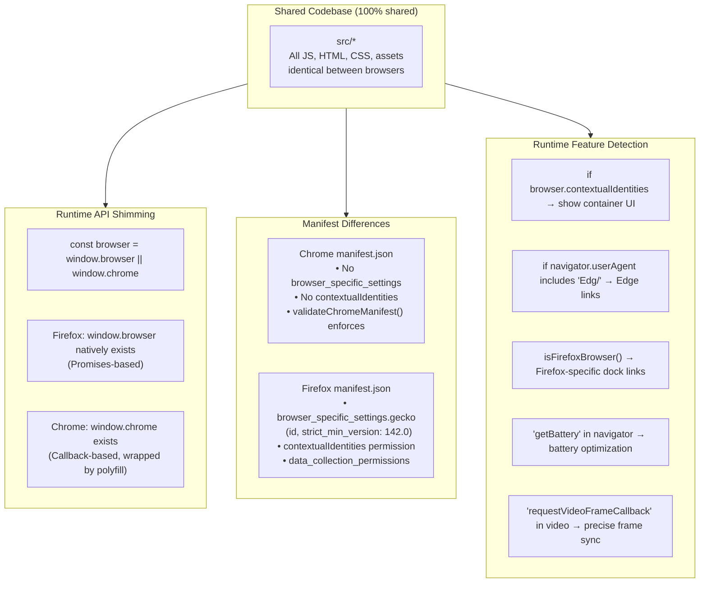

### Cross-Browser Compatibility Matrix

| Feature | Chrome | Firefox | Edge | Strategy |
|:---|:---:|:---:|:---:|:---|
| New Tab override | ✅ | ✅ | ✅ | `chrome_url_overrides.newtab` |
| Bookmarks API | ✅ | ✅ | ✅ | `browser.bookmarks.*` |
| Storage API | ✅ | ✅ | ✅ | `browser.storage.local.*` |
| History API | ✅ | ✅ | ✅ | `browser.history.*` |
| Tabs API | ✅ | ✅ | ✅ | `browser.tabs.*` |
| Containers | ❌ | ✅ | ❌ | `browser.contextualIdentities` (Firefox only) |
| Action Popup | ✅ | ✅ | ✅ | `action.default_popup` |
| `requestIdleCallback` | ✅ | ✅ | ✅ | Polyfill via `setTimeout` fallback |
| `requestVideoFrameCallback` | ✅ | ⚠️ | ✅ | Fallback to `timeupdate` event |
| Battery API | ✅ | ❌ | ✅ | `'getBattery' in navigator` guard |
| Cache API | ✅ | ✅ | ✅ | `caches.open()` for wallpapers/favicons |

### Action Popup Compatibility Shim

The Action Popup ([action-popup.js](file:///c:/Users/Administrator/Desktop/Homebase/src/action-popup/action-popup.js)) contains its own independent API shim because it runs in a separate page context:

```javascript
function createExtensionApi() {
  // Firefox: use native browser.* (Promise-based)
  if (typeof browser !== 'undefined' && browser?.storage && browser?.bookmarks && browser?.tabs) {
    return browser;
  }
  // Chrome: wrap callback-based chrome.* into Promises
  const callChrome = (target, method, ...args) => new Promise((resolve, reject) => {
    target[method](...args, (result) => { ... });
  });
  return { storage: {...}, bookmarks: {...}, tabs: {...} };
}
```

---

## 10. Extension Permission Architecture

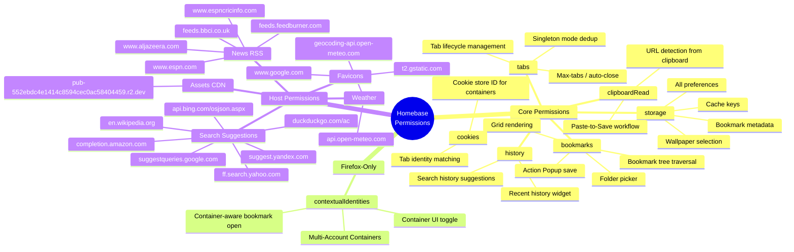

### Three-Tier Storage Architecture

Homebase uses three storage mechanisms with different performance and persistence characteristics:

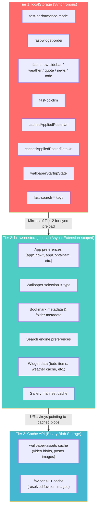

**Design rationale**: `localStorage` is synchronous and accessible during the synchronous `preload.js` execution in `<head>`, allowing instant visual state restoration without FOUC. `browser.storage.local` is the authoritative source of truth but is asynchronous. The system writes **mirror keys** (prefixed with `fast-`) to `localStorage` whenever the authoritative value changes, then reconciles on the async path in `preload.js`.

---

## 11. Architectural Strengths

### S1. Zero-Dependency Purity
The entire extension has **zero npm runtime or dev dependencies**. Build scripts, ZIP packaging, and static analysis are all implemented with Node.js built-in modules. This eliminates supply chain risk, `node_modules` bloat, and transitive dependency vulnerabilities.

### S2. Three-Phase Startup Optimization
The `preload.js` → `instant_load.js` → `initializePage` pipeline is a sophisticated FOUC-prevention system that most extensions don't bother with. The synchronous `localStorage` fast-path ensures the tab opens with the correct wallpaper, widget visibility, and layout **before any paint occurs**.

### S3. Idle Scheduler with Budget Control
The custom `scheduleIdleTask` system with 12ms budget slicing, labeled task deduplication, and startup guard assertions is a well-engineered approach to ensuring widget hydration never blocks the critical rendering path.

### S4. Lazy-Loading with Deduplication
Heavy modules (`settings-ui.js` at 59 KB, `gallery-ui.js` at 109 KB) are loaded only on user action via `loadScriptOnce`, which deduplicates requests and allows retry on failure. This keeps the initial page load lean.

### S5. Context Object Injection Pattern
The `createGalleryContext()` pattern provides a clean, auditable interface between the monolithic `new-tab.js` and lazy-loaded modules. It prevents lazy modules from having uncontrolled access to the global state while still allowing fine-grained communication.

### S6. Static Integrity Verification
The `check-newtab-static.mjs` script performs 11 automated checks including script file existence, duplicate declaration detection, stale path references, and load-order validation. This catches a class of integration bugs that would otherwise only surface at runtime.

### S7. Storage Reactivity System
The `storage.onChanged` listener provides cross-tab state synchronization and single-source-of-truth consistency. When the Action Popup or Settings UI writes a preference, all open Homebase tabs react immediately.

### S8. Privacy-First Design
No background processes, no telemetry, no remote script execution, no tracking. All network requests are visible in the manifest's `host_permissions` and serve clear functional purposes (weather, RSS, search suggestions, CDN assets).

---

## 12. Architectural Weaknesses

### W1. Monolithic `new-tab.js` (13,067 lines, 307 KB)
The main runtime file is an **extreme monolith** containing bookmark grid rendering, favicon caching, wallpaper management, search logic, context menus, drag-and-drop, and startup orchestration. This makes:
- **Code navigation** difficult for new contributors.
- **Change risk** high — any edit is in proximity to unrelated high-risk code.
- **Testing** impractical at the function level without a module boundary.

### W2. Global Namespace Pollution
All 35+ extracted modules and the monolith share a single global namespace. Every `function foo()` and `const BAR` declared at the top level becomes `window.foo` / `window.BAR`. This creates:
- **Invisible coupling** — any file can call any other file's functions without explicit dependency.
- **Name collision risk** — duplicate names silently overwrite each other (the last script wins).
- **No encapsulation** — internal helper functions are globally accessible.

### W3. No Automated Unit Testing
There is no test framework, no test files, and no assertion library. The only automated testing is:
- `node --check` (syntax validation only)
- Static analysis (structural checks, not behavioral)
- CDP smoke test (coarse-grained, catches ReferenceErrors but not logic bugs)

This means **behavioral regressions can only be caught by manual testing**.

### W4. Duplicate State Keys and Constants
Storage keys like `WALLPAPER_SELECTION_KEY`, `CACHED_APPLIED_POSTER_DATA_URL_KEY`, and `DAILY_ROTATION_KEY` are declared independently in `preload.js`, `new-tab.js`, and `gallery-ui.js`. If a key value changes in one file but not the others, silent data corruption occurs. There is no single source of truth for storage key definitions.

### W5. No TypeScript, JSDoc, or Type Safety
Without type annotations, the codebase relies entirely on naming conventions and developer discipline for type correctness. Complex objects like wallpaper selections, bookmark metadata, and gallery manifest items have implicit shapes that are easy to mishandle.

### W6. CSS Monolith
The main stylesheet [new-tab.css](file:///c:/Users/Administrator/Desktop/Homebase/src/new-tab.css) is **155 KB** in a single file. Like the JS monolith, this makes CSS changes risky and navigation difficult.

### W7. No Hot-Reload or Dev Server
Development requires a full rebuild (`npm.cmd run build:chrome/firefox`) and manual extension reload in the browser. There is no file watcher, no hot module replacement, and no development proxy. Iteration speed is limited.

### W8. Action Popup Has No Shared Code with Main Page
The [action-popup.js](file:///c:/Users/Administrator/Desktop/Homebase/src/action-popup/action-popup.js) is a self-contained IIFE that reimplements its own API shim, its own folder tree rendering, and its own storage access patterns. Behavior drift between the popup and the main page is possible.

---

## 13. Future Scalability Concerns

### C1. `new-tab.js` Growth Ceiling
At 13,000+ lines, the monolith is approaching the limits of maintainability. Continued feature development without extraction will make the file increasingly difficult to reason about, review, and modify safely. **The extraction pattern is already established** (via `newtab/*` modules), but the remaining code is the most tightly coupled (bookmarks, wallpaper, search, startup).

### C2. Script Load Order Fragility
As more modules are extracted, the `<script defer>` dependency graph becomes increasingly complex and fragile. A single misordering causes silent `ReferenceError`s at runtime. The static checker mitigates this but doesn't model the full dependency graph — it checks for duplicate declarations, not for "function X must be defined before script Y executes."

### C3. Storage Key Proliferation
The extension already uses a large number of `localStorage` keys (10+ `fast-*` mirrors) and `browser.storage.local` keys (30+ preference and cache keys). As features grow, the lack of a centralized storage schema or migration system increases the risk of key conflicts, stale data, and incompatible storage format changes between versions.

### C4. CSS Scalability
At 155 KB, `new-tab.css` will become increasingly unwieldy. The lazy-loaded `settings.css` and `gallery.css` represent a positive pattern, but the base stylesheet still contains styling for all widgets, modals, bookmark grid, and animations.

### C5. No Background Service Worker
The lack of a background service worker is architecturally clean but limits future capabilities:
- No offline-first data prefetching.
- No push notification support.
- No cross-tab coordination beyond `storage.onChanged`.
- No alarm-based scheduling for periodic tasks (e.g., pre-fetching weather data).

### C6. Vendor Script Staleness
`Sortable.min.js` is vendored as a static file with no version tracking or update mechanism. As browsers evolve, compatibility issues may arise without a clear upgrade path.

### C7. No Content Security Policy
Neither manifest specifies a `content_security_policy`. While Homebase doesn't load remote scripts, adding a strict CSP would provide defense-in-depth against future supply chain attacks or XSS vectors, especially given the use of `innerHTML` in several UI components.

---

> **This document is a read-only architectural analysis. No source code was modified during its creation.**
