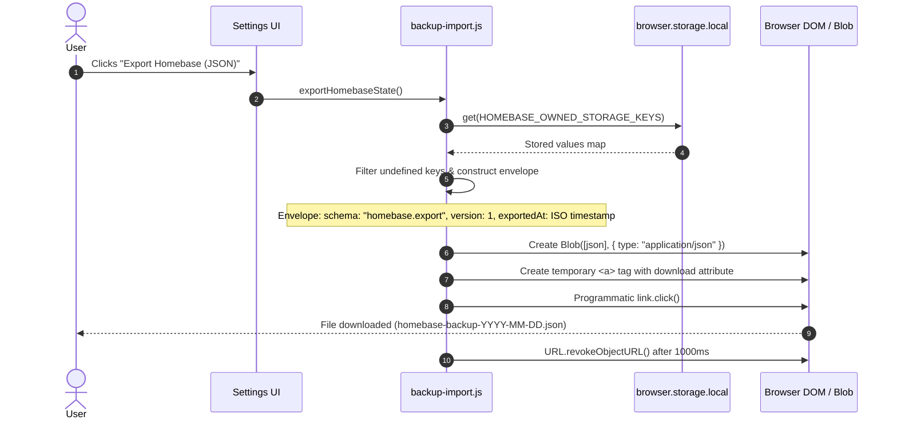
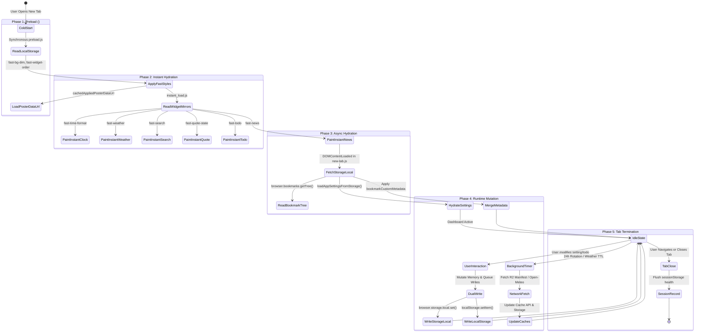

# Homebase — Complete Data Architecture & Data Flow Analysis

> **Author**: Principal Software Architect & Data Systems Engineer  
> **Date**: 2026-09-24  
> **Scope**: Read-only data architecture and flow analysis — no code modifications  
> **Prerequisites**: [docs/00-project-baseline.md](file:///c:/Users/Administrator/Desktop/Homebase/docs/00-project-baseline.md), [docs/01-architecture.md](file:///c:/Users/Administrator/Desktop/Homebase/docs/01-architecture.md), [docs/02-feature-map.md](file:///c:/Users/Administrator/Desktop/Homebase/docs/02-feature-map.md)

---

## Executive Summary

Homebase employs a **hybrid, multi-tier data storage architecture** designed to satisfy two competing goals:
1. **Instant, zero-latency first-paint render** on new tab creation (eliminating white flash and layout shift).
2. **Persistent, schema-structured, cross-session durability** for high-volume data (bookmarks, visual styles, offline cached media, and user preferences).

To balance these goals without a background service worker or a centralized database, the extension coordinates data across **five distinct tiers**:
1. **Synchronous Fast-Path (`localStorage`)**: Stores lightweight mirrors and visual layout flags for instant synchronous reads during HTML `<head>` evaluation.
2. **Asynchronous Persistent Store (`browser.storage.local`)**: The canonical source of truth for all structured user preferences, custom metadata, and widget configurations.
3. **Cache Storage API (`window.caches`)**: Binary and asset blob store for full-resolution background videos, video posters, user-uploaded wallpaper assets, and dynamically resolved high-definition favicons.
4. **Transient Tab Session (`sessionStorage`)**: In-memory tab-isolated storage used exclusively for cross-navigation performance health tracking.
5. **In-Memory JavaScript State (Module Globals & Memory Caches)**: Ephemeral runtime state holding decoded bookmark nodes, DOM element caches, search engine descriptors, and debounce timers.

This document provides a comprehensive, rigorous analysis of the entire data pipeline, including storage mechanisms, exhaustive key inventories, data structures, backup algorithms, lifecycle state machines, migration risks, and privacy impacts.

---

## Table of Contents

1. [Storage Mechanisms Overview](#1-storage-mechanisms-overview)
2. [Complete Storage Keys Inventory](#2-complete-storage-keys-inventory)
3. [Core Data Structures & Schemas](#3-core-data-structures--schemas)
4. [User Preferences Catalog](#4-user-preferences-catalog)
5. [Multi-Tier Cache Strategy](#5-multi-tier-cache-strategy)
6. [Backup & Import System](#6-backup--import-system)
7. [End-to-End Data Lifecycle](#7-end-to-end-data-lifecycle)
8. [Schema Migration Concerns](#8-schema-migration-concerns)
9. [Data Loss Risks & Edge Cases](#9-data-loss-risks--edge-cases)
10. [Privacy, Data Leaks & Security Considerations](#10-privacy-data-leaks--security-considerations)

---

## 1. Storage Mechanisms Overview

Homebase uses five distinct storage technologies, each fulfilling a specialized latency, persistence, or size-tier role.

```
┌────────────────────────────────────────────────────────────────────────────────────────┐
│                                  HOMEBASE CLIENT TIERS                                 │
├─────────────────────────┬─────────────────────────┬────────────────────────────────────┤
│ STORAGE MECHANISM       │ PRIMARY ROLE            │ CHARACTERISTICS                    │
├─────────────────────────┼─────────────────────────┼────────────────────────────────────┤
│ 1. window.localStorage  │ Fast Preload & Mirrors  │ Synchronous, Blocking, 5-10MB Cap  │
│ 2. browser.storage.local│ Canonical Truth         │ Asynchronous, Indexed, ~Unlimited  │
│ 3. window.caches (API)  │ High-Volume Binary/Blob │ Asynchronous, Evictable, Origin Cap│
│ 4. window.sessionStorage│ Diagnostic Health       │ Synchronous, Per-Tab, Ephemeral    │
│ 5. JS In-Memory Heap    │ Runtime Execution       │ Ultra-fast, Non-Persistent         │
└─────────────────────────┴─────────────────────────┴────────────────────────────────────┘
```

### Detailed Mechanism Breakdown

| Mechanism | Access Pattern | Scope | Thread Context | Persistence | Quota / Size Limits | Primary Use Case in Homebase |
| :--- | :--- | :--- | :--- | :--- | :--- | :--- |
| **`browser.storage.local`** | Async (`Promise` / Callback) | Global Extension Origin | Main Thread | Persistent across browser restarts & profile sessions | ~Unlimited (with `unlimitedStorage` permission) or browser default (~10MB without) | Canonical store for 76+ user settings, bookmark customizations, widget settings, folder metadata. |
| **`window.localStorage`** | Sync (`getItem`, `setItem`) | Origin (`chrome-extension://` or `moz-extension://`) | Main Thread | Persistent across browser restarts | 5 MB – 10 MB per origin | Preload layer (`preload.js`, `instant_load.js`) to read wallpaper state, widget visibility, dim value, and clock format before CSS/DOM paint. |
| **`window.caches` (Cache API)** | Async (`Promise`-based Request/Response) | Origin Storage Bucket | Main Thread | Persistent (subject to browser disk quota eviction) | Shared disk quota (hundreds of MBs / GBs based on free disk) | Storing large video wallpapers, poster images, custom user uploaded wallpapers, and resolved high-res favicons. |
| **`window.sessionStorage`** | Sync (`getItem`, `setItem`) | Single Tab Instance | Main Thread | Cleared when the tab or window is closed | 5 MB per tab | Tracks startup health metrics and consecutive reload times (`homebasePerfHealthSession`) across tab refreshes. |
| **In-Memory Heap** | Direct Variable Access | Execution Context | JavaScript Engine | Cleared on page navigation, reload, or tab close | V8 / SpiderMonkey heap limits (~2GB) | Runtime bookmark trees, active filtered search results, Sortable.js DOM references, in-flight promises. |

> [!NOTE]
> **Absence of `browser.storage.sync`**: Homebase does **not** use `browser.storage.sync`. All synchronization is intentionally local to protect privacy, avoid Google/Mozilla account sync limits (100KB total quota, 8KB per item), and prevent binary payload corruption.

---

## 2. Complete Storage Keys Inventory

The following tables document **every key** utilized across all storage mechanisms in the entire Homebase repository.

### 2.1 Canonical `browser.storage.local` Keys (76 Documented Keys)

These keys represent the canonical source of truth managed primarily in [src/newtab/settings/backup-import.js](file:///c:/Users/Administrator/Desktop/Homebase/src/newtab/settings/backup-import.js), [src/new-tab.js](file:///c:/Users/Administrator/Desktop/Homebase/src/new-tab.js), and widgets.

| Storage Key | Data Type | Default Value | Owning Module / File | Mirrored to `localStorage`? | Included in Backup? | Purpose & Description |
| :--- | :--- | :--- | :--- | :---: | :---: | :--- |
| `wallpaperSelection` | `Object` / `null` | `null` | `new-tab.js` | Partial (`wallpaperStartupState`) | Yes | Current active wallpaper metadata (id, title, url, poster, type, mode). |
| `cachedAppliedPosterUrl` | `String` | `""` | `new-tab.js` | Yes | Yes | Public or blob URL of the active background poster image. |
| `cachedAppliedPosterDataUrl` | `String` | `""` | `new-tab.js` | Yes | Yes | Base64 data URL (<240KB) of the active background poster for instant paint. |
| `cachedAppliedPoster` | `String` | `""` | `new-tab.js` | No | Yes | Legacy poster image reference. |
| `cachedAppliedVideoUrl` | `String` | `""` | `new-tab.js` | No | Yes | Cached remote URL of the currently playing MP4/WebM video. |
| `videosManifest` | `Array<Object>` | `[]` | `new-tab.js` | No | Yes | Cached JSON manifest of remote curated wallpapers from Cloudflare R2. |
| `videosManifestFetchedAt` | `Number` | `0` | `new-tab.js` | No | Yes | Epoch timestamp (ms) when `videosManifest` was last fetched. |
| `cachedGalleryPosters` | `Array<String>` | `[]` | `new-tab.js` | No | Yes | Array of cached gallery poster identifiers currently residing in Cache Storage. |
| `wallpaperPoolIds` | `Array<String>` | `[]` | `new-tab.js` | No | Yes | Array of wallpaper IDs included in the daily rotation pool. |
| `wallpaperFallbackUsedAt` | `Number` | `0` | `new-tab.js` | No | Yes | Timestamp tracking when fallback wallpaper was displayed due to asset failure. |
| `pendingDailyRotation` | `Object` / `null` | `null` | `new-tab.js` | No | Yes | Holds candidate wallpaper queued for rotation after startup stabilization. |
| `pendingDailyRotationSince` | `Number` | `0` | `new-tab.js` | No | Yes | Timestamp when the pending daily rotation was registered. |
| `galleryFavorites` | `Array<String>` | `[]` | `new-tab.js`, `gallery-ui.js` | No | Yes | List of user favorited wallpaper IDs. |
| `dailyWallpaperEnabled` | `Boolean` | `true` | `new-tab.js`, `gallery-ui.js` | No | Yes | User preference enabling automatic 24-hour daily wallpaper rotation. |
| `wallpaperTypePreference` | `String` | `'video'` | `new-tab.js`, `gallery-ui.js` | No | Yes | Background medium preference: `'video'` or `'static'`. |
| `wallpaperQualityPreference` | `String` | `'high'` | `new-tab.js`, `gallery-ui.js` | No | Yes | Video resolution stream preference: `'high'` (1080p/4K) or `'low'` (720p). |
| `appTimeFormatPreference` | `String` | `'12-hour'` | `settings-preferences.js`, `time.js` | Yes (`fast-time-format`) | Yes | Clock format preference: `'12-hour'` or `'24-hour'`. |
| `appBackgroundDim` | `Number` | `0` | `settings-preferences.js`, `preload.js` | Yes (`fast-bg-dim`) | Yes | Background overlay darkness percentage (`0` to `80`). |
| `appShowSidebar` | `Boolean` | `true` | `widget-visibility.js` | Yes (`fast-show-sidebar`) | Yes | Master toggle for the entire right-side widget panel. |
| `appShowWeather` | `Boolean` | `true` | `widget-visibility.js`, `weather.js` | Yes (`fast-show-weather`) | Yes | Weather widget visibility toggle. |
| `appShowQuote` | `Boolean` | `true` | `widget-visibility.js`, `quote.js` | Yes (`fast-show-quote`) | Yes | Daily Quote widget visibility toggle. |
| `appShowNews` | `Boolean` | `false` | `widget-visibility.js`, `news.js` | Yes (`fast-show-news`) | Yes | News widget visibility toggle. |
| `appShowTodo` | `Boolean` | `true` | `widget-visibility.js`, `todo.js` | Yes (`fast-show-todo`) | Yes | Todo widget visibility toggle. |
| `todoItems` | `Array<Object>` | `[]` | `todo.js` | Yes (`fast-todo`) | Yes | Array of user todo task objects (`{ id, text, done, createdAt }`). |
| `todoHideDone` | `Boolean` | `false` | `todo.js` | Yes (`fast-todo`) | Yes | Toggle to filter out completed todo items from the widget list. |
| `widgetOrder` | `Array<String>` | `['weather', 'quote', 'todo', 'news']` | `widget-visibility.js` | Yes (`fast-widget-order`) | Yes | User drag-sorted display order of sidebar widgets. |
| `appNewsSource` | `String` | `'aljazeera'` | `news.js` | Yes (`fast-news`) | Yes | Active RSS news provider ID (`'bbc-top'`, `'aljazeera'`, `'techcrunch'`, etc.). |
| `appMaxTabsCount` | `Number` | `0` | `tab-lifecycle.js` | No | Yes | Tab limiter threshold (`0` = disabled; integer = max open tabs). |
| `appAutoCloseMinutes` | `Number` | `0` | `tab-lifecycle.js` | No | Yes | Inactivity timeout in minutes before auto-closing tabs (`0` = disabled). |
| `appSingletonMode` | `Boolean` | `false` | `tab-lifecycle.js` | No | Yes | Restricts browser to only a single active Homebase tab. |
| `appSearchOpenNewTab` | `Boolean` | `false` | `settings-preferences.js`, `new-tab.js` | No | Yes | When true, search queries open in a new browser tab. |
| `appSearchRememberEngine` | `Boolean` | `true` | `settings-preferences.js`, `new-tab.js` | No | Yes | Remembers the last selected search engine across sessions. |
| `appSearchDefaultEngine` | `String` | `'google'` | `search-engine-settings.js` | No | Yes | Primary fallback search engine ID. |
| `appSearchMath` | `Boolean` | `true` | `settings-preferences.js`, `new-tab.js` | No | Yes | Evaluates mathematical expressions inline inside search query input. |
| `appSearchShowHistory` | `Boolean` | `false` | `search-history-suggestions.js` | No | Yes | Displays recent browser history items in search dropdown. |
| `appSearchSuggestionsEnabled`| `Boolean` | `true` | `search-history-suggestions.js` | No | Yes | Queries remote search engine autosuggest APIs as the user types. |
| `appBookmarkOpenNewTab` | `Boolean` | `false` | `settings-preferences.js`, `new-tab.js` | No | Yes | Controls whether clicking bookmark tiles launches links in a new tab. |
| `appBookmarkTextBg` | `Boolean` | `true` | `bookmark-style-runtime.js` | No | Yes | Enables semi-transparent backdrop behind bookmark tile labels. |
| `appBookmarkTextBgColor` | `String` | `'#2CA5FF'` | `bookmark-style-runtime.js` | No | Yes | Hex color value for bookmark text backdrop chip. |
| `appBookmarkTextBgOpacity` | `Number` | `0.65` | `bookmark-style-runtime.js` | No | Yes | Opacity float (`0.0` to `1.0`) for bookmark title chip. |
| `appBookmarkTextBgBlur` | `Number` | `4` | `bookmark-style-runtime.js` | No | Yes | Backdrop blur radius in pixels (`0` to `20`) for bookmark labels. |
| `appBookmarkFallbackColor` | `String` | `'#00b8d4'` | `bookmark-style-runtime.js` | No | Yes | Accent color for bookmarks without resolved icons. |
| `appBookmarkFolderColor` | `String` | `'#FFFFFF'` | `bookmark-style-runtime.js` | No | Yes | Default icon color for bookmark folder tab headers. |
| `appPerformanceMode` | `Boolean` | `false` | `settings-preferences.js` | Yes (`fast-performance-mode`)| Yes | Disables backdrop blur, shadows, and transitions for lower-end hardware. |
| `debugPerfOverlay` | `Boolean` | `false` | `perf-report.js` | No | Yes | Toggles diagnostic on-screen FPS, DOM node count, and paint metric overlay. |
| `appBatteryOptimization` | `Boolean` | `false` | `settings-preferences.js` | No | Yes | Halts animations and video playback when running on battery power. |
| `appCinemaMode` | `Boolean` | `false` | `cinema-mode-runtime.js` | No | Yes | Auto-hides all UI widgets, search bars, and docks after inactivity timeout. |
| `appContainerMode` | `Boolean` | `true` | `firefox-containers.js` | No | Yes | Enables Firefox Multi-Account Container picker on bookmark click. |
| `appContainerNewTab` | `Boolean` | `true` | `firefox-containers.js` | No | Yes | Forces container bookmark launches into a dedicated container tab. |
| `appGridAnimationPref` | `String` | `'default'` | `visual-effects-runtime.js` | No | Yes | CSS animation preset for bookmark grid cards (`'scale'`, `'fade'`, etc.). |
| `appGridAnimationSpeed` | `Number` | `0.3` | `visual-effects-runtime.js` | No | Yes | Animation duration in seconds (`0.1` to `1.0`). |
| `appGridAnimationEnabled` | `Boolean` | `false` | `visual-effects-runtime.js` | No | Yes | Toggle switch enabling or suppressing bookmark grid entry animations. |
| `appGlassStylePref` | `String` | `'original'`| `visual-effects-runtime.js` | No | Yes | Glassmorphism blur style preset (`'original'`, `'frosted'`, `'tinted'`). |
| `bookmarkCustomMetadata` | `Object` | `{}` | `new-tab.js`, `bookmark-editor.js` | No | Yes | Map of bookmark ID -> custom properties (`{ icon, originalUrl, title }`). |
| `homebaseBookmarkRootId` | `String` | `""` | `new-tab.js`, `action-popup.js` | No | Yes | Browser bookmark folder ID designated as Homebase root directory. |
| `folderCustomMetadata` | `Object` | `{}` | `new-tab.js`, `bookmark-editor.js` | No | Yes | Map of folder ID -> visual styling (`{ color, icon }`). |
| `domainIconMap` | `Object` | `{}` | `bookmark-editor.js` | No | Yes | Hostname -> base64 favicon data URL cache mapping. |
| `lastUsedBookmarkFolderId` | `String` | `""` | `new-tab.js` | No | Yes | Bookmark folder ID active when user last navigated dashboard. |
| `quoteUpdateFrequency` | `String` | `'hourly'` | `quote.js` | Yes (`fast-quote-state`) | Yes | Rotation schedule for quotes (`'per-tab'`, `'hourly'`, `'daily'`). |
| `quoteLocalIndexV1` | `Number` | `0` | `quote.js` | No | Yes | Monotonically increasing pointer offset into `assets/quotes.json`. |
| `quoteTags` | `Array<String>` | `[]` | `quote.js` | No | Yes | User selected topic tags for filtering quotes (`'motivational'`, etc.). |
| `searchEnginesConfig` | `Array<Object>` | `[]` | `search-engine-settings.js` | No | Yes | User ordering and enabled states for search engines (`[{ id, enabled }]`). |
| `currentSearchEngineId` | `String` | `'google'` | `search-engine-settings.js`, `new-tab.js` | Yes (`fast-search`) | Yes | Currently active search engine for the main search input. |
| `cachedWeatherData` | `Object` | `null` | `weather.js` | Yes (`fast-weather`) | Yes | Full JSON response payload cached from Open-Meteo API. |
| `cachedCityName` | `String` | `""` | `weather.js` | Yes (`fast-weather`) | Yes | Display name of the resolved weather city location. |
| `cachedUnits` | `String` | `'celsius'`| `weather.js` | Yes (`fast-weather`) | Yes | Temperature unit system: `'celsius'` or `'fahrenheit'`. |
| `weatherFetchedAt` | `Number` | `0` | `weather.js` | Yes (`fast-weather`) | Yes | Epoch timestamp (ms) when weather was last successfully updated. |
| `weatherLat` | `Number` | `null` | `weather.js` | No | Yes | Latitude coordinates configured for weather lookups. |
| `weatherLon` | `Number` | `null` | `weather.js` | No | Yes | Longitude coordinates configured for weather lookups. |
| `weatherCityName` | `String` | `""` | `weather.js` | No | Yes | Manually configured or reverse-geocoded city string. |
| `weatherUnits` | `String` | `'celsius'`| `weather.js` | No | Yes | Selected measurement unit for weather queries. |

---

### 2.2 Unowned / Missing Extension Storage Keys

The following keys are actively read or written to `browser.storage.local` in source code, but are **omitted from `HOMEBASE_OWNED_STORAGE_KEYS`**. Consequently, they are **never backed up** and **risk deletion during backup restoration**:

| Storage Key | Data Type | Module / File | Problem & Architectural Impact |
| :--- | :--- | :--- | :--- |
| `homebaseRecentSaveFolders` | `Array<String>` | `src/action-popup/action-popup.js` | Holds up to 6 recently used folder IDs for quick saving. Lost on backup export/import. |
| `homebaseLastUsedFolderId` | `String` | `src/action-popup/action-popup.js` | Key name mismatch with `lastUsedBookmarkFolderId` in `new-tab.js`. State is siloed between popup and new tab. |
| `galleryPostersCacheCheckedAt` | `Number` | `src/new-tab.js` | Last check timestamp for gallery posters cache. Not exported. |
| `galleryPostersCacheSignature` | `String` | `src/new-tab.js` | Hash / signature of remote posters manifest. Not exported. |
| `lastSeenWhatsNewVersion` | `String` | `src/newtab/settings/settings-ui.js` | Stores last seen release version string. Resets on new device import. |
| `latestKnownWhatsNewVersion` | `String` | `src/newtab/settings/settings-ui.js` | Dismissed changelog version. Resets on new device import. |
| `homebaseTipsDisabled` | `Boolean` | `src/newtab/tips/homebase-tips-ui.js` | User toggle suppressing tip popups. Unchecked during export. |
| `homebaseOnboardingDismissed` | `Boolean` | `src/newtab/tips/homebase-tips-ui.js` | State tracking onboarding completion. Resets on restore. |
| `homebaseTipDismissedDate` | `String` | `src/newtab/tips/homebase-tips-ui.js` | Date stamp when daily tip was closed. Resets on restore. |
| `homebaseTipLastIndex` | `Number` | `src/newtab/tips/homebase-tips-ui.js` | Carousel rotation pointer for tips. Resets on restore. |
| `myWallpapers` | `Array<Object>` | `src/newtab/wallpaper/gallery-ui.js` | **Critical Defect**: Metadata array of custom user-uploaded wallpapers. Completely lost during backup! |
| `fav:meta:<url>` | `Object` | `src/new-tab.js` | Metadata record (TTL, status, ETag) for cached favicons. |

---

### 2.3 Synchronous `window.localStorage` Fast Mirrors

`localStorage` keys are synchronous mirrors read during the critical path (`preload.js` in `<head>` and `instant_load.js` before DOM readiness).

| `localStorage` Key | Source `browser.storage.local` Key | Format / Schema | Read By | Written By |
| :--- | :--- | :--- | :--- | :--- |
| `fast-bg-dim` | `appBackgroundDim` | String Number (`"0"` to `"80"`) | `preload.js` | `settings-preferences.js`, `backup-import.js` |
| `fast-show-sidebar` | `appShowSidebar` | String boolean (`"1"` or `"0"`) | `preload.js` | `widget-visibility.js`, `backup-import.js` |
| `fast-show-weather` | `appShowWeather` | String boolean (`"1"` or `"0"`) | `preload.js`, `instant_load.js` | `widget-visibility.js`, `backup-import.js` |
| `fast-show-quote` | `appShowQuote` | String boolean (`"1"` or `"0"`) | `preload.js`, `instant_load.js` | `widget-visibility.js`, `backup-import.js` |
| `fast-show-news` | `appShowNews` | String boolean (`"1"` or `"0"`) | `preload.js`, `instant_load.js` | `widget-visibility.js`, `backup-import.js` |
| `fast-show-todo` | `appShowTodo` | String boolean (`"1"` or `"0"`) | `preload.js`, `instant_load.js` | `widget-visibility.js`, `backup-import.js` |
| `fast-widget-order` | `widgetOrder` | JSON string array (`'["weather","quote"...]'`) | `preload.js` | `widget-visibility.js`, `settings-ui.js` |
| `fast-performance-mode` | `appPerformanceMode` | String boolean (`"1"` or `"0"`) | `preload.js` | `settings-preferences.js` |
| `fast-time-format` | `appTimeFormatPreference` | String (`"12-hour"` or `"24-hour"`) | `instant_load.js` | `time.js` |
| `fast-weather` | `cachedWeatherData` + location | JSON Object (compact weather metrics) | `instant_load.js` | `weather.js` |
| `fast-search` | `currentSearchEngineId` | JSON Object (`{ placeholder, selectorData }`) | `instant_load.js` | `new-tab.js` |
| `fast-quote-state` | `quoteLocalIndexV1` | JSON Object (`{ current, next, config }`) | `instant_load.js` | `quote.js` |
| `fast-todo` | `todoItems` + `todoHideDone` | JSON Object (`{ items, hideDone, __timestamp }`) | `instant_load.js` | `todo.js` |
| `fast-news` | `cachedNews` | JSON Object (`{ items, source, fetchedAt }`) | `instant_load.js` | `news.js` |
| `wallpaperStartupState` | `wallpaperSelection` | JSON Object (`{ id, title, type, mode }`) | `preload.js` | `new-tab.js` |
| `cachedAppliedPosterDataUrl`| `cachedAppliedPosterDataUrl` | Base64 Data URL string (<240KB) | `preload.js` | `new-tab.js`, `gallery-ui.js` |
| `cachedAppliedPosterUrl` | `cachedAppliedPosterUrl` | URL String (blob or public HTTPS) | `preload.js` | `new-tab.js`, `gallery-ui.js` |
| `homebasePerfDebug` | N/A | `"1"` or `"0"` (Debug flag) | `startup-perf-runtime.js` | Developer Console |
| `hbDebugStartupPerf` | N/A | `"1"` or `"0"` (Debug flag) | `startup-perf-runtime.js` | Developer Console |
| `homebaseDebugLogs` | N/A | `"1"` or `"0"` (Verbose logging) | `startup-perf-runtime.js` | Developer Console |

---

### 2.4 Cache Storage API (`window.caches`) Buckets

| Cache Bucket Name | Storage Mechanism | Contents | Key Scheme | Size & Eviction Control |
| :--- | :--- | :--- | :--- | :--- |
| **`wallpaper-assets`** | Cache Storage API | Downloaded MP4/WebM video wallpaper loops and high-res static poster images. | Canonical HTTPS URL from Cloudflare R2 (`https://pub-552ebdc4e1414c8594cec0ac58404459.r2.dev/v/...`) | Unbounded by default; managed manually by user actions in Gallery UI. |
| **`gallery-posters`** | Cache Storage API | Downsampled preview thumbnail poster images for wallpaper gallery grid. | Remote poster image HTTPS URL | Validated against remote manifest ETag every 24 hours. |
| **`favicons-v1`** | Cache Storage API | Extracted / resolved high-resolution website favicon icons. | Sanitized domain / URL scheme (`fav:origin:...`) | In-memory LRU indexing + origin isolation. |
| **`user-wallpapers-v1`** | Cache Storage API | Binary image / video files uploaded directly by the user from local disk. | Synthetic URL scheme: `https://user-wallpapers.local/<uuid>` | Managed by `gallery-ui.js`; deleted when user clicks delete in "My Wallpapers". |

---

### 2.5 Tab Session Storage (`window.sessionStorage`)

| Key Name | Storage Mechanism | Data Type | Purpose |
| :--- | :--- | :--- | :--- |
| **`homebasePerfHealthSession`** | `window.sessionStorage` | JSON String | Stores consecutive render duration (`renderDurationMs`), DOM bookmark count, and memory allocation across page refreshes to detect infinite render loops and trigger performance degradation alerts. |

---

## 3. Core Data Structures & Schemas

The following TypeScript definitions document the exact in-memory and serialized schemas utilized by Homebase components.

### 3.1 Bookmark & Folder Custom Metadata

```typescript
// browser.storage.local['bookmarkCustomMetadata']
interface BookmarkCustomMetadataStore {
  [bookmarkId: string]: BookmarkCustomMetadata;
}

interface BookmarkCustomMetadata {
  icon?: string;            // Custom image URL, base64 data URI, or emoji character
  originalUrl?: string;     // URL at creation time for fallback domain icon resolution
  customTitle?: string;     // Custom override label if user renames tile independently
  containerId?: string;     // Preferred Firefox contextual identity cookie store ID
}

// browser.storage.local['folderCustomMetadata']
interface FolderCustomMetadataStore {
  [folderId: string]: FolderCustomMetadata;
}

interface FolderCustomMetadata {
  color?: string;           // Hex color code (e.g. '#2CA5FF') applied to folder tab header
  icon?: string;            // SVG symbol identifier or emoji representing the folder
  customOrder?: string[];   // Explicit ordering array of child bookmark IDs
}

// browser.storage.local['domainIconMap']
interface DomainIconMapStore {
  [domain: string]: string; // Domain (e.g. 'github.com') -> base64 PNG data URL (<30KB)
}
```

### 3.2 Todo Widget Data Structure

```typescript
// browser.storage.local['todoItems']
type TodoItemsStore = TodoItem[];

interface TodoItem {
  id: string;               // Unique string generated via `todo-${Date.now()}-${random}`
  text: string;             // Sanitized task string
  done: boolean;            // Completion status
  createdAt: number;        // Epoch millisecond timestamp
}

// localStorage['fast-todo']
interface FastTodoMirror {
  items: Array<{
    id: string;
    text: string;
    done: boolean;
  }>;
  hideDone: boolean;
  __timestamp: number;      // Cache validation timestamp
}
```

### 3.3 Search Engine Configuration

```typescript
// browser.storage.local['searchEnginesConfig']
type SearchEnginesConfigStore = SearchEngineConfigEntry[];

interface SearchEngineConfigEntry {
  id: string;               // Engine ID (e.g., 'google', 'duckduckgo', 'github')
  enabled: boolean;         // Visibility toggle in search dropdown selector
}

// In-Memory Search Engine Definition (from src/data.js and src/new-tab.js)
interface SearchEngineDefinition {
  id: string;
  name: string;
  url: string;              // Search template URL containing '%s'
  symbolId?: string;        // SVG sprite ID in new-tab.html
  color: string;            // Accent brand color for UI button
  placeholder: string;      // Input field placeholder text
  bang: string[];           // Bang trigger prefixes (e.g. ['!g', '!google'])
  suggestUrl?: string;      // Remote suggestions API endpoint
  enabled: boolean;         // Active status from searchEnginesConfig
}
```

### 3.4 Wallpaper & Video Manifest Structures

```typescript
// browser.storage.local['wallpaperSelection']
interface WallpaperSelection {
  id: string;               // Unique identifier (e.g., 'nordic-aurora')
  title: string;            // Human-readable title
  type: 'video' | 'static'; // Media type
  videoUrl?: string;        // Full resolution MP4/WebM URL
  posterUrl?: string;       // Low/medium resolution static poster image URL
  mode?: 'fill' | 'fit';    // Aspect ratio CSS scaling rule
  author?: string;          // Contributor or photographer attribution
  source?: 'curated' | 'user'; // Source origin
}

// browser.storage.local['myWallpapers'] (User Custom Uploads)
interface UserWallpaperEntry {
  id: string;               // UUID string
  name: string;             // User file name
  addedAt: number;          // Timestamp of upload
  size: number;             // File size in bytes
  type: 'image' | 'video';  // MIME category
  mimeType: string;         // 'image/jpeg', 'image/png', 'video/mp4', etc.
  url: string;              // 'https://user-wallpapers.local/<id>'
}
```

### 3.5 Weather Data Structures

```typescript
// browser.storage.local['cachedWeatherData'] (Open-Meteo Normalized Payload)
interface CachedWeatherData {
  latitude: number;
  longitude: number;
  generationtime_ms: number;
  utc_offset_seconds: number;
  timezone: string;
  timezone_abbreviation: string;
  elevation: number;
  current_weather: {
    temperature: number;
    windspeed: number;
    winddirection: number;
    weathercode: number;
    is_day: number;
    time: string;
  };
  hourly: {
    time: string[];
    temperature_2m: number[];
    relativehumidity_2m: number[];
    precipitation_probability: number[];
    surface_pressure: number[];
    cloudcover: number[];
    weathercode: number[];
  };
  daily: {
    time: string[];
    weathercode: number[];
    temperature_2m_max: number[];
    temperature_2m_min: number[];
    sunrise: string[];
    sunset: string[];
  };
}

// localStorage['fast-weather']
interface FastWeatherMirror {
  city: string;
  temp: string;             // e.g. "21°C"
  desc: string;             // e.g. "Partly Cloudy"
  icon: string;             // Weather symbol or icon text
  pressure: string;         // e.g. "1013 hPa"
  humidity: string;         // e.g. "65%"
  cloudcover: string;       // e.g. "20%"
  precipProb: string;       // e.g. "10%"
  sunrise: string;          // e.g. "06:14 AM"
  sunset: string;           // e.g. "07:45 PM"
  updated: string;          // Formatted display string
  __timestamp: number;      // Epoch ms timestamp for staleness checks
}
```

---

## 4. User Preferences Catalog

The user preferences in Homebase are centrally managed in [src/newtab/settings/settings-preferences.js](file:///c:/Users/Administrator/Desktop/Homebase/src/newtab/settings/settings-preferences.js).

```
┌────────────────────────────────────────────────────────────────────────┐
│                        USER PREFERENCE MATRIX                          │
├────────────────────┬───────────────┬─────────────────┬─────────────────┤
│ PREFERENCE CATEGORY│ KEYS COUNT    │ BACKUP SCOPE    │ FAST MIRRORED   │
├────────────────────┼───────────────┼─────────────────┼─────────────────┤
│ Appearance & Style │ 14 keys       │ Full            │ Dim, Glass, Anim│
│ Widget Toggles/Ord │ 6 keys        │ Full            │ All 6 mirrored  │
│ Search System      │ 7 keys        │ Full            │ Active Engine   │
│ Bookmarks System   │ 7 keys        │ Full            │ None            │
│ Tab Management     │ 3 keys        │ Full            │ None            │
│ Wallpaper & Media  │ 6 keys        │ Full            │ Poster, State   │
│ Performance Flags  │ 4 keys        │ Full            │ Perf Mode       │
└────────────────────┴───────────────┴─────────────────┴─────────────────┘
```

### Comprehensive User Preferences Table

| Preference Setting | Storage Key | Type | Default Value | Allowed Values / Ranges | UI Control in Settings |
| :--- | :--- | :--- | :--- | :--- | :--- |
| **Clock Format** | `appTimeFormatPreference` | String | `'12-hour'` | `'12-hour'`, `'24-hour'` | Settings > General > Time Format |
| **Background Dim** | `appBackgroundDim` | Number | `0` | `0` to `80` (integer step 5) | Settings > Appearance > Dim Slider |
| **Show Sidebar** | `appShowSidebar` | Boolean | `true` | `true`, `false` | Settings > Widgets > Sidebar Toggle |
| **Show Weather** | `appShowWeather` | Boolean | `true` | `true`, `false` | Settings > Widgets > Weather Toggle |
| **Show Daily Quote**| `appShowQuote` | Boolean | `true` | `true`, `false` | Settings > Widgets > Quote Toggle |
| **Show News Feed** | `appShowNews` | Boolean | `false` | `true`, `false` | Settings > Widgets > News Toggle |
| **Show Todo List** | `appShowTodo` | Boolean | `true` | `true`, `false` | Settings > Widgets > Todo Toggle |
| **Widget Sort Order**| `widgetOrder` | Array | `['weather','quote','todo','news']` | Array subset of 4 widget IDs | Settings > Widgets > Reorder Drag List |
| **News RSS Provider**| `appNewsSource` | String | `'aljazeera'` | `'bbc-top'`, `'bbc'`, `'aljazeera'`, `'techcrunch'`, `'espn'`, `'espn-cricinfo'` | News Widget Settings Modal |
| **Quote Frequency** | `quoteUpdateFrequency` | String | `'hourly'` | `'per-tab'`, `'hourly'`, `'daily'` | Quote Widget Settings Modal |
| **Quote Category Tags**| `quoteTags` | Array | `[]` | Any combination of quote tags | Quote Widget Settings Modal |
| **Weather Units** | `weatherUnits` | String | `'celsius'` | `'celsius'`, `'fahrenheit'` | Weather Widget Settings Modal |
| **Search In New Tab**| `appSearchOpenNewTab` | Boolean | `false` | `true`, `false` | Settings > Search > Open in New Tab |
| **Remember Engine** | `appSearchRememberEngine`| Boolean | `true` | `true`, `false` | Settings > Search > Remember Selected |
| **Default Engine** | `appSearchDefaultEngine` | String | `'google'` | Valid search engine identifier | Settings > Search > Default Engine |
| **Inline Calculator**| `appSearchMath` | Boolean | `true` | `true`, `false` | Settings > Search > Math Evaluation |
| **Search History** | `appSearchShowHistory` | Boolean | `false` | `true`, `false` | Settings > Search > History Suggestions |
| **Autosuggestions** | `appSearchSuggestionsEnabled`| Boolean| `true` | `true`, `false` | Settings > Search > Query Suggestions |
| **Bookmarks New Tab**| `appBookmarkOpenNewTab` | Boolean | `false` | `true`, `false` | Settings > Bookmarks > Open in New Tab |
| **Bookmark Tile Bg** | `appBookmarkTextBg` | Boolean | `true` | `true`, `false` | Settings > Bookmarks > Label Backdrop |
| **Bookmark Bg Color**| `appBookmarkTextBgColor` | String | `'#2CA5FF'` | Valid 6-digit hex color code | Settings > Bookmarks > Color Picker |
| **Bookmark Opacity** | `appBookmarkTextBgOpacity`| Number | `0.65` | `0.1` to `1.0` (float) | Settings > Bookmarks > Opacity Slider |
| **Bookmark Blur** | `appBookmarkTextBgBlur` | Number | `4` | `0` to `20` (pixels) | Settings > Bookmarks > Blur Slider |
| **Bookmark Fallback**| `appBookmarkFallbackColor`| String | `'#00b8d4'`| Valid 6-digit hex color code | Settings > Bookmarks > Fallback Color |
| **Folder Header Color**| `appBookmarkFolderColor` | String | `'#FFFFFF'` | Valid 6-digit hex color code | Settings > Bookmarks > Folder Color |
| **Max Tabs Limit** | `appMaxTabsCount` | Number | `0` | `0` (disabled) to `50` | Settings > Tabs > Max Tabs Limit |
| **Auto-Close Inactive**| `appAutoCloseMinutes` | Number | `0` | `0` (disabled) to `240` | Settings > Tabs > Inactivity Minutes |
| **Singleton Mode** | `appSingletonMode` | Boolean | `false` | `true`, `false` | Settings > Tabs > Singleton Tab |
| **Performance Mode** | `appPerformanceMode` | Boolean | `false` | `true`, `false` | Settings > Advanced > Low Power Mode |
| **Cinema Mode** | `appCinemaMode` | Boolean | `false` | `true`, `false` | Settings > Advanced > Cinema Mode |
| **Battery Optimization**| `appBatteryOptimization`| Boolean| `false` | `true`, `false` | Settings > Advanced > Battery Saver |
| **Debug Perf Overlay**| `debugPerfOverlay` | Boolean | `false` | `true`, `false` | Settings > Advanced > Diagnostic Overlay |
| **Firefox Containers**| `appContainerMode` | Boolean | `true` | `true`, `false` (Firefox only) | Settings > Firefox > Container Integration |
| **Wallpaper Type** | `wallpaperTypePreference`| String | `'video'` | `'video'`, `'static'` | Wallpaper Gallery Modal |
| **Wallpaper Quality**| `wallpaperQualityPreference`| String| `'high'` | `'high'`, `'low'` | Wallpaper Gallery Modal |
| **Daily Rotation** | `dailyWallpaperEnabled` | Boolean | `true` | `true`, `false` | Wallpaper Gallery Modal |
| **Glass Style** | `appGlassStylePref` | String | `'original'` | `'original'`, `'frosted'`, `'tinted'` | Settings > Appearance > Glass Style |
| **Grid Animation** | `appGridAnimationPref` | String | `'default'` | `'default'`, `'fade'`, `'slide'`, `'pop'` | Settings > Appearance > Grid Animation |
| **Animation Speed** | `appGridAnimationSpeed` | Number | `0.3` | `0.1` to `1.0` (seconds) | Settings > Appearance > Duration Slider |

---

## 5. Multi-Tier Cache Strategy

Homebase implements a tiered caching strategy with strict Time-To-Live (TTL) policies and offline fallbacks.

```
┌─────────────────────────────────────────────────────────────────────────────┐
│                          CACHE INVALIDATION MATRIX                          │
├────────────────────┬──────────────┬───────────────┬─────────────────────────┤
│ CACHED ENTITY      │ FRESH TTL    │ STALE MAX AGE │ INVALIDATION TRIGGER    │
├────────────────────┼──────────────┼───────────────┼─────────────────────────┤
│ Wallpaper Manifest │ 24 Hours     │ Indefinite    │ TTL Expiry / Gallery Open│
│ Gallery Posters    │ 24 Hours     │ Indefinite    │ Manifest Hash Mismatch  │
│ Weather API        │ 60 Minutes   │ 48 Hours      │ Manual Refresh / City Chg│
│ News RSS Feeds     │ 30 Minutes   │ Indefinite    │ Manual Refresh / Src Chg│
│ Search Autosuggest │ 10 Minutes   │ 10 Minutes    │ Query Input Keypress    │
│ Resolved Favicons  │ Indefinite   │ Indefinite    │ Cache Error / Manual Del│
│ Daily Quotes       │ 1h or 24h    │ Indefinite    │ Frequency Clock Timer   │
└────────────────────┴──────────────┴───────────────┴─────────────────────────┘
```

### Detailed Cache Invalidation & Eviction Mechanisms

#### 1. Wallpapers Manifest (`videosManifest`)
- **TTL**: `24 * 60 * 60 * 1000` (24 hours).
- **Storage**: `browser.storage.local['videosManifest']`.
- **Validation**: On new tab startup, `videosManifestFetchedAt` is checked against `Date.now()`. If expired, a network `fetch()` to Cloudflare R2 is initiated via `requestIdleCallback`. If the fetch fails or the network is offline, the cached manifest is retained indefinitely.

#### 2. Gallery Posters Cache (`gallery-posters`)
- **Concurrency Guard**: Background download uses a concurrency limiter (`POSTER_CACHE_CONCURRENCY = 4`) to prevent network flooding and UI thread jank.
- **Cache Size Limit**: Preload poster data URIs stored in `localStorage` are strictly validated against `TARGET_STARTUP_POSTER_DATA_URL_LENGTH = 240000` bytes. If exceeded, the data URI is evicted immediately to prevent quota exceptions.

#### 3. Weather Cache (`fast-weather` and `cachedWeatherData`)
- **Freshness Window**: 60 minutes (`WEATHER_FAST_FRESH_TTL_MS = 60 * 60 * 1000`).
- **Maximum Display Stale Window**: 48 hours (`WEATHER_STALE_DISPLAY_MAX_AGE_MS = 48 * 60 * 60 * 1000`).
- **Offline / Stale Indicator**: If cache age exceeds 60 minutes or `navigator.onLine === false`, the UI displays a subtle indicator: `Cached data - Updated: <time>` or `Offline cache - Updated: <time>`. Beyond 48 hours, the widget suppresses stale numbers entirely to prevent misleading data.

#### 4. News RSS Feeds (`fast-news`)
- **TTL**: 30 minutes (`NEWS_CACHE_TTL_MS = 30 * 60 * 1000`).
- **Eviction**: When the user changes news providers (e.g. from Al Jazeera to BBC), `fast-news` in `localStorage` is purged synchronously via `localStorage.removeItem('fast-news')` to avoid displaying mismatched headlines during fetch.

#### 5. Search Suggestion LRU Cache (`search-suggestion-cache.js`)
- **Type**: In-memory JavaScript `Map`.
- **Capacity**: Capped at 100 query entries with Least Recently Used (LRU) deletion.
- **TTL**: 10 minutes. Avoids repetitive network requests when the user backspaces or types common queries.

#### 6. Favicon Cache (`favicons-v1` Cache Storage & `domainIconMap`)
- **Dual Tier**: Fast base64 data URLs stored in `domainIconMap` (`browser.storage.local`); high-res PNG blobs stored in `favicons-v1` (`window.caches`).
- **Resolution Pipeline**: 
  1. Check in-memory image cache.
  2. Check `domainIconMap`.
  3. Check Cache API `favicons-v1`.
  4. Query browser native bookmarks icon (`chrome://favicon/`).
  5. Fallback to Google S2 favicon service (`https://www.google.com/s2/favicons?domain=...`).
  6. On failure, render colored monogram tile.

---

## 6. Backup & Import System

Homebase contains a built-in JSON backup and restore engine implemented in [src/newtab/settings/backup-import.js](file:///c:/Users/Administrator/Desktop/Homebase/src/newtab/settings/backup-import.js).

### 6.1 Export Pipeline (`exportHomebaseState`)



### 6.2 Backup JSON Schema Definition

```json
{
  "$schema": "http://json-schema.org/draft-07/schema#",
  "title": "HomebaseBackup",
  "type": "object",
  "required": ["schema", "version", "exportedAt", "storageLocal"],
  "properties": {
    "schema": {
      "type": "string",
      "const": "homebase.export"
    },
    "version": {
      "type": "integer",
      "const": 1
    },
    "exportedAt": {
      "type": "string",
      "format": "date-time"
    },
    "storageLocal": {
      "type": "object",
      "additionalProperties": true
    }
  }
}
```

### 6.3 Import & Restoration Pipeline (`importHomebaseState`)

The import process executes a rigorous validation sequence before writing to disk:

1. **File Selection & Reading**: Accepts a single `.json` file from an `<input type="file">`.
2. **Syntax Validation**: `JSON.parse(text)` in a `try...catch` block. Throws `"Invalid JSON file"` if malformed.
3. **Schema Envelope Verification**:
   - `parsed.schema === 'homebase.export'` (must match string exactly).
   - `parsed.version === 1` (rejects higher or missing versions).
   - `isPlainObject(parsed.storageLocal)` (must be a genuine key-value dictionary, rejecting Arrays or primitives).
4. **Data Normalization**:
   - Todo tasks are passed through `normalizeTodoItems()` to guarantee unique IDs and boolean flags.
   - `todoHideDone` validated as boolean.
5. **Atomic Storage Differential (`updates` vs `removals`)**:
   - Iterates through `HOMEBASE_OWNED_STORAGE_KEYS`:
     - If key exists in `incoming`: queues for `browser.storage.local.set(updates)`.
     - If key is **absent** from `incoming`: queues for `browser.storage.local.remove(removals)` (except `todoItems` and `todoHideDone` which are preserved if absent).
6. **Synchronous Fast-Mirror Sync**:
   - Manually synchronizes `fast-bg-dim`, `fast-show-sidebar`, `fast-show-weather`, `fast-show-quote`, `fast-show-news`, and `fast-show-todo` into `window.localStorage`.
7. **Reload Notification**:
   - Prompts the user with `showCustomDialog('Import complete', 'Homebase settings have been restored. Reloading...')` and triggers a full page refresh via `window.location.reload()`.

---

## 7. End-to-End Data Lifecycle

The following state diagram documents the lifecycle of data from initial cold launch through steady-state operation and tab teardown.



---

## 8. Schema Migration Concerns

Homebase currently **lacks a dedicated, automated database migration framework** (such as an indexed migration runner or versioned migration table). Instead, migrations are handled through **ad-hoc defensive fallbacks** distributed across multiple files.

### 8.1 Current Ad-Hoc Migration Techniques
- **Nullish Coalescing & Type Fallbacks**: In `settings-preferences.js`, values are verified via:
  ```javascript
  const storedShowSidebar = stored.hasOwnProperty(APP_SHOW_SIDEBAR_KEY) 
    ? stored[APP_SHOW_SIDEBAR_KEY] !== false 
    : true;
  ```
- **Structure Normalization on Load**: In `widget-visibility.js`, widget order arrays are inspected for missing or duplicate items:
  ```javascript
  const normalizedWidgetOrder = normalizeWidgetOrder(storedWidgetOrder);
  if (!areWidgetOrdersEqual(storedWidgetOrder, normalizedWidgetOrder)) {
    browser.storage.local.set({ [WIDGET_ORDER_KEY]: normalizedWidgetOrder });
  }
  ```
- **Todo Item Migration**: `normalizeTodoItems()` in `todo.js` sanitizes legacy items lacking unique `id` or `createdAt` timestamps by retroactively assigning IDs.

### 8.2 Architectural Vulnerabilities of Current Migration Design
1. **No Migration History Tracker**: There is no `schemaVersion` key stored in `browser.storage.local`. When an extension updates from `v0.8.0` to `v0.14.0`, there is no hook to execute one-time schema transformations.
2. **Key Name Divergence / Stale Orphans**:
   - `cachedAppliedPoster` (legacy key) sits permanently alongside `cachedAppliedPosterUrl` and `cachedAppliedPosterDataUrl`.
   - `lastUsedBookmarkFolderId` in `new-tab.js` vs `homebaseLastUsedFolderId` in `action-popup.js`.
3. **Backup Version Stagnation**: `HOMEBASE_BACKUP_VERSION` is hardcoded to `1`. If the schema evolves to store new widget types or nested structures, older versions of Homebase will reject newer backups without a backward-compatible upgrade path.

---

## 9. Data Loss Risks & Edge Cases

| Risk Scenario | Root Cause | Impact | Severity | Mitigation Currently in Place |
| :--- | :--- | :--- | :---: | :--- |
| **`localStorage` Quota Exceeded** | Storing large base64 image data URLs in `cachedAppliedPosterDataUrl` exceeding 5MB quota. | `QuotaExceededError` thrown synchronously, aborting `preload.js` or `settings-preferences.js`. | **High** | `MAX_PRELOAD_POSTER_DATA_URL_LENGTH` cap (250,000 chars) rejects oversized data URLs before writing. |
| **Browser Storage Clearing** | User invokes "Clear Browsing Data" / "Cookies and Site Data" in browser settings. | Wipes `window.localStorage` and Cache Storage API (`wallpaper-assets`, `user-wallpapers-v1`). | **High** | `browser.storage.local` is preserved in Chromium extensions during standard cache clear, allowing wallpaper posters to be re-downloaded. |
| **Backup Restoration Data Purge** | `importHomebaseState()` iterates `HOMEBASE_OWNED_STORAGE_KEYS` and issues `storage.local.remove()` for absent keys. | Any setting not explicitly serialized in the backup file is permanently deleted from storage. | **High** | Guards exist only for `todoItems` and `todoHideDone`. All other missing keys are wiped. |
| **Custom Wallpapers Lost on Export** | `myWallpapers` key and `user-wallpapers-v1` cache bucket are omitted from `HOMEBASE_OWNED_STORAGE_KEYS`. | Exporting and importing on a new machine completely loses user uploaded wallpapers. | **Critical** | None. Architectural gap in `backup-import.js`. |
| **Dual-Write State Desynchronization** | Browser crashes, tab crashes, or storage write promise rejects mid-operation. | `localStorage` fast mirror contains different values than `browser.storage.local`. | **Medium** | Async hydration in `new-tab.js` overrides `localStorage` values with `browser.storage.local` on next launch. |
| **Concurrent Tab Write Collisions** | User modifies settings in two new tabs simultaneously. | Last write wins without conflict resolution or transactional locks. | **Medium** | `browser.storage.onChanged` listener reloads preferences across open tabs. |

---

## 10. Privacy, Data Leaks & Security Considerations

Homebase was explicitly designed with a **privacy-first, zero-telemetry architecture**. However, interactions with external network endpoints introduce potential data leakage vectors that require documentation and user awareness.

```
┌──────────────────────────────────────────────────────────────────────────────────────────┐
│                                 NETWORK DATA FLOW AUDIT                                  │
├──────────────────────────┬─────────────────────────────┬─────────────────────────────────┤
│ EXTERNAL ENDPOINT        │ DATA TRANSMITTED            │ USER CONTROLS                   │
├──────────────────────────┼─────────────────────────────┼─────────────────────────────────┤
│ Open-Meteo Weather API   │ Latitude & Longitude Coords │ Weather Widget Disable / Manual │
│ Remote RSS News Feeds    │ Client IP & User-Agent      │ News Widget Disable (Off by def)│
│ Search Autosuggest APIs  │ Real-time Typed Keystrokes  │ Toggle `appSearchSuggestions`   │
│ Google S2 Favicon Engine │ Visited Bookmark Hostnames  │ Direct Origin Favicon Fallback  │
│ Cloudflare R2 CDN Bucket │ Static Media Asset Requests │ Toggle Wallpaper to Static      │
└──────────────────────────┴─────────────────────────────┴─────────────────────────────────┘
```

### Detailed Network Privacy Analysis

#### 1. Open-Meteo Weather API (`api.open-meteo.com`)
- **Data Transmitted**: Exact latitude and longitude coordinates, timezone string.
- **Privacy Impact**: Reveals approximate physical location of the user to Open-Meteo servers on each hourly weather update.
- **Mitigation**: Homebase does **not** use the HTML5 Geolocation API without explicit user consent. Latitude and longitude are either chosen via city search or manual entry. The weather widget can be completely toggled off.

#### 2. Search Engine Autosuggestion Services
- **Data Transmitted**: Raw query strings typed into the central search bar are transmitted via `GET` requests to Google (`suggestqueries.google.com`), DuckDuckGo, or Bing.
- **Privacy Impact**: Transmits potentially sensitive queries, search intent, and keystrokes to third-party search engines before the user presses Enter.
- **Mitigation**: Controlled by the `appSearchSuggestionsEnabled` preference toggle (Settings > Search > Query Suggestions). Can be completely disabled.

#### 3. Favicon Resolution & Google S2 Service
- **Data Transmitted**: Domain names of user bookmarks sent to `https://www.google.com/s2/favicons?domain=<host>`.
- **Privacy Impact**: Transmits the list of domains the user has bookmarked to Google's public favicon service.
- **Mitigation**: Homebase first attempts direct origin extraction (`https://<domain>/favicon.ico`) and browser internal icon caches before falling back to Google S2.

#### 4. Remote RSS News Feeds
- **Data Transmitted**: Direct HTTP requests to third-party news servers (BBC, Al Jazeera, TechCrunch, ESPN).
- **Privacy Impact**: Exposes the user's IP address and reading preferences to news feed hosts.
- **Mitigation**: News widget is **disabled by default** (`appShowNews = false`). No requests are made unless explicitly enabled by the user.

#### 5. Telemetry & Analytics Absence
- **Verified**: Zero Google Analytics, zero Sentry, zero Mixpanel, zero remote error tracking.
- **Permissions**: Homebase does not request `identity`, `webRequest`, `cookies`, or broad `<all_urls>` permissions, confining network activity strictly to declared features.

---

## Conclusion & Architectural Recommendations

The Homebase data architecture is an effective, highly optimized dual-tier system that achieves sub-50ms first-paint speeds via synchronous `localStorage` preloading while maintaining persistent configuration state in `browser.storage.local`.

To achieve enterprise-grade durability and complete scalability, future phases should address:
1. **Unifying Backup Keys**: Add `myWallpapers`, `homebaseRecentSaveFolders`, and missing tip/whats-new keys to `HOMEBASE_OWNED_STORAGE_KEYS`.
2. **Storage Repository Layer**: Replace scattered `browser.storage.local` calls with a strongly-typed `StorageService` that automatically guarantees dual-write synchronization with `localStorage`.
3. **Formal Schema Versioning**: Introduce a `schemaVersion` key in `browser.storage.local` and a structured sequential migration runner to handle seamless upgrades across future releases.
