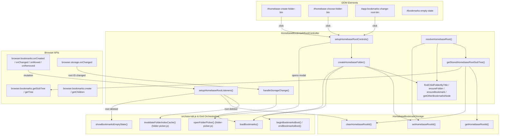

# Phase 5 Checkpoint 4 Architecture Audit

**Cycle**: Cycle #11  
**Phase**: Phase 5 — Wallpaper System Consolidation & Subsystem Isolation  
**Checkpoint**: Checkpoint 4 — Architecture Audit: Root Management & Bookmark Observer Extraction  
**Date**: October 2, 2026  
**Status**: Completed — Awaiting Owner Approval  
**Target File**: [`src/new-tab.js`](file:///c:/Users/Administrator/Desktop/Homebase/src/new-tab.js)  

---

## 1. Executive Summary

Following the completion, review, and remote synchronization of:
- **Checkpoint 1** (`ecc4cf8`): Wallpaper visibility and media lifecycle extraction
- **Checkpoint 2** (`6abb63c`): Responsive layout, sidebar/dock collapse extraction
- **Checkpoint 3** (`f970ac5`): Bookmark editor adapter layer extraction
- **Regression Fix** (`313cd8c`): Sidebar reference resolution in widget visibility ordering

[`src/new-tab.js`](file:///c:/Users/Administrator/Desktop/Homebase/src/new-tab.js) currently contains **3,521 lines** (reduced from 3,833 lines at the start of Phase 5, net **-312 lines** across Phase 5 to date).

This audit investigates the extraction of **Root Management & Bookmark Observer** responsibilities from `src/new-tab.js` into a dedicated bookmark controller module:  
[`src/newtab/bookmarks/bookmark-root-controller.js`](file:///c:/Users/Administrator/Desktop/Homebase/src/newtab/bookmarks/bookmark-root-controller.js).

---

## 2. Inventory of Target Logic in `src/new-tab.js`

A detailed scan of `src/new-tab.js` reveals 12 distinct code points comprising **~200 lines** of root management, folder discovery, control binding, bookmark observers, and storage synchronization:

### 2.1 DOM Element Queries
| Line(s) | Identifier | Selector | Usage |
|---|---|---|---|
| Line 36 | `appBookmarksChangeRootBtn` | `#app-bookmarks-change-root-btn` | Settings folder change button |
| Line 38 | `homebaseCreateFolderBtn` | `#homebase-create-folder-btn` | Empty-state "Create Homebase Folder" button |
| Line 40 | `homebaseChooseFolderBtn` | `#homebase-choose-folder-btn` | Empty-state "Choose Folder" button |

*(Note: Lines 42–56 also declare 8 `folderPicker*` modal elements which are solely consumed by `folder-picker.js` and can be evaluated for cleanup).*

---

### 2.2 Pure Tree Discovery & Traversal Helpers
| Function | Lines | Responsibilities | Dependencies |
|---|:---:|---|---|
| `findChildFolderByTitle(parentNode, titleLower)` | 1013–1018 (6 lines) | Scans `parentNode.children` for a subfolder matching the case-insensitive title. | Pure JavaScript tree inspection. |
| `ensureFolder(parentId, title)` | 1020–1031 (12 lines) | Finds existing child folder or creates a new bookmark folder via `browser.bookmarks.create`. | `browser.bookmarks.getChildren`, `browser.bookmarks.create`, `findChildFolderByTitle`. |
| `ensureBookmark(parentId, title, url)` | 1033–1050 (18 lines) | Finds existing child bookmark with matching URL/title or creates one via `browser.bookmarks.create`. | `browser.bookmarks.getChildren`, `browser.bookmarks.create`. |
| `getOtherBookmarksNode(rootChildren)` | 1052–1061 (10 lines) | Resolves the browser "Other Bookmarks" node across browsers: checks Firefox ID `'unfiled_____'`, Chrome ID `'2'`, or title `'other bookmarks'`. | Pure JavaScript array search. |
| `findHomebaseUnderOtherBookmarks(treeRoot)` | 1063–1068 (6 lines) | Traverses root tree to find the "Homebase" folder located inside "Other Bookmarks". | `getOtherBookmarksNode`, `findChildFolderByTitle`. |

---

### 2.3 Stored Root Subtree Verification & Fallback
| Function | Lines | Responsibilities | Dependencies |
|---|:---:|---|---|
| `getStoredHomebaseRootSubTree(storedRootId)` | 1112–1134 (23 lines) | Calls `browser.bookmarks.getSubTree(storedRootId)` to validate stored root. If root was deleted externally or is malformed, clears stored root ID via `clearHomebaseRootId()`, logs fallback via `recordPerfFallback()`, and returns `null`. Assigns valid subtree to `bookmarkTree`. | `browser.bookmarks.getSubTree`, `clearHomebaseRootId()`, `recordPerfFallback()`, global `bookmarkTree`. |

---

### 2.4 Root Creation & Resolution Workflows
| Function / Block | Lines | Responsibilities | Dependencies |
|---|:---:|---|---|
| `createHomebaseFolder()` | 2477–2515 (39 lines) | Creates default "Homebase" folder under "Other Bookmarks", creates subfolder "Folder 1", adds starter "Google" bookmark, persists root ID via `setHomebaseRootId()`, and triggers `loadBookmarks()`. Handles boot states (`beginBookmarksBoot`, `endBookmarksBoot`) and empty state error fallbacks. | `getBookmarkTree`, `getOtherBookmarksNode`, `ensureFolder`, `ensureBookmark`, `setHomebaseRootId`, `loadBookmarks`, `showBookmarksEmptyState`, `beginBookmarksBoot`, `endBookmarksBoot`. |
| Root Resolution in `loadBookmarks()` | 2544–2585 (42 lines) | Orchestrates root identification: 1) attempts stored ID lookup via `getStoredHomebaseRootSubTree(storedRootId)`; 2) if invalid/empty, fetches full tree via `getBookmarkTree(true)` and searches `findHomebaseUnderOtherBookmarks()`; 3) auto-saves discovered root ID via `setHomebaseRootId()`; 4) if not found, triggers `showBookmarksEmptyState()`. | `getHomebaseRootId`, `getStoredHomebaseRootSubTree`, `getBookmarkTree`, `findHomebaseUnderOtherBookmarks`, `setHomebaseRootId`, `showBookmarksEmptyState`, `hbPerfTime`. |

---

### 2.5 UI Control Wiring
| Function | Lines | Responsibilities | Dependencies |
|---|:---:|---|---|
| `setupHomebaseRootControls()` | 2611–2643 (33 lines) | Binds click handlers to `#homebase-create-folder-btn` (calls `createHomebaseFolder`), `#homebase-choose-folder-btn` (calls `openFolderPicker`), and `#app-bookmarks-change-root-btn` (calls `openFolderPicker`). | `homebaseCreateFolderBtn`, `homebaseChooseFolderBtn`, `appBookmarksChangeRootBtn`, `createHomebaseFolder`, `openFolderPicker`. |

---

### 2.6 Bookmark Event Observers
| Function | Lines | Responsibilities | Dependencies |
|---|:---:|---|---|
| `setupHomebaseRootListeners()` | 2645–2694 (50 lines) | Registers listeners on `browser.bookmarks.onCreated`, `onChanged`, and `onMoved` to trigger `invalidateFolderIndexCache()`. Registers listener on `browser.bookmarks.onRemoved` to detect if the deleted folder matches `getHomebaseRootId()`; if root was deleted, clears storage via `clearHomebaseRootId()` and invokes `showBookmarksEmptyState()`. | `browser.bookmarks.onCreated/onChanged/onMoved/onRemoved`, `invalidateFolderIndexCache`, `getHomebaseRootId`, `clearHomebaseRootId`, `showBookmarksEmptyState`. |

---

### 2.7 Storage Synchronization
| Code Point | Lines | Responsibilities | Dependencies |
|---|:---:|---|---|
| Storage Listener for Root ID | 3442–3444 (3 lines) | Detects external or cross-tab modifications to `HOMEBASE_BOOKMARK_ROOT_ID_KEY` in `browser.storage.onChanged` and triggers `loadBookmarks()`. | `changes[HOMEBASE_BOOKMARK_ROOT_ID_KEY]`, `loadBookmarks()`. |
| Page Startup Wiring | 2962 & 2964 (2 lines) | Calls `setupHomebaseRootControls()` and `setupHomebaseRootListeners()` during `initializePage()`. | `setupHomebaseRootControls`, `setupHomebaseRootListeners`. |

---

## 3. Current Ownership & Verification of `bookmark-storage.js`

### 3.1 What Already Exists in `src/newtab/bookmarks/bookmark-storage.js`
- **Key Constant**: `const HOMEBASE_BOOKMARK_ROOT_ID_KEY = 'homebaseBookmarkRootId';` (lines 5, 278, 302).
- **Getter**: `async function getHomebaseRootId()` (reads from `window.HomebaseStorage` with fallback to `browser.storage.local`).
- **Setter**: `async function setHomebaseRootId(id)` (persists to storage).
- **Clearing**: `async function clearHomebaseRootId()` (removes key from storage).
- **Exports**: Fully exposed on `window` and `window.HomebaseBookmarkStorage`.

### 3.2 What Remains in `src/new-tab.js`
- Bookmark tree resolution (`getStoredHomebaseRootSubTree`, `findHomebaseUnderOtherBookmarks`, `getOtherBookmarksNode`, `findChildFolderByTitle`).
- Default folder provisioning (`createHomebaseFolder`, `ensureFolder`, `ensureBookmark`).
- Root button DOM event listener wiring (`setupHomebaseRootControls`).
- Browser bookmark mutation listeners (`setupHomebaseRootListeners`).
- Cross-tab storage change coordination for root ID (`changes[HOMEBASE_BOOKMARK_ROOT_ID_KEY]`).

### 3.3 Separation of Concerns: Why a New Controller is Needed
[`src/newtab/bookmarks/bookmark-storage.js`](file:///c:/Users/Administrator/Desktop/Homebase/src/newtab/bookmarks/bookmark-storage.js) is strictly a storage-access layer (keys, sanitizers, reading/writing metadata). It intentionally has:
- **No browser.bookmarks event observers**
- **No DOM event bindings or element references**
- **No folder tree discovery or creation logic**

Mixing DOM listeners and browser bookmark observers into `bookmark-storage.js` would violate the Single Responsibility Principle and break existing unit tests that test `bookmark-storage.js` in headless environments without DOM elements or bookmark mocks.

Therefore, the proper architectural destination is a dedicated controller:  
[`src/newtab/bookmarks/bookmark-root-controller.js`](file:///c:/Users/Administrator/Desktop/Homebase/src/newtab/bookmarks/bookmark-root-controller.js).

---

## 4. Dependency Graph & Interaction Architecture



---

## 5. Extraction Safety & Architectural Design

### 5.1 Low-Risk Components
1. **Tree Helper Functions** (`findChildFolderByTitle`, `ensureFolder`, `ensureBookmark`, `getOtherBookmarksNode`, `findHomebaseUnderOtherBookmarks`):
   - Completely functional, deterministic helpers.
   - Zero DOM interaction; zero state mutation.
   - Safe to extract verbatim.

2. **Root Controls Wiring** (`setupHomebaseRootControls`):
   - Only binds click events if target elements exist in DOM.
   - Fully decoupled.

3. **Bookmark Observers** (`setupHomebaseRootListeners`):
   - Defensive listener registration with safe error catching and existence checks for `browser.bookmarks`.
   - Uses dependency injection / clean callbacks for `onIndexInvalidated` and `onRootRemoved`.

### 5.2 Areas Requiring Careful Coordination
1. **`bookmarkTree` Global Mutation in `getStoredHomebaseRootSubTree`**:
   - In `new-tab.js`, line 1126 assigns `bookmarkTree = subTree;`.
   - In `bookmark-root-controller.js`, the function will return `{ rootNode, subTree }` (or accept an `onSubTreeResolved` callback) so `new-tab.js` updates its module-scoped `bookmarkTree` cleanly without undeclared global assignments.

2. **Cross-Module Communication**:
   - `invalidateFolderIndexCache()` is defined in `folder-picker.js`.
   - The controller will invoke `window.invalidateFolderIndexCache` or an injected callback defensively to ensure test environments without `folder-picker.js` do not throw.

3. **Performance Metrics Tracking**:
   - `recordPerfFallback('bookmarks', 'Invalid bookmark root ID')` and `hbPerfTime` must be invoked defensively via `window.HomebasePerfReport` or optional chaining.

---

## 6. Proposed Destination Module Specification

### Destination File
`src/newtab/bookmarks/bookmark-root-controller.js`

### Namespace & Public API
```javascript
window.HomebaseBookmarkRootController = {
  // Discovery & Tree Inspection
  findChildFolderByTitle,
  ensureFolder,
  ensureBookmark,
  getOtherBookmarksNode,
  findHomebaseUnderOtherBookmarks,
  getStoredHomebaseRootSubTree,

  // Root Lifecycle
  createHomebaseFolder,
  setupHomebaseRootControls,
  setupHomebaseRootListeners,

  // Storage Observer Bridge
  handleStorageChange
};
```

### Global Compatibility Bridges (for existing callers)
To guarantee backward compatibility with legacy scripts and tests without refactoring callers:
```javascript
window.findChildFolderByTitle = findChildFolderByTitle;
window.ensureFolder = ensureFolder;
window.ensureBookmark = ensureBookmark;
window.getOtherBookmarksNode = getOtherBookmarksNode;
window.findHomebaseUnderOtherBookmarks = findHomebaseUnderOtherBookmarks;
window.getStoredHomebaseRootSubTree = getStoredHomebaseRootSubTree;
window.createHomebaseFolder = createHomebaseFolder;
window.setupHomebaseRootControls = setupHomebaseRootControls;
window.setupHomebaseRootListeners = setupHomebaseRootListeners;
```

---

## 7. Script Loading Order in `src/new-tab.html`

Currently in `src/new-tab.html`:
```html
3340:   <script src="newtab/bookmarks/folder-picker.js" defer></script>
...
3353:   <script src="newtab/bookmarks/bookmark-storage.js" defer></script>
3354:   <script src="newtab/bookmarks/bookmark-grid-controller.js" defer></script>
...
3358:   <script src="newtab/bookmarks/bookmark-editor-adapter.js" defer></script>
```

### Proposed Placement
Place `src/newtab/bookmarks/bookmark-root-controller.js` immediately after `bookmark-editor-adapter.js` (line 3359):
```html
  <script src="newtab/bookmarks/bookmark-editor-adapter.js" defer></script>
  <script src="newtab/bookmarks/bookmark-root-controller.js" defer></script>
```
**Prerequisite Invariants**:
- `folder-picker.js` (line 3340) loads **before** `bookmark-root-controller.js` (provides `openFolderPicker` and `invalidateFolderIndexCache`).
- `bookmark-storage.js` (line 3353) loads **before** `bookmark-root-controller.js` (provides `getHomebaseRootId`, `setHomebaseRootId`, `clearHomebaseRootId`).
- `bookmark-root-controller.js` loads **before** `src/new-tab.js` (line 3403).

---

## 8. Expected Line Reduction

| Code Region in `src/new-tab.js` | Current Lines | Post-Extraction Lines | Net Reduction |
|---|:---:|:---:|:---:|
| DOM element declarations (lines 36, 38, 40) | 3 | 0 (or deferred) | -3 |
| Tree helpers (lines 1013–1068) | 56 | 0 | -56 |
| `getStoredHomebaseRootSubTree` (lines 1112–1134) | 23 | 4 (thin delegation bridge) | -19 |
| `createHomebaseFolder` (lines 2477–2515) | 39 | 4 (thin delegation bridge) | -35 |
| `setupHomebaseRootControls` (lines 2611–2643) | 33 | 4 (thin delegation bridge) | -29 |
| `setupHomebaseRootListeners` (lines 2645–2694) | 50 | 4 (thin delegation bridge) | -46 |
| **Total** | **~204 lines** | **~16 lines** | **~188 lines** |

Net estimated size of `src/new-tab.js`: **~3,333 lines** (down from 3,521 lines).

---

## 9. Risk Assessment & Mitigation

| Risk | Severity | Impact | Mitigation Strategy |
|---|:---:|---|---|
| **Subtree state synchronization** | Medium | `bookmarkTree` becomes out-of-sync if subtree fetch does not update new-tab's local tree variable. | `getStoredHomebaseRootSubTree` accepts an `onSubTreeResolved` callback or returns `{ rootNode, subTree }` so `new-tab.js` explicitly updates `bookmarkTree`. |
| **Missing DOM buttons on certain states** | Low | Calling `addEventListener` on null elements could throw runtime error. | Defensive checks (`if (buttonEl) { ... }`) preserved exactly as in legacy code. |
| **Cross-browser root ID discrepancy** | Low | Firefox (`unfiled_____`) vs Chrome (`2`) folder identification failure. | Keep `getOtherBookmarksNode` resolution logic identical to current implementation. |
| **Undeclared globals collision** | Low | SyntaxError from duplicate top-level declarations across deferred scripts. | Remove declarations from `src/new-tab.js` and register in `check-newtab-static.mjs`. |
| **Multiple listener attachments** | Low | Event listener duplication if `setupHomebaseRootListeners()` is called more than once. | Include an internal idempotency guard (`isRootListenersInitialized`) in `bookmark-root-controller.js`. |

---

## 10. Verification Plan

### 10.1 Automated Verification
Before approval of implementation:
1. `node --check src/newtab/bookmarks/bookmark-root-controller.js`
2. `node --check src/new-tab.js`
3. `node scripts/check-newtab-static.mjs`
4. `node scripts/smoke-newtab-file.mjs`
5. `npm.cmd test` (full 343 unit tests across all 4 stages)
6. `npm.cmd run build:chrome`

### 10.2 Manual Browser Verification Checklist
Manual browser verification is required prior to release because this checkpoint interacts with `browser.bookmarks` and storage persistence:

- [ ] **Chrome**:
  - Open new tab with existing root: bookmarks render accurately.
  - Delete Homebase folder in Chrome Bookmark Manager: new tab detects removal via `browser.bookmarks.onRemoved`, switches to empty state.
  - Click "Create Homebase Folder": creates default folder hierarchy under "Other Bookmarks > Homebase > Folder 1" with "Google" bookmark.
  - Click "Change Folder": folder picker opens and switches root folder properly.
- [ ] **Firefox**:
  - Verify "Other Bookmarks" node identification (`unfiled_____`).
  - Test folder selection and bookmark modification reactivity.

---

## 11. No-Code-Change Confirmation

In strict compliance with Homebase repository rules:
- **No source code files modified**
- **No git commits created**
- **No git pushes performed**
- **Working tree clean**

*Awaiting owner review and approval of this audit before proceeding to the Checkpoint 4 Implementation Plan (`docs/117-cycle11-phase5-checkpoint4-plan.md`).*
