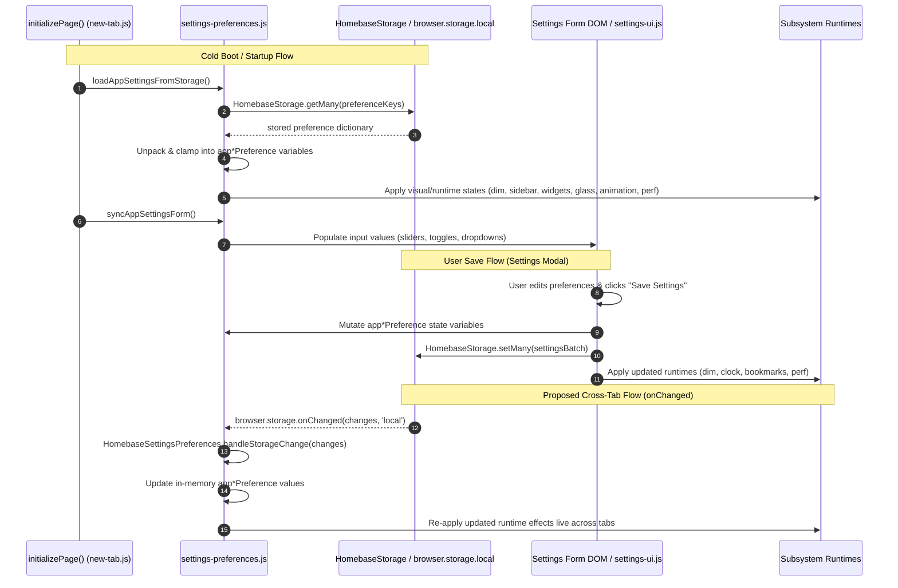

# Phase 5 Checkpoint 5 Architecture Audit

**Cycle**: Cycle #11  
**Phase**: Phase 5 — Wallpaper System Consolidation & Subsystem Isolation  
**Checkpoint**: Checkpoint 5 — Architecture Audit: Settings Preference State Synchronization Extraction  
**Date**: October 2, 2026  
**Status**: Completed — Awaiting Owner Approval  
**Target Files**:
- [`src/new-tab.js`](file:///c:/Users/Administrator/Desktop/Homebase/src/new-tab.js)
- [`src/newtab/settings/settings-preferences.js`](file:///c:/Users/Administrator/Desktop/Homebase/src/newtab/settings/settings-preferences.js)

---

## 1. Executive Summary

Following the completion, review, and remote synchronization of:
- **Checkpoint 1** (`ecc4cf8`): Wallpaper visibility and media lifecycle extraction
- **Checkpoint 2** (`6abb63c`): Responsive layout, sidebar/dock collapse extraction
- **Checkpoint 3** (`f970ac5`): Bookmark editor adapter layer extraction
- **Regression Fix** (`313cd8c`): Sidebar reference resolution in widget visibility ordering
- **Checkpoint 4** (`a37a449`): Root management and bookmark observer extraction

[`src/new-tab.js`](file:///c:/Users/Administrator/Desktop/Homebase/src/new-tab.js) currently contains **3,322 lines** (reduced from 3,833 lines at the start of Phase 5, net **-511 lines** across Phase 5 to date).

This audit investigates the extraction and consolidation of **Settings Preference State Synchronization** responsibilities. Currently, [`src/newtab/settings/settings-preferences.js`](file:///c:/Users/Administrator/Desktop/Homebase/src/newtab/settings/settings-preferences.js) contains the runtime logic for `loadAppSettingsFromStorage()` and `syncAppSettingsForm()`. However, the **33 storage key constants**, **33 preference state variables**, and **26 settings DOM element handles** remain declared in the monolith [`src/new-tab.js`](file:///c:/Users/Administrator/Desktop/Homebase/src/new-tab.js).

### The Inverted Dependency Problem
In [`src/new-tab.html`](file:///c:/Users/Administrator/Desktop/Homebase/src/new-tab.html):
- `settings-preferences.js` is loaded at line 3382 as `<script defer>`.
- `new-tab.js` is loaded at line 3403 as `<script defer>`.

Because `settings-preferences.js` runs *before* `new-tab.js`, it relies on global lexical bindings (`APP_*_KEY`, `app*Preference`, `app*Select/Toggle`) that are not declared until `new-tab.js` evaluates 21 scripts later. While function execution is deferred until startup (`initializePage()`), this inverted dependency architecture is extremely fragile:
1. Intermediate scripts or early callers cannot inspect or touch preference variables without risking `ReferenceError`.
2. Unit tests (`tests/unit/settings-storage.test.mjs`) must manually mock 33 keys, 33 variables, and 26 DOM handles to test `settings-preferences.js`.
3. `settings-preferences.js` lacks an authoritative controller namespace (`window.HomebaseSettingsPreferences`).
4. Monolith `src/new-tab.js` still hoards 176 lines of state and DOM declarations for a subsystem it does not operate.

Extracting state ownership into `settings-preferences.js` and establishing `window.HomebaseSettingsPreferences` will eliminate **~176 lines** from `src/new-tab.js`, bringing the monolith down to **~3,146 lines**.

---

## 2. Current Preference Ownership & Inventory

### 2.1 Preference State Variables Declared in `src/new-tab.js` (Lines 852–913)

The monolith declares 33 loose `let` preference variables:

| Line | Variable Identifier | Storage Key Constant | Storage Key String | Default Value | Parsing / Clamping |
|:---:|---|---|---|:---:|---|
| 852 | `appBackgroundDimPreference` | `APP_BACKGROUND_DIM_KEY` | `'appBackgroundDim'` | `0` | Clamped 0–90 |
| 854 | `appShowSidebarPreference` | `APP_SHOW_SIDEBAR_KEY` | `'appShowSidebar'` | `true` | Boolean (`!== false`) |
| 856 | `appShowWeatherPreference` | `APP_SHOW_WEATHER_KEY` | `'appShowWeather'` | `true` | Boolean (`!== false`) |
| 858 | `appShowQuotePreference` | `APP_SHOW_QUOTE_KEY` | `'appShowQuote'` | `true` | Boolean (`!== false`) |
| 860 | `appShowNewsPreference` | `APP_SHOW_NEWS_KEY` | `'appShowNews'` | `false` | Boolean (`=== true`) |
| 862 | `appShowTodoPreference` | `APP_SHOW_TODO_KEY` | `'appShowTodo'` | `true` | Boolean (`!== false`) |
| 864 | `appNewsSourcePreference` | `APP_NEWS_SOURCE_KEY` | `'appNewsSource'` | `'aljazeera'` | Validated news source ID |
| 866 | `appMaxTabsPreference` | `APP_MAX_TABS_KEY` | `'appMaxTabsCount'` | `0` | `parseInt(val, 10) \|\| 0` |
| 868 | `appAutoClosePreference` | `APP_AUTOCLOSE_KEY` | `'appAutoCloseMinutes'` | `0` | `parseInt(val, 10) \|\| 0` |
| 870 | `appSingletonModePreference` | `APP_SINGLETON_MODE_KEY` | `'appSingletonMode'` | `false` | Boolean (`=== true`) |
| 872 | `appSearchOpenNewTabPreference` | `APP_SEARCH_OPEN_NEW_TAB_KEY` | `'appSearchOpenNewTab'` | `false` | Boolean (`=== true`) |
| 874 | `appSearchRememberEnginePreference` | `APP_SEARCH_REMEMBER_ENGINE_KEY` | `'appSearchRememberEngine'` | `true` | Boolean (`!== false`) |
| 876 | `appSearchDefaultEnginePreference` | `APP_SEARCH_DEFAULT_ENGINE_KEY` | `'appSearchDefaultEngine'` | `'google'` | String engine ID |
| 878 | `appSearchMathPreference` | `APP_SEARCH_MATH_KEY` | `'appSearchMath'` | `true` | Boolean (`!== false`) |
| 880 | `appSearchShowHistoryPreference` | `APP_SEARCH_SHOW_HISTORY_KEY` | `'appSearchShowHistory'` | `false` | Boolean (`=== true`) |
| 882 | `appSearchSuggestionsPreference` | `APP_SEARCH_SUGGESTIONS_KEY` | `'appSearchSuggestionsEnabled'` | `true` | Boolean (`!== false`) |
| 884 | `appContainerModePreference` | `APP_CONTAINER_MODE_KEY` | `'appContainerMode'` | `true` | Boolean (`!== false`) |
| 886 | `appContainerNewTabPreference` | `APP_CONTAINER_NEW_TAB_KEY` | `'appContainerNewTab'` | `true` | Boolean (`!== false`) |
| 888 | `appBookmarkOpenNewTabPreference` | `APP_BOOKMARK_OPEN_NEW_TAB_KEY` | `'appBookmarkOpenNewTab'` | `false` | Boolean (`=== true`) |
| 890 | `appBookmarkTextBgPreference` | `APP_BOOKMARK_TEXT_BG_KEY` | `'appBookmarkTextBg'` | `false` | Boolean (`=== true`) |
| 892 | `appBookmarkTextBgColorPreference` | `APP_BOOKMARK_TEXT_BG_COLOR_KEY` | `'appBookmarkTextBgColor'` | `'#2CA5FF'` | Hex color string |
| 894 | `appBookmarkTextBgOpacityPreference` | `APP_BOOKMARK_TEXT_OPACITY_KEY` | `'appBookmarkTextBgOpacity'` | `0.65` | `parseFloat(val) \|\| 0.65` |
| 896 | `appBookmarkTextBgBlurPreference` | `APP_BOOKMARK_TEXT_BLUR_KEY` | `'appBookmarkTextBgBlur'` | `4` | `parseInt(val, 10) \|\| 4` |
| 898 | `appBookmarkFallbackColorPreference` | `APP_BOOKMARK_FALLBACK_COLOR_KEY` | `'appBookmarkFallbackColor'` | `'#00b8d4'` | Hex color string |
| 900 | `appBookmarkFolderColorPreference` | `APP_BOOKMARK_FOLDER_COLOR_KEY` | `'appBookmarkFolderColor'` | `'#FFFFFF'` | Hex color string |
| 902 | `appGridAnimationPreference` | `APP_GRID_ANIMATION_KEY` | `'appGridAnimationPref'` | `'default'` | Key in `GRID_ANIMATIONS` |
| 903 | `appGridAnimationSpeedPreference` | `APP_GRID_ANIMATION_SPEED_KEY` | `'appGridAnimationSpeed'` | `0.3` | `parseFloat(val) \|\| 0.3` |
| 904 | `appGridAnimationEnabledPreference` | `APP_GRID_ANIMATION_ENABLED_KEY` | `'appGridAnimationEnabled'` | `false` | Boolean (`=== true`) |
| 905 | `appGlassStylePreference` | `APP_GLASS_STYLE_KEY` | `'appGlassStylePref'` | `'original'` | ID in `GLASS_STYLES` |
| 907 | `appPerformanceModePreference` | `APP_PERFORMANCE_MODE_KEY` | `'appPerformanceMode'` | `readFastPerformanceModePreference()` | Boolean |
| 908 | `debugPerfOverlayPreference` | `APP_DEBUG_PERF_OVERLAY_KEY` | `'debugPerfOverlay'` | `false` | Boolean (`=== true`) |
| 910 | `appBatteryOptimizationPreference` | `APP_BATTERY_OPTIMIZATION_KEY` | `'appBatteryOptimization'` | `false` | Boolean (`=== true`) |
| 912 | `appCinemaModePreference` | `APP_CINEMA_MODE_KEY` | `'appCinemaMode'` | `false` | Boolean (`=== true`) |

*(Note: Preferences already owned elsewhere include `timeFormatPreference` in [`time.js`](file:///c:/Users/Administrator/Desktop/Homebase/src/newtab/widgets/time.js), and `wallpaperTypePreference`, `wallpaperQualityPreference`, `dailyRotationPreference` in [`wallpaper-controller.js`](file:///c:/Users/Administrator/Desktop/Homebase/src/newtab/wallpaper/wallpaper-controller.js)).*

---

### 2.2 Storage Key Constants Declared in `src/new-tab.js` (Lines 756–816)

The monolith declares 33 storage key constants:

```javascript
const APP_TIME_FORMAT_KEY = 'appTimeFormatPreference';
const APP_BACKGROUND_DIM_KEY = 'appBackgroundDim';
const APP_SHOW_SIDEBAR_KEY = 'appShowSidebar';
const APP_SHOW_WEATHER_KEY = 'appShowWeather';
const APP_SHOW_QUOTE_KEY = 'appShowQuote';
const APP_SHOW_NEWS_KEY = 'appShowNews';
const APP_SHOW_TODO_KEY = 'appShowTodo';
const APP_NEWS_SOURCE_KEY = 'appNewsSource';
const APP_MAX_TABS_KEY = 'appMaxTabsCount';
const APP_AUTOCLOSE_KEY = 'appAutoCloseMinutes';
const APP_SINGLETON_MODE_KEY = 'appSingletonMode';
const APP_SEARCH_OPEN_NEW_TAB_KEY = 'appSearchOpenNewTab';
const APP_SEARCH_MATH_KEY = 'appSearchMath';
const APP_SEARCH_SHOW_HISTORY_KEY = 'appSearchShowHistory';
const APP_SEARCH_SUGGESTIONS_KEY = 'appSearchSuggestionsEnabled';
const APP_BOOKMARK_OPEN_NEW_TAB_KEY = 'appBookmarkOpenNewTab';
const APP_BOOKMARK_TEXT_BG_KEY = 'appBookmarkTextBg';
const APP_BOOKMARK_TEXT_BG_COLOR_KEY = 'appBookmarkTextBgColor';
const APP_BOOKMARK_TEXT_OPACITY_KEY = 'appBookmarkTextBgOpacity';
const APP_BOOKMARK_TEXT_BLUR_KEY = 'appBookmarkTextBgBlur';
const APP_BOOKMARK_FALLBACK_COLOR_KEY = 'appBookmarkFallbackColor';
const APP_BOOKMARK_FOLDER_COLOR_KEY = 'appBookmarkFolderColor';
const APP_PERFORMANCE_MODE_KEY = 'appPerformanceMode';
const FAST_PERFORMANCE_MODE_KEY = 'fast-performance-mode';
const APP_DEBUG_PERF_OVERLAY_KEY = 'debugPerfOverlay';
const APP_BATTERY_OPTIMIZATION_KEY = 'appBatteryOptimization';
const APP_CINEMA_MODE_KEY = 'appCinemaMode';
const APP_CONTAINER_MODE_KEY = 'appContainerMode';
const APP_CONTAINER_NEW_TAB_KEY = 'appContainerNewTab';
const APP_GRID_ANIMATION_KEY = 'appGridAnimationPref';
const APP_GRID_ANIMATION_SPEED_KEY = 'appGridAnimationSpeed';
const APP_GRID_ANIMATION_ENABLED_KEY = 'appGridAnimationEnabled';
const APP_GLASS_STYLE_KEY = 'appGlassStylePref';
```

*(Note: `APP_SEARCH_REMEMBER_ENGINE_KEY` and `APP_SEARCH_DEFAULT_ENGINE_KEY` are declared in `search-storage.js`; `WALLPAPER_QUALITY_KEY`, `WALLPAPER_TYPE_KEY`, and `DAILY_ROTATION_KEY` are declared in `wallpaper-storage.js`).*

---

### 2.3 Settings DOM Element Handles Declared in `src/new-tab.js` (Lines 701–753)

The monolith declares 26 DOM element query handles:

| Line | Identifier | Target Element ID | Usage in `new-tab.js` | Consumer Module(s) |
|:---:|---|---|:---:|---|
| 701 | `appSettingsCloseBtn` | `app-settings-close` | **None** (0 references) | `settings-ui.js` |
| 703 | `appSettingsCancelBtn` | `app-settings-cancel` | **None** (0 references) | `settings-ui.js` |
| 705 | `appSettingsSaveBtn` | `app-settings-save` | **None** (0 references) | `settings-ui.js` |
| 707 | `appTimeFormatSelect` | `app-time-format` | **None** (0 references) | `settings-preferences.js`, `settings-ui.js` |
| 709 | `appSidebarToggle` | `app-show-sidebar-toggle` | **None** (0 references) | `settings-preferences.js`, `settings-ui.js` |
| 711 | `appWeatherToggle` | `app-show-weather-toggle` | **None** (0 references) | `settings-preferences.js`, `settings-ui.js` |
| 713 | `appQuoteToggle` | `app-show-quote-toggle` | **None** (0 references) | `settings-preferences.js`, `settings-ui.js` |
| 715 | `appNewsToggle` | `app-show-news-toggle` | **None** (0 references) | `settings-preferences.js`, `settings-ui.js` |
| 717 | `appTodoToggle` | `app-show-todo-toggle` | **None** (0 references) | `settings-preferences.js`, `settings-ui.js` |
| 719 | `appMaxTabsSelect` | `app-max-tabs-select` | **None** (0 references) | `settings-preferences.js`, `settings-ui.js` |
| 721 | `appAutoCloseSelect` | `app-autoclose-select` | **None** (0 references) | `settings-preferences.js`, `settings-ui.js` |
| 723 | `appSearchOpenNewTabToggle` | `app-search-open-new-tab-toggle` | **None** (0 references) | `settings-preferences.js`, `settings-ui.js` |
| 725 | `appSearchRememberEngineToggle` | `app-search-remember-engine-toggle` | **None** (0 references) | `settings-preferences.js`, `settings-ui.js` |
| 727 | `appSearchMathToggle` | `app-search-math-toggle` | **None** (0 references) | `settings-preferences.js`, `settings-ui.js` |
| 729 | `appSearchHistoryToggle` | `app-search-history-toggle` | **None** (0 references) | `settings-preferences.js`, `settings-ui.js` |
| 731 | `appSearchSuggestionsToggle` | `app-search-suggestions-toggle` | **None** (0 references) | `settings-preferences.js`, `settings-ui.js` |
| 733 | `appSearchDefaultEngineContainer` | `app-search-default-engine-container` | **None** (0 references) | `search-engine-settings.js` |
| 735 | `appSearchDefaultEngineSelect` | `app-search-default-engine-select` | **None** (0 references) | `search-engine-settings.js`, `settings-ui.js` |
| 737 | `appDimSlider` | `app-dim-slider` | **None** (0 references) | `settings-preferences.js`, `settings-ui.js` |
| 739 | `appDimLabel` | `app-dim-value-label` | **None** (0 references) | `settings-preferences.js`, `settings-ui.js` |
| 741 | `appDailyToggle` | `app-daily-toggle` | **None** (0 references) | `settings-preferences.js`, `settings-ui.js` |
| 743 | `appWallpaperTypeSelect` | `app-wallpaper-type-select` | **None** (0 references) | `settings-preferences.js`, `settings-ui.js` |
| 745 | `appWallpaperQualitySelect` | `app-wallpaper-quality-select` | **None** (0 references) | `settings-preferences.js`, `settings-ui.js` |
| 749 | `wallpaperTypeToggle` | `gallery-wallpaper-type-toggle` | **None** (0 references) | `settings-preferences.js`, `settings-ui.js` |
| 750 | `wallpaperQualityToggle` | `gallery-wallpaper-quality-toggle` | **None** (0 references) | `settings-preferences.js`, `settings-ui.js` |
| 752 | `galleryDailyToggle` | `gallery-daily-toggle` | **None** (0 references) | `settings-preferences.js`, `settings-ui.js` |

*Lines 695–699: `mainSettingsBtn`, `appSettingsModal`, `appSettingsNav` are shared modal scaffolding. `mainSettingsBtn` is accessed by `dock-navigation.js` and `settings-ui.js`; `appSettingsModal` and `appSettingsNav` are solely used in `settings-ui.js`.*

---

## 3. Load, Save, and Cross-Tab Flows



### 3.1 Load Flow
1. `initializePage()` launches `const settingsP = loadAppSettingsFromStorage()` in parallel with bookmark metadata and folder state (`Promise.allSettled`).
2. `loadAppSettingsFromStorage()` invokes `runSchemaMigrations()`, then queries `HomebaseStorage.getMany(preferenceKeys)` (38 keys total).
3. Values are unpacked into `app*Preference` variables with fallback defaults.
4. Runtimes are invoked immediately: `applyPerformanceModeState`, `applyGridAnimation`, `applyGlassStyle`, `applyTimeFormatPreference`, `applySidebarVisibility`, `applyWidgetVisibility`, `applyBookmarkTextBg*`, `applyBackgroundDim`, `resetCinemaMode`.
5. Fast-path mirrors in `localStorage` (`fast-bg-dim`, `fast-performance-mode`) are synchronized.
6. `syncAppSettingsForm()` is called to sync the form DOM controls.

### 3.2 Save Flow
1. User interacts with settings modal controls loaded via lazy-loaded `settings-ui.js`.
2. On modal save (or inline toggle events):
   - Form inputs are read.
   - Global `app*Preference` variables are mutated.
   - Batch object `settingsBatch` is persisted via `HomebaseStorage.setMany()`.
   - Visual effects and runtimes are re-applied.

### 3.3 Cross-Tab Synchronization Gap
Currently, `browser.storage.onChanged` in `new-tab.js` (lines 3188–3249) only listens for wallpaper selection, search preferences, todos, and bookmark metadata changes. It does **not** handle changes to `appBackgroundDim`, `appShowSidebar`, `appShowWeather`, `appPerformanceMode`, or bookmark styling across open tabs. Checkpoint 5 provides an opportunity to add `HomebaseSettingsPreferences.handleStorageChange(changes, area)` to synchronize settings across open tabs in real time.

---

## 4. Subsystem Dependency Mapping

The 33 preferences are consumed across the following modules:

| Subsystem Module | Consumed Preferences / Keys | Access Type |
|---|---|:---:|
| [`src/newtab/widgets/widget-visibility.js`](file:///c:/Users/Administrator/Desktop/Homebase/src/newtab/widgets/widget-visibility.js) | `appShowSidebarPreference`, `APP_SHOW_SIDEBAR_KEY`, `appShowWeatherPreference`, `appShowQuotePreference`, `appShowNewsPreference`, `appShowTodoPreference` | Read & Write |
| [`src/newtab/widgets/time.js`](file:///c:/Users/Administrator/Desktop/Homebase/src/newtab/widgets/time.js) | `timeFormatPreference`, `APP_TIME_FORMAT_KEY` | Read & Write |
| [`src/newtab/widgets/weather.js`](file:///c:/Users/Administrator/Desktop/Homebase/src/newtab/widgets/weather.js) | `appShowWeatherPreference` | Read & Write |
| [`src/newtab/widgets/quote.js`](file:///c:/Users/Administrator/Desktop/Homebase/src/newtab/widgets/quote.js) | `appShowQuotePreference`, `appShowSidebarPreference` | Read & Write |
| [`src/newtab/widgets/news.js`](file:///c:/Users/Administrator/Desktop/Homebase/src/newtab/widgets/news.js) | `appNewsSourcePreference`, `appShowNewsPreference`, `appShowSidebarPreference` | Read & Write |
| [`src/newtab/widgets/todo.js`](file:///c:/Users/Administrator/Desktop/Homebase/src/newtab/widgets/todo.js) | `appShowTodoPreference` | Read & Write |
| [`src/newtab/core/tab-lifecycle.js`](file:///c:/Users/Administrator/Desktop/Homebase/src/newtab/core/tab-lifecycle.js) | `appMaxTabsPreference`, `appAutoClosePreference` | Read |
| [`src/newtab/integrations/firefox-containers.js`](file:///c:/Users/Administrator/Desktop/Homebase/src/newtab/integrations/firefox-containers.js) | `appContainerModePreference`, `appContainerNewTabPreference`, `APP_CONTAINER_NEW_TAB_KEY` | Read & Write |
| [`src/newtab/settings/cinema-mode-runtime.js`](file:///c:/Users/Administrator/Desktop/Homebase/src/newtab/settings/cinema-mode-runtime.js) | `appCinemaModePreference` | Read |
| [`src/newtab/settings/visual-effects-runtime.js`](file:///c:/Users/Administrator/Desktop/Homebase/src/newtab/settings/visual-effects-runtime.js) | `appBackgroundDimPreference`, `appGlassStylePreference`, `appGridAnimationPreference`, `appGridAnimationSpeedPreference`, `appGridAnimationEnabledPreference` | Read & Write |
| [`src/newtab/settings/visual-effects-settings.js`](file:///c:/Users/Administrator/Desktop/Homebase/src/newtab/settings/visual-effects-settings.js) | `appGridAnimationPreference`, `appGlassStylePreference` | Read & Write |
| [`src/newtab/settings/performance-controller.js`](file:///c:/Users/Administrator/Desktop/Homebase/src/newtab/settings/performance-controller.js) | `appPerformanceModePreference`, `appGlassStylePreference`, `appGridAnimationPreference`, `appGridAnimationSpeedPreference`, `appGridAnimationEnabledPreference` | Read & Write |
| [`src/newtab/settings/search-engine-settings.js`](file:///c:/Users/Administrator/Desktop/Homebase/src/newtab/settings/search-engine-settings.js) | `appSearchDefaultEnginePreference`, `appSearchRememberEnginePreference` | Read & Write |
| [`src/newtab/bookmarks/bookmark-style-runtime.js`](file:///c:/Users/Administrator/Desktop/Homebase/src/newtab/bookmarks/bookmark-style-runtime.js) | `appBookmarkTextBgPreference`, `appBookmarkTextBgOpacityPreference`, `appBookmarkTextBgBlurPreference`, `appBookmarkTextBgColorPreference` | Read & Write |
| [`src/newtab/bookmarks/bookmark-grid-controller.js`](file:///c:/Users/Administrator/Desktop/Homebase/src/newtab/bookmarks/bookmark-grid-controller.js) | `appBookmarkFallbackColorPreference`, `appBookmarkFolderColorPreference`, `appPerformanceModePreference`, `appGridAnimationEnabledPreference` | Read |
| [`src/newtab/bookmarks/bookmark-editor-adapter.js`](file:///c:/Users/Administrator/Desktop/Homebase/src/newtab/bookmarks/bookmark-editor-adapter.js) | `appBookmarkFolderColorPreference`, `appBookmarkFallbackColorPreference` | Read |
| [`src/newtab/settings/settings-ui.js`](file:///c:/Users/Administrator/Desktop/Homebase/src/newtab/settings/settings-ui.js) | All 33 preferences and 33 storage key constants | Read & Write |

---

## 5. Risk Assessment & Mitigations

### 5.1 Shared Global Lexical Scope Collision (High Risk)
- **Risk**: In a `<script defer>` architecture, scripts share the global declarative environment. If `APP_*_KEY` constants or `app*Preference` variables are declared in `settings-preferences.js` without being removed from `new-tab.js`, the browser throws an immediate `Uncaught SyntaxError: Identifier '...' has already been declared`.
- **Mitigation**: Perform an atomic move. Every declaration transferred to `settings-preferences.js` must be removed from `new-tab.js`. Run `node scripts/check-newtab-static.mjs` to statically ensure zero collisions across deferred scripts.

### 5.2 External Callers & Two-Way Mutation (High Risk)
- **Risk**: External modules (`settings-ui.js`, `visual-effects-settings.js`, `bookmark-style-runtime.js`) directly reassign preference variables (e.g., `appBackgroundDimPreference = nextValue;` or `appPerformanceModePreference = isOn;`). If these variables are declared as private module variables, external assignments would create undeclared global variables or throw in strict mode.
- **Mitigation**: Expose all mutable preference variables via `Object.defineProperty(window, ...)` with explicit getters and setters, following the pattern proven in `wallpaper-controller.js` and `dock-navigation.js`. When any module writes `appBackgroundDimPreference = 20`, the setter transparently updates the canonical controller state.

### 5.3 DOM Element Timing (Medium Risk)
- **Risk**: The 26 settings DOM elements (`appDimSlider`, `appSidebarToggle`, etc.) are declared at the top level of `new-tab.js`. In `settings-preferences.js`, queries must not fail if executed before DOM elements are parsed.
- **Mitigation**: Deferred scripts execute after HTML parsing is complete, so `document.getElementById` resolves successfully at script top-level. Alternatively, provide dynamic element getters (e.g., `getDimSlider()`) or query elements lazily within `syncAppSettingsForm()`.

### 5.4 Unit Test Environment Integrity (Low Risk)
- **Risk**: `tests/unit/settings-storage.test.mjs` executes `settings-preferences.js` inside a VM sandbox.
- **Mitigation**: Ensure that when `settings-preferences.js` defines its own constants and variables, it does not overwrite pre-existing sandbox values if supplied, or cleanly initializes them. Run `npm.cmd test` to verify unit tests pass.

---

## 6. Proposed Architecture

### 6.1 Destination Module
Consolidate all preference definitions, storage constants, DOM handles, and synchronization flows directly into:
[`src/newtab/settings/settings-preferences.js`](file:///c:/Users/Administrator/Desktop/Homebase/src/newtab/settings/settings-preferences.js)

### 6.2 Controller Namespace
Expose `window.HomebaseSettingsPreferences` (and alias `window.HomebaseSettingsPreferenceController`):

```javascript
window.HomebaseSettingsPreferences = {
  // Core synchronization
  loadAppSettingsFromStorage,
  syncAppSettingsForm,
  handleStorageChange,

  // Direct state access
  getPreference: (key) => { ... },
  setPreference: (key, value) => { ... },
  getAllPreferences: () => ({ ... }),

  // Constants dictionary
  KEYS: {
    APP_TIME_FORMAT_KEY,
    APP_BACKGROUND_DIM_KEY,
    APP_SHOW_SIDEBAR_KEY,
    // ... all 33 keys
  }
};
```

### 6.3 Global Compatibility Bridges
To maintain 100% backward compatibility with all existing callers:
1. **Key Constants**: Export all 33 `APP_*_KEY` constants to `window` (`window.APP_BACKGROUND_DIM_KEY = APP_BACKGROUND_DIM_KEY;`).
2. **Preference Variables**: Bind all 33 `app*Preference` variables to `window` using `Object.defineProperty(window, key, { get, set, configurable: true, enumerable: true })`.
3. **Function Bridges**: `window.loadAppSettingsFromStorage = loadAppSettingsFromStorage;` and `window.syncAppSettingsForm = syncAppSettingsForm;`.
4. **DOM Handles**: Expose the 26 DOM element references on `window` for `settings-ui.js` compatibility.

---

## 7. Line Locations & Estimated Line Reduction

### 7.1 Blocks to Extract from `src/new-tab.js`

| Code Block in `src/new-tab.js` | Start Line | End Line | Line Count | Target Location |
|---|:---:|:---:|:---:|---|
| Settings DOM Element Declarations | 701 | 753 | 53 lines | `settings-preferences.js` |
| Storage Key Constants (`APP_*_KEY`) | 756 | 816 | 61 lines | `settings-preferences.js` |
| Preference State Variables (`app*Preference`) | 852 | 913 | 62 lines | `settings-preferences.js` |
| **Total Lines Removed from Monolith** | | | **~176 lines** | |

### 7.2 Monolith Impact
- Current line count: **3,322 lines**
- Estimated line count after Checkpoint 5: **~3,146 lines**
- Total Phase 5 reduction to date: **-687 lines** (from 3,833 lines)

---

## 8. Verification Plan

### 8.1 Automated Static & Syntax Verification
Run in PowerShell:
```powershell
node --check src/newtab/settings/settings-preferences.js
node --check src/new-tab.js
node scripts/check-newtab-static.mjs
node scripts/smoke-newtab-file.mjs
npm.cmd test
npm.cmd run build:chrome
```

### 8.2 Scope & Collision Checks
1. Verify that all 33 storage key constants exist exactly once across deferred scripts.
2. Verify that all 33 preference variables exist exactly once across deferred scripts.
3. Verify that `scripts/check-newtab-static.mjs` reports `0 cross-script top-level declaration collisions`.
4. Confirm protected files are completely untouched:
```powershell
git diff src/preload.js src/instant_load.js manifests/ dist/
```

### 8.3 Real-Browser CDP Verification Pass
Using Puppeteer/CDP in headless Chrome:
- Verify cold boot loads with zero console errors or `ReferenceError`s.
- Verify `window.HomebaseSettingsPreferences` is defined and exposes expected methods.
- Verify `loadAppSettingsFromStorage()` populates preferences correctly.
- Verify opening settings modal and saving persists changes without error.
- Verify fast mirrors in `localStorage` (`fast-bg-dim`, `fast-performance-mode`) update properly.

---

## 9. Conclusion & No-Code-Change Confirmation

In accordance with owner workflow rules:
- **Zero source code modifications** were made during this audit.
- **Zero git commits** were created.
- **Zero branches** were pushed.
- Awaiting owner review and explicit approval before drafting the Checkpoint 5 Implementation Plan.
