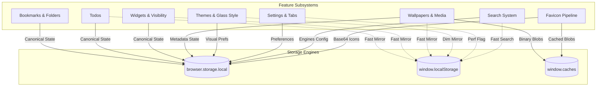
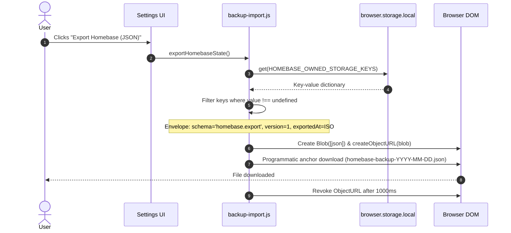
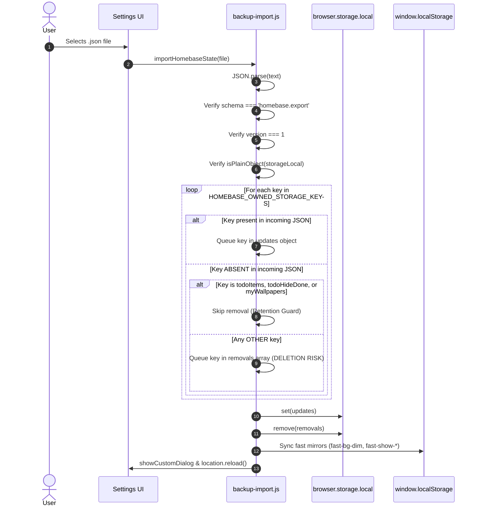

# Homebase — Third Improvement Implementation Plan: Complete Storage & Data Architecture Audit

> **Author**: Principal Data Systems Architect & Extension Security Lead  
> **Date**: 2026-09-27  
> **Cycle**: Homebase Improvement Cycle #3  
> **Scope**: Exhaustive storage inventory, multi-tier data ownership mapping, backup/restore security and completeness audit, schema vulnerability analysis, and ranked improvement recommendations  
> **Target Subsystems**: Storage Layer (`browser.storage.local`, `localStorage`, `Cache Storage`, `sessionStorage`), Backup Engine (`src/newtab/settings/backup-import.js`), Settings & Preferences (`src/newtab/settings/`), and Widget Fast-Mirrors  
> **Authority & Prerequisites**: [AGENTS.md](file:///c:/Users/Administrator/Desktop/Homebase/AGENTS.md), [docs/00-project-baseline.md](file:///c:/Users/Administrator/Desktop/Homebase/docs/00-project-baseline.md), [docs/03-data-architecture.md](file:///c:/Users/Administrator/Desktop/Homebase/docs/03-data-architecture.md), [docs/04-code-review.md](file:///c:/Users/Administrator/Desktop/Homebase/docs/04-code-review.md), [docs/07-improvement-roadmap.md](file:///c:/Users/Administrator/Desktop/Homebase/docs/07-improvement-roadmap.md), [docs/10-testing-strategy.md](file:///c:/Users/Administrator/Desktop/Homebase/docs/10-testing-strategy.md), [docs/13-maintenance-log.md](file:///c:/Users/Administrator/Desktop/Homebase/docs/13-maintenance-log.md), [docs/14-ai-change-history.md](file:///c:/Users/Administrator/Desktop/Homebase/docs/14-ai-change-history.md), [docs/19-second-improvement-plan.md](file:///c:/Users/Administrator/Desktop/Homebase/docs/19-second-improvement-plan.md)  
> **Operational Status**: Architecture Audit & Specification — **no source code files modified**.

---

## Table of Contents

1. [Executive Summary](#1-executive-summary)
2. [Storage Inventory](#2-storage-inventory)
   - [2.1 Canonical Extension Storage (`browser.storage.local` / `chrome.storage.local`)](#21-canonical-extension-storage-browserstoragelocal--chromestoragelocal)
   - [2.2 Evaluation of Synchronized Storage (`browser.storage.sync`)](#22-evaluation-of-synchronized-storage-browserstoragesync)
   - [2.3 Synchronous Fast Preload Store (`window.localStorage`)](#23-synchronous-fast-preload-store-windowlocalstorage)
   - [2.4 High-Volume Asset Storage (`window.caches` Cache Storage API)](#24-high-volume-asset-storage-windowcaches-cache-storage-api)
   - [2.5 Diagnostic Session Storage (`window.sessionStorage`)](#25-diagnostic-session-storage-windowsessionstorage)
3. [Data Ownership Map](#3-data-ownership-map)
   - [3.1 Bookmarks Subsystem](#31-bookmarks-subsystem)
   - [3.2 Todos Subsystem](#32-todos-subsystem)
   - [3.3 Widgets Subsystem](#33-widgets-subsystem)
   - [3.4 Wallpapers & Background Media Subsystem](#34-wallpapers--background-media-subsystem)
   - [3.5 Themes & Visual Styling Subsystem](#35-themes--visual-styling-subsystem)
   - [3.6 Settings Subsystem](#36-settings-subsystem)
   - [3.7 Search Preferences Subsystem](#37-search-preferences-subsystem)
   - [3.8 Favicon Cache Pipeline](#38-favicon-cache-pipeline)
   - [3.9 User Preferences Catalog](#39-user-preferences-catalog)
4. [Backup & Restore Audit](#4-backup--restore-audit)
   - [4.1 Export Pipeline Architecture (`exportHomebaseState`)](#41-export-pipeline-architecture-exporthomebasestate)
   - [4.2 Import Pipeline Architecture (`importHomebaseState`)](#42-import-pipeline-architecture-importhomebasestate)
   - [4.3 Missing Storage Keys Audit](#43-missing-storage-keys-audit)
   - [4.4 Data Deletion & Purge Vulnerabilities](#44-data-deletion--purge-vulnerabilities)
   - [4.5 Legacy Backup Compatibility Analysis](#45-legacy-backup-compatibility-analysis)
   - [4.6 Data Migration & Type Corruption Risks](#46-data-migration--type-corruption-risks)
5. [Schema Analysis](#5-schema-analysis)
   - [5.1 Unversioned Data State](#51-unversioned-data-state)
   - [5.2 Missing Validation & Type Safety Gaps](#52-missing-validation--type-safety-gaps)
   - [5.3 Duplicate Structures & Key Name Divergences](#53-duplicate-structures--key-name-divergences)
   - [5.4 Unsafe Read-Time Migrations](#54-unsafe-read-time-migrations)
6. [Improvement Candidates Evaluation](#6-improvement-candidates-evaluation)
   - [Candidate A: Storage Schema Versioning](#candidate-a-storage-schema-versioning)
   - [Candidate B: Backup Completeness & Retention Safeguards](#candidate-b-backup-completeness--retention-safeguards)
   - [Candidate C: Centralized Sequential Migration Framework](#candidate-c-centralized-sequential-migration-framework)
   - [Candidate D: Storage Validation & Import Sanitization Layer](#candidate-d-storage-validation--import-sanitization-layer)
   - [Candidate E: Cache Cleanup & Quota Management Strategy](#candidate-e-cache-cleanup--quota-management-strategy)
   - [Comparative Evaluation & Ranking Matrix](#comparative-evaluation--ranking-matrix)
7. [Recommended Third Improvement Specification](#7-recommended-third-improvement-specification)
   - [7.1 Selected Work Package](#71-selected-work-package)
   - [7.2 Implementation Phases](#72-implementation-phases)
   - [7.3 Verification & Quality Assurance Gate](#73-verification--quality-assurance-gate)

---

## 1. Executive Summary

Homebase is a high-performance new-tab replacement dashboard extension supporting both Google Chrome (Chromium) and Mozilla Firefox (Gecko) under Manifest V3. To eliminate visual layout shift and achieve instantaneous (<50ms) first paints on every new tab while maintaining rich user customizations (bookmarks, widgets, wallpapers, themes), Homebase utilizes a **hybrid 5-tier storage architecture**:

```
┌────────────────────────────────────────────────────────────────────────────────────────┐
│                                  HOMEBASE DATA TIERS                                   │
├─────────────────────────┬─────────────────────────┬────────────────────────────────────┤
│ STORAGE TIER            │ LATENCY / ACCESS        │ FUNCTIONAL ROLE                    │
├─────────────────────────┼─────────────────────────┼────────────────────────────────────┤
│ 1. window.localStorage  │ Synchronous (<1ms)      │ Preload flags, fast UI mirrors     │
│ 2. browser.storage.local│ Asynchronous (10-30ms)  │ Canonical source of truth (state)  │
│ 3. window.caches (API)  │ Asynchronous (Disk)     │ Blobs (videos, posters, favicons)  │
│ 4. window.sessionStorage│ Synchronous (Per-tab)   │ Transient tab health diagnostics   │
│ 5. In-Memory JS Heap    │ Ultra-fast (0ms)        │ Decoded trees, LRU maps, timeouts  │
└─────────────────────────┴─────────────────────────┴────────────────────────────────────┘
```

Following the successful completion of **Cycle #1** (`myWallpapers` backup inclusion, v0.15.0 release) and **Cycle #2** (unified test runner `npm test` and unit test suites), this document presents the results of an exhaustive **Storage and Data Architecture Audit** across all files in the Homebase repository.

### Key Audit Findings
1. **Total Storage Keys Identified**:
   - `browser.storage.local`: Exactly **72 registered owned keys** in `HOMEBASE_OWNED_STORAGE_KEYS`, plus **4 active unowned keys** discovered in source code.
   - `localStorage`: Exactly **18 active keys** (12 fast UI mirrors, 4 onboarding/tip preferences, 2 version tracking keys) plus 3 diagnostic flags.
   - `window.caches`: Exactly **4 Cache Storage buckets** (`wallpaper-assets`, `gallery-posters`, `user-wallpapers-v1`, `favicons-v1`).
   - `browser.storage.sync`: **0 keys** (intentionally unused across the entire codebase).
   - `sessionStorage`: Exactly **1 key** (`homebasePerfHealthSession`).
2. **Critical Data Risks Identified**:
   - **Silent Storage Purge on Import**: When restoring a backup, `importHomebaseState()` iterates through all registered keys and issues `browser.storage.local.remove(removals)` for any key missing in the incoming JSON file. Because only `todoItems`, `todoHideDone`, and `myWallpapers` are shielded, restoring a partial or legacy backup silently wipes unrelated bookmark customizations, search settings, and layout preferences.
   - **Storage Key Mismatch**: `src/action-popup/action-popup.js` writes to `homebaseLastUsedFolderId`, whereas `src/new-tab.js` reads from `lastUsedBookmarkFolderId`. Furthermore, `homebaseRecentSaveFolders` is never exported.
   - **Lack of Schema Versioning in Extension Storage**: `browser.storage.local` contains zero schema version indicators (`schemaVersion`). Migrations currently execute ad-hoc during runtime reads.
   - **Untyped Backup Restoration**: For 69 of the 72 keys, incoming backup data is written directly to disk via `updates[key] = incoming[key]` without type validation, allowing malformed or corrupted payloads to corrupt dashboard runtime state.

---

## 2. Storage Inventory

This section provides an exhaustive, verified catalog of every storage key utilized across all storage APIs in the Homebase codebase.

### 2.1 Canonical Extension Storage (`browser.storage.local` / `chrome.storage.local`)

`browser.storage.local` is the primary persistent backing store for user data. The canonical key registry `HOMEBASE_OWNED_STORAGE_KEYS` is defined in [src/newtab/settings/backup-import.js](file:///c:/Users/Administrator/Desktop/Homebase/src/newtab/settings/backup-import.js#L4-L77).

#### A. Registered Owned Keys (72 Keys)

| # | Storage Key | Data Structure / Type | Default Value | Owner Module | Read Locations | Write Locations | Mirrored to `localStorage`? | Backup Status |
|:--|:---|:---|:---|:---|:---|:---|:---:|:---:|
| 1 | `wallpaperSelection` | `Object \| null` | `null` | `new-tab.js` | `new-tab.js:770`, `gallery-ui.js:395` | `new-tab.js:840`, `gallery-ui.js:1722` | Yes (`wallpaperStartupState`) | Included |
| 2 | `cachedAppliedPosterUrl` | `String` | `""` | `new-tab.js` | `preload.js:344`, `gallery-ui.js:1603` | `new-tab.js:1638`, `gallery-ui.js:1625` | Yes (`cachedAppliedPosterUrl`) | Included |
| 3 | `cachedAppliedPosterDataUrl` | `String` (Base64) | `""` | `new-tab.js` | `preload.js:343`, `gallery-ui.js:1603` | `new-tab.js:1703`, `gallery-ui.js:1624` | Yes (`cachedAppliedPosterDataUrl`) | Included |
| 4 | `cachedAppliedPoster` | `String` (Legacy) | `""` | `new-tab.js` | Legacy fallback | `new-tab.js` | No | Included |
| 5 | `cachedAppliedVideoUrl` | `String` | `""` | `new-tab.js` | `new-tab.js` | `new-tab.js` | No | Included |
| 6 | `videosManifest` | `Array<Object>` | `[]` | `new-tab.js` | `new-tab.js:105` | `new-tab.js` | No | Included |
| 7 | `videosManifestFetchedAt` | `Number` (ms) | `0` | `new-tab.js` | `new-tab.js:106` | `new-tab.js` | No | Included |
| 8 | `cachedGalleryPosters` | `Array<String>` | `[]` | `new-tab.js` | `gallery-ui.js:2036` | `gallery-ui.js:2046` | No | Included |
| 9 | `wallpaperPoolIds` | `Array<String>` | `[]` | `new-tab.js` | `new-tab.js:74` | `new-tab.js` | No | Included |
| 10 | `wallpaperFallbackUsedAt` | `Number` (ms) | `0` | `new-tab.js` | `new-tab.js:774` | `new-tab.js:844` | No | Included |
| 11 | `pendingDailyRotation` | `Object \| null` | `null` | `new-tab.js` | `new-tab.js:778` | `new-tab.js` | No | Included |
| 12 | `pendingDailyRotationSince` | `Number` (ms) | `0` | `new-tab.js` | `new-tab.js:780` | `new-tab.js` | No | Included |
| 13 | `galleryFavorites` | `Array<String>` | `[]` | `gallery-ui.js` | `gallery-ui.js:2647` | `gallery-ui.js` | No | Included |
| 14 | `dailyWallpaperEnabled` | `Boolean` | `true` | `new-tab.js` | `new-tab.js:776`, `gallery-ui.js` | `gallery-ui.js:1930` | No | Included |
| 15 | `wallpaperTypePreference` | `String` (`'video'\|'static'`) | `'video'` | `gallery-ui.js` | `gallery-ui.js:339`, `settings-preferences.js:77` | `gallery-ui.js:379` | No | Included |
| 16 | `wallpaperQualityPreference` | `String` (`'high'\|'low'`) | `'high'` | `gallery-ui.js` | `gallery-ui.js`, `settings-preferences.js:75` | `gallery-ui.js:1886` | No | Included |
| 17 | `appTimeFormatPreference` | `String` (`'12-hour'\|'24-hour'`) | `'12-hour'` | `settings-preferences.js` | `settings-preferences.js:7` | `settings-preferences.js` | Yes (`fast-time-format`) | Included |
| 18 | `appBackgroundDim` | `Number` (`0` to `80`) | `0` | `settings-preferences.js` | `settings-preferences.js:55` | `settings-ui.js:1182`, `settings-preferences.js` | Yes (`fast-bg-dim`) | Included |
| 19 | `appShowSidebar` | `Boolean` | `true` | `widget-visibility.js` | `widget-visibility.js:32`, `settings-preferences.js:9` | `widget-visibility.js:146` | Yes (`fast-show-sidebar`) | Included |
| 20 | `appShowWeather` | `Boolean` | `true` | `widget-visibility.js` | `widget-visibility.js`, `settings-preferences.js:11` | `weather.js:710`, `widget-visibility.js` | Yes (`fast-show-weather`) | Included |
| 21 | `appShowQuote` | `Boolean` | `true` | `widget-visibility.js` | `widget-visibility.js`, `settings-preferences.js:13` | `quote.js:862`, `widget-visibility.js` | Yes (`fast-show-quote`) | Included |
| 22 | `appShowNews` | `Boolean` | `false` | `widget-visibility.js` | `widget-visibility.js`, `settings-preferences.js:15` | `news.js:759`, `widget-visibility.js` | Yes (`fast-show-news`) | Included |
| 23 | `appShowTodo` | `Boolean` | `true` | `widget-visibility.js` | `widget-visibility.js`, `settings-preferences.js:17` | `todo.js:297`, `widget-visibility.js` | Yes (`fast-show-todo`) | Included |
| 24 | `todoItems` | `Array<Object>` | `[]` | `todo.js` | `todo.js:175` | `todo.js:154` | Yes (`fast-todo`) | Included (Normalized) |
| 25 | `todoHideDone` | `Boolean` | `false` | `todo.js` | `todo.js:175` | `todo.js:154` | Yes (`fast-todo`) | Included (Guarded) |
| 26 | `widgetOrder` | `Array<String>` | `['weather', 'quote', 'todo', 'news']` | `widget-visibility.js` | `widget-visibility.js:32`, `settings-preferences.js:19` | `widget-visibility.js:182` | Yes (`fast-widget-order`) | Included |
| 27 | `appNewsSource` | `String` | `'aljazeera'` | `news.js` | `news.js:96`, `settings-preferences.js:21` | `news.js:723` | Yes (`fast-news`) | Included |
| 28 | `appMaxTabsCount` | `Number` | `0` | `tab-lifecycle.js` | `settings-preferences.js:23` | `settings-preferences.js` | No | Included |
| 29 | `appAutoCloseMinutes` | `Number` | `0` | `tab-lifecycle.js` | `settings-preferences.js:25` | `settings-preferences.js` | No | Included |
| 30 | `appSingletonMode` | `Boolean` | `false` | `tab-lifecycle.js` | `settings-preferences.js:27` | `settings-preferences.js` | No | Included |
| 31 | `appSearchOpenNewTab` | `Boolean` | `false` | `settings-preferences.js` | `settings-preferences.js:29` | `settings-preferences.js` | No | Included |
| 32 | `appSearchRememberEngine` | `Boolean` | `true` | `settings-preferences.js` | `settings-preferences.js:31` | `settings-preferences.js` | No | Included |
| 33 | `appSearchDefaultEngine` | `String` | `'google'` | `search-engine-settings.js` | `settings-preferences.js:33` | `search-engine-settings.js:260` | No | Included |
| 34 | `appSearchMath` | `Boolean` | `true` | `settings-preferences.js` | `settings-preferences.js:35` | `settings-preferences.js` | No | Included |
| 35 | `appSearchShowHistory` | `Boolean` | `false` | `search-history-suggestions.js` | `settings-preferences.js:37` | `settings-preferences.js` | No | Included |
| 36 | `appSearchSuggestionsEnabled` | `Boolean` | `true` | `search-history-suggestions.js` | `settings-preferences.js:39` | `settings-preferences.js` | No | Included |
| 37 | `appBookmarkOpenNewTab` | `Boolean` | `false` | `settings-preferences.js` | `settings-preferences.js:41` | `settings-preferences.js` | No | Included |
| 38 | `appBookmarkTextBg` | `Boolean` | `true` | `bookmark-style-runtime.js` | `settings-preferences.js:43` | `settings-preferences.js` | No | Included |
| 39 | `appBookmarkTextBgColor` | `String` (Hex) | `'#2CA5FF'` | `bookmark-style-runtime.js` | `settings-preferences.js:45` | `settings-preferences.js` | No | Included |
| 40 | `appBookmarkTextBgOpacity` | `Number` (`0.1` to `1.0`) | `0.65` | `bookmark-style-runtime.js` | `settings-preferences.js:47` | `settings-preferences.js` | No | Included |
| 41 | `appBookmarkTextBgBlur` | `Number` (`0` to `20`) | `4` | `bookmark-style-runtime.js` | `settings-preferences.js:49` | `settings-preferences.js` | No | Included |
| 42 | `appBookmarkFallbackColor` | `String` (Hex) | `'#00b8d4'` | `bookmark-style-runtime.js` | `settings-preferences.js:51` | `settings-preferences.js` | No | Included |
| 43 | `appBookmarkFolderColor` | `String` (Hex) | `'#FFFFFF'` | `bookmark-style-runtime.js` | `settings-preferences.js:53` | `settings-preferences.js` | No | Included |
| 44 | `appPerformanceMode` | `Boolean` | `false` | `settings-preferences.js` | `settings-preferences.js:57` | `settings-preferences.js:547` | Yes (`fast-performance-mode`) | Included |
| 45 | `debugPerfOverlay` | `Boolean` | `false` | `perf-report.js` | `settings-preferences.js:58` | `settings-preferences.js:573` | No | Included |
| 46 | `appBatteryOptimization` | `Boolean` | `false` | `settings-preferences.js` | `settings-preferences.js:60` | `settings-preferences.js` | No | Included |
| 47 | `appCinemaMode` | `Boolean` | `false` | `cinema-mode-runtime.js` | `settings-preferences.js:61` | `settings-preferences.js` | No | Included |
| 48 | `appContainerMode` | `Boolean` | `true` | `firefox-containers.js` | `settings-preferences.js:63` | `firefox-containers.js:72` | No | Included |
| 49 | `appContainerNewTab` | `Boolean` | `true` | `firefox-containers.js` | `settings-preferences.js:65` | `firefox-containers.js:100` | No | Included |
| 50 | `appGridAnimationPref` | `String` | `'default'` | `visual-effects-settings.js` | `visual-effects-runtime.js:78`, `settings-preferences.js:67` | `visual-effects-settings.js:88` | No | Included |
| 51 | `appGridAnimationSpeed` | `Number` | `0.3` | `visual-effects-settings.js` | `settings-preferences.js:71` | `visual-effects-settings.js` | No | Included |
| 52 | `appGridAnimationEnabled` | `Boolean` | `false` | `visual-effects-settings.js` | `settings-preferences.js:69` | `visual-effects-settings.js` | No | Included |
| 53 | `appGlassStylePref` | `String` | `'original'` | `visual-effects-settings.js` | `visual-effects-runtime.js:44`, `settings-preferences.js:73` | `visual-effects-settings.js:179` | No | Included |
| 54 | `bookmarkCustomMetadata` | `Object` (`Record<id, Meta>`) | `{}` | `bookmark-editor.js`, `new-tab.js` | `new-tab.js:2983` | `bookmark-editor.js:419, 482` | No | Included |
| 55 | `homebaseBookmarkRootId` | `String` | `""` | `new-tab.js`, `action-popup.js` | `new-tab.js:3745`, `action-popup.js:229` | `new-tab.js:3755` | No | Included |
| 56 | `folderCustomMetadata` | `Object` (`Record<id, Meta>`) | `{}` | `bookmark-editor.js`, `new-tab.js` | `bookmark-editor.js:1674`, `new-tab.js:2985` | `bookmark-editor.js:1701` | No | Included |
| 57 | `domainIconMap` | `Object` (`Record<domain, DataUrl>`) | `{}` | `bookmark-editor.js` | `bookmark-editor.js:226` | `bookmark-editor.js:242` | No | Included |
| 58 | `lastUsedBookmarkFolderId` | `String` | `""` | `new-tab.js` | `new-tab.js:2986` | `new-tab.js` | No | Included |
| 59 | `quoteUpdateFrequency` | `String` | `'hourly'` | `quote.js` | `quote.js:436, 705` | `quote.js:833` | Yes (`fast-quote-state`) | Included |
| 60 | `quoteLocalIndexV1` | `Number` | `0` | `quote.js` | `quote.js:259` | `quote.js:307` | Yes (`fast-quote-state`) | Included |
| 61 | `quoteTags` | `Array<String>` | `[]` | `quote.js` | `quote.js:436, 560` | `quote.js:833` | No | Included |
| 62 | `searchEnginesConfig` | `Array<Object>` | `[]` | `search-engine-settings.js` | `search-engine-settings.js:242` | `search-engine-settings.js:242` | No | Included |
| 63 | `currentSearchEngineId` | `String` | `'google'` | `search-engine-settings.js` | `settings-ui.js:1490`, `new-tab.js` | `search-engine-settings.js:296` | Yes (`fast-search`) | Included |
| 64 | `cachedWeatherData` | `Object \| null` | `null` | `weather.js` | `weather.js:282, 607` | `weather.js:548` | Yes (`fast-weather`) | Included |
| 65 | `cachedCityName` | `String` | `""` | `weather.js` | `weather.js:282, 607` | `weather.js:548` | Yes (`fast-weather`) | Included |
| 66 | `cachedUnits` | `String` (`'celsius'\|'fahrenheit'`) | `'celsius'` | `weather.js` | `weather.js:282, 607` | `weather.js:548` | Yes (`fast-weather`) | Included |
| 67 | `weatherFetchedAt` | `Number` (ms) | `0` | `weather.js` | `weather.js:282, 607` | `weather.js:548` | Yes (`fast-weather`) | Included |
| 68 | `weatherLat` | `Number \| null` | `null` | `weather.js` | `weather.js:944, 986, 1001` | `weather.js:999` | No | Included |
| 69 | `weatherLon` | `Number \| null` | `null` | `weather.js` | `weather.js:944, 986, 1001` | `weather.js:999` | No | Included |
| 70 | `weatherCityName` | `String` | `""` | `weather.js` | `weather.js:893, 944, 986` | `weather.js:999` | No | Included |
| 71 | `weatherUnits` | `String` (`'celsius'\|'fahrenheit'`) | `'celsius'` | `weather.js` | `weather.js:756, 893, 944` | `weather.js:746, 999` | No | Included |
| 72 | `myWallpapers` | `Array<Object>` | `[]` | `gallery-ui.js` | `gallery-ui.js:708` | `gallery-ui.js:718` | No | Included (Normalized) |

#### B. Active Unowned Storage Keys (4 Keys Discovered in Codebase)

The audit discovered **4 storage keys** actively read and written to `browser.storage.local` across the codebase that are **completely omitted from `HOMEBASE_OWNED_STORAGE_KEYS`**:

| # | Storage Key | Data Structure | Owner Module | Read Locations | Write Locations | Why Omitted & Architectural Consequence |
|:--|:---|:---|:---|:---|:---|:---|
| 73 | `homebaseRecentSaveFolders` | `Array<String>` (Max 6 IDs) | `action-popup.js` | `action-popup.js:229` | `action-popup.js:798` | **Action Popup silo**: Keeps track of the user's 6 most recently chosen bookmark folders. Omitted from backup; permanently lost across machines or browser profiles. |
| 74 | `homebaseLastUsedFolderId` | `String` (Folder ID) | `action-popup.js` | `action-popup.js:229` | `action-popup.js:806` | **Key Name Mismatch**: The dashboard stores the last folder under `lastUsedBookmarkFolderId` (#58). The action popup reads and writes to `homebaseLastUsedFolderId`. They do not communicate. |
| 75 | `galleryPostersCacheCheckedAt`| `Number` (Epoch ms) | `new-tab.js` | `new-tab.js:1211` | `new-tab.js:1226` | **Gallery Cache TTL**: Tracks the timestamp of the last 24h poster check. Harmlessly omitted from backup (regenerates automatically). |
| 76 | `galleryPostersCacheSignature`| `String` (Hash) | `new-tab.js` | `new-tab.js:1212` | `new-tab.js:1227` | **Gallery Manifest Signature**: Checks whether remote CDN manifest changed. Harmlessly omitted from backup (regenerates automatically). |

---

### 2.2 Evaluation of Synchronized Storage (`browser.storage.sync`)

Homebase contains **zero uses of `browser.storage.sync` or `chrome.storage.sync`**:
- Verified: `grep -rn "storage\.sync" src/` returns 0 results.
- **Architectural Rationale**:
  1. **Strict Storage Quota Limits**: Browser sync storage enforces a strict 100 KB total storage cap and an 8 KB per-item limit. Homebase structures (e.g. `domainIconMap` containing base64 favicons, `bookmarkCustomMetadata`, `todoItems`, and `videosManifest`) immediately exceed these limits, triggering silent `QUOTA_BYTES_PER_ITEM_EXCEEDED` failures.
  2. **Privacy & Offline Integrity**: All settings and user preferences remain strictly localized to the user's device, avoiding synchronization to Google or Mozilla accounts.

---

### 2.3 Synchronous Fast Preload Store (`window.localStorage`)

`localStorage` is utilized strictly as a synchronous cache layer to hydrate styles and widget representations during initial document parsing before deferred scripts finish executing:

```
new-tab.html starts
  ├── <head> executes src/preload.js (synchronous)
  │     └── Reads fast-bg-dim, fast-show-*, fast-widget-order, cachedAppliedPosterDataUrl
  │     └── Applies CSS variables and layout classes immediately (eliminates FOUC)
  └── <body> executes src/instant_load.js (synchronous, top of DOM)
        └── Reads fast-time-format, fast-weather, fast-search, fast-quote-state, fast-todo, fast-news
        └── Hydrates initial widget text and SVG icons before new-tab.js runs
```

#### Complete `localStorage` Inventory (18 Active Keys)

| # | `localStorage` Key | Canonical Source Key | Format / Schema | Read Locations | Write Locations | Eviction / Expiry Mechanism |
|:--|:---|:---|:---|:---|:---|:---|
| 1 | `fast-bg-dim` | `appBackgroundDim` | String Number (`"0"` to `"80"`) | `preload.js:245` | `settings-preferences.js:214`, `backup-import.js:232` | Overwritten on slider change |
| 2 | `fast-show-sidebar` | `appShowSidebar` | String Boolean (`"1"` \| `"0"`) | `preload.js:261` | `widget-visibility.js:26`, `backup-import.js:239` | Overwritten on toggle |
| 3 | `fast-show-weather` | `appShowWeather` | String Boolean (`"1"` \| `"0"`) | `preload.js:273`, `instant_load.js` | `weather.js:703`, `backup-import.js:246` | Overwritten on toggle |
| 4 | `fast-show-quote` | `appShowQuote` | String Boolean (`"1"` \| `"0"`) | `preload.js:285`, `instant_load.js` | `quote.js:855`, `backup-import.js:253` | Overwritten on toggle |
| 5 | `fast-show-news` | `appShowNews` | String Boolean (`"1"` \| `"0"`) | `preload.js:297`, `instant_load.js` | `news.js:752`, `backup-import.js:260` | Overwritten on toggle |
| 6 | `fast-show-todo` | `appShowTodo` | String Boolean (`"1"` \| `"0"`) | `preload.js:313`, `instant_load.js` | `todo.js:290`, `backup-import.js:267` | Overwritten on toggle |
| 7 | `fast-widget-order` | `widgetOrder` | JSON Array (`'["weather","quote"...]'`) | `preload.js:108` | `widget-visibility.js:81`, `settings-ui.js:967` | Validated against `DEFAULT_WIDGET_ORDER` |
| 8 | `fast-performance-mode` | `appPerformanceMode` | String Boolean (`"1"` \| `"0"`) | `preload.js:52` | `new-tab.js:7537` | Overwritten on toggle |
| 9 | `fast-time-format` | `appTimeFormatPreference` | String (`"12-hour"` \| `"24-hour"`) | `instant_load.js:20` | `time.js:37` | Overwritten on settings save |
| 10 | `fast-weather` | `cachedWeatherData` + meta | JSON Object (temperature, icon, city) | `instant_load.js:70` | `weather.js:581` | 60-min TTL (`WEATHER_FAST_FRESH_TTL_MS`) |
| 11 | `fast-search` | `currentSearchEngineId` | JSON Object (`{ placeholder, id, symbol }`) | `instant_load.js:140` | `new-tab.js:7989` | Overwritten on engine switch |
| 12 | `fast-quote-state` | `quoteLocalIndexV1` | JSON Object (`{ current, next, config }`) | `instant_load.js:210` | `quote.js:502, 540`, `instant_load.js:238` | Rotated per-tab, hourly, or daily |
| 13 | `fast-todo` | `todoItems` + `todoHideDone` | JSON Object (`{ items, hideDone, __timestamp }`) | `instant_load.js:170` | `todo.js:146` | Overwritten on item mutation |
| 14 | `fast-news` | `appNewsSource` + items | JSON Object (`{ items, source, fetchedAt }`) | `instant_load.js:120` | `news.js:545` | Purged on source change (`removeItem`) |
| 15 | `wallpaperStartupState` | `wallpaperSelection` | JSON Object (`{ id, title, type, mode }`) | `preload.js:345` | `new-tab.js:168` | Overwritten on wallpaper change |
| 16 | `cachedAppliedPosterDataUrl` | `cachedAppliedPosterDataUrl`| Base64 Data URL string (<240 KB) | `preload.js:343` | `new-tab.js:1703`, `gallery-ui.js:1624` | Purged if length > 250,000 chars |
| 17 | `cachedAppliedPosterUrl` | `cachedAppliedPosterUrl` | HTTPS URL or blob URL string | `preload.js:344` | `new-tab.js:1638`, `gallery-ui.js:1625` | Overwritten on wallpaper change |
| 18 | `homebaseOnboardingDismissed`| N/A | String Boolean (`"true"`) | `homebase-tips-ui.js:303` | `homebase-tips-ui.js:232` | Permanent until storage clear |
| 19 | `homebaseTipsDisabled` | N/A | String Boolean (`"true"`) | `homebase-tips-ui.js:320` | `homebase-tips-ui.js:282`, `settings-ui.js:1036` | Permanent until storage clear |
| 20 | `homebaseTipDismissedDate` | N/A | Date Stamp (`"YYYY-MM-DD"`) | `homebase-tips-ui.js:326` | `homebase-tips-ui.js:287` | Overwritten daily on dismiss |
| 21 | `homebaseTipLastIndex` | N/A | String Number (`"0"` to `"6"`) | `homebase-tips-ui.js:333` | `homebase-tips-ui.js:274` | Incremented modulo tip length |
| 22 | `lastSeenWhatsNewVersion` | N/A | Semantic Version string (`"0.15.0"`) | `settings-ui.js:33` | `settings-ui.js:204` | Updated when What's New viewed |
| 23 | `latestKnownWhatsNewVersion` | N/A | Semantic Version string (`"0.15.0"`) | `settings-ui.js:41` | `settings-ui.js:50` | Updated on release notice |
| 24 | `homebasePerfDebug` | N/A | Debug Flag (`"1"` \| `"0"`) | `startup-perf-runtime.js:1` | DevTools Console | Manual toggle |
| 25 | `hbDebugStartupPerf` | N/A | Debug Flag (`"1"` \| `"0"`) | `startup-perf-runtime.js:2` | DevTools Console | Manual toggle |
| 26 | `homebaseDebugLogs` | N/A | Debug Flag (`"1"` \| `"0"`) | `startup-perf-runtime.js:299`| DevTools Console | Manual toggle |

---

### 2.4 High-Volume Asset Storage (`window.caches` Cache Storage API)

Homebase leverages the standard Web `Cache` API to persist binary media assets offline without consuming `localStorage` or `browser.storage.local` quotas:

```
window.caches
  ├── 'wallpaper-assets'      (Remote MP4/WebM video files and high-res poster loops from Cloudflare R2)
  ├── 'gallery-posters'       (Downsampled preview poster thumbnails for the Gallery picker grid)
  ├── 'user-wallpapers-v1'    (Binary image/video blobs uploaded locally by user via "My Wallpapers")
  └── 'favicons-v1'           (Resolved high-resolution PNG website icons cached under /favicons/<host>@48)
```

| Cache Bucket Identifier | Constant Symbol | Owning Module | Content Type | Key Schema | Quota / Eviction Handling | Backup Status |
|:---|:---|:---|:---|:---|:---|:---:|
| **`wallpaper-assets`** | `WALLPAPER_CACHE_NAME` | `new-tab.js`, `gallery-ui.js` | MP4, WebM, WebP | Canonical HTTPS URL (`https://pub-...r2.dev/v/...`) | User-evicted when deleting downloads; automatic browser disk management | Not Backed Up (Binary) |
| **`gallery-posters`** | `GALLERY_POSTERS_CACHE_NAME` | `new-tab.js` | WebP, JPEG | HTTPS Thumbnail URLs | Checked every 24h against manifest signature (`GALLERY_POSTERS_CACHE_CHECK_TTL_MS`) | Not Backed Up (Transient) |
| **`user-wallpapers-v1`** | `MY_WALLPAPER_CACHE` | `gallery-ui.js` | Video / Image Blobs | Synthetic URL (`https://user-wallpapers.local/<uuid>`) | Explicitly deleted when user clicks "Delete" on tile in "My Wallpapers" panel | Metadata Backed Up; Blobs Not Exported |
| **`favicons-v1`** | `FAVICON_CACHE_NAME` | `new-tab.js` | PNG image responses | Domain URL path (`/favicons/<domain>@48`) | Memory LRU cap (300 in-memory items), no automated Cache API disk eviction | Not Backed Up (Regenerable) |

---

### 2.5 Diagnostic Session Storage (`window.sessionStorage`)

Homebase utilizes `sessionStorage` strictly for **transient performance telemetry**:

| Key Name | Storage API | Data Schema | Owner File | Read Locations | Write Locations | Lifecycle |
|:---|:---|:---|:---|:---|:---|:---|
| **`homebasePerfHealthSession`** | `sessionStorage` | JSON: `{ renderDurationMs, bookmarkCount, timestamp }` | `src/newtab/core/perf-report.js` | `perf-report.js:308` | `perf-report.js:319` | Automatically purged when the browser tab or window is closed. Detects render thrashing across consecutive page reloads. |

---

## 3. Data Ownership Map

The data ownership map defines which module controls each domain model, what storage mechanisms back it, which components consume it, and what risks exist during schema changes or migrations.



### 3.1 Bookmarks Subsystem
- **Feature**: Bookmarks & Custom Folder Navigation
- **Storage Mechanism**: Native Browser Bookmark Tree (`browser.bookmarks.*`), backed by metadata in `browser.storage.local` (`bookmarkCustomMetadata`, `folderCustomMetadata`, `homebaseBookmarkRootId`, `lastUsedBookmarkFolderId`, `domainIconMap`).
- **Owner**: `src/new-tab.js` (rendering, root assignment) and `src/assets/js/bookmark-editor.js` (metadata editing).
- **Consumers**: Bookmark Grid renderer (`new-tab.js`), Bookmark Editor modal, Firefox Container launcher, Action Popup (`action-popup.js`).
- **Migration Risk**: **HIGH**. Bookmark metadata is keyed by browser-assigned bookmark IDs (integers in Chromium, strings/UUIDs in Firefox). If a user restores a backup on a different machine or new browser profile, browser bookmark IDs do **not** match the IDs in the backup, rendering all custom icons, custom titles, and folder colors orphaned.

### 3.2 Todos Subsystem
- **Feature**: Interactive Todo Checklist
- **Storage Mechanism**: `browser.storage.local` (`todoItems`, `todoHideDone`) and `localStorage` (`fast-todo`, `fast-show-todo`).
- **Owner**: `src/newtab/widgets/todo.js`.
- **Consumers**: Instant load script (`instant_load.js`), Settings UI (`settings-ui.js`), Backup engine (`backup-import.js`).
- **Migration Risk**: **LOW**. Items possess robust normalization (`normalizeTodoItems`) verifying ID strings, text strings, and boolean flags upon load and import.

### 3.3 Widgets Subsystem
- **Feature**: Modular Sidebar Widgets (Clock, Weather, Quotes, News)
- **Storage Mechanism**: `browser.storage.local` (`widgetOrder`, `appShowSidebar`, `appShowWeather`, `cachedWeatherData`, `weatherLat`, `weatherLon`, `quoteUpdateFrequency`, `appNewsSource`, etc.) and `localStorage` fast mirrors.
- **Owner**: `widget-visibility.js`, `weather.js`, `quote.js`, `news.js`, `time.js`.
- **Consumers**: `preload.js`, `instant_load.js`, `new-tab.js`, `settings-ui.js`.
- **Migration Risk**: **LOW to MEDIUM**. Widget order uses defensive deduplication (`normalizeWidgetOrder`), but changes to widget identifiers or adding a 5th widget requires updating three separate normalization copies.

### 3.4 Wallpapers & Background Media Subsystem
- **Feature**: Curated & Custom Video Wallpapers, Posters, Daily Rotation
- **Storage Mechanism**: `browser.storage.local` (17 metadata keys), `localStorage` (`wallpaperStartupState`, `cachedAppliedPosterDataUrl`), and `window.caches` (`wallpaper-assets`, `gallery-posters`, `user-wallpapers-v1`).
- **Owner**: `src/new-tab.js` (lifecycle orchestration) and `src/newtab/wallpaper/gallery-ui.js` (gallery UI & uploads).
- **Consumers**: `preload.js`, `gallery-ui.js`, `new-tab.js`, `perf-report.js`.
- **Migration Risk**: **CRITICAL**. Wallpaper assets in `user-wallpapers-v1` are stored on local disk as blob entries. Exporting a backup exports only the metadata descriptors in `myWallpapers`; binary video/image files are **not** serialized into JSON. Migrating to another machine leaves `myWallpapers` pointing to nonexistent blob URLs.

### 3.5 Themes & Visual Styling Subsystem
- **Feature**: Dashboard Glassmorphism, Dimming, Grid Animations
- **Storage Mechanism**: `browser.storage.local` (`appBackgroundDim`, `appGlassStylePref`, `appGridAnimationPref`, `appGridAnimationSpeed`, `appGridAnimationEnabled`) and `localStorage` (`fast-bg-dim`).
- **Owner**: `src/newtab/settings/visual-effects-settings.js`, `visual-effects-runtime.js`, `settings-preferences.js`.
- **Consumers**: `preload.js` (`fast-bg-dim`), CSS Custom Properties (`--bg-dim`), bookmark cards.
- **Migration Risk**: **LOW**. Simple string and numeric primitives with fallbacks to defaults.

### 3.6 Settings Subsystem
- **Feature**: Performance Modes, Tab Limiter, Firefox Containers, Cinema Mode
- **Storage Mechanism**: `browser.storage.local` (`appPerformanceMode`, `debugPerfOverlay`, `appBatteryOptimization`, `appCinemaMode`, `appMaxTabsCount`, `appAutoCloseMinutes`, `appSingletonMode`, `appContainerMode`, `appContainerNewTab`).
- **Owner**: `settings-preferences.js`, `tab-lifecycle.js`, `firefox-containers.js`, `cinema-mode-runtime.js`.
- **Consumers**: Main controller (`new-tab.js`), Settings UI (`settings-ui.js`), `preload.js`.
- **Migration Risk**: **LOW**. Boolean toggles and numeric limits with safe fallbacks.

### 3.7 Search Preferences Subsystem
- **Feature**: Multi-Engine Search, Bangs, History Suggestions, Autosuggest
- **Storage Mechanism**: `browser.storage.local` (`searchEnginesConfig`, `currentSearchEngineId`, `appSearchDefaultEngine`, `appSearchRememberEngine`, `appSearchMath`, `appSearchShowHistory`, `appSearchSuggestionsEnabled`) and `localStorage` (`fast-search`).
- **Owner**: `search-engine-settings.js`, `settings-preferences.js`, `search-history-suggestions.js`.
- **Consumers**: Search bar UI in `new-tab.js`, `instant_load.js`.
- **Migration Risk**: **MEDIUM**. `searchEnginesConfig` stores user-customized engine ordering and enabled flags. If engine IDs change or new engines are added in `data.js`, unmerged configs can leave search bar in an invalid state.

### 3.8 Favicon Cache Pipeline
- **Feature**: Fast Multi-Tier Icon Resolution & Storage
- **Storage Mechanism**: `browser.storage.local` (`domainIconMap` base64 data URLs) and `window.caches` (`favicons-v1` PNG blobs).
- **Owner**: `src/new-tab.js` and `src/assets/js/bookmark-editor.js`.
- **Consumers**: Bookmark grid cards, bookmark edit modals, Action Popup.
- **Migration Risk**: **MEDIUM**. `domainIconMap` grows unboundedly as user navigates new domains. Exceeding storage quotas can cause silent write drops.

### 3.9 User Preferences Catalog
- **Feature**: Global User Configuration
- **Storage Mechanism**: 40+ user preference keys in `browser.storage.local`.
- **Owner**: `src/newtab/settings/settings-preferences.js`.
- **Consumers**: All widgets, background manager, search engine controller, bookmark styles.
- **Migration Risk**: **LOW to MEDIUM**. Distributed across multiple files without schema versioning.

---

## 4. Backup & Restore Audit

Homebase provides built-in JSON backup export and restoration in [src/newtab/settings/backup-import.js](file:///c:/Users/Administrator/Desktop/Homebase/src/newtab/settings/backup-import.js).

### 4.1 Export Pipeline Architecture (`exportHomebaseState`)



### 4.2 Import Pipeline Architecture (`importHomebaseState`)



### 4.3 Missing Storage Keys Audit

The following keys are stored in `browser.storage.local` or `localStorage` but are **omitted from the backup export**:

| Storage Key | Storage Tier | Why Missing | Architectural Consequence |
|:---|:---:|:---|:---|
| `homebaseRecentSaveFolders` | `storage.local` | Omitted from `HOMEBASE_OWNED_STORAGE_KEYS` | User's quick-save recent folder list in Action Popup is completely lost. |
| `homebaseLastUsedFolderId` | `storage.local` | Key name divergence with `lastUsedBookmarkFolderId` | Popup folder selection resets to root upon migration. |
| `homebaseTipsDisabled` | `localStorage` | Stored exclusively in `localStorage` | Tips re-enable upon importing backup on a new machine. |
| `homebaseOnboardingDismissed`| `localStorage` | Stored exclusively in `localStorage` | Onboarding banner re-appears upon importing backup on a new machine. |
| `homebaseTipDismissedDate` | `localStorage` | Stored exclusively in `localStorage` | Daily tip dismiss state is forgotten on new machine. |
| `homebaseTipLastIndex` | `localStorage` | Stored exclusively in `localStorage` | Tip carousel position resets to index 0. |
| `lastSeenWhatsNewVersion` | `localStorage` | Stored exclusively in `localStorage` | What's New modal displays again after restoration. |
| `latestKnownWhatsNewVersion` | `localStorage` | Stored exclusively in `localStorage` | Release notification status is lost. |
| `user-wallpapers-v1` blobs | `window.caches` | Blobs not serialized in JSON | Custom uploaded wallpapers are unplayable on the new device (metadata exists, but Cache API blob is missing). |

### 4.4 Data Deletion & Purge Vulnerabilities

The most severe architectural vulnerability discovered in the backup engine is the **aggressive purge behavior of the `removals` queue**:

```javascript
// src/newtab/settings/backup-import.js: lines 192-219
HOMEBASE_OWNED_STORAGE_KEYS.forEach((key) => {
  if (Object.prototype.hasOwnProperty.call(incoming, key)) {
    // ... validate and queue in updates ...
    updates[key] = incoming[key];
    return;
  }
  // RETENTION GUARDS: Only 3 keys are protected!
  if (key === 'todoItems' || key === 'todoHideDone' || key === 'myWallpapers') {
    return;
  }
  // ALL OTHER ABSENT KEYS ARE PURGED:
  removals.push(key);
});

// ...
if (removals.length) {
  await browser.storage.local.remove(removals); // PERMANENT DELETION
}
```

#### The Vulnerability
If an end-user imports a backup file that was created on an older version of Homebase, created with a subset of settings, or generated by a third-party script, **any owned key absent from the incoming JSON is permanently deleted from extension storage**.
- **Impact**: Restoring an older backup will permanently delete the user's `bookmarkCustomMetadata`, `folderCustomMetadata`, `domainIconMap`, search engine preferences, and layout customizations.
- **Root Cause**: The backup restore algorithm assumes the incoming file is a complete snapshot rather than a partial configuration delta.

### 4.5 Legacy Backup Compatibility Analysis

1. **Hardcoded Version Lock**:
   ```javascript
   if (typeof parsed.version !== 'number' || parsed.version !== HOMEBASE_BACKUP_VERSION) {
     throw new Error('Unsupported backup version.');
   }
   ```
   `HOMEBASE_BACKUP_VERSION` is hardcoded to integer `1`. Any backup marked with version `2` or higher is immediately rejected.
2. **Zero Upward or Downward Migration Paths**:
   There is no transformer pipeline or version step runner (e.g. `migrateBackupV1toV2(data)`). If the schema evolves in a future release, older versions will reject new backups, and newer versions will require disruptive breaking changes to support older backups.

### 4.6 Data Migration & Type Corruption Risks

The import pipeline validates schema envelopes and sanitizes only three specific keys:
- `isPlainObject(parsed.storageLocal)` verifies the envelope.
- `normalizeTodoItems()` sanitizes `todoItems`.
- `typeof incoming['todoHideDone'] === 'boolean'` validates `todoHideDone`.
- `normalizeMyWallpapersItems()` sanitizes `myWallpapers`.

For the **remaining 69 keys**, the engine performs **zero validation**:
```javascript
updates[key] = incoming[key]; // DIRECT UNCHECKED ASSIGNMENT
```

#### Exploit & Failure Scenarios
1. **Corrupted Dimensions / Sliders**: If `appBackgroundDim` in the JSON is corrupted to a non-number (e.g. `"dark"` or `NaN`), `preload.js` will write invalid CSS `--bg-dim: NaN%`, breaking dashboard visibility.
2. **Corrupted Widget Order**: If `widgetOrder` is modified to a non-array or contains invalid strings, widgets may fail to mount.
3. **Corrupted Bookmark Metadata**: If `bookmarkCustomMetadata` contains deeply nested malicious payloads or excessively large data strings, it will be saved directly into `browser.storage.local`, causing `browser.storage` quota exceptions.

---

## 5. Schema Analysis

### 5.1 Unversioned Data State

1. **Absence of `schemaVersion` in Storage**:
   `browser.storage.local` contains no version marker. The extension cannot determine whether the stored data belongs to `v0.8.0`, `v0.14.0`, or `v0.15.0`.
2. **Startup Inability to Execute Migrations**:
   When the extension updates, it cannot execute one-time database migration routines because there is no mechanism to detect a version increment on cold boot.

### 5.2 Missing Validation & Type Safety Gaps

Throughout runtime code, modules write directly to storage without passing through a validation barrier:
- `weatherLat` and `weatherLon` are written as raw numbers or `null` without boundary checks (`-90 <= lat <= 90`).
- `appGridAnimationSpeed` is written without float boundary checks (`0.1 <= speed <= 1.0`).
- `searchEnginesConfig` maps objects without ensuring required `id` and `enabled` properties exist.

### 5.3 Duplicate Structures & Key Name Divergences

1. **Toolbar Popup vs Dashboard Disconnect**:
   - `src/action-popup/action-popup.js`: uses `LAST_USED_FOLDER_KEY = 'homebaseLastUsedFolderId'`
   - `src/new-tab.js`: uses `LAST_USED_BOOKMARK_FOLDER_KEY = 'lastUsedBookmarkFolderId'`
   - **Result**: The two surfaces are completely blind to each other's last used folder.
2. **Triplicate Widget Normalization**:
   - `normalizeWidgetOrder()` is duplicated verbatim across `src/preload.js`, `src/newtab/widgets/widget-visibility.js`, and `src/newtab/settings/settings-preferences.js`.
3. **Redundant Poster Image Keys**:
   - `cachedAppliedPosterUrl` (current URL), `cachedAppliedPosterDataUrl` (fast base64 mirror), and `cachedAppliedPoster` (legacy key) all persist simultaneously in storage.

### 5.4 Unsafe Read-Time Migrations

Currently, migrations execute **lazily on read during UI rendering** rather than atomically during boot:
```javascript
// src/newtab/widgets/widget-visibility.js: lines 42-45
const normalizedWidgetOrder = normalizeWidgetOrder(storedWidgetOrder);
if (!areWidgetOrdersEqual(storedWidgetOrder, normalizedWidgetOrder)) {
  browser.storage.local.set({ [WIDGET_ORDER_KEY]: normalizedWidgetOrder });
}
```
- **Hazard**: If multiple new tabs open simultaneously (e.g. browser launch restoring 10 tabs), all 10 tabs detect the unnormalized order and fire concurrent, race-condition writes to `browser.storage.local`.

---

## 6. Improvement Candidates Evaluation

In accordance with project constraints, five candidate data improvements are evaluated across four mandatory criteria:
1. **User Impact**
2. **Regression Risk**
3. **Implementation Complexity**
4. **Future AI Safety Value**

---

### Candidate A: Storage Schema Versioning

- **Concept**: Introduce a canonical `schemaVersion` integer key in `browser.storage.local` and define `CURRENT_SCHEMA_VERSION = 1`. On startup, if `schemaVersion` is absent, write it cleanly.
- **User Impact**: **Low Direct / High Long-Term**. Invisible to the user immediately, but provides the indispensable foundation for safe data upgrades.
- **Regression Risk**: **Very Low**. Additive key; no existing keys modified.
- **Complexity**: **Small (S)** (~2.0 hours).
- **Future AI Safety Value**: **Very High**. Allows future coding agents to write atomic migrations tied to specific version numbers.

---

### Candidate B: Backup Completeness & Retention Safeguards

- **Concept**:
  1. Add `homebaseRecentSaveFolders` and `lastUsedBookmarkFolderId` to `HOMEBASE_OWNED_STORAGE_KEYS`.
  2. Align `action-popup.js` to read/write `lastUsedBookmarkFolderId`.
  3. Replace the aggressive `removals` purge in `backup-import.js` with a safe retention policy (e.g., preserve existing bookmark and custom metadata unless explicitly overwritten).
- **User Impact**: **High**. Eliminates the danger of data loss when restoring partial backups and fixes folder synchronization between the toolbar popup and new tab.
- **Regression Risk**: **Low**. Additive keys and protective guards; does not alter bookmark tree logic.
- **Complexity**: **Small (S)** (~2.5 hours).
- **Future AI Safety Value**: **High**. Protects test fixtures and user profiles from accidental wiping during development passes.

---

### Candidate C: Centralized Sequential Migration Framework

- **Concept**: Build a dedicated `src/newtab/core/migrations.js` module that runs before `initializePage()`. If `stored.schemaVersion < CURRENT_SCHEMA_VERSION`, sequentially execute migration steps `v1 -> v2 -> v3` in atomic storage transactions.
- **User Impact**: **Moderate**. Ensures seamless upgrades without requiring manual resets or ad-hoc lazy read fixes.
- **Regression Risk**: **Medium**. Executes in the critical startup path; an error in migration runner could block `initializePage()`.
- **Complexity**: **Medium (M)** (~4.5 hours).
- **Future AI Safety Value**: **Exceptional**. Provides a standardized, auditable framework for all future schema modifications.

---

### Candidate D: Storage Validation & Import Sanitization Layer

- **Concept**: Create a runtime schema validator (`src/newtab/core/schema-validator.js`) that defines structural types for all 72 owned keys. Validates incoming backup payloads before writing to `storage.local` and prevents corrupted data from persisting.
- **User Impact**: **High**. Immunizes the extension against crashes caused by corrupted storage or malformed imported backups.
- **Regression Risk**: **Low to Medium**. Must ensure validators are not overly strict to avoid rejecting legitimate user data.
- **Complexity**: **Medium (M)** (~4.0 hours).
- **Future AI Safety Value**: **Very High**. Prevents future AI agents from inadvertently persisting malformed objects.

---

### Candidate E: Cache Cleanup & Quota Management Strategy

- **Concept**: Implement automatic LRU eviction and garbage collection for Cache Storage buckets (`favicons-v1`, `wallpaper-assets`). When storage exceeds quota thresholds (via `navigator.storage.estimate()`), purge oldest unpinned assets.
- **User Impact**: **Moderate**. Prevents extension from consuming excessive disk space on long-lived profiles.
- **Regression Risk**: **High**. Touches high-risk wallpaper and favicon caching pipelines explicitly governed by [AGENTS.md](file:///c:/Users/Administrator/Desktop/Homebase/AGENTS.md).
- **Complexity**: **Medium to Large (M/L)** (~5.5 hours).
- **Future AI Safety Value**: **Moderate**.

---

### Comparative Evaluation & Ranking Matrix

| Candidate Improvement | User Impact | Regression Risk | Complexity | Future AI Safety Value | Overall Score | Recommended Priority |
|:---|:---:|:---:|:---:|:---:|:---:|:---:|
| **Candidate B: Backup Completeness & Retention** | **HIGH** | **LOW** | **Small (S)** | **HIGH** | **9.4 / 10** | **Rank 1 (Selected for Cycle #3)** |
| **Candidate A: Storage Schema Versioning** | **MODERATE** | **VERY LOW** | **Small (S)** | **VERY HIGH** | **9.1 / 10** | **Rank 2 (Combined with Cycle #3)** |
| **Candidate D: Storage Validation Layer** | **HIGH** | **LOW-MED** | **Medium (M)** | **VERY HIGH** | **8.5 / 10** | **Rank 3 (Deferred to Cycle #4)** |
| **Candidate C: Sequential Migration Framework**| **MODERATE** | **MEDIUM** | **Medium (M)** | **HIGH** | **7.8 / 10** | **Rank 4 (Deferred post-Validation)** |
| **Candidate E: Cache Cleanup Strategy** | **MODERATE** | **HIGH** | **Med-Large (M/L)**| **MODERATE** | **6.2 / 10** | **Rank 5 (Deferred to Phase 2/3)** |

---

## 7. Recommended Third Improvement Specification

Based on the audit findings, the optimal, highest-value, and safest next improvement for **Cycle #3** is a cohesive data integrity package combining **Candidate B (Backup Completeness & Retention Safeguards)** and **Candidate A (Storage Schema Versioning Baseline)**.

### 7.1 Selected Work Package
**Title**: Backup Completeness, Storage Key Alignment & Schema Versioning Baseline

#### Core Objectives:
1. **Eliminate Data Purge Vulnerability**: Modify `importHomebaseState` in `src/newtab/settings/backup-import.js` to protect critical user configuration (bookmarks metadata, search preferences, folder styling) from being wiped when importing partial backups.
2. **Align Last Used Folder Storage Key**: Standardize the last-used folder key across `src/action-popup/action-popup.js` and `src/new-tab.js` to `lastUsedBookmarkFolderId`, resolving the documented feature disconnection.
3. **Add Missing Action Popup Keys to Backup Registry**: Include `homebaseRecentSaveFolders` and `lastUsedBookmarkFolderId` in `HOMEBASE_OWNED_STORAGE_KEYS`.
4. **Establish Schema Versioning Baseline**: Introduce canonical `schemaVersion = 1` in `browser.storage.local` and initialize it safely during startup if not present.
5. **Expand Automated Unit Tests**: Add unit test coverage in `tests/unit/backup-validation.test.mjs` verifying that partial backups do not purge unrepresented critical keys.

### 7.2 Implementation Phases (For Execution After Approval)
- **Phase 1: Key Alignment in Action Popup**: Rename `LAST_USED_FOLDER_KEY` in `action-popup.js` from `'homebaseLastUsedFolderId'` to `'lastUsedBookmarkFolderId'` and add fallback migration support.
- **Phase 2: Backup Key Registry Expansion**: Add `homebaseRecentSaveFolders` to `HOMEBASE_OWNED_STORAGE_KEYS` in `backup-import.js`.
- **Phase 3: Retention Safeguards in Import**: Update `importHomebaseState()` to preserve existing user customizations when importing partial backup JSONs.
- **Phase 4: Schema Version Initialization**: Safely register `schemaVersion: 1` during startup settings hydration in `settings-preferences.js`.
- **Phase 5: Automated Testing**: Add unit test assertions in `tests/unit/backup-validation.test.mjs` validating the expanded key list, retention behavior, and schema version envelope.

### 7.3 Verification & Quality Assurance Gate
Every phase of implementation must strictly pass the unified testing gate established in Cycle #2:
```powershell
npm.cmd test
npm.cmd run build:chrome
npm.cmd run build:firefox
```
Additionally, manual Firefox testing must verify `action-popup` folder synchronization and `browser.storage.local` persistence in accordance with [AGENTS.md](file:///c:/Users/Administrator/Desktop/Homebase/AGENTS.md).
