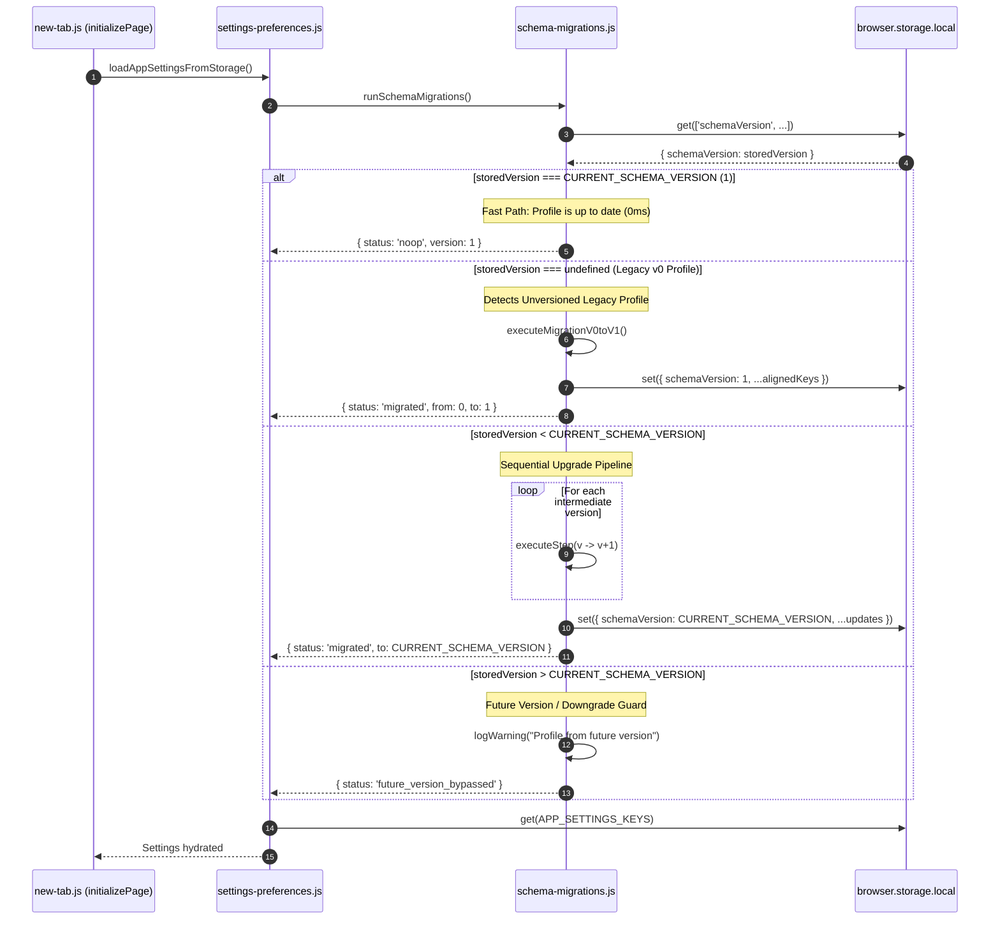

# Homebase — Improvement Cycle #3B Implementation Plan
## Storage Schema Versioning Architecture & Migration Pipeline

> **Author**: Core Extension Architect & Systems Engineer  
> **Date**: 2026-09-27  
> **Cycle ID**: Cycle #3B  
> **Target Release**: Homebase v0.15.1  
> **Authority**: [AGENTS.md](file:///c:/Users/Administrator/Desktop/Homebase/AGENTS.md), [docs/03-data-architecture.md](file:///c:/Users/Administrator/Desktop/Homebase/docs/03-data-architecture.md), [docs/20-third-improvement-plan.md](file:///c:/Users/Administrator/Desktop/Homebase/docs/20-third-improvement-plan.md), [docs/21-cycle3a-implementation-report.md](file:///c:/Users/Administrator/Desktop/Homebase/docs/21-cycle3a-implementation-report.md)  
> **Scope**: Architecture specification & implementation plan — **DO NOT MODIFY CODE**

---

## Table of Contents

1. [Executive Summary & Purpose](#1-executive-summary--purpose)
2. [Current Storage Model Audit](#2-current-storage-model-audit)
3. [Canonical Placement of `schemaVersion`](#3-canonical-placement-of-schemaversion)
4. [Startup Migration Lifecycle & Execution Flow](#4-startup-migration-lifecycle--execution-flow)
5. [Core Migration Safety Rules & Invariants](#5-core-migration-safety-rules--invariants)
6. [Backward Compatibility Strategy](#6-backward-compatibility-strategy)
7. [Rollback & Disaster Recovery Strategy](#7-rollback--disaster-recovery-strategy)
8. [Files That May Change](#8-files-that-may-change)
9. [Files That Must Not Change (Strict Invariants)](#9-files-that-must-not-change-strict-invariants)
10. [Automated Test Suite Specification](#10-automated-test-suite-specification)
11. [Manual Verification & Testing Plan](#11-manual-verification--testing-plan)

---

## 1. Executive Summary & Purpose

Following the successful execution of **Cycle #3A** (which eliminated destructive backup purges, registered missing owned keys, and aligned the Action Popup bookmark folder key), Homebase requires a permanent, standardized **Storage Schema Versioning Architecture**.

### The Core Problem
Homebase currently possesses no explicit schema version marker in `browser.storage.local`. Across 76+ storage keys, migrations have historically occurred in an **uncoordinated, ad-hoc, lazy-on-read** fashion distributed across multiple files (such as `widget-visibility.js` normalizing order arrays on load, `todo.js` synthesizing IDs, and `action-popup.js` checking legacy keys).

This unversioned state presents significant architectural hazards:
- **Multi-Tab Concurrency Hazards**: When a browser starts and restores multiple new-tab instances simultaneously, each tab executes lazy normalization and triggers race-condition writes to storage.
- **No Upgrade Auditability**: The extension cannot determine whether a given user profile was initialized in `v0.8.0`, `v0.12.0`, or `v0.15.0`.
- **Stale Key Accumulation**: Deprecated keys cannot be safely retired or restructured because there is no migration hook to transform schemas on upgrade.
- **Future AI Safety Vulnerability**: Without a rigid versioning harness, future AI coding agents risk introducing schema changes that break backward compatibility or corrupt user profiles.

### Scope of Cycle #3B
Cycle #3B defines the specification for:
1. Introducing an authoritative `schemaVersion` integer key in `browser.storage.local`.
2. Establishing `CURRENT_SCHEMA_VERSION = 1` as the immutable baseline for all current 76 owned keys.
3. Designing a centralized, sequential migration runner (`src/newtab/core/schema-migrations.js`) that executes deterministically during startup.
4. Implementing non-blocking, idempotent migration execution without altering `src/new-tab.js` or violating startup performance constraints.

---

## 2. Current Storage Model Audit

Homebase partitions data across four primary physical tiers:

```
┌────────────────────────────────────────────────────────────────────────────────────────┐
│                               CURRENT HOMEBASE STORAGE TIERS                           │
├─────────────────────────┬─────────────────────────┬────────────────────────────────────┤
│ STORAGE TIER            │ LATENCY PROFILE         │ CURRENT SCHEMA STATE               │
├─────────────────────────┼─────────────────────────┼────────────────────────────────────┤
│ 1. browser.storage.local│ Asynchronous (~5-15ms)  │ 76 Keys, Unversioned, Flat Map     │
│ 2. window.localStorage  │ Synchronous (0ms)       │ 18 Keys, Fast Preload Mirrors      │
│ 3. window.caches (API)  │ Asynchronous (~20-50ms) │ 4 Buckets, Binary Blobs & Assets   │
│ 4. window.sessionStorage│ Synchronous (0ms)       │ Ephemeral Health Diagnostics       │
└─────────────────────────┴─────────────────────────┴────────────────────────────────────┘
```

### 2.1 Unversioned Reality in `browser.storage.local`
- **Zero Version Indicator**: In existing installations, `await browser.storage.local.get('schemaVersion')` returns `{}`.
- **Implicit "Version 0"**: All existing user profiles exist in an implicit "Version 0" state where schema assumptions are hardcoded into consuming functions.
- **Key Divergences**:
  - Legacy poster reference (`cachedAppliedPoster`) sits alongside active URLs (`cachedAppliedPosterUrl`, `cachedAppliedPosterDataUrl`).
  - Action Popup historically used `homebaseLastUsedFolderId` while dashboard used `lastUsedBookmarkFolderId` (bridged via dual-write in Cycle #3A).

### 2.2 Fragmented Read-Time Normalization Patterns
Currently, schema transformations happen scattered across UI components:
1. **`src/newtab/widgets/widget-visibility.js`**:
   ```javascript
   const normalizedWidgetOrder = normalizeWidgetOrder(storedWidgetOrder);
   if (!areWidgetOrdersEqual(storedWidgetOrder, normalizedWidgetOrder)) {
     browser.storage.local.set({ [WIDGET_ORDER_KEY]: normalizedWidgetOrder });
   }
   ```
2. **`src/newtab/widgets/todo.js`**:
   ```javascript
   // Synthesizes IDs and done booleans lazily when rendering todo items
   ```
3. **`src/action-popup/action-popup.js`**:
   ```javascript
   // Fallback resolver checks lastUsedBookmarkFolderId, falls back to homebaseLastUsedFolderId
   ```

### 2.3 Backup Envelope State
In `src/newtab/settings/backup-import.js`:
- Envelope metadata contains:
  ```json
  {
    "schema": "homebase.export",
    "version": 1,
    "exportedAt": "2026-09-27T00:00:00.000Z",
    "storageLocal": { ... }
  }
  ```
- **Limitation**: `version: 1` describes the *backup JSON envelope format*, NOT the *storage schema version* of the dictionary inside `storageLocal`. If `storageLocal` schema changes, the backup envelope version alone cannot guide selective property transformations.

---

## 3. Canonical Placement of `schemaVersion`

### 3.1 Primary Home: `browser.storage.local`
- **Key Name**: `'schemaVersion'`
- **Data Type**: Positive Integer (`Number.isInteger(v) && v >= 1`)
- **Initial Baseline**: `CURRENT_SCHEMA_VERSION = 1`
- **Ownership**: `src/newtab/core/schema-migrations.js` (creation, verification, and migration)

### 3.2 Evaluation of Alternative Storage Locations

| Location | Evaluation | Decision | Justification |
| :--- | :--- | :---: | :--- |
| **`browser.storage.local`** | Canonical persistent store | **SELECTED** | Shared across all extension contexts (tabs, popups, options); persists across reboots; not wiped by standard browser cache clears. |
| **`window.localStorage`** | Synchronous origin store | **REJECTED** | Subject to browser origin-data clearing; quota limited (5MB); duplicating version introduces dual-write desynchronization risk without any startup speed benefit. |
| **`browser.storage.sync`** | Browser account sync | **REJECTED** | Homebase explicitly avoids `storage.sync` to preserve privacy and avoid 100KB account quota limits. |
| **`window.caches`** | Blob/Asset cache | **REJECTED** | Unsuitable for scalar configuration flags; subject to disk quota eviction. |

### 3.3 Backup Integration (`HOMEBASE_OWNED_STORAGE_KEYS`)
`schemaVersion` **must be added** to `HOMEBASE_OWNED_STORAGE_KEYS` in `src/newtab/settings/backup-import.js`.
- **Export**: When a user exports their settings, `schemaVersion: 1` is serialized inside `storageLocal`.
- **Import**: On import, `schemaVersion` is recognized as an owned key, validated as an integer, and restored cleanly.

### 3.4 Fast Mirror Decision
**`schemaVersion` will NOT be mirrored to `localStorage`.**
- *Rationale*: Preload (`preload.js`) executes before DOM paint to set CSS custom properties (`--bg-dim`, clock visibility). Schema versioning is purely operational data plumbing that executes asynchronously; zero CSS styles or first-paint elements depend on `schemaVersion`.

---

## 4. Startup Migration Lifecycle & Execution Flow

### 4.1 Startup Integration Point
Under [AGENTS.md](file:///c:/Users/Administrator/Desktop/Homebase/AGENTS.md), `src/new-tab.js` and `initializePage()` must **NOT** be modified.

#### The Safe Hook: `loadAppSettingsFromStorage()`
In `src/new-tab.js` (line 11446):
```javascript
const settingsP = loadAppSettingsFromStorage();
```
`loadAppSettingsFromStorage()` resides in `src/newtab/settings/settings-preferences.js`. By invoking the centralized migration runner at the very entry of `loadAppSettingsFromStorage()`, migrations execute:
1. Concurrently with wallpaper buffering and bookmark metadata retrieval.
2. Prior to settings application and widget rendering.
3. Without modifying `src/new-tab.js`.

### 4.2 Detailed Migration Execution Flow



### 4.3 Version States & Actions

| State | Stored Value | Condition | Action Taken |
| :--- | :---: | :--- | :--- |
| **State 1: Up-to-Date** | `1` | `storedVersion === CURRENT_SCHEMA_VERSION` | **No-op**. Immediate return (`<1ms`). Zero writes. |
| **State 2: Fresh Install** | `undefined` | Storage contains 0 owned keys | **Initialize**. Atomically write `{ schemaVersion: 1 }`. |
| **State 3: Legacy Existing** | `undefined` | Storage contains existing user keys | **Migrate V0 -> V1**. Run legacy alignment, write `{ schemaVersion: 1 }`. |
| **State 4: Outdated Profile** | `< CURRENT` | Storage contains older schema version | **Sequential Migration**. Run V1 -> V2 -> ... iteratively. |
| **State 5: Future / Downgrade**| `> CURRENT` | User downgraded extension version | **Bypass Safely**. Log warning; do not overwrite version; do not corrupt data. |

---

## 5. Core Migration Safety Rules & Invariants

To guarantee that schema migrations never corrupt user profiles or compromise extension stability, the migration runner must adhere to seven inviolable rules:

### Rule 1: Strict Idempotence
Every migration step function must be completely idempotent.
- Running a migration once, twice, or ten times in succession against the same storage state must yield the exact identical outcome.
- Checks such as `if (typeof stored.foo !== 'undefined')` must guard transformations.

### Rule 2: Single Atomic Storage Commit
A migration step must never write intermediate transformations across multiple individual `storage.local.set()` calls.
- All modified keys, along with the newly attained `schemaVersion`, must be committed in a **single atomic dictionary batch**:
  ```javascript
  await browser.storage.local.set({
    ...migratedDataBatch,
    schemaVersion: targetVersion
  });
  ```
- If the browser process crashes mid-operation, storage will either contain the full previous state or the full upgraded state—never a half-migrated, corrupt state.

### Rule 3: Zero Data Loss (Non-Destructive Key Retention)
Under no circumstances may a migration step delete existing user data without explicit architectural authorization.
- Legacy keys undergoing renaming (such as `homebaseLastUsedFolderId`) must be copied to the canonical key, with the legacy key retained or dual-written during a deprecation grace period.

### Rule 4: Non-Blocking Fault Tolerance
A migration failure must **never halt dashboard startup**:
- The migration runner must wrap execution in a `try...catch` block.
- If an unhandled exception occurs during migration, it must log an error to `console.error`, report the incident via the performance health recorder (`sessionStorage`), and gracefully resolve so that `loadAppSettingsFromStorage()` and `initializePage()` proceed.

### Rule 5: Concurrency & Anti-Race Protection
When a user launches their browser with multiple Homebase tabs opening simultaneously:
- A simple module-scoped in-memory execution lock (`let migrationPromise = null;`) prevents redundant migration passes within the same tab context.
- For cross-tab concurrency, the atomic check-then-set pattern ensures that if Tab A writes `schemaVersion = 1`, Tab B reading immediately afterwards hits the fast-path **State 1 (No-op)**.

### Rule 6: Zero Network Dependencies
Migrations must be strictly local and offline-first:
- A migration must **never** make a `fetch()` call, query Cloudflare R2 wallpaper manifests, or depend on remote network availability.

### Rule 7: Immutability of Custom User Payloads
Migrations must never strip unknown or custom properties from open-ended metadata objects (such as `bookmarkCustomMetadata`, `folderCustomMetadata`, or `domainIconMap`).

---

## 6. Backward Compatibility Strategy

### 6.1 Preserving Existing "Version 0" Profiles
Every user currently running Homebase v0.15.0 or earlier has an unversioned storage profile.
- The migration pipeline must treat `typeof stored.schemaVersion === 'undefined'` as **Version 0**.
- The `migrateV0toV1` transformation must:
  1. Inspect existing storage keys.
  2. If `homebaseLastUsedFolderId` exists and `lastUsedBookmarkFolderId` is missing, copy the value to `lastUsedBookmarkFolderId`.
  3. Ensure default values for critical preferences are preserved without overriding user choices.
  4. Write `schemaVersion: 1`.

### 6.2 Action Popup Parity
The Action Popup companion (`src/action-popup/action-popup.js`) operates independently of `new-tab.html`.
- During Cycle #3A, the Action Popup was upgraded to perform dual-writes to both `lastUsedBookmarkFolderId` and `homebaseLastUsedFolderId`.
- The introduction of `schemaVersion` does not disrupt the popup: the popup reads and writes canonical keys, while the dashboard manages version upgrades.

### 6.3 Backup Import Backward Compatibility
- **Legacy Backups (Pre-Cycle #3B)**:
  - Backups exported before this cycle lack `schemaVersion` inside `storageLocal`.
  - When importing a legacy backup, `importHomebaseState` detects the absence of `schemaVersion` and defaults it to `1`, ensuring the restored profile is fully recognized.
- **Future Backups**:
  - If a user attempts to import a backup from a future version (e.g. `schemaVersion: 2` into an extension running schema `1`), the import engine must display a clear user-facing dialog: `"This backup was created by a newer version of Homebase. Please update your extension."`

---

## 7. Rollback & Disaster Recovery Strategy

### 7.1 Automated In-Session Failure Containment
If a migration step throws an error during execution:
```javascript
try {
  await executeMigrationStep(currentVersion, nextVersion);
} catch (migrationError) {
  console.error('[Homebase Migration] Failed to migrate schema:', migrationError);
  // Log telemetry / health marker to sessionStorage
  if (window.sessionStorage) {
    sessionStorage.setItem('homebaseMigrationError', String(migrationError.message));
  }
  // DO NOT advance schemaVersion; allow existing readers to use fallback logic
  return { status: 'failed', error: migrationError };
}
```
Because legacy fallback logic remains active across all consuming modules, the extension continues to function even if the migration step aborts.

### 7.2 Extension Downgrade Safety (Future Version Guard)
If a user rolls back or installs an older version of Homebase over a newer profile:
- The older version encounters `schemaVersion > CURRENT_SCHEMA_VERSION`.
- The runner detects the higher version, bypasses migration, and does not overwrite `schemaVersion`.
- Consuming modules read keys using standard nullish coalescing (`stored[KEY] ?? DEFAULT`), preventing UI breakage.

### 7.3 Git Reversion & Developer Rollback
If a defect is discovered in Cycle #3B code prior to release:
- Clean revert command:
  ```powershell
  git revert <commit-hash>
  ```
- Because `schemaVersion = 1` is strictly additive and existing code contains fallback accessors, removing the migration runner does not invalidate existing storage data.

---

## 8. Files That May Change

The implementation of Cycle #3B is strictly constrained to the following candidate files:

| File Path | Operation | Planned Modification |
| :--- | :---: | :--- |
| **`src/newtab/core/schema-migrations.js`** | **NEW** | Centralized migration runner, version registry, and migration step definitions (`CURRENT_SCHEMA_VERSION = 1`). |
| **`src/newtab/settings/settings-preferences.js`** | **MODIFIED** | Invoke `runSchemaMigrations()` at the beginning of `loadAppSettingsFromStorage()`. |
| **`src/newtab/settings/backup-import.js`** | **MODIFIED** | Add `'schemaVersion'` to `HOMEBASE_OWNED_STORAGE_KEYS` and add version envelope validation during import. |
| **`src/new-tab.html`** | **MODIFIED** | Inject `<script src="newtab/core/schema-migrations.js" defer></script>` in the Core Runtime section before `settings-preferences.js`. |
| **`tests/unit/schema-migrations.test.mjs`** | **NEW** | Comprehensive unit test suite covering runner lifecycle, idempotence, concurrency, and version increments. |
| **`docs/13-maintenance-log.md`** | **MODIFIED** | Prepend standard maintenance log entry for Cycle #3B upon completion. |
| **`docs/14-ai-change-history.md`** | **MODIFIED** | Prepend standard AI change history entry for Cycle #3B upon completion. |
| **`docs/23-cycle3b-implementation-report.md`** | **NEW** | Author comprehensive post-implementation verification report. |

---

## 9. Files That Must Not Change (Strict Invariants)

In strict adherence to [AGENTS.md](file:///c:/Users/Administrator/Desktop/Homebase/AGENTS.md) and repository safety guidelines, the following files and directories **MUST NOT BE MODIFIED**:

```text
[STRICTLY PROHIBITED FROM MODIFICATION]
1. src/new-tab.js                        (High-risk: startup orchestration & initializePage must not be touched)
2. manifests/manifest.chrome.json       (High-risk: permissions & extension manifests)
3. manifests/manifest.firefox.json      (High-risk: permissions & extension manifests)
4. dist/*                               (Generated distribution output: never edit directly)
5. src/css/* & src/new-tab.css          (No visual styling changes)
6. src/preload.js                       (Fast synchronous preload path must remain pristine)
7. src/assets/js/Sortable.min.js        (Vendor script invariant)
8. src/newtab/bookmarks/*               (Bookmark drag, reorder, and render modules)
9. src/newtab/wallpaper/*               (Video/poster cache & wallpaper pool)
10. src/newtab/search/*                 (Search input, bang dispatch, suggestion cache)
```

---

## 10. Automated Test Suite Specification

A dedicated unit test file `tests/unit/schema-migrations.test.mjs` will be created using Node.js built-in `node:test` and `node:assert/strict`.

### 10.1 Required Test Cases

```javascript
// Test 1: Fresh Installation
test('schema-migrations: fresh install initializes schemaVersion to CURRENT_SCHEMA_VERSION', async () => { ... });

// Test 2: Legacy Profile Upgrade (v0 -> v1)
test('schema-migrations: unversioned profile is upgraded to schemaVersion 1 with key alignment', async () => { ... });

// Test 3: Up-to-Date Profile Fast Path
test('schema-migrations: profile already at CURRENT_SCHEMA_VERSION performs no writes', async () => { ... });

// Test 4: Idempotency Verification
test('schema-migrations: executing migration runner multiple times produces identical state', async () => { ... });

// Test 5: Atomic Batching
test('schema-migrations: all key mutations and version bump occur in single storage.local.set call', async () => { ... });

// Test 6: Future Version Downgrade Guard
test('schema-migrations: higher schemaVersion is preserved without modification or crash', async () => { ... });

// Test 7: Concurrency & Lock Protection
test('schema-migrations: concurrent invocations return identical promise without duplicate writes', async () => { ... });

// Test 8: Fault Tolerance & Graceful Degradation
test('schema-migrations: storage error during migration does not throw unhandled exception', async () => { ... });

// Test 9: Backup Integration
test('schema-migrations: schemaVersion is included in backup export and validated on import', async () => { ... });

// Test 10: Corrupted Version Value Recovery
test('schema-migrations: non-integer schemaVersion (string, negative, NaN) is safely corrected', async () => { ... });
```

### 10.2 Quality Gate Integration
The new test file will be automatically executed by `npm test` (`node scripts/test.mjs`), ensuring that the 4-stage test pipeline (Syntax, Static Invariants, Unit Tests, Browser Smoke) validates every commit.

---

## 11. Manual Verification & Testing Plan

Because Homebase is a dual-browser extension, automated unit tests must be supplemented by protocol-driven manual verification across Google Chrome and Mozilla Firefox.

### 11.1 Chrome Verification Protocol
1. **Fresh Profile Cold Boot**:
   - Open a clean Chrome profile with unpacked `dist/chrome`.
   - Open a new tab; inspect `chrome.storage.local` via DevTools Console:
     ```javascript
     chrome.storage.local.get('schemaVersion', console.log);
     ```
   - Assert `{ schemaVersion: 1 }` is present.
2. **Upgrade Simulation**:
   - Clear `schemaVersion` manually:
     ```javascript
     chrome.storage.local.remove('schemaVersion');
     ```
   - Set legacy key:
     ```javascript
     chrome.storage.local.set({ homebaseLastUsedFolderId: 'test-folder-123' });
     ```
   - Reload tab; assert `schemaVersion` is restored to `1` and `lastUsedBookmarkFolderId` matches `'test-folder-123'`.
3. **Multi-Tab Stress Pass**:
   - Open 10 Homebase tabs simultaneously using keyboard shortcut `Ctrl+T`.
   - Inspect console of each tab; assert zero errors, zero warnings, and zero unhandled rejections.

### 11.2 Firefox Verification Protocol
1. **Temporary Add-on Load**:
   - Navigate to `about:debugging` -> This Firefox -> Load Temporary Add-on -> `dist/firefox/manifest.json`.
2. **Storage Persistence & Container Check**:
   - Open new tab in Default container. Verify `schemaVersion: 1`.
   - Open new tab in "Personal" or "Work" container. Verify shared storage reads `schemaVersion: 1` without container isolation conflicts.
3. **Firefox Web Console Pass**:
   - Verify zero CSP violations, zero `ReferenceError` exceptions, and clean startup settling.

---

## 12. Conclusion & Readiness

This plan establishes a zero-risk, high-durability blueprint for implementing Storage Schema Versioning in Homebase. By isolating migration logic in `src/newtab/core/schema-migrations.js` and hooking into `loadAppSettingsFromStorage()`, Homebase gains an enterprise-grade schema migration framework without disturbing the delicate startup orchestration of `src/new-tab.js`.

Implementation will begin upon explicit user authorization for Cycle #3B execution.
