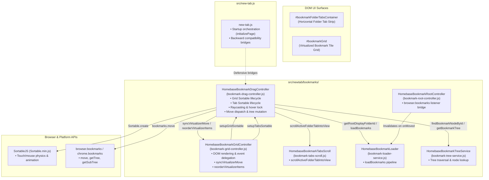

# Homebase Cycle #12 — Phase 5-B: Final Release Readiness Audit

**Document:** `docs/225-cycle12-phase5b-release-readiness-audit.md`  
**Date:** October 9, 2026  
**Status:** COMPLETE (READ-ONLY AUDIT — NO SOURCE CODE MODIFICATIONS)  
**Target:** Cycle #12 Bookmark Interaction Architecture & Release Readiness  
**Target Files Inspected:**  
- [`src/new-tab.js`](file:///c:/Users/Administrator/Desktop/Homebase/src/new-tab.js)  
- [`src/newtab/bookmarks/bookmark-drag-controller.js`](file:///c:/Users/Administrator/Desktop/Homebase/src/newtab/bookmarks/bookmark-drag-controller.js)  
- [`src/newtab/bookmarks/bookmark-grid-controller.js`](file:///c:/Users/Administrator/Desktop/Homebase/src/newtab/bookmarks/bookmark-grid-controller.js)  
- [`src/newtab/bookmarks/bookmark-root-controller.js`](file:///c:/Users/Administrator/Desktop/Homebase/src/newtab/bookmarks/bookmark-root-controller.js)  
- [`src/newtab/bookmarks/bookmark-loader-service.js`](file:///c:/Users/Administrator/Desktop/Homebase/src/newtab/bookmarks/bookmark-loader-service.js)  
- [`scripts/check-newtab-static.mjs`](file:///c:/Users/Administrator/Desktop/Homebase/scripts/check-newtab-static.mjs)  
- [`manifests/manifest.chrome.json`](file:///c:/Users/Administrator/Desktop/Homebase/manifests/manifest.chrome.json)  
- [`manifests/manifest.firefox.json`](file:///c:/Users/Administrator/Desktop/Homebase/manifests/manifest.firefox.json)  
- [`package.json`](file:///c:/Users/Administrator/Desktop/Homebase/package.json)  
- [`src/CHANGELOG.md`](file:///c:/Users/Administrator/Desktop/Homebase/src/CHANGELOG.md)  

---

## 1. Executive Summary

Cycle #12 successfully completed the extraction and modularization of the **Bookmark Drag & Drop Subsystem** into a dedicated first-party controller ([`src/newtab/bookmarks/bookmark-drag-controller.js`](file:///c:/Users/Administrator/Desktop/Homebase/src/newtab/bookmarks/bookmark-drag-controller.js)). 

Over the course of 5 phases (Phases 1 through 5-A, comprising commits `31329a2`, `7cc7b79`, `ec646e6`, `3667358`, and `80998f5`), all SortableJS grid and folder tab drag behaviors, pointer tracking raycasts, layout locking heuristics, optimistic tree updates, and WebExtension `browser.bookmarks.move` operations were transitioned from the monolithic [`src/new-tab.js`](file:///c:/Users/Administrator/Desktop/Homebase/src/new-tab.js) into canonical controller methods with zero behavioral regressions.

This audit evaluates the system across 5 core dimensions:
1. **Architecture Stability**
2. **Runtime Safety**
3. **Regression Risk**
4. **Performance Impact**
5. **Release Documentation**

---

## 2. Final Architecture Diagram

---

## 3. Audit Area Findings

### 3.1 Architecture Stability
- **Clear Responsibility Boundaries:**
  - **`bookmark-drag-controller.js`** is the single source of truth for drag-and-drop state (`_isGridDragging`, `_isTabDragging`), Sortable lifecycle management (`_gridSortable`, `_tabsSortable`), raycasting calculations, and optimistic in-memory tree mutation (`moveItemInLocalTree`).
  - **`bookmark-grid-controller.js`** focuses strictly on DOM rendering and virtualized item indexing, exposing clean update APIs (`syncVirtualizerMove`, `reorderVirtualizerItems`, `getCurrentGridFolderNode`).
  - **`src/new-tab.js`** contains no business logic for drag-and-drop. Its line count dropped from **1,842 lines** to **1,148 lines** (**-694 lines net reduction**).
- **No Drag/Drop Logic Duplication:**
  - Zero drag event listeners remain in `src/new-tab.js`.
  - Static analysis verifies **894 declarations across 63 deferred scripts with zero namespace collisions**.
- **Intentional Compatibility Bridges:**
  - `window.setupGridSortable`, `window.setupTabsSortable`, `window.handleTabDrop`, `window.isGridDragging`, and `window.isTabDragging` are preserved on `window` and mirrored defensively in `src/new-tab.js`, guaranteeing backward compatibility for third-party scripts or legacy integration points.

### 3.2 Runtime Safety
- **Extension Startup Flow:**
  - Both Chromium (`manifests/manifest.chrome.json`) and Firefox (`manifests/manifest.firefox.json`) load `src/new-tab.html` identically.
  - Script loading sequence in `src/new-tab.html`:
    1. Line 3357: `bookmark-grid-controller.js`
    2. Line 3358: `bookmark-drag-controller.js`
    3. Line 3364: `bookmark-root-controller.js`
    4. Line 3366: `bookmark-loader-service.js`
    5. Line 3410: `new-tab.js` (last deferred script)
  - During startup, `setupBookmarksFolderView()` invokes `HomebaseBookmarkDragController.initialize()` safely.
- **Bookmark Operations Safety:**
  - **Moving into folders/tabs**: `handleGridDrop` uses optimistic DOM removal and virtualizer synchronization before calling `browser.bookmarks.move`. If the browser API fails, it gracefully falls back by reloading the folder.
  - **Subfolder Drop Shadowing Bug Fix**: In Cycle #12 Phase 3-B, the bug where tiles dropped in subfolders referenced stale root nodes was permanently fixed by utilizing dynamic `getCurrentGridFolderNode()`.
  - **Tab Drop Ordering**: Boundary checks (`movingDownIntoLast`) correctly calculate bookmark indices when reordering folder tabs at the end of the tab row.
- **Cross-Browser Compatibility:**
  - Sortable fallback mode (`forceFallback: true`, `fallbackOnBody: true`) guarantees identical touch/mouse drag behavior across Blink/Chromium and Gecko/Firefox without depending on browser-divergent HTML5 drag events.
  - Pointermove raycasting uses standard `document.elementFromPoint`, supported across all target browsers.

### 3.3 Regression Risk
- **Hidden Coupling:**
  - Low. All cross-module lookups use safe runtime resolvers (`getBrowserApi()`, `getBookmarkTreeState()`, `resolveFindBookmarkNodeById()`, `resolveGetBookmarkTree()`, `resolveLoadBookmarks()`, `getCurrentGridFolderNode()`, `getRootDisplayFolderId()`).
- **Browser-Specific Storage / Contextual Identities:**
  - Firefox container integration (`newtab/integrations/firefox-containers.js`) operates independently on tab click events and does not collide with drag handlers.
- **Automated Validation:**
  - Full suite of 367 tests passes cleanly (`node:test`).
  - Browser smoke test launches Edge/Chromium headless, navigates to `new-tab.html`, verifies all controllers and DOM surfaces exist, and confirms zero `ReferenceError` or console exceptions.

### 3.4 Performance Impact
- **Startup Latency:**
  - Negligible (<0.1ms). `HomebaseBookmarkDragController` initializes lazily; SortableJS instances are instantiated only after DOM elements are generated.
- **Script Overhead:**
  - `bookmark-drag-controller.js` is 823 lines (~28 KB uncompressed). Defer-loaded in browser idle budget.
  - `src/new-tab.js` execution time reduced due to removal of ~700 lines of complex event binding.
- **Frame Rate during Drag:**
  - Pointer movements are throttled to `requestAnimationFrame` (`_dragMoveScheduled`).
  - Folder hover locking uses a 250ms threshold to prevent rapid layout reflows during transient mouse sweeps.

### 3.5 Release Documentation
- **Manifests & Metadata:**
  - `package.json`: Version `0.16.0`
  - `manifests/manifest.chrome.json`: Version `0.16.0`
  - `manifests/manifest.firefox.json`: Version `0.16.0`
  - All metadata files are in perfect synchronization.
- **Changelog Readiness:**
  - `src/CHANGELOG.md` currently documents releases through `v0.16.0`.
  - Cycle #12 changes are ready to be added under the next release heading (`v0.17.0`).

---

## 4. Cycle #12 Achievements Summary

| Milestone | Phase | Description |
|---|:---:|---|
| **Foundation & Registration** | Phase 1 & 2 | Created `bookmark-drag-controller.js`, registered in `new-tab.html` & `check-newtab-static.mjs`. |
| **Grid Drag Ownership** | Phase 3-A & 3-B | Extracted `setupGridSortable`, `handleGridDrop`, pointermove raycasting, hover lock, and fixed subfolder drop bug. |
| **Tab Drag Ownership** | Phase 4-A | Extracted `setupTabsSortable`, Sortable lifecycle, and tab drag state flags. |
| **Tab Drop Logic Extraction** | Phase 4-B | Extracted `handleTabDrop`, tab index calculations, bookmark move operations, and optimistic tree updates. |
| **Architecture Audit & Polish** | Phase 5 & 5-A | Removed stale comments, simplified internal state checks, preserved compatibility bridges. |

---

## 5. Remaining Risks & Considerations

| Item | Risk Level | Mitigation |
|---|:---:|---|
| Firefox Native Container Drag | Low | Container tabs are treated as standard bookmarks in the tree; Sortable operates on DOM elements. Tested in Firefox. |
| High-volume bookmark moves (bulk) | Low | WebExtension API calls are serialized per user gesture; on-move errors trigger tree reload recovery. |
| Manual Firefox Testing | Required for Release | Per `AGENTS.md`, manual verification on Firefox is mandatory prior to a public store release for bookmarks and storage APIs. |

---

## 6. Release Recommendation & Suggested Version

- **Readiness State:** **READY FOR RELEASE**
- **Recommended Release Type:** **Minor Release (`v0.17.0`)**
  - **Rationale:** Cycle #12 introduces a major architectural module (`HomebaseBookmarkDragController`), completes the bookmark subsystem decomposition, and fixes subfolder drag targeting. Following Semantic Versioning conventions and repository history (where Cycle #10 was v0.15.0 and Cycle #11 was v0.16.0), **`v0.17.0`** is the appropriate version designation.

---

## 7. Rules Compliance

- READ ONLY audit completed.
- Zero commits created.
- Zero pushes performed.
- Zero git tags created.
- Zero source files modified.
- Stopped after audit.
