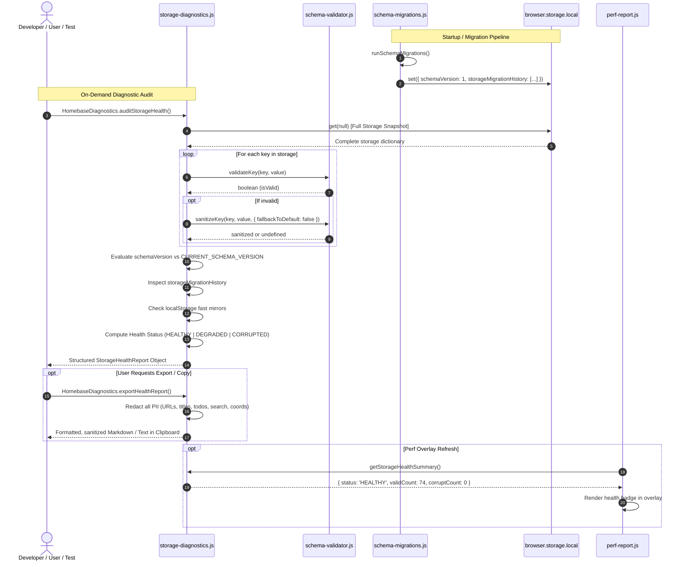

# Homebase — Improvement Cycle #5 Implementation Plan
## Storage Health Diagnostics Architecture & Observability Engine

> **Author**: Core Extension Architect & Systems Diagnostics Lead  
> **Date**: 2026-09-27  
> **Cycle ID**: Homebase Improvement Cycle #5  
> **Target Release**: Homebase v0.15.3  
> **Authority**: [AGENTS.md](file:///c:/Users/Administrator/Desktop/Homebase/AGENTS.md), [docs/03-data-architecture.md](file:///c:/Users/Administrator/Desktop/Homebase/docs/03-data-architecture.md), [docs/04-code-review.md](file:///c:/Users/Administrator/Desktop/Homebase/docs/04-code-review.md), [docs/10-testing-strategy.md](file:///c:/Users/Administrator/Desktop/Homebase/docs/10-testing-strategy.md), [docs/22-cycle3b-schema-version-plan.md](file:///c:/Users/Administrator/Desktop/Homebase/docs/22-cycle3b-schema-version-plan.md), [docs/23-cycle3b-implementation-report.md](file:///c:/Users/Administrator/Desktop/Homebase/docs/23-cycle3b-implementation-report.md), [docs/24-cycle4-storage-validation-plan.md](file:///c:/Users/Administrator/Desktop/Homebase/docs/24-cycle4-storage-validation-plan.md), [docs/25-cycle4-implementation-report.md](file:///c:/Users/Administrator/Desktop/Homebase/docs/25-cycle4-implementation-report.md)  
> **Scope**: Storage Health Diagnostics Architecture Audit & Specification — **DO NOT MODIFY CODE**

---

## Table of Contents

1. [Executive Summary & Completed Foundation](#1-executive-summary--completed-foundation)
2. [Section 1: Current Observability Audit](#2-section-1-current-observability-audit)
   - [2.1 Existing Console Logging](#21-existing-console-logging)
   - [2.2 Error Handling Patterns](#22-error-handling-patterns)
   - [2.3 Migration Logs & Status Gaps](#23-migration-logs--status-gaps)
   - [2.4 Storage Warnings](#24-storage-warnings)
   - [2.5 Validation Failure Telemetry Gaps](#25-validation-failure-telemetry-gaps)
   - [2.6 Recovery Events & Silent Normalization](#26-recovery-events--silent-normalization)
   - [2.7 Observability Matrix (Visibility, Persistence & Lifespan)](#27-observability-matrix-visibility-persistence--lifespan)
3. [Section 2: Storage Health Requirements](#3-section-2-storage-health-requirements)
   - [3.1 Question 1: Is Storage Valid?](#31-question-1-is-storage-valid)
   - [3.2 Question 2: Which Keys Are Corrupted?](#32-question-2-which-keys-are-corrupted)
   - [3.3 Question 3: What Schema Version Exists?](#33-question-3-what-schema-version-exists)
   - [3.4 Question 4: Did Migrations Complete?](#34-question-4-did-migrations-complete)
   - [3.5 Question 5: Were Repairs Performed?](#35-question-5-were-repairs-performed)
   - [3.6 Question 6: Are Backups Healthy?](#36-question-6-are-backups-healthy)
4. [Section 3: Feature Evaluation & Comparative Ranking](#4-section-3-feature-evaluation--comparative-ranking)
   - [Feature A: Storage Health Report Generator](#feature-a-storage-health-report-generator)
   - [Feature B: Migration History Tracking](#feature-b-migration-history-tracking)
   - [Feature C: Validation Failure Logging](#feature-c-validation-failure-logging)
   - [Feature D: Developer Debug Panel](#feature-d-developer-debug-panel)
   - [Feature E: Export Diagnostic Report](#feature-e-export-diagnostic-report)
   - [Comparative Feature Ranking Matrix](#comparative-feature-ranking-matrix)
5. [Section 4: Design Constraints & Performance Invariants](#5-section-4-design-constraints--performance-invariants)
   - [5.1 Strict Non-Modification Constraints](#51-strict-non-modification-constraints)
   - [5.2 Strict Architectural Invariants](#52-strict-architectural-invariants)
   - [5.3 Startup Performance Budget (< 0ms Blocking Overhead)](#53-startup-performance-budget--0ms-blocking-overhead)
6. [Section 5: Selected Improvement Package for Cycle #5](#6-section-5-selected-improvement-package-for-cycle-5)
   - [6.1 The Core Problem Statement](#61-the-core-problem-statement)
   - [6.2 Selected Architectural Solution](#62-selected-architectural-solution)
   - [6.3 Architecture Design & Data Flow](#63-architecture-design--data-flow)
7. [Section 6: Files Affected & Files Protected](#7-section-6-files-affected--files-protected)
   - [7.1 Files Affected](#71-files-affected)
   - [7.2 Files Strictly Protected (Invariants)](#72-files-strictly-protected-invariants)
8. [Section 7: Implementation Sequence](#8-section-7-implementation-sequence)
9. [Section 8: Testing Strategy](#9-section-8-testing-strategy)
   - [8.1 Automated 4-Tier Test Pipeline Verification](#81-automated-4-tier-test-pipeline-verification)
   - [8.2 Automated Unit Test Specifications](#82-automated-unit-test-specifications)
   - [8.3 Manual Cross-Browser Verification Protocols](#83-manual-cross-browser-verification-protocols)
10. [Section 9: Rollback & Disaster Recovery Plan](#10-section-9-rollback--disaster-recovery-plan)

---

## 1. Executive Summary & Completed Foundation

Homebase has systematically resolved major data durability and structural vulnerabilities across its preceding engineering cycles:
- **Unified Testing Baseline (Cycle #2)**: Deployed a zero-dependency multi-tier test harness (`npm test`) covering syntax AST validation, static structural invariants, unit tests (`node:test`), and headless CDP browser smoke verification.
- **Backup Retention Protection (Cycle #3A)**: Permanently eliminated destructive storage wipes during backup restoration (`browser.storage.local.remove(removals)` removed) and secured unrepresented user keys.
- **Storage Key Alignment (Cycle #3A)**: Aligned bookmark save tracking between the action popup (`homebaseLastUsedFolderId`) and new-tab dashboard (`lastUsedBookmarkFolderId`) with backward-compatible dual-write and auto-migration.
- **Schema Version Foundation (Cycle #3B)**: Established canonical `schemaVersion = 1` in `browser.storage.local`, registered the version marker in `HOMEBASE_OWNED_STORAGE_KEYS`, built the sequential migration runner skeleton ([src/newtab/core/schema-migrations.js](file:///c:/Users/Administrator/Desktop/Homebase/src/newtab/core/schema-migrations.js)), and integrated startup execution inside `loadAppSettingsFromStorage()` without touching [src/new-tab.js](file:///c:/Users/Administrator/Desktop/Homebase/src/new-tab.js).
- **Storage Validation Architecture (Cycle #4)**: Built [src/newtab/core/schema-validator.js](file:///c:/Users/Administrator/Desktop/Homebase/src/newtab/core/schema-validator.js) (`window.HomebaseValidator`) providing authoritative schema definitions covering all 74 storage keys with type validation, number/integer clamping, enum checking, 3/6-digit hex color expansion, array bounds, object prototype inspection, and prototype pollution defense. Sanitized backup imports in [src/newtab/settings/backup-import.js](file:///c:/Users/Administrator/Desktop/Homebase/src/newtab/settings/backup-import.js) and migration updates in [src/newtab/core/schema-migrations.js](file:///c:/Users/Administrator/Desktop/Homebase/src/newtab/core/schema-migrations.js) with sub-millisecond execution.

### The Objective of Cycle #5: Storage Health Diagnostics
While the storage layer is now versioned and protected by schema validators, **it operates as a complete black box**. 
When storage values are corrupted, when migrations execute or fail, when backup files are rejected or repaired, and when self-healing algorithms clamp out-of-bounds numbers:
- **Zero persistent telemetry or logs exist**.
- **Neither developers, users, nor future AI agents can inspect storage integrity without manually writing JavaScript in the DevTools console**.
- **Support issues and bug reports provide zero actionable storage state**.

**Cycle #5 designs the Storage Health Diagnostics Architecture**: an on-demand, non-blocking, privacy-preserving observability engine that provides complete transparency into storage validity, corruption detection, migration history, self-healing repairs, and backup health.

---

## 2. Section 1: Current Observability Audit

A comprehensive codebase audit was conducted across all 39 deferred JavaScript scripts, preload layers, widgets, and settings modules to assess existing observability mechanisms.

```
┌────────────────────────────────────────────────────────────────────────────────────────┐
│                              CURRENT OBSERVABILITY INVENTORY                           │
├────────────────────┬─────────────────────────────┬─────────────────────────────────────┤
│ MECHANISM          │ CURRENT LOCATION(S)         │ OBSERVABILITY DEFICIENCY            │
├────────────────────┼─────────────────────────────┼─────────────────────────────────────┤
│ Console Logging    │ 20+ files across src/       │ Ad-hoc, uncoordinated, ephemeral;   │
│                    │                             │ lost immediately upon tab closure   │
├────────────────────┼─────────────────────────────┼─────────────────────────────────────┤
│ Error Handling     │ Scattered try/catch blocks  │ Silent swallowing in preload/instant;│
│                    │                             │ errors caught but never aggregated  │
├────────────────────┼─────────────────────────────┼─────────────────────────────────────┤
│ Migration Logs     │ schema-migrations.js        │ Outputs console.warn/error only;    │
│                    │                             │ no persistent record or timestamp   │
├────────────────────┼─────────────────────────────┼─────────────────────────────────────┤
│ Storage Warnings   │ perf-report.js (session)    │ Only tracks 2 hardcoded fallbacks;  │
│                    │                             │ storage read/write errors omitted   │
├────────────────────┼─────────────────────────────┼─────────────────────────────────────┤
│ Validation Failures│ schema-validator.js         │ 100% silent boolean/null returns;   │
│                    │                             │ zero logging or telemetry           │
├────────────────────┼─────────────────────────────┼─────────────────────────────────────┤
│ Recovery Events    │ validator & widget siloing  │ Silent clamping and default resets; │
│                    │                             │ user/developer unaware of repairs   │
└────────────────────┴─────────────────────────────┴─────────────────────────────────────┘
```

### 2.1 Existing Console Logging
Console logging across the repository exhibits extreme fragmentation:
1. **Conditional Debug Logging**: [src/newtab/core/startup-perf-runtime.js](file:///c:/Users/Administrator/Desktop/Homebase/src/newtab/core/startup-perf-runtime.js) defines `hbDebugLog()` and `hbDebugInfo()`, but these are gated behind `localStorage.getItem('homebaseDebugLogs') === '1'` or `?debug` / `?perf` URL parameters.
2. **Uncoordinated Warning Statements**:
   - Widgets (`weather.js`, `todo.js`, `quote.js`, `news.js`, `widget-visibility.js`): Output isolated warnings when persistence calls reject (e.g. `console.warn('Failed to save todo items', err)`).
   - Wallpaper Gallery (`gallery-ui.js`): Logs asset cache errors, poster generation failures, and manifest timeouts.
3. **Absence in Core Validation**: [src/newtab/core/schema-validator.js](file:///c:/Users/Administrator/Desktop/Homebase/src/newtab/core/schema-validator.js) contains **zero console statements**. Functions like `validateKey()`, `sanitizeKey()`, and `sanitizeStorageBatch()` execute purely in-memory and return transformed values silently.

### 2.2 Error Handling Patterns
Error handling is defensive but non-observant:
1. **Critical Path Swallowing**:
   - [src/preload.js](file:///c:/Users/Administrator/Desktop/Homebase/src/preload.js) (lines 45, 53) and [src/instant_load.js](file:///c:/Users/Administrator/Desktop/Homebase/src/instant_load.js) (lines 71, 84, 147, 219, 244, 272) wrap fast-mirror reads in empty `catch (e) {}` blocks. If `localStorage` access is blocked or corrupted, it fails completely silently.
2. **Settings Hydration Fault Tolerance**:
   - In [src/newtab/settings/settings-preferences.js](file:///c:/Users/Administrator/Desktop/Homebase/src/newtab/settings/settings-preferences.js):
     ```javascript
     try {
       if (typeof runSchemaMigrations === 'function') {
         await runSchemaMigrations();
       }
     } catch (migErr) {
       console.error('Schema migration run failed safely:', migErr);
     }
     ```
     If migrations fail, the error is logged to the console, and settings hydration continues using hardcoded defaults. The error is discarded and never stored.
3. **Backup Import Error Handling**:
   - [src/newtab/settings/backup-import.js](file:///c:/Users/Administrator/Desktop/Homebase/src/newtab/settings/backup-import.js) throws explicit errors for malformed JSON or unsupported versions (`'Invalid backup schema.'`, `'Unsupported backup version.'`), surfacing a user alert dialog (`showCustomDialog`). However, corrupted keys sanitized or dropped by `sanitizeStorageBatch()` generate zero user or developer feedback.

### 2.3 Migration Logs & Status Gaps
In [src/newtab/core/schema-migrations.js](file:///c:/Users/Administrator/Desktop/Homebase/src/newtab/core/schema-migrations.js):
- The runner returns a structured execution descriptor: `{ status: 'noop' | 'initialized' | 'future_version_bypassed' | 'migrated' | 'error', version: number, error?: Error }`.
- **The Gap**: The caller in `settings-preferences.js` discards this return value!
- Neither the timestamp of migration, the previous version, the intermediate steps executed, the duration, nor the failure details are recorded to persistent storage or made available to diagnostics.

### 2.4 Storage Warnings
In [src/newtab/core/perf-report.js](file:///c:/Users/Administrator/Desktop/Homebase/src/newtab/core/perf-report.js):
- A warning accumulator exists: `recordPerfWarning(key, message)` pushes into `perfState.warnings` and persists to `sessionStorage` (`homebasePerfHealthSession`).
- **The Gap**: `recordPerfWarning` is only connected to bookmark root recovery (`bookmarks-fallback`) and gallery poster cache warnings (`galleryPosters-fallback`).
- None of the 74 storage keys, schema validation events, quota limits, or migration states interact with this warning system.

### 2.5 Validation Failure Telemetry Gaps
Cycle #4 introduced powerful schema validators, but their execution produces zero diagnostic trail:
- If a backup file contains `appBackgroundDim: 250`, `sanitizeKey` quietly clamps it to `80`.
- If a backup file contains an invalid hex color `"<script>alert(1)</script>"`, `sanitizeKey` silently discards it.
- If prototype pollution (`__proto__`, `constructor`) is attempted, `sanitizeStorageBatch` quietly strips it.
- **The Gap**: Neither the user, the developer, nor an AI agent running a smoke test has any means of knowing that 1, 5, or 20 keys were sanitized or dropped.

### 2.6 Recovery Events & Silent Normalization
Multiple modules contain silent self-healing routines:
- `widget-visibility.js`: Restores missing widget IDs to `widgetOrder`.
- `todo.js`: Retroactively synthesizes IDs and `createdAt` for malformed todos.
- `action-popup.js`: Resolves `homebaseLastUsedFolderId` fallback.
- `schema-validator.js`: Expands 3-digit hex colors, clamps floats, bounds arrays.
All recovery events execute invisibly. When a user asks "Why did my settings change?", there is no audit log to consult.

### 2.7 Observability Matrix (Visibility, Persistence & Lifespan)

| Diagnostic Event | Where Errors Appear | Who Can See Them | Does It Persist? | Survives Browser Restart? |
| :--- | :--- | :--- | :---: | :---: |
| **Storage Write Failure** | DevTools Console (`console.warn`) | Developer only (with DevTools open) | No | **No** (Lost on tab close) |
| **Fast Preload Read Error** | Nowhere (Swallowed in `catch {}`) | Nobody | No | **No** (Completely invisible) |
| **Schema Migration Error** | DevTools Console (`console.error`) | Developer only (with DevTools open) | No | **No** (Lost on tab close) |
| **Downgrade Guard Warning**| DevTools Console (`console.warn`) | Developer only (with DevTools open) | No | **No** (Lost on tab close) |
| **Validation Failure / Drop**| Nowhere (Pure return value) | Nobody | No | **No** (Completely invisible) |
| **Number / Color Clamping** | Nowhere (Silent self-repair) | Nobody | No | **No** (Completely invisible) |
| **Corrupt Backup Key Drop** | Nowhere (Silently omitted) | Nobody | No | **No** (Completely invisible) |
| **Bookmark Tree Fallback** | Perf Overlay & `sessionStorage` | Developer (with overlay enabled) | Session-only | **No** (Lost on window close) |
| **Storage Quota Exceeded** | Uncaught `QuotaExceededError` | Developer only | No | **No** (Crash without log) |

---

## 3. Section 2: Storage Health Requirements

A comprehensive Storage Health Diagnostics system must provide unambiguous, deterministic answers to six fundamental operational questions without requiring code inspection or manual debugging.

```
┌────────────────────────────────────────────────────────────────────────┐
│                   SIX CORE STORAGE HEALTH REQUIREMENTS                 │
├────────────────────┬───────────────────────────────────────────────────┤
│ QUESTION           │ DIAGNOSTIC CAPABILITY REQUIRED                    │
├────────────────────┼───────────────────────────────────────────────────┤
│ 1. Storage Valid?  │ Overall health rating (HEALTHY, WARNING, CRITICAL)│
│                    │ Key validation ratio and anomaly summary          │
├────────────────────┼───────────────────────────────────────────────────┤
│ 2. Keys Corrupted? │ Granular list of malformed keys with failure type │
│                    │ (type mismatch, out of bounds, enum, structure)   │
├────────────────────┼───────────────────────────────────────────────────┤
│ 3. Schema Version? │ Authoritative version comparison against baseline │
│                    │ (v0 unversioned, v1 aligned, downgrade warning)   │
├────────────────────┼───────────────────────────────────────────────────┤
│ 4. Migrations Done?│ Execution status, timestamp, duration, and error  │
│                    │ details for the last migration pipeline run       │
├────────────────────┼───────────────────────────────────────────────────┤
│ 5. Repairs Done?   │ Audit trail of clamped, normalized, or defaulted  │
│                    │ settings during startup, import, or validation    │
├────────────────────┼───────────────────────────────────────────────────┤
│ 6. Backup Healthy? │ Pre-flight validation of backup JSON payloads     │
│                    │ reporting valid, recoverable, and invalid keys    │
└────────────────────┴───────────────────────────────────────────────────┘
```

### 3.1 Question 1: Is Storage Valid?
The diagnostic system must evaluate the global state of `browser.storage.local` and compute a clear, tri-state health classification:
- **`HEALTHY` (Green)**: 100% of stored owned keys conform strictly to `SCHEMA_DEFINITIONS`; `schemaVersion === CURRENT_SCHEMA_VERSION`; zero prototype pollution or malformed structures detected.
- **`DEGRADED` (Yellow)**: Storage contains recoverable anomalies: numbers requiring clamping (e.g. `dim: 85`), 3-digit hex colors, unversioned legacy profile (`schemaVersion` missing but valid data), or unowned unknown keys.
- **`CORRUPTED` (Red)**: Critical failures detected: fatal type mismatches (e.g. `widgetOrder` is boolean, `cachedWeatherData` is string), prototype pollution attempted, schema migration failure recorded, or storage quota approaching origin limits.

### 3.2 Question 2: Which Keys Are Corrupted?
The diagnostic system must inspect every key present in `browser.storage.local` and produce an itemized diagnostic record:
- **Key Name**: The exact string identifier.
- **Validity Status**: `VALID`, `RECOVERABLE` (can be normalized), or `CORRUPTED` (unrecoverable, must be discarded or defaulted).
- **Failure Code**: Precise violation taxonomy:
  - `TYPE_MISMATCH`: Expected boolean/number/string/object, got incompatible type.
  - `OUT_OF_BOUNDS`: Numeric value exceeds minimum or maximum bounds.
  - `INVALID_ENUM`: String is not an authorized member of declared options.
  - `MALFORMED_HEX`: Color string violates hex regex or contains unsafe injection tokens.
  - `MALFORMED_ARRAY`: Array contains invalid member types or excessive length.
  - `PROTOTYPE_POLLUTION`: Contains forbidden `__proto__`, `constructor`, or `prototype` keys.
- **Safe Representation**: Sanitized, privacy-safe description of the anomaly (never displaying private bookmark titles, URLs, or personal text).

### 3.3 Question 3: What Schema Version Exists?
The diagnostic system must read and evaluate the stored schema version marker:
- **Stored Version**: The numeric value of `schemaVersion` in `storage.local`.
- **Target Version**: `CURRENT_SCHEMA_VERSION` (currently `1`).
- **Profile Classification**:
  - `ALIGNED`: `storedVersion === CURRENT_SCHEMA_VERSION`
  - `LEGACY_UNVERSIONED`: `storedVersion === undefined || storedVersion === null`
  - `OUTDATED`: `storedVersion < CURRENT_SCHEMA_VERSION` (pending upgrade)
  - `FUTURE_DOWNGRADE`: `storedVersion > CURRENT_SCHEMA_VERSION` (extension downgraded)

### 3.4 Question 4: Did Migrations Complete?
The diagnostic system must track the execution lifecycle of `runSchemaMigrations()`:
- **Last Run Timestamp**: ISO 8601 timestamp of the most recent migration attempt.
- **Execution Status**: `noop` | `initialized` | `migrated` | `future_version_bypassed` | `error`.
- **Version Transition**: `fromVersion` -> `toVersion`.
- **Execution Duration**: Milliseconds taken by the migration runner.
- **Failure Information**: If status is `error`, record the error name, message, and failure step without halting dashboard startup.

### 3.5 Question 5: Were Repairs Performed?
The diagnostic system must record self-healing operations executed by `HomebaseValidator`:
- **Repair Event**: When `sanitizeKey()` alters an incoming value (clamping, hex expansion, default assignment).
- **Source**: `startup_sanitization`, `backup_import`, `migration_step`, or `runtime_set`.
- **Target Key**: The key that underwent repair.
- **Action Taken**: e.g., `"Clamped appBackgroundDim from 120 to 80"`, `"Restored default widget order"`, `"Normalized #FFF to #FFFFFF"`.

### 3.6 Question 6: Are Backups Healthy?
The diagnostic system must provide an on-demand pre-flight validator for backup JSON files:
- **Envelope Integrity**: Verifies `schema === 'homebase.export'` and `version === 1`.
- **Key Audit**: Counts how many keys in `storageLocal` are:
  - Fully Valid (ready for direct import)
  - Recoverable (will be safely clamped/normalized)
  - Invalid (will be discarded without bricking user state)
  - Unknown/Future Keys (will be preserved non-destructively)
- **Critical Key Presence**: Verifies presence of foundational keys (`schemaVersion`, `widgetOrder`, `todoItems`, `wallpaperSelection`, `myWallpapers`).

---

## 4. Section 3: Feature Evaluation & Comparative Ranking

Five candidate observability features were evaluated against the project's technical goals, constraints, and architecture.

---

### Feature A: Storage Health Report Generator
- **Description**: An on-demand diagnostic engine (`HomebaseDiagnostics.auditStorageHealth()`) that scans all keys in `browser.storage.local`, cross-references each against `HomebaseValidator.SCHEMA_DEFINITIONS`, inspects `localStorage` fast mirrors, checks Cache Storage quotas, and generates a structured, structured diagnostic object.
- **User Benefit**: **Moderate to High**. Empowers users and support threads with immediate clarity on storage integrity.
- **Developer Benefit**: **Exceptional**. Provides a one-line console/test command to inspect the exact state of all 74+ keys.
- **Risk**: **Zero**. Completely read-only, non-destructive, and initiates zero storage writes.
- **Complexity**: **Low to Moderate**. Leverages existing schema definitions and validation functions in `schema-validator.js`.
- **Future AI Debugging Value**: **Exceptional**. Automated test harnesses and AI coding agents can invoke `auditStorageHealth()` during CI smoke passes to instantly catch regressions.

---

### Feature B: Migration History Tracking
- **Description**: A lightweight persistent log stored in `browser.storage.local` under key `storageMigrationHistory` (an array capped at 5 entries). Records timestamp, status, `fromVersion`, `toVersion`, duration, and error message for each migration run.
- **User Benefit**: **Moderate**. Prevents repeated failed migration attempts on every tab boot.
- **Developer Benefit**: **Very High**. Eliminates guesswork regarding whether an upgrade completed or failed.
- **Risk**: **Very Low**. Capped array; atomic batch update with schema version.
- **Complexity**: **Low**. Injected directly into `runSchemaMigrations()` in `schema-migrations.js`.
- **Future AI Debugging Value**: **Very High**. Allows automated verification of multi-version migration step functions.

---

### Feature C: Validation Failure Logging
- **Description**: An in-memory circular ring buffer (`ValidationLog`, capped at 50 entries) that records every validation failure, clamping event, and dropped key during runtime writes, backup imports, and migrations.
- **User Benefit**: **Moderate**. Enables diagnostic transparency when settings do not save as expected.
- **Developer Benefit**: **High**. Pinpoints the exact module, key, and bad payload that triggered sanitization.
- **Risk**: **Low**. In-memory only; bounded memory footprint (<20KB); zero persistence overhead.
- **Complexity**: **Low to Moderate**. Modular hooks in `schema-validator.js` and `backup-import.js`.
- **Future AI Debugging Value**: **High**. Provides runtime breadcrumbs when debugging UI components.

---

### Feature D: Developer Debug Panel
- **Description**: A visual UI view embedded in Settings > Advanced or expanding the existing Performance Overlay (`perf-report.js`) to display live Storage Health status, corrupted key count, schema version, and migration status.
- **User Benefit**: **High for Power Users**. Immediate visual status without opening DevTools.
- **Developer Benefit**: **High**. Direct on-screen dashboard during local extension development.
- **Risk**: **Low to Medium**. Requires DOM additions and event listeners; must not alter CSS or violate layout constraints.
- **Complexity**: **Medium to High**. UI markup, rendering logic, and event listeners.
- **Future AI Debugging Value**: **Moderate**. AI agents inspect data structures directly; UI rendering is secondary.

---

### Feature E: Export Diagnostic Report
- **Description**: A privacy-preserving utility (`HomebaseDiagnostics.exportReport()`) that serializes the storage health audit into a sanitized text or JSON report and copies it to the clipboard or downloads a file. Strips all personal bookmark titles, URLs, todo notes, and search queries.
- **User Benefit**: **Very High**. Allows users to attach a single clean diagnostic report to GitHub issues or support inquiries.
- **Developer Benefit**: **Exceptional**. Provides full diagnostic context for debugging user-reported bugs without privacy risks.
- **Risk**: **Low**. Requires strict PII redaction to prevent accidental bookmark or search data leaks.
- **Complexity**: **Low to Moderate**. Built on top of Feature A's output format.
- **Future AI Debugging Value**: **Exceptional**. Future AI agents resolving user bug reports can directly ingest the diagnostic report to identify the root cause.

---

### Comparative Feature Ranking Matrix

| Candidate Feature | User Benefit | Developer Benefit | Risk Profile | Complexity | Future AI Value | Overall Score | Priority Rank |
| :--- | :---: | :---: | :---: | :---: | :---: | :---: | :---: |
| **Feature A: Storage Health Report Generator** | Moderate (7/10) | Exceptional (10/10) | Zero (10/10) | Low-Med (8/10) | Exceptional (10/10) | **9.0 / 10** | **Rank 1 (Core Engine)** |
| **Feature E: Export Diagnostic Report** | Very High (9/10) | Exceptional (10/10) | Low (8/10) | Low-Med (8/10) | Exceptional (10/10) | **9.0 / 10** | **Rank 1 (User / Support Interface)** |
| **Feature B: Migration History Tracking** | Moderate (7/10) | Very High (9/10) | Very Low (9/10)| Low (9/10) | Very High (9/10) | **8.6 / 10** | **Rank 2 (Persistence Ledger)** |
| **Feature C: Validation Failure Logging** | Moderate (6/10) | High (8/10) | Low (9/10) | Low-Med (8/10) | High (8/10) | **7.8 / 10** | **Rank 3 (Telemetry Buffer)** |
| **Feature D: Developer Debug Panel** | High (8/10) | High (8/10) | Low-Med (7/10) | Med-High (5/10) | Moderate (6/10) | **6.8 / 10** | **Rank 4 (Deferred to UI Phase)** |

---

## 5. Section 4: Design Constraints & Performance Invariants

To maintain Homebase's sub-50ms new-tab first-paint speed, zero layout shift, and ironclad privacy, Cycle #5 establishes strict architectural constraints:

### 5.1 Strict Non-Modification Constraints
Under [AGENTS.md](file:///c:/Users/Administrator/Desktop/Homebase/AGENTS.md), the following high-risk components **must NOT be modified**:
- **`src/new-tab.js`**: `initializePage()`, startup orchestration, idle schedulers, and bookmark rendering remain 100% untouched.
- **`src/preload.js`**: `<head>` fast-path execution remains strictly invariant. Zero diagnostic logic may run in `preload.js`.
- **`src/instant_load.js`**: Instant body hydration remains strictly invariant.
- **`manifests/*`**: Chrome and Firefox extension manifests remain untouched. Zero permission additions.
- **`src/css/*` & `src/new-tab.css`**: No style modifications or stylesheet bloat.
- **`dist/*`**: Generated browser distribution bundles must never be committed.

### 5.2 Strict Architectural Invariants
- **100% Offline-First & Zero Network Calls**: The diagnostic engine must be completely self-contained. It must never make external HTTP requests (`fetch`), ping telemetry servers, or depend on remote endpoints.
- **Ironclad Privacy & PII Redaction**: Diagnostic reports and validation logs must **never** record or export personal user data:
  - Bookmark URLs, bookmark titles, folder names: **Redacted / Omitted**
  - Todo task strings: **Redacted / Length-only**
  - Search queries and history: **Omitted**
  - Weather coordinates (latitude/longitude): **Truncated / Omitted**
  - Video URLs and wallpaper blob keys: **Truncated / Presence-only**
- **Classic `<script defer>` Architecture**: Kept as vanilla deferred scripts. Zero ES modules (`import`/`export`), zero bundlers, zero npm runtime dependencies.

### 5.3 Startup Performance Budget (< 0ms Blocking Overhead)
- **Zero Blocking Impact on Critical Path**: The diagnostic system **must not execute full storage health audits during startup**.
- **Execution Partitioning**:
  1. *Startup Path (`loadAppSettingsFromStorage`)*: Migration runner writes only a lightweight migration record if an upgrade actually occurred. Fast-path (up-to-date) startup overhead is **0ms**.
  2. *Full Storage Audit (`auditStorageHealth`)*: Runs **strictly on-demand** (when requested by user/developer/test) or deferred during idle periods via `requestIdleCallback` after `init-ready`.
  3. *Latency Budget*: On-demand audit across all 74 keys must execute in under **5.0ms** total.

---

## 6. Section 5: Selected Improvement Package for Cycle #5

### 6.1 The Core Problem Statement
Homebase currently validates data via `HomebaseValidator` and tracks versions via `HomebaseMigrations`, but lacks any observability or diagnostic infrastructure. Storage write failures, silent clamping of out-of-bounds numbers, dropped corrupt backup keys, migration execution results, and storage health states are completely invisible to users, developers, and AI agents. When issues arise, debugging requires manual console exploration with zero persistent logs.

### 6.2 Selected Architectural Solution
For **Improvement Cycle #5**, Homebase will implement a unified **Storage Health Diagnostics Architecture** comprising:

```
┌────────────────────────────────────────────────────────────────────────┐
│               CYCLE #5: STORAGE HEALTH DIAGNOSTICS PACKAGE             │
├────────────────────────────────────────────────────────────────────────┤
│ 1. Core Diagnostics Module (src/newtab/core/storage-diagnostics.js)    │
│    - Authoritative auditStorageHealth() engine                         │
│    - Capped in-memory validation failure ring buffer (50 entries)      │
│    - Pre-flight backup health auditor (auditBackupHealth)              │
│    - Privacy-redacted report serializer (generateHealthReport)         │
│    - One-click clipboard export (exportHealthReport)                   │
├────────────────────────────────────────────────────────────────────────┤
│ 2. Migration History Persistence (src/newtab/core/schema-migrations.js)│
│    - Persist storageMigrationHistory (capped at 5 entries) in storage  │
│    - Record timestamp, status, from/to version, duration, and error    │
├────────────────────────────────────────────────────────────────────────┤
│ 3. Validation Telemetry Bridge (src/newtab/core/schema-validator.js)   │
│    - Hook sanitizeKey to emit structured anomaly events to diagnostics │
│    - Record dropped keys, clamped numbers, and normalized colors       │
├────────────────────────────────────────────────────────────────────────┤
│ 4. Performance Overlay Health Integration (src/newtab/core/perf-report)│
│    - Display Storage Health status (HEALTHY / DEGRADED / CORRUPTED)    │
│    - Integrate storage health summary into buildFullPerfReport()       │
├────────────────────────────────────────────────────────────────────────┤
│ 5. Automated Unit Test Suite (tests/unit/storage-diagnostics.test.mjs) │
│    - 10+ comprehensive test suites covering audits, corruption         │
│      detection, migration history, backup pre-flight, and privacy      │
└────────────────────────────────────────────────────────────────────────┘
```

### 6.3 Architecture Design & Data Flow



---

## 7. Section 6: Files Affected & Files Protected

### 7.1 Files Affected

| File Path | Status | Nature of Proposed Change |
| :--- | :---: | :--- |
| **`src/newtab/core/storage-diagnostics.js`** | **NEW** | Primary diagnostics engine: `auditStorageHealth()`, `auditBackupHealth()`, `getValidationLog()`, `generateHealthReport()`, `exportHealthReport()`. |
| **`src/new-tab.html`** | **MODIFIED** | Register `newtab/core/storage-diagnostics.js` under Core Runtime directly after `schema-migrations.js`. |
| **`src/newtab/core/schema-migrations.js`** | **MODIFIED** | Record migration outcomes to `storageMigrationHistory` key in `browser.storage.local`. |
| **`src/newtab/core/schema-validator.js`** | **MODIFIED** | Connect optional anomaly event callback in `sanitizeKey` to log clamping/dropping events. |
| **`src/newtab/core/perf-report.js`** | **MODIFIED** | Incorporate storage health summary into `buildFullPerfReport()` and debug overlay. |
| **`src/newtab/settings/backup-import.js`** | **MODIFIED** | Add `'storageMigrationHistory'` to `HOMEBASE_OWNED_STORAGE_KEYS`. |
| **`tests/unit/storage-diagnostics.test.mjs`** | **NEW** | Complete unit test suite verifying diagnostics, corruption detection, privacy, and latency. |
| **`docs/26-cycle5-storage-health-plan.md`** | **NEW** | This architecture specification document. |
| **`docs/27-cycle5-implementation-report.md`** | **NEW** | Post-implementation verification report (upon execution). |

### 7.2 Files Strictly Protected (Invariants)

The following files and areas are **strictly invariant** and must not be modified:
- `src/new-tab.js` (Strictly untouched: initializePage, bookmarks, idle scheduling)
- `src/preload.js` (Strictly untouched: synchronous head preload)
- `src/instant_load.js` (Strictly untouched: synchronous body instant load)
- `manifests/manifest.chrome.json` & `manifests/manifest.firefox.json` (Strictly untouched)
- `src/new-tab.css` & `src/css/*` (Strictly untouched: styling unchanged)
- `dist/*` (Strictly untouched: generated files never committed)
- Existing storage keys & defaults (Strictly backward compatible)

---

## 8. Section 7: Implementation Sequence

The implementation for Cycle #5 is structured into five sequential, verifiable phases:

```
┌────────────────────────────────────────────────────────────────────────┐
│                   CYCLE #5 IMPLEMENTATION PHASES                       │
├────────────────────────────────────────────────────────────────────────┤
│ Phase 1: Core Diagnostics Engine (storage-diagnostics.js)              │
│          Implement auditStorageHealth, auditBackupHealth, redaction    │
├────────────────────────────────────────────────────────────────────────┤
│ Phase 2: Script Dependency Integration (new-tab.html)                  │
│          Load storage-diagnostics.js after schema-migrations.js        │
├────────────────────────────────────────────────────────────────────────┤
│ Phase 3: Migration History Persistence (schema-migrations.js)          │
│          Commit storageMigrationHistory record upon migration runs     │
├────────────────────────────────────────────────────────────────────────┤
│ Phase 4: Validation Event & Perf Overlay Bridge                        │
│          Hook validation anomalies and surface status in perf overlay  │
├────────────────────────────────────────────────────────────────────────┤
│ Phase 5: Automated Unit Testing & Benchmarks                           │
│          10+ unit tests in tests/unit/storage-diagnostics.test.mjs     │
└────────────────────────────────────────────────────────────────────────┘
```

### Phase 1: Core Diagnostics Engine (`src/newtab/core/storage-diagnostics.js`)
Create the dedicated diagnostics module exposing `window.HomebaseDiagnostics`:
1. `auditStorageHealth(customBrowserApi)`:
   - Queries `browser.storage.local.get(null)` for a full snapshot.
   - Evaluates all owned keys against `HomebaseValidator.SCHEMA_DEFINITIONS`.
   - Categorizes keys into `valid`, `recoverable`, `corrupted`, and `unknown`.
   - Evaluates `schemaVersion` against `CURRENT_SCHEMA_VERSION`.
   - Inspects `storageMigrationHistory` for recent upgrade failures.
   - Computes global health score: `HEALTHY`, `DEGRADED`, or `CORRUPTED`.
2. `auditBackupHealth(jsonStringOrObject)`:
   - Pre-flight validation of backup files before user restoration.
   - Analyzes schema envelope, version, key counts, corrupted keys, and missing essentials.
3. `recordValidationAnomaly(key, action, detail)`:
   - In-memory circular buffer (capped at 50 entries) recording clamping, normalizations, and dropped keys.
4. `generateHealthReport(options)`:
   - Compiles a privacy-redacted, human-readable Markdown or text report.
   - Strictly redacts all PII (URLs, bookmark titles, todo notes, coordinates, search queries).
5. `exportHealthReport(options)`:
   - Copies the sanitized report to the system clipboard via `navigator.clipboard.writeText`.

### Phase 2: Script Dependency Registration (`src/new-tab.html`)
In `src/new-tab.html`, register the new script in Core Runtime directly following `schema-migrations.js`:
```html
  <!-- Core runtime -->
  <script src="newtab/core/dock-navigation.js" defer></script>
  <script src="newtab/core/schema-validator.js" defer></script>
  <script src="newtab/core/schema-migrations.js" defer></script>
  <script src="newtab/core/storage-diagnostics.js" defer></script>
```

### Phase 3: Migration History Tracking (`src/newtab/core/schema-migrations.js`)
Update `runSchemaMigrations()` to record execution outcomes:
- When a migration executes (initialized, migrated, or error), append a record to `storageMigrationHistory`:
  ```javascript
  {
    timestamp: new Date().toISOString(),
    status: 'migrated', // or 'initialized', 'future_version_bypassed', 'error'
    fromVersion: storedVersion ?? 0,
    toVersion: CURRENT_SCHEMA_VERSION,
    durationMs: Math.round(duration),
    error: err ? { message: err.message, name: err.name } : null
  }
  ```
- Keep the history array capped to the last 5 entries to prevent unbounded storage growth.
- Register `'storageMigrationHistory'` in `HOMEBASE_OWNED_STORAGE_KEYS` in `backup-import.js`.

### Phase 4: Validation Event & Perf Report Integration
1. In `src/newtab/core/schema-validator.js`, connect `sanitizeKey` to `HomebaseDiagnostics.recordValidationAnomaly` when a value requires clamping, normalization, or dropping.
2. In `src/newtab/core/perf-report.js`, update `buildFullPerfReport()` and `updatePerfOverlay()` to include a concise Storage Health section:
   ```text
   Storage Health
   - Status: HEALTHY
   - Schema: v1 (Current)
   - Keys: 74 valid, 0 corrupted, 0 unknown
   - Migration: v0 -> v1 (Success @ 2026-09-27)
   ```

### Phase 5: Automated Testing Suite (`tests/unit/storage-diagnostics.test.mjs`)
Implement a comprehensive unit test suite leveraging Node.js native `node:test` and `node:assert/strict`.

---

## 9. Section 8: Testing Strategy

Testing must follow the four-tier automated pyramid established in Cycle #2:

```
┌────────────────────────────────────────────────────────────────────────┐
│                      4-STAGE VERIFICATION PIPELINE                     │
├────────────────────┬───────────────────────────────────────────────────┤
│ Stage 1: Syntax    │ node --check on all new & modified JS files       │
├────────────────────┼───────────────────────────────────────────────────┤
│ Stage 2: Static    │ node scripts/check-newtab-static.mjs              │
│                    │ Verify script order, 40 deferred scripts, globals │
├────────────────────┼───────────────────────────────────────────────────┤
│ Stage 3: Unit      │ npm.cmd test -- --unit                            │
│                    │ Run tests/unit/storage-diagnostics.test.mjs       │
├────────────────────┼───────────────────────────────────────────────────┤
│ Stage 4: Smoke     │ node scripts/smoke-newtab-file.mjs (CDP)          │
│                    │ Chrome headless boot & DOM mounting verification  │
└────────────────────┴───────────────────────────────────────────────────┘
```

### 8.1 Automated Unit Test Specifications

The new test suite `tests/unit/storage-diagnostics.test.mjs` must assert:

1. **Exports & Global Availability**:
   - `window.HomebaseDiagnostics` is exposed with required methods (`auditStorageHealth`, `auditBackupHealth`, `getValidationLog`, `generateHealthReport`, `exportHealthReport`).
2. **Healthy Storage Audit**:
   - A storage snapshot containing valid keys returns `{ status: 'HEALTHY', corruptedCount: 0, schemaVersionAligned: true }`.
3. **Corrupted Key Identification**:
   - Injecting invalid types (e.g. `widgetOrder: false`, `appBackgroundDim: "dark"`, `bookmarkCustomMetadata: 123`) flags `{ status: 'CORRUPTED' }` and isolates the exact offending keys with accurate failure codes.
4. **Recoverable Key Detection**:
   - Out-of-bounds numbers (e.g. `appBackgroundDim: 95`) or 3-digit hex colors are identified as recoverable anomalies with status `'DEGRADED'`.
5. **Schema Version Mismatch Analysis**:
   - Missing `schemaVersion` flagged as `LEGACY_UNVERSIONED`.
   - Higher `schemaVersion` flagged as `FUTURE_DOWNGRADE`.
6. **Migration History Verification**:
   - Migration runner records are correctly formatted, capped at 5 entries, and parsed by the audit.
7. **Validation Failure Ring Buffer**:
   - Validation anomalies push to the ring buffer and strictly cap at 50 entries without memory leakage.
8. **Ironclad Privacy Redaction**:
   - Generates a report from storage containing bookmark URLs (`https://secret-intranet.corp`), titles, and todo strings, asserting that **zero private strings appear in the generated report**.
9. **Backup Pre-Flight Health Audit**:
   - Asserts that `auditBackupHealth()` correctly identifies valid vs corrupted vs prototype-polluted backup payloads without importing them.
10. **Performance Budget Assertion**:
    - Benchmarks `auditStorageHealth()` across 100 iterations, asserting that average audit time is **< 3.0ms**.

### 8.2 Manual Cross-Browser Verification Protocols

- **Google Chrome**:
  1. Build extension: `npm.cmd run build:chrome`.
  2. Load unpacked from `dist/chrome`.
  3. Open DevTools console: execute `await window.HomebaseDiagnostics.auditStorageHealth()`.
  4. Verify report outputs structured health status.
  5. Toggle Debug Perf Overlay in Settings > Advanced; verify Storage Health appears.
- **Mozilla Firefox**:
  1. Build extension: `npm.cmd run build:firefox`.
  2. Load temporary add-on in `about:debugging`.
  3. Execute `HomebaseDiagnostics.exportHealthReport()`; verify clipboard contents are sanitized.
  4. Test Firefox Containers integration remains unaffected.
- **Microsoft Edge**:
  1. Load unpacked build; verify smooth rendering and zero startup console warnings.

---

## 10. Section 9: Rollback & Disaster Recovery Plan

If unexpected regressions, script-order collisions, or performance degradation occur during or after implementation:

### 10.1 Code Rollback
Because all changes are modular and additive, the codebase can be reverted cleanly via Git without data loss:
```powershell
git revert <commit-sha>
npm.cmd run build
```
Or manually restoring the affected files:
```powershell
git checkout HEAD~1 -- src/new-tab.html src/newtab/core/schema-migrations.js src/newtab/core/schema-validator.js src/newtab/core/perf-report.js src/newtab/settings/backup-import.js
rm src/newtab/core/storage-diagnostics.js tests/unit/storage-diagnostics.test.mjs
npm.cmd test
```

### 10.2 Storage Durability & Data Safety
- All diagnostic methods are **strictly read-only** (`storage.local.get` only). They never mutate, re-encode, or overwrite existing user settings during audits.
- The only write operation is `storageMigrationHistory` (appended during schema migrations). If the diagnostics module is completely removed, existing components simply ignore this key.
- User bookmarks, wallpapers, widgets, and settings are 100% insulated from rollback side effects.

---

## Conclusion & Next Actions

This architecture plan establishes the complete specification for **Homebase Improvement Cycle #5**:
1. Eliminates the storage black box with a zero-dependency, non-blocking diagnostics engine.
2. Answers the six core storage health requirements deterministically.
3. Ranks and integrates high-impact features (Health Report Generator, Privacy-Safe Export, Migration Tracking, and Validation Logging).
4. Strictly adheres to [AGENTS.md](file:///c:/Users/Administrator/Desktop/Homebase/AGENTS.md) invariants, leaving `src/new-tab.js`, CSS, manifests, preload layers, and dist untouched.

**Status**: Ready for Human Engineering Review. **NO CODE MODIFICATIONS PERFORMED**.
