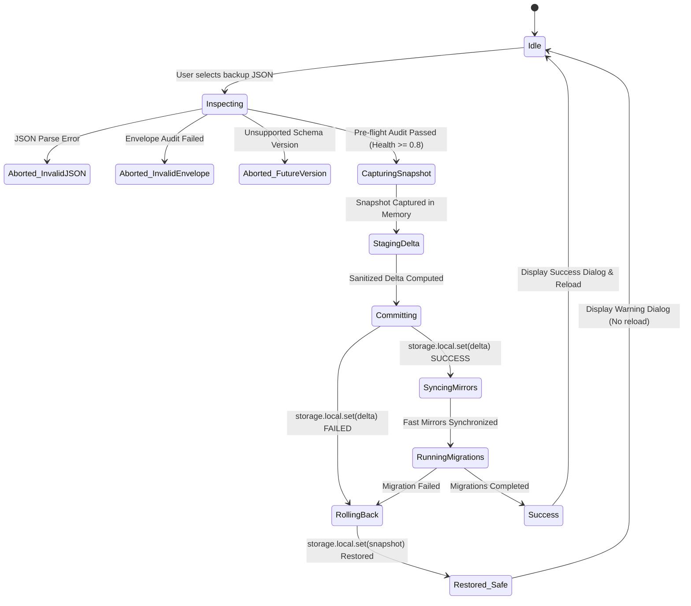

# Homebase — Improvement Cycle #7 Phase 2 Architecture Plan
## Transactional Backup Engine & Migration Safety Layer

> **Author**: Core Extension Architect & Systems Diagnostics Lead  
> **Date**: 2026-09-27  
> **Cycle ID**: Homebase Improvement Cycle #7 — Phase 2  
> **Target Release**: Homebase v0.15.7  
> **Authority**: [AGENTS.md](file:///c:/Users/Administrator/Desktop/Homebase/AGENTS.md), [docs/00-project-state.md](file:///c:/Users/Administrator/Desktop/Homebase/docs/00-project-state.md), [docs/34-cycle7-plan.md](file:///c:/Users/Administrator/Desktop/Homebase/docs/34-cycle7-plan.md), [docs/35-cycle7-phase1-implementation-report.md](file:///c:/Users/Administrator/Desktop/Homebase/docs/35-cycle7-phase1-implementation-report.md)  
> **Scope**: Detailed Architecture Plan for Phase 2: Transactional Backup Engine (`backup-import.js`), Migration Safety Hardening (`schema-migrations.js`), and Integration with Unified Storage Service (`window.HomebaseStorage`) — **PLANNING DOCUMENT ONLY — DO NOT MODIFY SOURCE CODE**

---

## Table of Contents

1. [Executive Summary](#1-executive-summary)
2. [Current Backup & Import Flow Audit](#2-current-backup--import-flow-audit)
   - [2.1 Export Pipeline (`exportHomebaseState`)](#21-export-pipeline-exporthomebasestate)
   - [2.2 Import Pipeline (`importHomebaseState`)](#22-import-pipeline-importhomebasestate)
   - [2.3 Vulnerability & Gap Analysis](#23-vulnerability--gap-analysis)
3. [Migration Safety Gaps & Risk Analysis](#3-migration-safety-gaps--risk-analysis)
   - [3.1 Unprotected Sequential Step Execution](#31-unprotected-sequential-step-execution)
   - [3.2 Post-Import Schema Desynchronization](#32-post-import-schema-desynchronization)
   - [3.3 Future Schema Downgrade Edge Cases](#33-future-schema-downgrade-edge-cases)
   - [3.4 Concurrency & Cross-Tab Race Hazards](#34-concurrency--cross-tab-race-hazards)
4. [Transactional Engine Architecture](#4-transactional-engine-architecture)
   - [4.1 Transaction Lifecycle & State Machine](#41-transaction-lifecycle--state-machine)
   - [4.2 Pre-Flight Inspection & Dry-Run Validation Barrier](#42-pre-flight-inspection--dry-run-validation-barrier)
   - [4.3 Dual-Layer Snapshot Isolation](#43-dual-layer-snapshot-isolation)
   - [4.4 Atomic Commit Phase](#44-atomic-commit-phase)
   - [4.5 Post-Commit Migration Handshake](#45-post-commit-migration-handshake)
5. [Backup Restore Rollback Design](#5-backup-restore-rollback-design)
   - [5.1 In-Memory Rollback Buffer & Guarantees](#51-in-memory-rollback-buffer--guarantees)
   - [5.2 Fast Mirror Rollback Orchestration](#52-fast-mirror-rollback-orchestration)
   - [5.3 Quota-Exceeded Containment During Rollback](#53-quota-exceeded-containment-during-rollback)
   - [5.4 User Notification & Transparency Protocol](#54-user-notification--transparency-protocol)
6. [Storage-Service (`HomebaseStorage`) Integration Points](#6-storage-service-homebasestorage-integration-points)
   - [6.1 Export Delegation (`HomebaseStorage.snapshot()`)](#61-export-delegation-homebasestoragesnapshot)
   - [6.2 Import Delta Application (`HomebaseStorage.setMany()`)](#62-import-delta-application-homebasestoragesetmany)
   - [6.3 Elimination of Redundant Fast Mirror Maps](#63-elimination-of-redundant-fast-mirror-maps)
7. [Minimal Mutation & Write Guarantees](#7-minimal-mutation--write-guarantees)
   - [7.1 Delta Calculation Algorithm](#71-delta-calculation-algorithm)
   - [7.2 Disk Wear & Multi-Tab Event Storm Prevention](#72-disk-wear--multi-tab-event-storm-prevention)
8. [Privacy Guarantees & Zero-Telemetry Constraints](#8-privacy-guarantees--zero-telemetry-constraints)
   - [8.1 Anomaly Logging Redaction Pipeline](#81-anomaly-logging-redaction-pipeline)
   - [8.2 Zero Outbound Communication Verification](#82-zero-outbound-communication-verification)
9. [Failure Recovery Strategy & Matrix](#9-failure-recovery-strategy--matrix)
10. [Unit Testing Strategy & Expansion](#10-unit-testing-strategy--expansion)
    - [10.1 New Test Suite: `tests/unit/backup-transaction.test.mjs`](#101-new-test-suite-testsunitbackup-transactiontestmjs)
    - [10.2 Planned Test Cases (14 Scenarios)](#102-planned-test-cases-14-scenarios)
11. [Implementation Order & Phase Roadmap](#11-implementation-order--phase-roadmap)
12. [Protected Invariants & Boundary Compliance](#12-protected-invariants--boundary-compliance)

---

## 1. Executive Summary

Phase 1 of Improvement Cycle #7 successfully created and established **`window.HomebaseStorage`** ([src/newtab/core/storage-service.js](file:///c:/Users/Administrator/Desktop/Homebase/src/newtab/core/storage-service.js)), providing an authoritative, centralized storage facade featuring automatic validation gating, synchronous `localStorage` fast-mirror synchronization, snapshot isolation, and privacy-safe health reporting. The baseline suite expanded to **116 passed unit tests** with 0 regressions.

**Phase 2** builds directly upon this rock-solid foundation by hardening the most critical state-modifying operations in the dashboard: **Configuration Backup Import/Restoration** and **Storage Schema Migrations**.

Currently, importing a backup in [src/newtab/settings/backup-import.js](file:///c:/Users/Administrator/Desktop/Homebase/src/newtab/settings/backup-import.js) performs uncoordinated, non-transactional writes directly to `browser.storage.local`. If an exception occurs during the batch write (such as a browser quota limit, malformed payload, or process interruption), storage is left in a corrupted or half-updated state from which the user cannot recover without manually clearing extension data. Furthermore, `backup-import.js` duplicates ad-hoc fast-mirror writing logic, bypasses the newly built `HomebaseStorage` facade, neglects pre-flight diagnostic auditing via `HomebaseDiagnostics.auditBackupHealth()`, and does not trigger schema migrations if restoring a backup with an older `schemaVersion`.

Phase 2 introduces an **Atomic Transaction Engine with In-Memory Rollback** for backup restoration, integrates deep rollback safety into `schema-migrations.js`, migrates backup I/O to `window.HomebaseStorage`, enforces minimal-mutation delta writing, and validates the entire pipeline through a comprehensive new unit test suite.

---

## 2. Current Backup & Import Flow Audit

### 2.1 Export Pipeline (`exportHomebaseState`)

The current export implementation in [src/newtab/settings/backup-import.js](file:///c:/Users/Administrator/Desktop/Homebase/src/newtab/settings/backup-import.js) operates as follows:

```
[ Trigger Export ]
       │
       ▼
[ Query browser.storage.local ] ──> reads static array HOMEBASE_OWNED_STORAGE_KEYS (74 keys)
       │
       ▼
[ Assemble Payload Envelope ]
  {
    schema: "homebase.export",
    version: 1,
    exportedAt: ISOString,
    storageLocal: { ...filteredKeys }
  }
       │
       ▼
[ Create Blob & Download Link ] ──> Generates 'homebase-backup-YYYY-MM-DD.json'
```

#### Observations:
1. **Direct Low-Level Storage Query**: Directly accesses `browser.storage.local.get()` instead of delegating to `HomebaseStorage.snapshot()` or `HomebaseStorage.getMany()`.
2. **Static Key Drift Risk**: Relies on a hardcoded array of 74 keys in `HOMEBASE_OWNED_STORAGE_KEYS`. If a new feature introduces a valid key in `schema-validator.js`, export will miss it unless manually added to `HOMEBASE_OWNED_STORAGE_KEYS`.
3. **No Export-Time Health Sanity**: Exports whatever is stored without verifying if values are uncorrupted.

---

### 2.2 Import Pipeline (`importHomebaseState`)

The existing import implementation in [src/newtab/settings/backup-import.js](file:///c:/Users/Administrator/Desktop/Homebase/src/newtab/settings/backup-import.js) follows this path:

```
[ User Selects File ]
       │
       ▼
[ Read & JSON.parse ] ──> try/catch throws "Invalid JSON file."
       │
       ▼
[ Envelope Checks ] ──> schema === 'homebase.export', version === 1, isPlainObject(storageLocal)
       │
       ▼
[ Legacy Key Compatibility ] ──> maps 'homebaseLastUsedFolderId' -> 'lastUsedBookmarkFolderId'
       │
       ▼
[ Validation Barrier ] ──> HomebaseValidator.sanitizeStorageBatch(incoming, { fallbackToDefault: false })
       │
       ▼
[ Direct Unsafe Write ] ──> await browser.storage.local.set(updates)  <-- CRITICAL POINT OF FAILURE
       │
       ▼
[ Ad-hoc Fast Mirror Writes ] ──> iterates 6 hardcoded keys with individual localStorage.setItem()
       │
       ▼
[ Alert & Hard Reload ] ──> showCustomDialog(); window.location.reload()
```

---

### 2.3 Vulnerability & Gap Analysis

| Critical Gap | Description | Architectural Risk |
| :--- | :--- | :--- |
| **No Pre-Write Snapshot** | No snapshot of current storage is captured prior to writing `updates`. | If the write throws or fails midway, existing dashboard settings are destroyed with **zero recovery path**. |
| **No Pre-Flight Health Audit** | `HomebaseDiagnostics.auditBackupHealth(json)` exists in [src/newtab/core/storage-diagnostics.js](file:///c:/Users/Administrator/Desktop/Homebase/src/newtab/core/storage-diagnostics.js) but is **never invoked**. | Malformed or heavily corrupted payloads are not detected before entering the write pipeline. |
| **Bypasses `HomebaseStorage` Facade** | Directly executes `await browser.storage.local.set(updates)` instead of using `window.HomebaseStorage.setMany()`. | Bypasses centralized error logging, prototype pollution checks, and unified telemetry. |
| **Duplicated Fast-Mirror Maps** | Lines 267–313 duplicate mirror keys (`fast-bg-dim`, `fast-show-sidebar`, etc.) and miss keys tracked by `FAST_MIRROR_MAP` in `storage-service.js` (`fast-widget-order`, `fast-clock-format`, `fast-search-align`, `fast-custom-color`, `fast-perf-mode`). | Fast mirrors desynchronize immediately after backup restoration until individual setting toggles are clicked. |
| **No Migration Trigger on Restore** | If an imported backup has `schemaVersion: 1` and the dashboard is later upgraded to `schemaVersion: 2`, restoring an old backup overwrites the schema without executing migrations. | Database schema version and active code diverge immediately upon import. |
| **Unbounded Overwrite (No Delta)** | Writes all incoming keys even if 95% of them are identical to existing storage. | Generates massive `storage.onChanged` event storms across all open tabs and causes unnecessary flash storage writes. |

---

## 3. Migration Safety Gaps & Risk Analysis

### 3.1 Unprotected Sequential Step Execution

In [src/newtab/core/schema-migrations.js](file:///c:/Users/Administrator/Desktop/Homebase/src/newtab/core/schema-migrations.js), the sequential migration loop operates:

```javascript
while (currentVer < CURRENT_SCHEMA_VERSION) {
  const nextVer = currentVer + 1;
  const migrationStep = SCHEMA_MIGRATIONS.find(...);
  if (migrationStep && typeof migrationStep.migrate === 'function') {
    const snapshot = await browserInstance.storage.local.get(null);
    const transformedUpdates = await migrationStep.migrate(snapshot, browserInstance);
    // ...
    await browserInstance.storage.local.set({
      ...(sanitizedUpdates || {}),
      [SCHEMA_VERSION_KEY]: nextVer,
      [MIGRATION_HISTORY_KEY]: existingHistory
    });
  }
  currentVer = nextVer;
}
```

#### The Vulnerability:
If a multi-step migration (e.g. v1 -> v2 -> v3) fails during step 2:
- Step 1 has already permanently committed changes.
- The `catch` block appends a failure record to `migrationHistory`, but **does NOT roll back** the partially migrated storage back to its pre-migration state.
- The user is left in a hybrid schema state where some keys are v2 and others are v1.

---

### 3.2 Post-Import Schema Desynchronization

When a user imports a backup from an earlier version of Homebase:
- The backup payload contains the older `schemaVersion` (or no `schemaVersion` for v0 legacy backups).
- `backup-import.js` currently copies `schemaVersion` directly or leaves it unmigrated.
- If the dashboard does not immediately invoke `HomebaseMigrations.runSchemaMigrations()` post-import, the extension runs with stale schema structures until the entire extension or browser is restarted.

---

### 3.3 Future Schema Downgrade Edge Cases

If a user exports a backup on a newer Homebase version (e.g. `schemaVersion: 2`) and imports it into an older Homebase version (`schemaVersion: 1`):
- `schema-migrations.js` has a startup guard (`future_version_bypassed`), but `backup-import.js` currently accepts the future `schemaVersion`.
- Importing a future `schemaVersion` tricks the older extension into believing migrations are up to date, silencing future migration runners when the extension is eventually updated.

---

### 3.4 Concurrency & Cross-Tab Race Hazards

If a user has 3 Homebase new-tab pages open and initiates a backup restore in Tab 1:
- Tab 1 writes to storage.
- Tabs 2 and 3 receive `storage.onChanged` events asynchronously.
- If Tab 1 encounters a failure midway and has to roll back, Tabs 2 and 3 will receive two rapid contradictory state change events.
- An atomic, single-call commit and rollback pattern minimizes the window of inconsistency to near zero.

---

## 4. Transactional Engine Architecture

### 4.1 Transaction Lifecycle & State Machine



---

### 4.2 Pre-Flight Inspection & Dry-Run Validation Barrier

Before *any* mutation or snapshot allocation occurs, `importHomebaseState` must execute a strict, multi-stage pre-flight inspection:

```javascript
/**
 * Stage 1: Structure & Schema Version Gate
 */
if (!parsed || parsed.schema !== HOMEBASE_BACKUP_SCHEMA) {
  throw new Error('INVALID_BACKUP_SCHEMA: Missing or invalid schema identifier.');
}

if (typeof parsed.version !== 'number' || parsed.version > HOMEBASE_BACKUP_VERSION) {
  throw new Error('UNSUPPORTED_BACKUP_VERSION: Backup version exceeds current capability.');
}

if (!isPlainObject(parsed.storageLocal)) {
  throw new Error('INVALID_BACKUP_PAYLOAD: Missing or invalid storage payload dictionary.');
}

/**
 * Stage 2: Diagnostic Health Audit Gate
 */
const diagnostics = window.HomebaseDiagnostics;
if (diagnostics && typeof diagnostics.auditBackupHealth === 'function') {
  const audit = diagnostics.auditBackupHealth(parsed);
  if (!audit.valid) {
    throw new Error(`BACKUP_AUDIT_FAILED: Payload failed validation audit (${audit.errors.join(', ')}).`);
  }
}
```

---

### 4.3 Dual-Layer Snapshot Isolation

To guarantee 100% rollback fidelity, a dual-layer snapshot is captured:
1. **Primary Storage Snapshot**: An isolated deep clone of all existing keys in `browser.storage.local`. Captured via `window.HomebaseStorage.snapshot()`.
2. **Fast-Mirror Snapshot**: A synchronous capture of all active keys in `localStorage` mapped by `FAST_MIRROR_MAP`.

```javascript
/**
 * Captures synchronous fast mirror state prior to transaction
 * @returns {Record<string, string|null>}
 */
function captureFastMirrorSnapshot() {
  const mirrorSnapshot = {};
  if (typeof window !== 'undefined' && window.localStorage) {
    const keys = [
      'fast-bg-dim',
      'fast-widget-order',
      'fast-clock-format',
      'fast-search-align',
      'fast-bookmark-bg',
      'fast-custom-color',
      'fast-perf-mode'
    ];
    for (const k of keys) {
      mirrorSnapshot[k] = window.localStorage.getItem(k);
    }
  }
  return mirrorSnapshot;
}
```

---

### 4.4 Atomic Commit Phase

1. The incoming payload is sanitized using `window.HomebaseValidator.sanitizeStorageBatch(incoming, { fallbackToDefault: false })`.
2. A delta map `updates` is computed: only keys whose stringified or primitive values differ from the current snapshot are queued for writing.
3. If `Object.keys(updates).length === 0`:
   - No writes are performed.
   - Return `{ status: 'noop', message: 'Backup is identical to current configuration.' }`.
4. If updates exist, perform atomic commit:
   ```javascript
   await storageApi.set(updates);
   ```
5. Synchronize fast mirrors via `HomebaseStorage.set()` or unified mirror syncing.

---

### 4.5 Post-Commit Migration Handshake

If the backup contained a lower `schemaVersion` than `window.CURRENT_SCHEMA_VERSION`:
```javascript
const importedVersion = updates['schemaVersion'];
if (typeof importedVersion === 'number' && importedVersion < window.CURRENT_SCHEMA_VERSION) {
  if (window.HomebaseMigrations?.runSchemaMigrations) {
    const migrationResult = await window.HomebaseMigrations.runSchemaMigrations();
    if (migrationResult.status === 'error') {
      throw new Error(`POST_IMPORT_MIGRATION_FAILED: ${migrationResult.error?.message || 'Unknown migration error'}`);
    }
  }
}
```

---

## 5. Backup Restore Rollback Design

### 5.1 In-Memory Rollback Buffer & Guarantees

The snapshot captured during Phase 4.3 lives in the lexical scope of the transaction runner. It is completely memory-isolated and independent of any network or remote services.

If an exception occurs at any point during write or migration:
```javascript
try {
  // Commit attempt...
} catch (commitError) {
  console.error('[Homebase Backup] Transaction failed. Executing atomic rollback...', commitError);
  
  // 1. Roll back storage.local
  if (storageSnapshot && storageApi) {
    try {
      await storageApi.set(storageSnapshot);
    } catch (rollbackStorageError) {
      console.error('[Homebase Backup] CRITICAL: Storage rollback write failed:', rollbackStorageError);
    }
  }

  // 2. Roll back localStorage fast mirrors
  if (mirrorSnapshot && window.localStorage) {
    try {
      restoreFastMirrorSnapshot(mirrorSnapshot);
    } catch (rollbackMirrorError) {
      console.warn('[Homebase Backup] Fast mirror rollback warning:', rollbackMirrorError);
    }
  }

  // 3. Record diagnostic anomaly (Privacy-safe)
  if (window.HomebaseDiagnostics?.recordValidationAnomaly) {
    window.HomebaseDiagnostics.recordValidationAnomaly(
      'backup_import',
      'rollback_completed',
      { errorCategory: categorizeError(commitError) }
    );
  }

  // 4. Notify user and abort reload
  displayRollbackDialog(commitError);
  return { status: 'rolled_back', error: commitError };
}
```

---

### 5.2 Fast Mirror Rollback Orchestration

Restoring fast mirrors requires restoring previous values or removing keys that did not exist prior to the transaction:

```javascript
function restoreFastMirrorSnapshot(snapshot) {
  if (!snapshot || !window.localStorage) return;
  for (const [key, val] of Object.entries(snapshot)) {
    try {
      if (val === null) {
        window.localStorage.removeItem(key);
      } else {
        window.localStorage.setItem(key, val);
      }
    } catch (_) {
      // Storage quota or restriction protection
    }
  }
}
```

---

### 5.3 Quota-Exceeded Containment During Rollback

Why is rollback guaranteed to succeed even if the initial write failed due to `QuotaExceededError`?
- **Mathematical Guarantee**: The pre-write snapshot represents state that was *already successfully stored* on the device just milliseconds prior.
- If the incoming backup failed because it contained 8 MB of custom wallpaper base64 data that exceeded browser storage quota, writing the snapshot back writes an identical or smaller payload that is guaranteed to fit within the quota.

---

### 5.4 User Notification & Transparency Protocol

The UI must present clear, distinct, actionable modal dialogs:
1. **Pre-flight Error**: "Backup File Invalid: The selected file does not match Homebase schema specifications. Your current settings were not changed."
2. **Rollback Triggered**: "Import Failed: An unexpected error occurred while applying the backup. Your original settings have been safely and completely restored."
3. **Success**: "Settings Restored: Homebase configuration restored successfully. Reloading..."

---

## 6. Storage-Service (`HomebaseStorage`) Integration Points

Phase 2 cleanly refactors `src/newtab/settings/backup-import.js` to leverage `window.HomebaseStorage`:

### 6.1 Export Delegation (`HomebaseStorage.snapshot()`)

Instead of issuing a direct `browser.storage.local.get(HOMEBASE_OWNED_STORAGE_KEYS)`, `exportHomebaseState` calls:

```javascript
async function exportHomebaseState() {
  const storage = window.HomebaseStorage;
  if (!storage) {
    throw new Error('HomebaseStorage service unavailable.');
  }

  // Capture complete, sanitized storage snapshot
  const rawStorage = await storage.snapshot();
  
  // Filter for owned keys or export all valid keys
  const storageLocal = {};
  HOMEBASE_OWNED_STORAGE_KEYS.forEach((key) => {
    if (rawStorage && rawStorage[key] !== undefined) {
      storageLocal[key] = rawStorage[key];
    }
  });

  const payload = {
    schema: HOMEBASE_BACKUP_SCHEMA,
    version: HOMEBASE_BACKUP_VERSION,
    exportedAt: new Date().toISOString(),
    storageLocal
  };
  
  // Deliver download blob...
}
```

---

### 6.2 Import Delta Application (`HomebaseStorage.setMany()`)

`importHomebaseState` delegates batch writes to `window.HomebaseStorage.setMany(updates)`.
- Automatically enforces validation gating.
- Automatically synchronizes all registered fast mirrors in `FAST_MIRROR_MAP`.
- Handles prototype pollution rejections defensively.

---

### 6.3 Elimination of Redundant Fast Mirror Maps

Lines 267–313 of `backup-import.js` will be removed entirely. All fast-mirror synchronization logic will be handled exclusively by `HomebaseStorage.setMany()`, eliminating duplicate mapping and preventing mirror desynchronization bugs.

---

## 7. Minimal Mutation & Write Guarantees

### 7.1 Delta Calculation Algorithm

To minimize flash disk writes and avoid multi-tab event storms:

```javascript
function computeStorageDelta(currentSnapshot, incomingSanitized) {
  const delta = {};
  for (const [key, val] of Object.entries(incomingSanitized)) {
    if (!Object.prototype.hasOwnProperty.call(currentSnapshot, key)) {
      delta[key] = val;
    } else {
      const currentVal = currentSnapshot[key];
      // Fast identity check
      if (currentVal !== val) {
        // Deep serialization comparison for objects/arrays
        if (typeof val === 'object' && val !== null) {
          if (JSON.stringify(currentVal) !== JSON.stringify(val)) {
            delta[key] = val;
          }
        } else {
          delta[key] = val;
        }
      }
    }
  }
  return delta;
}
```

---

### 7.2 Disk Wear & Multi-Tab Event Storm Prevention

- If a backup has 74 keys but the user only changed their clock format, `computeStorageDelta` emits a 1-key write `{ appTimeFormatPreference: '24-hour' }` instead of a 74-key write.
- Other open tabs only observe one `storage.onChanged` entry, preventing UI thrashing across browser tabs.

---

## 8. Privacy Guarantees & Zero-Telemetry Constraints

### 8.1 Anomaly Logging Redaction Pipeline

In accordance with Homebase's zero-telemetry invariant:
- All exceptions caught during backup import and rollback are sanitized using `categorizeError(err)`.
- Recorded anomaly details in `HomebaseDiagnostics.recordValidationAnomaly` must **never** contain:
  - Bookmark URLs, folder titles, or favicons
  - Todo text contents
  - Weather location city names or coordinates
  - Custom wallpaper image data URLs
  - Search queries or engine URLs
- Allowed telemetry: standardized category tokens (`QUOTA_EXCEEDED`, `IO_ERROR`, `PARSE_ERROR`, `SCHEMA_MISMATCH`).

### 8.2 Zero Outbound Communication Verification

- The entire backup export, import, audit, commit, and rollback pipeline is strictly local-only.
- Zero HTTP/HTTPS requests, zero analytics, zero crash reporting.
- All blob generations are local in-memory via `URL.createObjectURL(blob)` and immediately revoked via `URL.revokeObjectURL()`.

---

## 9. Failure Recovery Strategy & Matrix

| Failure Mode | Trigger / Condition | System Response | User Experience |
| :--- | :--- | :--- | :--- |
| **Corrupt JSON Syntax** | User selects truncated or binary file | Caught in Stage 1 parser; zero storage access | Dialog: "Invalid JSON file. Please select a valid backup." (No reload) |
| **Non-Homebase JSON** | User selects package.json or unrelated file | Envelope check fails; zero storage access | Dialog: "Invalid backup schema. File is not a Homebase backup." (No reload) |
| **Unsupported Version** | Version > 1 | Schema version check fails; zero storage access | Dialog: "Unsupported backup version. Please update Homebase." (No reload) |
| **Severe Payload Corruption** | Over 50% of keys invalid | `auditBackupHealth` flags validation failure | Dialog: "Corrupted backup detected. Import aborted to protect your settings." (No reload) |
| **Quota Exceeded on Commit** | Backup contains excessive wallpaper data | `setMany()` throws; rollback restores snapshot | Dialog: "Import failed due to storage limits. Original settings restored." (No reload) |
| **Disk I/O Failure on Commit** | Browser storage locks or crashes | `setMany()` throws; rollback restores snapshot | Dialog: "Storage error occurred. Original settings restored." (No reload) |
| **Migration Failure Post-Import** | Step function in `SCHEMA_MIGRATIONS` throws | Post-commit check catches; rollback restores snapshot | Dialog: "Migration error during import. Original settings restored." (No reload) |
| **Successful Restoration** | All checks pass, delta committed, mirrors synced | Success confirmed; schedule reload | Dialog: "Homebase settings restored. Reloading..." -> Auto-reloads |

---

## 10. Unit Testing Strategy & Expansion

### 10.1 New Test Suite: `tests/unit/backup-transaction.test.mjs`

A dedicated, comprehensive unit test suite running under Node.js native test runner (`node:test`) using Node's `vm` module to execute `src/newtab/settings/backup-import.js`, `src/newtab/core/storage-service.js`, `src/newtab/core/schema-validator.js`, and `src/newtab/core/storage-diagnostics.js`.

### 10.2 Planned Test Cases (14 Scenarios)

1. **Successful Transaction**: Valid backup updates storage, computes minimal delta, and synchronizes fast mirrors.
2. **Delta Minimization**: Restoring identical backup executes 0 storage writes (`noop`).
3. **Parse Failure Safety**: Malformed JSON throws error and performs 0 storage writes.
4. **Envelope Validation Safety**: Invalid schema or missing `storageLocal` aborts before snapshot allocation.
5. **Future Version Protection**: Backup with `version > HOMEBASE_BACKUP_VERSION` is rejected.
6. **Diagnostic Audit Integration**: Payload failing `HomebaseDiagnostics.auditBackupHealth` is rejected prior to write.
7. **Simulated Storage Failure Rollback**: When `storage.local.set` throws, original storage state is 100% restored.
8. **Fast Mirror Rollback**: Fast mirrors are completely reverted to pre-transaction states upon rollback.
9. **Quota Error Resilience**: Simulated `QuotaExceededError` triggers clean rollback without corrupting existing data.
10. **Post-Import Migration Execution**: Restoring a backup with `schemaVersion: 0` triggers `runSchemaMigrations()`.
11. **Post-Import Migration Failure Rollback**: If post-import migration throws, storage is rolled back to pre-import snapshot.
12. **Privacy Redaction in Anomalies**: Rollback error recorded in `HomebaseDiagnostics` contains 0 user data or URLs.
13. **Prototype Pollution Immunity**: Malicious backup payloads containing `__proto__` properties are sanitized and ignored.
14. **Export Completeness**: `exportHomebaseState` produces a valid envelope containing all owned storage keys.

---

## 11. Implementation Order & Phase Roadmap

Execution of Phase 2 will proceed in strict sequential order:

```
Step 1: Planning Document Finalization (docs/36-cycle7-phase2-plan.md) [CURRENT]
Step 2: Architecture Review & Clearances (npm.cmd test)
Step 3: Migration Safety Hardening (src/newtab/core/schema-migrations.js)
        - Pre-migration snapshot capture
        - Migration step failure rollback
Step 4: Transactional Backup Engine Implementation (src/newtab/settings/backup-import.js)
        - Pre-flight diagnostic audit integration
        - Snapshot capture & isolation
        - Minimal mutation delta calculation
        - HomebaseStorage integration
        - Atomic rollback handler on exception
Step 5: Automated Test Suite Construction (tests/unit/backup-transaction.test.mjs)
        - Implement 14 test scenarios
        - Target: Expand test suite from 116 to 130+ assertions
Step 6: Verification & Dual-Browser Build
        - node --check
        - check-newtab-static.mjs
        - npm.cmd test
        - npm.cmd run build
Step 7: Implementation Report Creation (docs/37-cycle7-phase2-implementation-report.md)
```

---

## 12. Protected Invariants & Boundary Compliance

In strict adherence to [AGENTS.md](file:///c:/Users/Administrator/Desktop/Homebase/AGENTS.md):

- [src/new-tab.js](file:///c:/Users/Administrator/Desktop/Homebase/src/new-tab.js): **STRICTLY UNTOUCHED**.
- [src/preload.js](file:///c:/Users/Administrator/Desktop/Homebase/src/preload.js): **STRICTLY UNTOUCHED**.
- [src/instant_load.js](file:///c:/Users/Administrator/Desktop/Homebase/src/instant_load.js): **STRICTLY UNTOUCHED**.
- `manifests/*`: **STRICTLY UNTOUCHED**.
- `dist/*`: **STRICTLY UNTOUCHED** (Generated only via `npm.cmd run build`).
- **Classic Script Architecture**: No ES module imports, no bundlers, zero npm dependencies.
- **Privacy Guarantee**: Zero telemetry, zero analytics, zero external network traffic.
- **Cross-Browser Compatibility**: Guaranteed for Chrome (MV3) and Firefox (MV3/Gecko).
