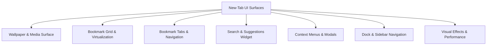
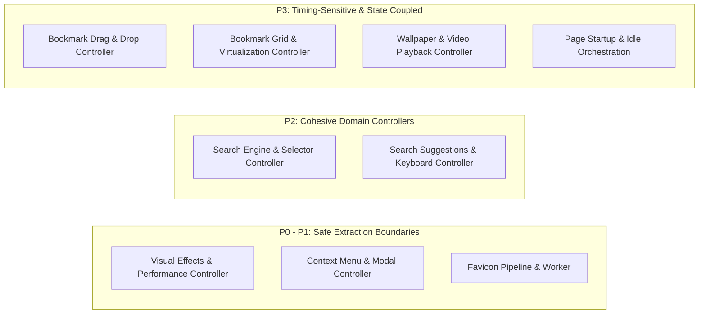

# Homebase — Improvement Cycle #10 Architecture & Implementation Plan
## Decomposition of `src/new-tab.js` into Modular Domain Controllers

> **Author**: Core Extension Architect & Systems Diagnostics Lead  
> **Date**: September 29, 2026  
> **Cycle ID**: Homebase Improvement Cycle #10  
> **Target Release**: Homebase v0.17.0  
> **Baseline Commit**: `07a7a01` ("Complete Cycle 9 storage extraction with host adapter bridge")  
> **Authority**: [AGENTS.md](file:///c:/Users/Administrator/Desktop/Homebase/AGENTS.md), [docs/00-project-state.md](file:///c:/Users/Administrator/Desktop/Homebase/docs/00-project-state.md), [docs/48-cycle9-plan.md](file:///c:/Users/Administrator/Desktop/Homebase/docs/48-cycle9-plan.md), [docs/55-cycle9-phase5-implementation-report.md](file:///c:/Users/Administrator/Desktop/Homebase/docs/55-cycle9-phase5-implementation-report.md)  
> **Scope**: Planning & Responsibility Audit Only — Zero Source Modifications  

---

## Table of Contents

1. [Executive Summary & Cycle #10 Mandate](#1-executive-summary--cycle-10-mandate)
2. [Comprehensive Responsibility Audit of `src/new-tab.js`](#2-comprehensive-responsibility-audit-of-srcnew-tabjs)
   - [2.1 Audit Summary & File Metrics](#21-audit-summary--file-metrics)
   - [2.2 Identification of UI Domains (7 Core Surfaces)](#22-identification-of-ui-domains-7-core-surfaces)
   - [2.3 Identification of Event Systems (80 Listeners Across 4 Layers)](#23-identification-of-event-systems-80-listeners-across-4-layers)
   - [2.4 Identification of Business Logic Clusters (227 Functions in 10 Clusters)](#24-identification-of-business-logic-clusters-227-functions-in-10-clusters)
   - [2.5 Analysis of Mutable State Variables (78 Root State Items)](#25-analysis-of-mutable-state-variables-78-root-state-items)
   - [2.6 Safe Extraction Boundaries vs. High-Risk Zones](#26-safe-extraction-boundaries-vs-high-risk-zones)
3. [Target Modular Domain Controller Architecture](#3-target-modular-domain-controller-architecture)
   - [3.1 Architecture Overview & Core Constraints](#31-architecture-overview--core-constraints)
   - [3.2 Domain Controller Specifications](#32-domain-controller-specifications)
4. [Phased Implementation Roadmap](#4-phased-implementation-roadmap)
   - [4.1 Phase 1: Performance & Visual Runtime Controller (P0 - Low Risk)](#41-phase-1-performance--visual-runtime-controller-p0---low-risk)
   - [4.2 Phase 2: Context Menu & Dialog Action Controller (P1 - Low-Medium Risk)](#42-phase-2-context-menu--dialog-action-controller-p1---low-medium-risk)
   - [4.3 Phase 3: Favicon Resolution & Hydration Pipeline (P1 - Medium Risk)](#43-phase-3-favicon-resolution--hydration-pipeline-p1---medium-risk)
   - [4.4 Phase 4: Search Engine Management & Selector Controller (P2 - Medium Risk)](#44-phase-4-search-engine-management--selector-controller-p2---medium-risk)
   - [4.5 Phase 5: Search Live Execution, Suggestions & Bang Controller (P2 - Medium-High Risk)](#45-phase-5-search-live-execution-suggestions--bang-controller-p2---medium-high-risk)
   - [4.6 Phase 6: Bookmark Drag-and-Drop & Tab Navigation Controller (P3 - High Risk)](#46-phase-6-bookmark-drag-and-drop--tab-navigation-controller-p3---high-risk)
   - [4.7 Phase 7: Bookmark Grid Rendering & Virtualization Controller (P3 - High Risk)](#47-phase-7-bookmark-grid-rendering--virtualization-controller-p3---high-risk)
   - [4.8 Phase 8: Wallpaper Playback & Video Lifecycle Controller (P3 - High Risk)](#48-phase-8-wallpaper-playback--video-lifecycle-controller-p3---high-risk)
   - [4.9 Phase 9: Startup Orchestration Consolidation & Monolith Finalization](#49-phase-9-startup-orchestration-consolidation--monolith-finalization)
5. [Invariants, Protected Boundaries & Constraints](#5-invariants-protected-boundaries--constraints)
6. [Testing & Multi-Stage Verification Strategy](#6-testing--multi-stage-verification-strategy)
7. [Rollback & Safety Mechanisms](#7-rollback--safety-mechanisms)

---

## 1. Executive Summary & Cycle #10 Mandate

In Improvement Cycle #9, all direct `browser.storage.local` and `chrome.storage.local` calls were completely eliminated from `src/new-tab.js`. Dedicated storage services (`FaviconCache`, `BookmarkStorage`, `SearchStorage`, `WallpaperStorage`, and `HostStorageAdapter`) now mediate all persistence through `HomebaseStorage`.

However, `src/new-tab.js` remains the central monolithic entry point:
- **12,261 lines of code**
- **227 top-level functions**
- **217 top-level variable declarations** (including 78 mutable `let` state variables)
- **80 event listeners** spanning window, DOM, media, pointer, and runtime APIs
- **Zero module exports** (relying on script-scope hoisting and global window scope)

### Cycle #10 Mandate:
Decompose the monolithic responsibilities of `src/new-tab.js` into focused, highly cohesive **Domain Controllers** under `src/newtab/` while:
1. **Preserving 100% of runtime behavior** (zero functional changes, zero visual regressions).
2. **Maintaining classic script architecture** (`<script defer>`, zero ES modules, zero bundlers).
3. **Keeping storage architecture and `HomebaseStorage` untouched**.
4. **Keeping protected bootloaders untouched** (`src/preload.js`, `src/instant_load.js`, `manifests/*`, `dist/*`).
5. **Leaving startup orchestration, idle scheduler, and `initializePage` intact** as the coordinating master harness.

---

## 2. Comprehensive Responsibility Audit of `src/new-tab.js`

### 2.1 Audit Summary & File Metrics

| Metric | Measured Value | Architectural Assessment |
| :--- | :---: | :--- |
| **Total Source Lines** | **12,261** | Monolithic codebase with extensive inlined UI, state, and event logic. |
| **Top-Level Functions** | **227** | Spans 10 distinct architectural domains from video playback to DOM drag-and-drop. |
| **Top-Level Variables** | **217** | 78 mutable state variables (`let`), 139 constants/DOM element references (`const`). |
| **Direct Event Listeners** | **80** | Registered across window, document, video elements, inputs, and context menus. |
| **Browser Runtime Listeners** | **1** | `browser.storage.onChanged` in `initializePage`. |
| **Direct Storage Calls** | **0** | Verified 0 direct `browser.storage.local` get/set/remove calls (Cycle 9 complete). |

---

### 2.2 Identification of UI Domains (7 Core Surfaces)

The UI responsibilities in `src/new-tab.js` control 7 distinct visual surfaces on the new-tab dashboard:



#### 1. Wallpaper & Media Surface
- **DOM Selectors**: `#wallpaper-video`, `.background-video`, `#background-video-a`, `#background-video-b`, `#bg-canvas`, `#wallpaper-toggle`, `#app-wallpaper-type-select`, `#app-wallpaper-next-btn`, `#wallpaper-source-credit`, `.wallpaper-credit-link`.
- **Responsibilities**: Dual-video buffer crossfading, play/pause state transitions, video error fallback to image canvas, next-wallpaper button loading spinner, wallpaper photographer/source attribution sync, and settings preview synchronization.

#### 2. Bookmark Grid & Virtualization Surface
- **DOM Selectors**: `#bookmarks-grid`, `.bookmark-item`, `.bookmark-folder`, `.icon-wrapper`, `.bookmark-icon`, `.bookmark-letter-fallback`, `#bookmarks-empty-state`, `#bookmarks-empty-message`.
- **Responsibilities**: Bookmark card rendering, folder card rendering, icon image/canvas fallback rendering, custom card background tinting, inline title renaming (`<textarea>` auto-sizing), and dynamic virtualized window slicing for folders containing >50 items.

#### 3. Bookmark Tabs & Navigation Surface
- **DOM Selectors**: `#bookmark-tabs-track`, `#bookmark-folder-tabs`, `.bookmark-folder-tab`, `.tab-scroll-btn`, `#tab-scroll-left`, `#tab-scroll-right`, `#add-tab-btn`, `#tab-tooltip`.
- **Responsibilities**: Folder tab bar layout, active folder tab highlight/underline, horizontal smooth scrolling with edge fade, folder creation button with tooltip, and inline tab title editing.

#### 4. Search Widget & Suggestions Panel
- **DOM Selectors**: `.widget-search`, `#search-input`, `#search-results-panel`, `#bookmark-results-container`, `#suggestion-results-container`, `.search-area-wrapper`, `#search-engine-selector`, `#search-engine-icon`, engine dropdown options.
- **Responsibilities**: Search input autofocus and query handling, search engine switcher icon and dropdown selector, keyboard navigation across 4 result zones (Bangs, Calculator, Bookmarks, Web Suggestions), dynamic accent color updates, and panel expand/collapse animation.

#### 5. Context Menus & Action Dialogs
- **DOM Selectors**: `#icon-context-menu`, `#folder-context-menu`, `#tab-context-menu`, `#grid-folder-menu`, `#root-context-menu`, `#delete-confirm-modal`, `#folder-picker-modal`.
- **Responsibilities**: Right-click coordinate tracking and viewport boundary clamping, context menu action dispatch (open, edit, move, delete, sort, paste), delete confirmation dialog lifecycle, and lazy-loading invocation of `bookmark-editor.js`.

#### 6. Dock, Sidebar & Integrations
- **DOM Selectors**: `.dock`, `.dock-item`, `.sidebar`, `#collapsed-clock-slot`, `#google-apps-btn`, `#google-apps-panel`.
- **Responsibilities**: Sidebar expand/collapse toggle, collapsed clock display, Google Apps launcher dropdown, Firefox contextual identity (container) badge and multi-tab opening.

#### 7. Visual Effects & Performance Runtime
- **DOM Selectors**: `document.body` classes (`grid-animation-enabled`, `performance-mode`, `glass-disabled`, `battery-saver`), CSS custom properties (`--grid-animation-speed`, `--bg-dim-opacity`).
- **Responsibilities**: Fast battery optimization toggles, glassmorphism runtime disabling/enabling, dynamic background dimming overlay injection, and grid animation preference enforcement.

---

### 2.3 Identification of Event Systems (80 Listeners Across 4 Layers)

The event listeners attached in `src/new-tab.js` operate across 4 distinct layers:

| Event Layer | Listener Count | Target Elements | Events Handled | Architectural Concern |
| :--- | :---: | :--- | :--- | :--- |
| **1. Lifecycle & Window System** | **11** | `window`, `document` | `load`, `DOMContentLoaded`, `visibilitychange`, `beforeunload`, `pagehide`, `resize`, `blur` | Page boot timing, background throttling, clean unmount |
| **2. Interactive DOM & Keyboard** | **45** | Inputs, buttons, menus, document | `click`, `dblclick`, `keydown`, `input`, `blur`, `paste`, `submit`, `wheel` | Search typing, keyboard navigation, inline rename, modals |
| **3. Drag-and-Drop & Pointer** | **9** | Grid, tabs, window, track | `pointermove`, `pointerenter`, `pointerleave`, Sortable callbacks | Sortable.js boundary tracking, drag hover tab switching |
| **4. Media & Runtime Engine** | **15** | `<video>`, `browser.storage` | `loadeddata`, `loadedmetadata`, `canplay`, `playing`, `timeupdate`, `ended`, `error`, `storage.onChanged` | Crossfade frame synchronization, video errors, cross-tab sync |

---

### 2.4 Identification of Business Logic Clusters (227 Functions in 10 Clusters)

The 227 functions in `src/new-tab.js` cluster naturally into 10 cohesive business domains:

```text
Cluster A: Wallpaper Lifecycle & Video Playback (49 functions)
├── Rotation & Schedule: getLocalDayStamp, isNewLocalDay, isDailyWallpaperRotationDue, schedulePendingDailyRotationAttempt, ensureDailyWallpaper
├── Manifest & Remote: fetchVideosManifestIfNeeded, getVideosManifest, refreshGalleryManifestInBackground, fetchGalleryManifestWithTimeout
├── Asset Processing: buildVideoPosterFromFile, createStartupPosterDataUrl, createOptimizedPosterDataUrl, warmGalleryPosterHydration
├── Playback Engine: applyWallpaperByType, setBackgroundVideoSources, startBackgroundVideosAfterSourceLoad, clearBackgroundVideos, setupBackgroundVideoCrossfade
└── UI & Settings: openWallpaperGallery, ensureGalleryUi, createGalleryContext, updateSettingsPreview, ensurePlayableSelection

Cluster B: Bookmarks Tree, Navigation & Operations (34 functions)
├── Discovery & Hierarchy: findHomebaseUnderOtherBookmarks, getOtherBookmarksNode, getStoredHomebaseRootSubTree, findChildFolderByTitle
├── Tree Navigation: findBookmarkNodeById, findNodeAndParent, updateNodeInTree, appendNodeToParent, getValidFolderId, getDefaultBookmarkParentId
├── CRUD Operations: createHomebaseFolder, createNewBookmarkFolder, deleteBookmarkOrFolder, deleteBookmarkFolder, sortCurrentFolderByName, handlePasteBookmark
├── Processing Pipeline: processBookmarks, loadBookmarks, loadBookmarkMetadata, loadFolderMetadata, loadLastUsedFolderId, setLastUsedFolderId
└── Root Management: setupHomebaseRootControls, setupHomebaseRootListeners, openBookmarkInNewTab, openFolderFromContext, openFolderAll

Cluster C: Favicon Resolution & Cache Pipeline (26 functions)
├── Queue & Task Worker: enqueueFaviconTask, runNextFaviconTask, notifyFaviconWaiters, queueFaviconResolution
├── Resolution Engine: isValidFaviconTargetUrl, getDomainKeyFromUrl, buildFaviconCandidates, getFaviconUrlForRawUrl
├── Network & Object URLs: testFaviconCandidateUrl, testFaviconCandidateObjectUrl, xhrFetchBlob, blobToResponse, responseToObjectURL
├── Cache & Object Storage: cacheKeyFor, readIconFromCache, writeIconToCache, getFaviconCache, revokeFaviconObjectUrl
└── DOM Hydration: setFaviconImageSrc, loadFaviconObjectUrlIntoImage, ensureFaviconObserver, hydrateSearchResultFavicons

Cluster D: Bookmark Grid Rendering, Card Lifecycle & Virtualization (24 functions)
├── Card Generators: renderBookmark, renderBookmarkFolder, renderBookmarkIconInto, renderFolderIconInto, ensureBookmarkFallback
├── Metadata & Element Sync: updateElementData, metadataEntriesEqual, getChangedMetadataIds, findRenderedGridItemById, patchActiveGridMetadataItems
├── Virtual Grid Manager: initVirtualizer, updateVirtualGrid, disableVirtualizer, createNodeForVirtualizer, getIconKeyForNode
├── Grid Rendering: renderBookmarkGrid, createBackButton, clearBookmarkImages, autoResizeTextarea
└── Pointer & Scroll Sync: isBookmarkGridScrollKey, isPointerOverBookmarkGrid, scrollBookmarkGridForKey, setupBookmarkGridPointerTracking

Cluster E: Search Execution, Selection Navigation & Keyboard Handler (22 functions)
├── Keyboard Routing: handleSearchKeydown, isSearchKeyboardContext, isSearchInputEmptyAndPassive
├── Results Selection: selectItem, getCurrentSectionItems, getSelectedResult, getSelectionSnapshot, moveSection, syncSearchInputWithItem
├── Hover & Mouse: attachHoverSync, handleSearchResultMouseDown, handleSearchResultClick
├── Query Execution: handleSearch, handleSearchInput, handleSearchChange, executeSearch, openSearchUrl
└── State Synchronization: removeSelectionClasses, clearAllSelections, restoreSelectionAfterFilter, applySelectionToCurrentResults

Cluster F: Search Engine Management, Bangs & Suggestion Hydration (22 functions)
├── Selector UI: renderSearchEngineSelector, updateSearchSelectorPosition, buildSearchEngineIconContent, ensureEngineIconExists, populateSearchOptions
├── Engine State: updateSearchUI, clearSearchUI, cycleSearchEngine, setupSearch, applySearchEngineConfig, getSafeEnabledSearchEngineId
├── Async Suggestions: fetchSearchSuggestions, abortSuggestionFetch, clearExternalSuggestionResults, isStaleSearch, maybeAutoSelectSuggestion
└── Bangs & Visibility: getBangSuggestions, updatePanelVisibility, preconnectToSearchEngine, setSearchSuggestionsPreference

Cluster G: Bookmark Modals, Inline Renaming & Context Menu Dispatch (20 functions)
├── Inline Renaming: showEditInput (tabs), showGridItemRenameInput (grid cards)
├── Modals & Dialogs: showAddBookmarkModal, showEditBookmarkModal, showAddFolderModal, showEditFolderModal, openMoveBookmarkModal, showDeleteConfirm
├── Editor Lazy Loader: ensureBookmarkEditor, createBookmarkEditorContext, callBookmarkEditorMethod, notifyBookmarkEditorLoadFailure
├── Tooltips & Visibility: setupBookmarkFolderAddTooltip, setChangeFolderButtonVisibility, hideBookmarksUI, showBookmarksUI
└── Boot & State: showBookmarksEmptyState, hideBookmarksEmptyState, beginBookmarksBoot, endBookmarksBoot

Cluster H: Bookmark Tabs, Drag-and-Drop Reordering (11 functions)
├── Grid Drag & Drop: setupGridSortable, handleGridMove, handleGridDragPointerMove, handleGridDrop, moveItemInLocalTree
├── Tab Drag & Drop: setupTabsSortable, handleTabDrop, clearTabDropHighlight
└── Tab Structure: createFolderTabs, setupTabsSortable

Cluster I: Visual Effects, Performance & Dock Navigation (7 functions)
├── Performance Mode: readFastPerformanceModePreference, syncFastPerformanceModeMirror, isPerformanceModeEnabled, applyPerformanceModeState
├── Visual Effects Runtime: disableGridAnimationRuntime, disableGlassRuntime, enableGlassRuntimeFromPreference
└── Dock / Sidebar: updateSidebarCollapseState

Cluster J: Page Initialization, Idle Task Scheduler & Script Loader (12 functions)
├── Idle Task Queue: processIdleTasks, scheduleIdleTask, scheduleIdleChunkedTask
├── Dynamic Asset Loaders: loadScriptOnce, loadStylesheetOnce
└── Boot Orchestration: initializePage, logInitSettled, cleanupBackgroundPlayback, checkBatteryStatus
```

---

### 2.5 Analysis of Mutable State Variables (78 Root State Items)

The 78 mutable state variables (`let`) in `src/new-tab.js` govern runtime behavior and are divided across domains:

1. **Wallpaper Playback State (15 items)**: `videosManifestPromise`, `pendingDailyRotationTimer`, `lastAppliedWallpaper`, `backgroundVideoSourceLoadPromise`, `backgroundVideoSourceLoadGeneration`, `wallpaperVideoStartSequence`, `backgroundVideoCrossfadeSetupKey`, `videoPlaybackController`, `backgroundCrossfadeTimeout`, `galleryHydrationWarmPromise`, `currentWallpaperSelection`, `wallpaperTypePreference`, `wallpaperQualityPreference`, `dailyRotationPreference`, `initialWallpaperState`.
2. **Favicon Queue & Cache State (5 items)**: `faviconTaskActiveCount`, `faviconIntersectionObserver`, `faviconTaskQueue`, `faviconWaiters`, `faviconResolvedCache`.
3. **Bookmark Core Tree & Navigation State (9 items)**: `allBookmarks`, `bookmarkTree`, `rootDisplayFolderId`, `activeHomebaseFolderId`, `currentGridFolderNode`, `bookmarkMetadata`, `folderMetadata`, `lastUsedBookmarkFolderId`, `bookmarkTreeFetchPromise`.
4. **Bookmark Drag-and-Drop & Virtualization State (11 items)**: `gridSortable`, `tabsSortable`, `isGridDragging`, `isTabDragging`, `activeTabDropTarget`, `folderHoverTarget`, `folderHoverStart`, `lastGridDragOverItem`, `sortableTimeout`, `dragMoveScheduled`, `virtualizerState`.
5. **Bookmark Context Menu State (3 items)**: `currentContextItemId`, `currentContextIsFolder`, `currentContextSourceTile`.
6. **Search State & Results Navigation (13 items)**: `currentSearchEngine`, `activeSearchEngineId`, `currentSelectionIndex`, `currentSectionIndex`, `selectionExplicit`, `lastSelectedText`, `userIsTyping`, `latestSearchToken`, `lastBookmarkHtml`, `lastSuggestionHtml`, `searchNavigationLocked`, `isBookmarkGridPointerOver`, `bookmarkGridPointerListenersAttached`.
7. **App Settings & Theme Preferences (21 items)**: `appBackgroundDimPreference`, `appShowSidebarPreference`, `appShowWeatherPreference`, `appShowQuotePreference`, `appShowNewsPreference`, `appShowTodoPreference`, `appNewsSourcePreference`, `appMaxTabsPreference`, `appSearchRememberEnginePreference`, `appBookmarkTextBgColorPreference`, `appBookmarkTextBgOpacityPreference`, `appBookmarkTextBgBlurPreference`, `appBookmarkFallbackColorPreference`, `appBookmarkFolderColorPreference`, `appGridAnimationPreference`, `appGridAnimationSpeedPreference`, `appGridAnimationEnabledPreference`, `appGlassStylePreference`, `appPerformanceModePreference`, `debugPerfOverlayPreference`, `appBatteryOptimizationPreference`.
8. **Idle Scheduler State (1 item)**: `idleTaskScheduled`.

---

### 2.6 Safe Extraction Boundaries vs. High-Risk Zones

To prevent breaking existing behavior during decomposition, boundaries are categorized by risk level:



#### Safe Extraction Boundaries (Low Risk):
- **Performance & Visual Runtime**: Self-contained DOM style and CSS class manipulation with no dependencies on bookmark data or search queries.
- **Context Menus & Dialog Action Dispatch**: Dispatches events and modal triggers; cleanly isolated by passing clicked node data.
- **Favicon Resolution Pipeline**: Operates as an asynchronous worker queue on URLs and image elements; isolated from tree mutations.

#### Medium Risk Boundaries:
- **Search Engine Selector & Cycling**: Modifies search bar UI, persists engine selection via `HomebaseSearchStorage`, but tightly coordinates with search input events.
- **Live Search Results & Suggestions**: Coordinates network fetches, Bang queries, and keyboard cursor traversal; requires strict token invalidation.

#### High-Risk Zones (Strict Invariants Applied):
- **Bookmark Grid Virtualization & DOM Cards**: Complex DOM recycling, scroll listeners, and dynamic icon rendering; highly sensitive to reflow timing.
- **Bookmark Drag-and-Drop (Sortable.js)**: Requires delicate coordination between tab drop targets, folder hover timers, and Sortable instance teardown/rebuild.
- **Wallpaper Playback & Video Crossfade**: Frame-accurate `timeupdate` listeners, dual video buffers, and battery management; high risk of visual flicker.
- **`initializePage` & Idle Task Scheduler**: Orchestrates the entire application boot sequence. **Must remain in `src/new-tab.js` as master harness.**

---

## 3. Target Modular Domain Controller Architecture

### 3.1 Architecture Overview & Core Constraints

In alignment with Homebase project standards:
1. **Classic Script Architecture**: Each domain controller is a standalone JavaScript file loaded via `<script src="newtab/.../...js" defer>` before `src/new-tab.js`.
2. **Global Namespace Registration**: Controllers export structured objects on `window` (e.g., `window.HomebasePerformanceController`, `window.HomebaseContextMenuController`).
3. **No Bundlers / No ES Modules**: No `import`/`export` syntax. Zero build-step bundlers.
4. **Zero Refactoring During Extraction**: Functions and variables retain their exact signatures and semantics during extraction.
5. **Storage Architecture Preservation**: All controllers leverage existing `HomebaseStorage` or domain storage services (`HomebaseBookmarkStorage`, `HomebaseWallpaperStorage`, `HomebaseSearchStorage`, `HomebaseFaviconCache`).

```text
┌────────────────────────────────────────────────────────────────────────────────┐
│                           src/new-tab.html                                     │
├────────────────────────────────────────────────────────────────────────────────┤
│  ... existing modules ...                                                      │
│  <script src="newtab/settings/performance-controller.js" defer></script>       │
│  <script src="newtab/bookmarks/context-menu-controller.js" defer></script>     │
│  <script src="newtab/core/favicon-pipeline.js" defer></script>                 │
│  <script src="newtab/search/search-engine-controller.js" defer></script>       │
│  <script src="newtab/search/search-interaction-controller.js" defer></script>   │
│  <script src="newtab/bookmarks/bookmark-dnd-controller.js" defer></script>     │
│  <script src="newtab/bookmarks/bookmark-grid-controller.js" defer></script>    │
│  <script src="newtab/wallpaper/wallpaper-controller.js" defer></script>        │
│  <script src="new-tab.js" defer></script> <!-- Master Orchestrator -->         │
└────────────────────────────────────────────────────────────────────────────────┘
```

---

### 3.2 Domain Controller Specifications

| Controller Name | Target Path | Function Count | Primary Responsibility |
| :--- | :--- | :---: | :--- |
| **`HomebasePerformanceController`** | `src/newtab/settings/performance-controller.js` | 7 | Controls performance mode, glassmorphism runtime, and animation speed. |
| **`HomebaseContextMenuController`** | `src/newtab/bookmarks/context-menu-controller.js` | 14 | Manages right-click menus, viewport boundary positioning, and modal invocation. |
| **`HomebaseFaviconPipeline`** | `src/newtab/core/favicon-pipeline.js` | 26 | Manages favicon worker queue, candidate discovery, network fetching, and DOM hydration. |
| **`HomebaseSearchEngineController`**| `src/newtab/search/search-engine-controller.js` | 14 | Controls search engine selector dropdown, engine cycling, and icon resolution. |
| **`HomebaseSearchInteractionController`** | `src/newtab/search/search-interaction-controller.js` | 30 | Controls live search keyboard navigation, Bangs, calculator, and suggestions. |
| **`HomebaseBookmarkDndController`** | `src/newtab/bookmarks/bookmark-dnd-controller.js` | 11 | Manages Sortable.js grid and tab drag-and-drop, tab drop hover, and reordering. |
| **`HomebaseBookmarkGridController`**| `src/newtab/bookmarks/bookmark-grid-controller.js` | 24 | Renders bookmark/folder cards, manages virtualization, and patches metadata updates. |
| **`HomebaseWallpaperController`**   | `src/newtab/wallpaper/wallpaper-controller.js` | 49 | Controls video crossfade, rotation timers, battery status, and background playback. |

---

## 4. Phased Implementation Roadmap

Decomposition is structured into 9 carefully ordered phases, progressing strictly from lowest risk and lowest coupling to higher risk domains.

### 4.1 Phase 1: Performance & Visual Runtime Controller (P0 - Low Risk)
- **Target File**: `src/newtab/settings/performance-controller.js`
- **Scope**: Extract `readFastPerformanceModePreference`, `syncFastPerformanceModeMirror`, `isPerformanceModeEnabled`, `disableGridAnimationRuntime`, `disableGlassRuntime`, `enableGlassRuntimeFromPreference`, `applyPerformanceModeState`.
- **Invariants**: Do not alter `localStorage` fast mirror keys (`fast-performance-mode`, `fast-glass-style`).
- **Tests**: `tests/unit/performance-controller.test.mjs`.

### 4.2 Phase 2: Context Menu & Dialog Action Controller (P1 - Low-Medium Risk)
- **Target File**: `src/newtab/bookmarks/context-menu-controller.js`
- **Scope**: Extract context menu positioning, menu click listeners, delete confirmation modal handling, and lazy-loading bridge for `bookmark-editor.js`.
- **Invariants**: Preserve exact DOM element IDs for all context menus (`#icon-context-menu`, `#folder-context-menu`, etc.).
- **Tests**: `tests/unit/context-menu-controller.test.mjs`.

### 4.3 Phase 3: Favicon Resolution & Hydration Pipeline (P1 - Medium Risk)
- **Target File**: `src/newtab/core/favicon-pipeline.js`
- **Scope**: Extract favicon task queue (`enqueueFaviconTask`, `runNextFaviconTask`), URL candidate builder, fallback resolution, object URL management, and DOM observer.
- **Invariants**: Coordinate seamlessly with `window.HomebaseFaviconCache`. Do not alter candidate fallback order.
- **Tests**: `tests/unit/favicon-pipeline.test.mjs`.

### 4.4 Phase 4: Search Engine Management & Selector Controller (P2 - Medium Risk)
- **Target File**: `src/newtab/search/search-engine-controller.js`
- **Scope**: Extract search engine selector dropdown, engine cycling (`cycleSearchEngine`, `Alt+Up/Down`), icon rendering, and default engine synchronization.
- **Invariants**: Preserve `window.searchEngines` data structures and storage synchronization via `HomebaseSearchStorage`.
- **Tests**: `tests/unit/search-engine-controller.test.mjs`.

### 4.5 Phase 5: Search Live Execution, Suggestions & Bang Controller (P2 - Medium-High Risk)
- **Target File**: `src/newtab/search/search-interaction-controller.js`
- **Scope**: Extract search input typing listeners, keyboard section navigation (`handleSearchKeydown`), selection snapshotting, suggestion abort controller, Bang autocomplete, and Calculator evaluation.
- **Invariants**: Preserve keyboard navigation sequence across all 4 result tiers; keep cancellation tokens intact.
- **Tests**: `tests/unit/search-interaction-controller.test.mjs`.

### 4.6 Phase 6: Bookmark Drag-and-Drop & Tab Navigation Controller (P3 - High Risk)
- **Target File**: `src/newtab/bookmarks/bookmark-dnd-controller.js`
- **Scope**: Extract Sortable.js grid integration (`setupGridSortable`), tab reordering (`setupTabsSortable`), drag ghost positioning, and tab drop hover timer.
- **Invariants**: Preserve Sortable options, drag animation timings, and local tree mutation logic (`moveItemInLocalTree`).
- **Tests**: `tests/unit/bookmark-dnd-controller.test.mjs`.

### 4.7 Phase 7: Bookmark Grid Rendering & Virtualization Controller (P3 - High Risk)
- **Target File**: `src/newtab/bookmarks/bookmark-grid-controller.js`
- **Scope**: Extract bookmark card rendering (`renderBookmark`), folder card rendering (`renderBookmarkFolder`), back button generator, and virtualization engine (`initVirtualizer`, `updateVirtualGrid`).
- **Invariants**: Preserve DOM layout classes, card animation triggers, and inline renaming textarea behavior.
- **Tests**: `tests/unit/bookmark-grid-controller.test.mjs`.

### 4.8 Phase 8: Wallpaper Playback & Video Lifecycle Controller (P3 - High Risk)
- **Target File**: `src/newtab/wallpaper/wallpaper-controller.js`
- **Scope**: Extract dual background video crossfader (`setupBackgroundVideoCrossfade`), video playback start/pause/clear, battery monitoring, daily rotation trigger, and gallery modal trigger.
- **Invariants**: Maintain seamless zero-flicker video transitions and offline image fallback canvas.
- **Tests**: `tests/unit/wallpaper-controller.test.mjs`.

### 4.9 Phase 9: Startup Orchestration Consolidation & Monolith Finalization
- **Target File**: `src/new-tab.js` (Final consolidation)
- **Scope**: Retain `initializePage`, `processIdleTasks`, `scheduleIdleTask`, and high-level coordinator listeners in `src/new-tab.js`. Connect all domain controllers cleanly into the startup harness.
- **Invariants**: Line count of `src/new-tab.js` projected to decrease from **12,261 lines to <1,500 lines**.

---

## 5. Invariants, Protected Boundaries & Constraints

To ensure stability across all browsers, the following constraints must be strictly adhered to throughout Cycle #10:

1. **Protected Files**:
   - `src/preload.js`: **DO NOT MODIFY** (Synchronous early head bootloader).
   - `src/instant_load.js`: **DO NOT MODIFY** (Critical fast cache renderer).
   - `manifests/*`: **DO NOT MODIFY** (No permission changes, no manifest edits).
   - `dist/*`: **DO NOT MODIFY** (Generated build outputs).
2. **Storage Architecture**:
   - `HomebaseStorage` facade and all storage keys must remain completely unchanged.
   - No direct storage calls may be reintroduced.
3. **Architecture Rules**:
   - No ES module imports/exports.
   - All modules must be classic `<script defer>` files.
   - Script order in `src/new-tab.html` must always load controllers **before** `src/new-tab.js`.
4. **No Broad Refactoring**:
   - Do not rename DOM element IDs or CSS classes.
   - Do not change function signatures during extraction.
   - Preserve all existing event listener signatures and passive flags.

---

## 6. Testing & Multi-Stage Verification Strategy

Every phase of Cycle #10 must execute and pass the standardized 4-stage verification harness:

```powershell
# 1. Syntax Validation
node --check <changed-js-files>

# 2. Static Invariants Check
node scripts/check-newtab-static.mjs

# 3. Unit Test Suite (Must maintain 276+ passing tests)
npm.cmd test

# 4. Multi-Browser Production Build
npm.cmd run build
```

### Static Invariant Verifications:
- Every extracted function exists **exactly once** across the repository (no duplicate declarations).
- All deferred script files exist and load in strict dependency order before `src/new-tab.js`.
- No `ReferenceError` occurs in browser console during runtime.
- Firefox container and cross-browser APIs continue to function cleanly.

---

## 7. Rollback & Safety Mechanisms

1. **Phase Isolation**: Each phase is independently testable and produces dedicated unit tests under `tests/unit/`.
2. **Git Checkpoints**: Atomic git commits after each verified phase allow immediate rollback if an unexpected regression is identified.
3. **No Breaking Changes**: Extracted controllers act as transparent implementations of existing functions, leaving global function references intact or aliased for backwards compatibility during migration.
