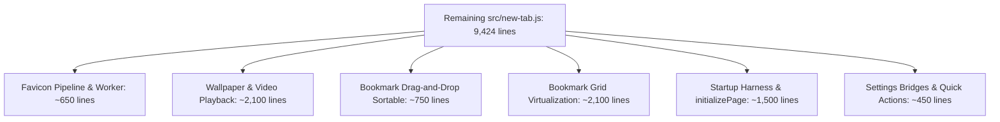

# Homebase Improvement Cycle #10 Phase 5 Architecture & Implementation Plan
## Extraction of Shared Infrastructure: Favicon Resolution & Hydration Pipeline

> **Cycle ID**: Homebase Improvement Cycle #10 — Phase 5  
> **Target Release**: Homebase v0.17.0  
> **Baseline Commit**: `c7ca61d` ("Extract search interaction controller")  
> **Status**: Planning & Audit Phase (Zero Source Code Modified)  
> **Authority**: [AGENTS.md](file:///c:/Users/Administrator/Desktop/Homebase/AGENTS.md), [docs/56-cycle10-plan.md](file:///c:/Users/Administrator/Desktop/Homebase/docs/56-cycle10-plan.md), [docs/61-cycle10-phase4-implementation-report.md](file:///c:/Users/Administrator/Desktop/Homebase/docs/61-cycle10-phase4-implementation-report.md)  

---

## 1. Current Architecture State

Following the completion of Phases 1 through 4 of Cycle #10, `src/new-tab.js` has undergone significant reduction:

| Milestone | Extracted Controller | Module Path | Lines Reduced | Total Monolith Lines |
|---|---|---|---|---|
| **Baseline** | — | — | — | 12,261 |
| **Phase 1** | `HomebasePerformanceController` | `src/newtab/settings/performance-controller.js` | -285 lines | 11,976 |
| **Phase 2** | `HomebaseDialogController` & `HomebaseContextMenuController` | `src/newtab/core/dialog-controller.js`, `src/newtab/core/context-menu-controller.js` | -379 lines | 11,597 |
| **Phase 3** | `HomebaseSearchUiController` | `src/newtab/search/search-ui-controller.js` | -465 lines | 11,385 |
| **Phase 4** | `HomebaseSearchInteractionController` | `src/newtab/search/search-interaction-controller.js` | **-1,961 lines** | **9,424** |
| **Total Reduction** | **5 Controllers Extracted** | — | **-3,090 lines** | **9,424 lines** |

- **Total source lines remaining**: 9,424 (down from 12,261).
- **Total declared functions**: 234 functions remaining.
- **Verification status**: 315/315 unit tests passing; 51 deferred local scripts loaded in strict dependency order; zero changes to protected bootloaders (`preload.js`, `instant_load.js`, manifests).

---

## 2. Comprehensive Audit of Remaining Domains

A fresh audit of `src/new-tab.js` identifies five major functional domains remaining in the monolith:



### Detailed Domain Breakdown:

| Domain | Lines in Monolith | Core Functions & Responsibilities | Coupled Dependencies | Risk Profile |
|---|---|---|---|---|
| **Favicon Pipeline & Queue** | ~650 lines | Candidate generation (`gstatic`, `googleS2`), task queue (`enqueueFaviconTask`), `IntersectionObserver` lazy loading, object URL lifecycle, and async resolution (`resolveFaviconForImageTarget`, `getFaviconUrlForRawUrl`). | `HomebaseFaviconCache`, DOM `` elements | **Low-Medium Risk** (Self-contained, asynchronous, network-isolated) |
| **Wallpaper & Video Playback** | ~2,100 lines | Dual background video crossfader, video manifest cache, daily rotation scheduler, fallback poster creation, online/offline blob hydration, and wallpaper type preferences. | `HomebaseWallpaperStorage`, `<video>` DOM elements, `initializePage` startup hook | **High Risk** (Startup timing sensitive, frame-accurate media crossfade) |
| **Bookmark Drag-and-Drop** | ~750 lines | Sortable.js grid and tab drag integration (`setupGridSortable`, `setupTabsSortable`), drag ghost positioning, autoscroll during drag, tab drop targeting, and folder drop hover timer. | `Sortable.min.js`, `allBookmarks`, `saveBookmarks`, grid virtualization | **Medium-High Risk** (Direct DOM tree mutation, pointer tracking) |
| **Bookmark Grid & Virtualization** | ~2,100 lines | Card rendering (`renderBookmark`), folder tabs creation, back button generator, and virtualization engine (`initVirtualizer`, `updateVirtualGrid`). | `allBookmarks`, Favicon Pipeline, Drag-and-Drop, folder navigation state | **High Risk** (DOM layout reflows, scroll performance, card recycling) |
| **Startup Harness & Idle Scheduler** | ~1,500 lines | `initializePage`, `processIdleTasks`, `scheduleIdleTask`, battery monitoring, boot performance logging. | Coordinates all subsystems. | **Protected Zone** (Must remain in `new-tab.js` per `AGENTS.md`) |

---

## 3. Extraction Target Selection

### Recommended Target: **Favicon Resolution & Hydration Pipeline**
- **New Module**: `src/newtab/core/favicon-pipeline.js`
- **Global Controller**: `window.HomebaseFaviconPipeline`

### Architectural Rationale:
1. **Shared Foundation for Search & Bookmarks**:
   - `search-interaction-controller.js` (extracted in Phase 4) currently calls `resolveFaviconForImageTarget` to hydrate search result favicons.
   - The upcoming Bookmark Grid & Virtualization controller (Phase 7) depends directly on `resolveFaviconForImageTarget`, `queueFaviconResolution`, `buildFaviconCandidates`, and `revokeFaviconObjectUrl`.
   - Extracting the Favicon Pipeline now establishes this shared service cleanly, preventing circular dependencies or duplicate helpers when extracting the bookmark grid.
2. **Clean Ownership Boundary**:
   - Builds directly on top of `src/newtab/core/favicon-cache.js` (extracted in Cycle 9).
   - Manages candidate generation, the network worker task queue, and the `IntersectionObserver` without touching bookmark state or video elements.
3. **Low Regression Risk**:
   - Operates completely asynchronously with non-blocking fallbacks.
   - If an image fails or aborts, fallback letters or icons render immediately.
4. **Significant Complexity Reduction**:
   - Eliminates ~650 lines of caching, queueing, and network resolution logic from `src/new-tab.js`.

---

## 4. Controller API Design: `window.HomebaseFaviconPipeline`

```javascript
window.HomebaseFaviconPipeline = {
  // Lifecycle
  initialize(options = {}),
  destroy(),

  // Candidate Generation & URL Parsing
  isValidTargetUrl(rawUrl),
  getDomainKey(rawUrl),
  buildCandidates(rawUrl, size),

  // Resolution & Hydration
  resolveForImageTarget(options),
  getUrlForRawUrl(rawUrl),
  queueResolution(img, resolveTask),

  // Object URL & DOM Image Helpers
  setObjectUrlForImage(img, objectUrl),
  revokeObjectUrl(img),
  setImageSrc(img, url),
  loadObjectUrlIntoImage(img, objectUrl, shouldAbort, acceptCandidate),
  testCandidateUrl(candidate, acceptCandidate),
  testCandidateObjectUrl(objectUrl, acceptCandidate),

  // Worker Queue & Observer
  enqueueTask(task),
  runNextTask(),
  ensureObserver(),

  // In-Memory Cache Accessors
  getResolvedEntry(domainKey),
  setResolvedEntry(domainKey, url, options),
  getResolvedUrl(domainKey),
  clearResolvedCache(),

  // Diagnostic State
  getState()
};
```

---

## 5. Scope of Extraction

### Functions to Move to `src/newtab/core/favicon-pipeline.js`:
1. `debugFavicon(event, details)`
2. `setFaviconResolved(domainKey, url, options)`
3. `getFaviconResolvedEntry(domainKey)`
4. `getFaviconResolvedUrl(domainKey)`
5. `notifyFaviconWaiters(domainKey, resolved)`
6. `runNextFaviconTask()`
7. `enqueueFaviconTask(task)`
8. `getFaviconCache()`
9. `cacheKeyFor(domainKey, size)`
10. `readIconFromCache(cacheKey)`
11. `writeIconToCache(cacheKey, response)`
12. `responseToObjectURL(response)`
13. `xhrFetchBlob(url, timeoutMs)`
14. `blobToResponse(blob)`
15. `setFaviconObjectUrlForImage(img, objectUrl)`
16. `revokeFaviconObjectUrl(img)`
17. `setFaviconImageSrc(img, url)`
18. `loadFaviconObjectUrlIntoImage(img, objectUrl, shouldAbort, acceptCandidate)`
19. `testFaviconCandidateUrl(candidate, acceptCandidate)`
20. `testFaviconCandidateObjectUrl(objectUrl, acceptCandidate)`
21. `ensureFaviconObserver()`
22. `queueFaviconResolution(img, resolveTask)`
23. `isValidFaviconTargetUrl(rawUrl)`
24. `getDomainKeyFromUrl(rawUrl)`
25. `buildFaviconCandidates(rawUrl)`
26. `getFaviconUrlForRawUrl(rawUrl)`
27. `resolveFaviconForImageTarget(options)`
28. `applyResolvedFaviconResult(options)`
29. `resolveFaviconFromNetwork(options)`

### Backward Compatibility Wrappers in `src/new-tab.js`:
All extracted functions will have matching lightweight delegates in `src/new-tab.js`:
```javascript
function getDomainKeyFromUrl(rawUrl) {
  if (window.HomebaseFaviconPipeline && typeof window.HomebaseFaviconPipeline.getDomainKey === 'function') {
    return window.HomebaseFaviconPipeline.getDomainKey(rawUrl);
  }
  return '';
}

function buildFaviconCandidates(rawUrl) {
  if (window.HomebaseFaviconPipeline && typeof window.HomebaseFaviconPipeline.buildCandidates === 'function') {
    return window.HomebaseFaviconPipeline.buildCandidates(rawUrl);
  }
  return [];
}

async function resolveFaviconForImageTarget(options) {
  if (window.HomebaseFaviconPipeline && typeof window.HomebaseFaviconPipeline.resolveForImageTarget === 'function') {
    return window.HomebaseFaviconPipeline.resolveForImageTarget(options);
  }
}
```

---

## 6. Script Loading Order Changes

In `src/new-tab.html`:
Load `newtab/core/favicon-pipeline.js` immediately after `newtab/core/favicon-cache.js`:

```html
  <script src="newtab/core/storage-service.js" defer></script>
  <script src="newtab/core/favicon-cache.js" defer></script>
  <script src="newtab/core/favicon-pipeline.js" defer></script>
  <script src="newtab/bookmarks/bookmark-storage.js" defer></script>
```

- Loaded after `favicon-cache.js` (which provides `window.HomebaseFaviconCache`).
- Loaded before `search-interaction-controller.js` and `new-tab.js`.
- Maintains `preload.js` as the sole script in `<head>`.
- Maintains `new-tab.js` as the 52nd and final deferred runtime script.

---

## 7. Testing Strategy

Create `tests/unit/favicon-pipeline.test.mjs`:
1. **Export Availability**: Validate `window.HomebaseFaviconPipeline` exists and exports all API methods.
2. **URL Validation & Domain Parsing**: Test HTTP/HTTPS URL parsing, localhost rejection, IP handling.
3. **Candidate Builder**: Confirm `gstatic` and `googleS2` candidate URLs are correctly formed with size params.
4. **Worker Queue Concurrency**: Verify `enqueueTask` respects `MAX_CONCURRENT_FAVICON_TASKS` (6 tasks max).
5. **In-Memory Cache & Limit**: Test resolved cache insertion, retrieval, and eviction when exceeding limit.
6. **Object URL Management**: Verify `setFaviconObjectUrlForImage` and `revokeFaviconObjectUrl` prevent memory leaks.
7. **Negative Cache TTL**: Verify negative cache suppresses repeated requests within 10 minutes.
8. **Headless Safety**: Validate all functions execute safely without DOM or when `IntersectionObserver` is absent.

---

## 8. Rollback Strategy

If regressions occur during Phase 5 implementation:
```powershell
git checkout -- src/new-tab.js src/new-tab.html
rm src/newtab/core/favicon-pipeline.js
rm tests/unit/favicon-pipeline.test.mjs
rm docs/62-cycle10-phase5-plan.md
```
Restores working tree cleanly to commit `c7ca61d`.

---

## 9. Verification Checklist

Prior to implementation:
- [x] Baseline test suite clean: 315/315 unit tests pass.
- [x] Protected boundaries untouched: `git diff src/preload.js src/instant_load.js manifests/ dist/` is 0 diff.
- [x] Working tree clean on `origin/development`.
- [ ] Phase 5 implementation approved by user.
