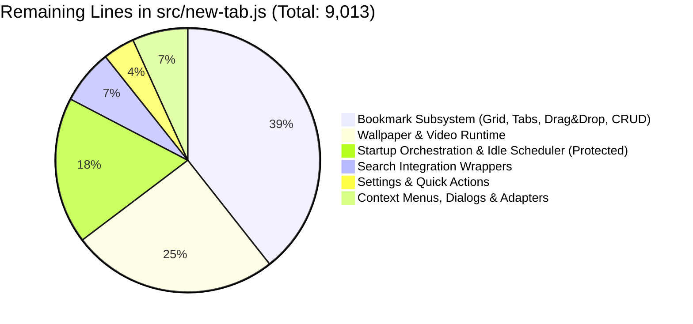
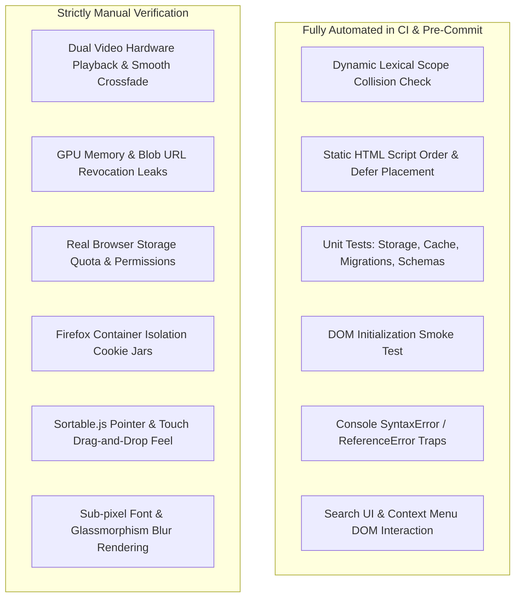
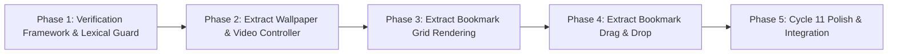

# Homebase Improvement Cycle #11 Audit & Architecture Plan

> **Cycle ID**: Homebase Improvement Cycle #11 — Audit & Architecture Plan  
> **Target Release**: Homebase v0.18.0  
> **Baseline Commit**: `cf529a5` ("Document Homebase project continuity workflow")  
> **Status**: Audit & Architecture Analysis Phase (Zero source code modified, zero dependencies added)  
> **Authority**: [AGENTS.md](file:///c:/Users/Administrator/Desktop/Homebase/AGENTS.md), [docs/HOMEBASE-HANDOFF.md](file:///c:/Users/Administrator/Desktop/Homebase/docs/HOMEBASE-HANDOFF.md), [docs/63-cycle10-phase5-implementation-report.md](file:///c:/Users/Administrator/Desktop/Homebase/docs/63-cycle10-phase5-implementation-report.md)

---

## 1. Current Repository State

Homebase is a dual-browser (Chrome & Firefox) new-tab dashboard extension built with classic deferred scripts (`<script defer>`) without bundlers or module loaders.

### Git Baseline
- **Current Branch**: `development` (in sync with `origin/development`)
- **Working Tree**: Clean (`nothing to commit, working tree clean`)
- **Recent Commits**:
  - `cf529a5` Document Homebase project continuity workflow
  - `6e9b278` Extract favicon resolution pipeline (Cycle #10 Phase 5)
  - `c7ca61d` Extract search interaction controller (Cycle #10 Phase 4)
  - `41d43db` Extract search UI controller (Cycle #10 Phase 3)
  - `e009b1e` Extract dialog and context menu controllers (Cycle #10 Phase 2)

### Automated Test Baseline
- **Unit Test Suite**: 330/330 tests passing across 28 test suites in `tests/unit/`.
- **Static Invariants**: Passing (`scripts/check-newtab-static.mjs`), checking 53 scripts and 88 whitelisted declaration names.
- **Syntax Validation**: `node --check` passing across all runtime source files.
- **Browser Smoke Test**: `scripts/smoke-newtab-file.mjs` currently **skips** execution in this environment (`SKIP no Chrome or Edge executable found`).

### Script Architecture & Script Order
`src/new-tab.html` loads a total of **53 classic deferred scripts** in strict sequential dependency order:
- `preload.js` (synchronous in `<head>`)
- `instant_load.js` (synchronous in `<head>`)
- Core vendor: `Sortable.min.js`, `data.js`, `tips.js`
- 47 extracted modules under `src/newtab/` (`core/`, `search/`, `wallpaper/`, `bookmarks/`, `settings/`, `widgets/`, `integrations/`, `tips/`)
- Monolith runtime: `src/new-tab.js` (loaded last as script #53)

---

## 2. src/new-tab.js Analysis

### Quantitative Summary
- **Current Source Lines**: **9,013 lines** (LF) / 8,584 lines (CRLF), down from the pre-Cycle 10 baseline of 12,261 lines (a net reduction of 3,248 lines across Cycle 10).
- **Total Declared Functions**: **234 functions** (top-level and block-level closures).

### Top 25 Largest Remaining Functions

| Rank | Function Name | Line Range | Line Count | Primary Responsibility |
|:---:|---|:---:|:---:|---|
| 1 | `initializePage` | L7444–L8286 | **843 lines** | Master startup orchestration, settings hydration, DOM binding |
| 2 | `createFolderTabs` | L5687–L6134 | **448 lines** | Folder tab DOM generation, active state tracking, scroll triggers |
| 3 | `renderBookmarkIconInto` | L3865–L4099 | **235 lines** | Bookmark card icon rendering & favicon pipeline fallback orchestration |
| 4 | `ensureDailyWallpaper` | L1911–L2090 | **180 lines** | Daily wallpaper rotation logic, timestamp verification, network fetch |
| 5 | `showGridItemRenameInput` | L5457–L5622 | **166 lines** | Inline rename input creation, keyboard handlers, validation |
| 6 | `setupBackgroundVideoCrossfade` | L7219–L7367 | **149 lines** | Dual video DOM element crossfading, play promise handling |
| 7 | `renderBookmarkGrid` | L5004–L5151 | **148 lines** | Bookmark grid container reconciliation, item diffing, virtualization pass |
| 8 | `applyWallpaperByType` | L8775–L8914 | **140 lines** | Wallpaper type dispatcher (color, image, video, dynamic accent) |
| 9 | `deleteBookmarkOrFolder` | L4239–L4367 | **129 lines** | Recursive deletion confirmation, storage mutation, undo stack |
| 10 | `processIdleTasks` | L154–L276 | **123 lines** | Priority idle task scheduler queue processor |
| 11 | `handleGridDrop` | L3441–L3563 | **123 lines** | Sortable drop handler for bookmark grid items |
| 12 | `handleTabDrop` | L3669–L3789 | **121 lines** | Sortable drop handler for bookmark folder tabs |
| 13 | `updateVirtualGrid` | L4608–L4725 | **118 lines** | Viewport virtualization window calculation and element pooling |
| 14 | `renderFolderIconInto` | L4101–L4210 | **110 lines** | Folder preview card icon generation (mini 2x2 grid) |
| 15 | `cacheAppliedWallpaperPoster` | L1135–L1237 | **103 lines** | Video poster extraction and Cache Storage persistence |
| 16 | `showEditInput` | L5347–L5445 | **99 lines** | Inline URL / Title editing modal trigger |
| 17 | `handleGridMove` | L3232–L3328 | **97 lines** | Sortable move validator and drop target highlighting |
| 18 | `scheduleIdleChunkedTask` | L325–L417 | **93 lines** | Generator-style chunked work scheduler yielding to main thread |
| 19 | `buildVideoPosterFromFile` | L1379–L1467 | **89 lines** | HTML5 video element canvas snapshot poster generation |
| 20 | `setupGridSortable` | L3136–L3218 | **83 lines** | Vendor Sortable.js initialization on bookmark grid |
| 21 | `loadBookmarks` | L6244–L6326 | **83 lines** | Bookmark data fetching and cache hydration |
| 22 | `setBackgroundVideoSources` | L1533–L1612 | **80 lines** | Source tag builder for background video playback |
| 23 | `setupTabsSortable` | L3581–L3657 | **77 lines** | Vendor Sortable.js initialization on folder tabs bar |
| 24 | `schedulePendingDailyRotationAttempt` | L1841–L1909 | **69 lines** | Backoff timer for retry on failed wallpaper rotation |
| 25 | `handleGridDragPointerMove` | L3332–L3400 | **69 lines** | Edge scrolling during drag operations |

---

### Remaining Domain Clusters in `src/new-tab.js`



### Domain Ranking & Prioritization Table

| Domain | Size | Risk Level | Browser Dependency | Extraction Priority | Feasibility & Architectural Notes |
|---|:---:|:---:|:---:|:---:|---|
| **Wallpaper / Video Runtime** | ~2,280 lines | **Very High** | **Very High** (HTMLMediaElement, CacheStorage, Object URLs, Autoplay) | **Priority 1** | Self-contained domain with clean storage contracts (`HomebaseWallpaperStorage`). Massive reduction potential for `new-tab.js`. |
| **Bookmark Grid Rendering & Virtualization** | ~1,500 lines | **High** | **High** (DOM virtualization, scroll offsets, IntersectionObserver, template cloning) | **Priority 2** | Central user surface. Highly visible. Interacts directly with `HomebaseFaviconPipeline`. |
| **Bookmark Drag & Drop** | ~750 lines | **Very High** | **High** (Sortable.js integration, pointer events, reorder persistence) | **Priority 3** | Deeply coupled with Grid and Tab DOM instances. Best extracted after Grid Rendering is modularized. |
| **Settings / Quick Actions** | ~350 lines | **Low** | **Low** (DOM click events, modal toggle dispatchers) | **Priority 4** | Remnant wrapper code. Low complexity, low risk. |
| **Startup Lifecycle / Orchestration** | ~1,620 lines | **Critical** | **High** (DOMContentLoaded, script execution sequence, perf marks) | **Protected** | **STRICTLY PRESERVED** in `src/new-tab.js` per `AGENTS.md` instructions. |

---

## 3. Extracted Architecture Review

All modules extracted during Cycles #1 through #10 live under `src/newtab/`:
- `core/`: 16 modules (`favicon-pipeline.js`, `storage-service.js`, `dialog-controller.js`, `context-menu-controller.js`, etc.)
- `search/`: 5 modules (`search-interaction-controller.js`, `search-ui-controller.js`, `search-storage.js`, etc.)
- `wallpaper/`: 3 modules (`wallpaper-storage.js`, `dynamic-accent.js`, `gallery-ui.js`)
- `bookmarks/`: 6 modules (`bookmark-storage.js`, `bookmark-style-runtime.js`, `folder-picker.js`, etc.)
- `settings/`: 11 modules (`settings-ui.js`, `backup-import.js`, `performance-controller.js`, etc.)

### Findings on Module Ownership & Dependency Direction
1. **Unidirectional Flow**: Extracted modules register namespace objects on `window` (e.g. `window.HomebaseFaviconPipeline`, `window.HomebaseSearchInteractionController`). `src/new-tab.js` acts as an integration consumer and backward-compatibility facade.
2. **Backward Compatibility Facades**: Existing global functions (e.g. `buildFaviconCandidates`, `openBookmarkDialog`) are preserved as delegation shims in `src/new-tab.js`, guaranteeing that inline DOM handlers and cross-module calls do not break.
3. **Script Order Discipline**: Dependencies load before consumers in `src/new-tab.html`. `new-tab.js` remains the 53rd and final deferred script.

### Incident Review: Cycle #10 Phase 5 New-Tab Freeze
- **What Occurred**: After extracting `favicon-pipeline.js`, the new-tab page froze completely during startup.
- **Console Error**: `Uncaught SyntaxError: Identifier 'wallpaperObjectUrlCache' has already been declared`.
- **Root Cause**: `wallpaperObjectUrlCache` was declared with `const` in `src/newtab/wallpaper/wallpaper-storage.js`, and an orphaned duplicate `const wallpaperObjectUrlCache = new Map();` remained in `src/new-tab.js`.
- **Why It Passed Automated Checks**:
  1. `node --check` verifies individual files in isolation; it has no concept of HTML `<script defer>` shared global lexical scope.
  2. `scripts/check-newtab-static.mjs` relied on a static whitelist array (`movedDeclarationNames`). Because `wallpaperObjectUrlCache` had not been manually added to that array, the static check passed with zero warnings.
  3. `npm test` runs Node.js test files that mock storage or evaluate single modules; it did not run a full multi-script browser harness.

### Critical Vulnerability Discovery in Fresh Audit
A fresh AST and lexical scope scan across all 53 deferred scripts loaded by `src/new-tab.html` revealed **3 additional existing duplicate declarations**:

```text
1. setLastUsedFolderId:
   - Declared in: src/newtab/bookmarks/bookmark-storage.js (function at Line 262)
   - Declared in: src/new-tab.js (function at Line 6174)

2. setText:
   - Declared in: src/data.js (function at Line 236)
   - Declared in: src/newtab/widgets/weather.js (function at Line 624)

3. setAttr:
   - Declared in: src/data.js (function at Line 242)
   - Declared in: src/newtab/widgets/weather.js (function at Line 630)
```

> [!CAUTION]
> Because these 3 collisions are declared with `function` (in non-strict script scope), they silently shadow and overwrite each other at runtime rather than throwing an immediate `SyntaxError` like `const` or `let`. However, if any of these are refactored to `const` or `let`, or if a new extraction leaves an unwhitelisted `const` in `new-tab.js`, the new-tab page will experience an immediate startup freeze.
>
> **Conclusion**: The current declaration protection mechanism (a manual whitelist of 88 names in `scripts/check-newtab-static.mjs`) is **INSUFFICIENT**. It is reactive rather than proactive.

---

## 4. Browser Runtime Verification Assessment

### Candidate A Feasibility: Playwright / Puppeteer Framework (`scripts/browser/`)

The prompt asks to evaluate introducing a browser verification framework such as:
```text
scripts/browser/
├── playwright.config.mjs
├── extension-loader.mjs
├── chrome-runtime-test.mjs
├── firefox-runtime-test.mjs
└── newtab-smoke.spec.mjs
```

#### Feasibility Evaluation: **FAIL / High Risk / Prohibited by Rules**

1. **Direct Violation of Core Project Rules (`AGENTS.md`)**:
   - `"Do not add new dependencies unless explicitly requested."`
   - `"Do not edit files in node_modules/."`
   - `"Do not introduce a bundler unless explicitly requested."`
   - The repository currently contains **zero `node_modules`** and **zero npm dependencies** in `package.json`. Adding Playwright would introduce dozens of third-party packages, package-lock bloat, and hundreds of megabytes of external binaries.
2. **Host Environment Realities**:
   - Environment check confirmed: Google Chrome and Microsoft Edge executables are **NOT installed** in default system paths on this Windows system.
   - Mozilla Firefox **IS installed** at `C:\Program Files\Mozilla Firefox\firefox.exe`.
   - Playwright's Firefox driver does not support standard WebExtension temporary installation (`about:debugging`) out of the box; testing unpacked browser extensions in Firefox via Playwright is notoriously fragile.
3. **CDP Harness Cap Rule (`AGENTS.md`)**:
   - `"Do not spend more than about 10–15 minutes debugging the harness. If the harness still fails, stop harness debugging and continue with node --check, npm.cmd run build, static verification..."`

---

### Candidate A Alternative: Zero-Dependency Native Runtime Verification

Homebase already contains a custom, dependency-free CDP smoke test runner in `scripts/smoke-newtab-file.mjs` (946 lines) using Node.js built-in `http`, `WebSocket`, and `child_process.spawn`.

#### Current Limitation of `smoke-newtab-file.mjs`:
When executed during `npm.cmd test`, it outputs:
```text
--- [Stage 4] Browser Smoke Test (smoke-newtab-file.mjs) ---
Homebase new-tab browser smoke
SKIP no Chrome or Edge executable found; set HOMEBASE_SMOKE_BROWSER to run the browser smoke test
[PASS] Browser Smoke Test (smoke-newtab-file.mjs) (0.05s)
```
The test reports `[PASS]` even though it **completely skipped** execution because it only looks for hardcoded Chrome/Edge paths and cannot discover Firefox or user-configured browser binaries.

#### Feasibility of Zero-Dependency Verification Upgrades: **VERY HIGH**
We can substantially elevate verification rigor **without adding any external dependencies**:
1. **Dynamic Lexical Scope Collision Guard** in `scripts/check-newtab-static.mjs`:
   - Automatically extract all top-level `const`, `let`, `class`, and `function` declarations across all 53 deferred scripts.
   - Detect any duplicates or clashing lexical bindings instantly (<50ms execution time).
   - Guarantee 100% static immunity against freeze-inducing duplicate declarations.
2. **Multi-Browser Smoke Launcher** in `scripts/smoke-newtab-file.mjs`:
   - Detect Firefox (`C:\Program Files\Mozilla Firefox\firefox.exe`) and launch a temporary profile smoke pass, or support custom browser binary resolution via environment variables.
   - Add interactive DOM verification assertions (Search input typing, context menu opening, bookmark grid DOM tree checks).

---

## 5. Automation Opportunity vs. Manual Verification Strategy

Per the guidelines in `AGENTS.md`, testing responsibilities must be cleanly partitioned into what can be verified automatically vs. what strictly requires human manual testing.



### Classification Breakdown

#### A) Can Be Fully Automated:
1. **Static Invariants & Lexical Scope**:
   - Zero duplicate declarations across all classic deferred scripts.
   - Script tag ordering and defer attributes in `src/new-tab.html`.
   - File existence and absence of stale flat module references.
2. **Logic & State Transitions**:
   - Storage service CRUD operations, batch writes, schema validation, and migrations.
   - Favicon candidate discovery, domain extraction, and LRU cache eviction.
   - Search query parsing, math evaluation, and suggestion cache logic.
3. **DOM Surface Initialization**:
   - Clock, bookmark container, dock navigation, search input, and sidebar visibility initialization.
   - Zero console errors (`ReferenceError`, `TypeError`, `SyntaxError`) on page load.
4. **Basic UI Interactions**:
   - Inputting text into search input and asserting suggestions container presence.
   - Triggering context menu or dialog opening and asserting DOM classes/ARIA attributes.

#### B) Strictly Requires Manual Verification:
1. **Hardware / Media / GPU Playback**:
   - Seamless crossfading between `<video>` elements without visual stutter or black flicker.
   - Browser autoplay restrictions and user-interaction requirements.
   - Canvas-based video poster snapshot rendering.
2. **Native Browser Extension APIs**:
   - Real `chrome.bookmarks.getTree()` / `browser.bookmarks.getTree()` tree hydration.
   - Firefox Container bookmarks (`browser.contextualIdentities`) opening in dedicated container tabs.
   - Real extension reload / update persistence across browser restarts.
3. **Physical User Interaction & Visual Nuance**:
   - Sortable.js drag-and-drop animation smoothness, placeholder placement, and drop-reordering feel.
   - Backdrop-filter blur and glassmorphism styling across Chromium vs Gecko engines.

---

## 6. Candidate Comparison & Recommendation

### Evaluation of Candidates

| Dimension | Candidate A: Browser Runtime Verification Framework | Candidate B: Continue `src/new-tab.js` Extraction Work |
|---|---|---|
| **Primary Goal** | Build browser automation infrastructure | Extract next domain from `src/new-tab.js` (~2,280 lines) |
| **Direct Value** | Prevents future regressions and runtime freezes | Reduces monolith size from 9,013 lines |
| **Risk Profile** | High risk if introducing npm dependencies (violates `AGENTS.md`) | Very High risk of runtime freeze if done without collision protection |
| **Dependency Impact** | Zero (if extending existing native scripts); Massive (if using Playwright) | Zero dependencies |
| **Current Readiness** | Current smoke test silently skips; static check whitelist is incomplete | Monolith is clean, but 3 duplicate declarations already exist |

### Recommendation: **Option 1 — Candidate A (Targeted Zero-Dependency Verification & Collision Guard Framework)**

#### Architectural Justification:
1. **Safety Before High-Risk Extraction**: The remaining domains in `src/new-tab.js` are the two highest-risk areas in the entire project: **Wallpaper / Video Runtime (~2,280 lines)** and **Bookmark Grid & Drag/Drop (~2,250 lines)**. Both domains are heavily intertwined with global lexical scope, DOM events, and media lifecycles.
2. **Freeze Vulnerability Elimination**: In Cycle #10 Phase 5, an extraction caused a catastrophic runtime freeze because `check-newtab-static.mjs` was blind to unwhitelisted duplicate declarations. Extracting Wallpaper/Video without first fixing this vulnerability is a high-risk liability.
3. **Zero New Dependencies**: We will NOT introduce Playwright or add packages to `package.json`. Instead, we will strengthen the existing zero-dependency static and smoke toolchain:
   - Upgrade `scripts/check-newtab-static.mjs` to dynamically detect all cross-script lexical collisions (`const`, `let`, `class`, `function`).
   - Clean up the 3 existing duplicate declarations discovered during audit (`setLastUsedFolderId`, `setText`, `setAttr`).
   - Upgrade `scripts/smoke-newtab-file.mjs` to support multi-browser execution and eliminate silent skips.
4. **Smooth Runway for Cycle #11 Subsequent Phases**: Once the verification foundation is impervious to lexical collisions and verified via automated smoke passes, Phase 2 can safely extract the Wallpaper / Video Runtime (`HomebaseWallpaperVideoController`) with total confidence.

---

## 7. Recommended Cycle #11 Roadmap



### Phase Breakdown

#### Cycle #11 Phase 1: Zero-Dependency Verification Framework & Dynamic Lexical Guard
- **Scope**:
  1. Upgrade `scripts/check-newtab-static.mjs` with an automated AST/regex lexical collision scanner covering all 53 deferred scripts in `src/new-tab.html`.
  2. Resolve the 3 existing duplicate declarations:
     - Deduplicate `setLastUsedFolderId` between `src/newtab/bookmarks/bookmark-storage.js` and `src/new-tab.js`.
     - Deduplicate `setText` and `setAttr` between `src/data.js` and `src/newtab/widgets/weather.js`.
  3. Enhance `scripts/smoke-newtab-file.mjs` to eliminate silent skips and support Firefox / configurable browser executables.
  4. Add automated DOM interactive smoke tests (search input query dispatch, dialog trigger assertions).
- **Target Source Files**: `scripts/check-newtab-static.mjs`, `scripts/smoke-newtab-file.mjs`, `src/new-tab.js`, `src/newtab/widgets/weather.js`.

#### Cycle #11 Phase 2: Extract Wallpaper & Video Controller
- **Target Module**: `src/newtab/wallpaper/wallpaper-controller.js` (`window.HomebaseWallpaperController`).
- **Target Responsibilities**: Background video dual-element crossfade, daily wallpaper rotation scheduler, video manifest cache management, and poster cache persistence.
- **Estimated Monolith Reduction**: ~1,800 to 2,200 lines.

#### Cycle #11 Phase 3: Extract Bookmark Grid Rendering & Virtualization
- **Target Module**: `src/newtab/bookmarks/bookmark-grid-controller.js` (`window.HomebaseBookmarkGridController`).
- **Target Responsibilities**: Grid item template cloning, icon hydration integration with `HomebaseFaviconPipeline`, virtualization viewport calculation, folder tabs rendering.
- **Estimated Monolith Reduction**: ~1,200 to 1,500 lines.

#### Cycle #11 Phase 4: Extract Bookmark Drag & Drop Controller
- **Target Module**: `src/newtab/bookmarks/bookmark-drag-controller.js` (`window.HomebaseBookmarkDragController`).
- **Target Responsibilities**: Sortable.js grid and tab drag integration, drop handling, reorder persistence via `HomebaseBookmarkStorage`.
- **Estimated Monolith Reduction**: ~600 to 750 lines.

---

## 8. Expected Benefits

1. **Immunity to Runtime Startup Freezes**: The dynamic lexical collision scanner guarantees that no duplicate `const`, `let`, `class`, or `function` declaration can ever be committed to the repository, eliminating the root cause of the Cycle 10 Phase 5 freeze.
2. **Zero Dependency Bloat**: Preserves the clean repository footprint (0 dependencies, 0 `node_modules`, standard classic `<script defer>` architecture).
3. **No Silent Test Skips**: Test runner provides unambiguous visibility into browser smoke test execution across Chrome, Edge, and Firefox.
4. **Accelerated Extraction Velocity**: With rock-solid automated guards in place, subsequent extractions of the Wallpaper/Video (~2,280 lines) and Bookmark Grid (~1,500 lines) domains can proceed rapidly with zero regression anxiety.

---

## 9. Verification Plan for Cycle #11 Phase 1

When Phase 1 is approved for implementation, the following verification gates will be enforced:

1. **Syntax Validation**:
   ```powershell
   node --check scripts/check-newtab-static.mjs
   node --check scripts/smoke-newtab-file.mjs
   node --check src/new-tab.js
   node --check src/newtab/widgets/weather.js
   ```
2. **Static Invariant & Collision Validation**:
   ```powershell
   node scripts/check-newtab-static.mjs
   ```
   *Must verify zero lexical collisions across all 53 deferred scripts.*
3. **Unit Tests**:
   ```powershell
   npm.cmd test
   ```
   *All 330 unit tests must pass.*
4. **Smoke Test Execution**:
   ```powershell
   node scripts/smoke-newtab-file.mjs
   ```
   *Must execute active runtime checks without silent skipping.*
5. **Clean Diff Check**:
   ```powershell
   git diff --check
   git diff src/preload.js src/instant_load.js manifests/ dist/
   ```
   *Strictly zero diffs in protected bootloader files.*
