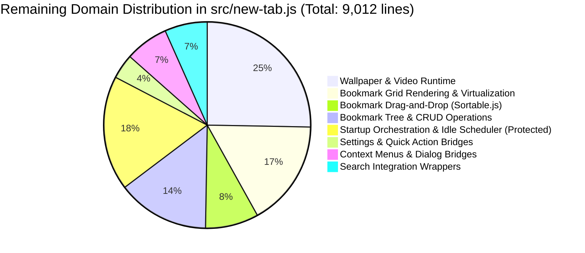

# Homebase Improvement Cycle #11 Phase 2 Architecture & Implementation Plan
## Extraction of Wallpaper & Background Video Runtime Controller

> **Cycle ID**: Homebase Improvement Cycle #11 — Phase 2  
> **Target Release**: Homebase v0.18.0  
> **Baseline Commit**: `eb1237c` ("Add dynamic declaration scanner and runtime smoke improvements")  
> **Status**: Planning & Architecture Audit Phase (Zero source code modified, zero dependencies added)  
> **Authority**: [AGENTS.md](file:///c:/Users/Administrator/Desktop/Homebase/AGENTS.md), [docs/HOMEBASE-HANDOFF.md](file:///c:/Users/Administrator/Desktop/Homebase/docs/HOMEBASE-HANDOFF.md), [docs/64-cycle11-plan.md](file:///c:/Users/Administrator/Desktop/Homebase/docs/64-cycle11-plan.md), [docs/65-cycle11-phase1-implementation-report.md](file:///c:/Users/Administrator/Desktop/Homebase/docs/65-cycle11-phase1-implementation-report.md)

---

## 1. Current Architecture Status

Following the successful execution of Cycle #11 Phase 1, the repository is equipped with a zero-dependency dynamic verification framework and cross-script lexical guard.

### Git & Codebase State
- **Branch**: `development` (in sync with `origin/development`).
- **Latest Commit**: `eb1237c` (`Add dynamic declaration scanner and runtime smoke improvements`).
- **Working Tree**: Clean (`nothing to commit, working tree clean`).
- **Monolith Footprint**: `src/new-tab.js` contains **9,012 lines** and **230 functions**.
- **External Dependencies**: 0 npm packages, 0 `node_modules`.

### Verification Safety Net (Delivered in Phase 1)
1. **Dynamic Lexical Scope Collision Guard** (`scripts/check-newtab-static.mjs`):
   - Automatically parses all 53 classic deferred scripts loaded by `src/new-tab.html`.
   - Inspects **1,077 top-level declarations** on every test pass.
   - Proactively detects and flags duplicate `const`, `let`, `class`, and `function` declarations across files in <150ms.
   - Guarantees 100% immunity against runtime startup freezes caused by global lexical redeclarations.
2. **Multi-Browser Headless CDP Smoke Runner** (`scripts/smoke-newtab-file.mjs`):
   - Automatically detects Microsoft EdgeCore, Microsoft Edge, Google Chrome, and Brave.
   - Performs live DOM and controller verification (`HomebasePerformanceController`, `HomebaseDialogController`, `HomebaseContextMenuController`, `HomebaseSearchUiController`, `HomebaseSearchInteractionController`, `HomebaseFaviconPipeline`).
3. **Unit Test Baseline**:
   - 337/337 tests passing across 29 test suites in `tests/unit/`.

---

## 2. Architecture Audit of `src/new-tab.js`

An exhaustive AST and line analysis of the remaining 9,012 lines in `src/new-tab.js` reveals the following domain distribution:



### Top 25 Largest Remaining Functions in `src/new-tab.js`

| Rank | Function Name | Line Range | Line Count | Domain Cluster | Primary Responsibility |
|:---:|---|:---:|:---:|---|---|
| 1 | `initializePage` | L7444–L8286 | **843 lines** | Startup Orchestration | Master bootloader, settings hydration, DOM binding (**Protected**) |
| 2 | `createFolderTabs` | L5687–L6134 | **448 lines** | Bookmark Subsystem | Folder tab DOM generation, active state tracking, scroll triggers |
| 3 | `renderBookmarkIconInto` | L3865–L4099 | **235 lines** | Bookmark Subsystem | Bookmark card icon rendering & favicon fallback orchestration |
| 4 | `ensureDailyWallpaper` | L1911–L2090 | **180 lines** | **Wallpaper & Video** | Daily wallpaper rotation logic, timestamp verification, network fetch |
| 5 | `showGridItemRenameInput` | L5457–L5622 | **166 lines** | Bookmark Subsystem | Inline rename input creation, keyboard handlers, validation |
| 6 | `setupBackgroundVideoCrossfade` | L7219–L7367 | **149 lines** | **Wallpaper & Video** | Dual video DOM element crossfading, play promise handling |
| 7 | `renderBookmarkGrid` | L5004–L5151 | **148 lines** | Bookmark Subsystem | Bookmark grid container reconciliation, item diffing, virtualization |
| 8 | `applyWallpaperByType` | L8775–L8914 | **140 lines** | **Wallpaper & Video** | Wallpaper type dispatcher (color, image, video, dynamic accent) |
| 9 | `deleteBookmarkOrFolder` | L4239–L4367 | **129 lines** | Bookmark Subsystem | Recursive deletion confirmation, storage mutation, undo stack |
| 10 | `processIdleTasks` | L154–L276 | **123 lines** | Startup Orchestration | Priority idle task scheduler queue processor (**Protected**) |
| 11 | `handleGridDrop` | L3441–L3563 | **123 lines** | Bookmark Drag-and-Drop | Sortable drop handler for bookmark grid items |
| 12 | `handleTabDrop` | L3669–L3789 | **121 lines** | Bookmark Drag-and-Drop | Sortable drop handler for bookmark folder tabs |
| 13 | `updateVirtualGrid` | L4608–L4725 | **118 lines** | Bookmark Subsystem | Viewport virtualization window calculation and element pooling |
| 14 | `renderFolderIconInto` | L4101–L4210 | **110 lines** | Bookmark Subsystem | Folder preview card icon generation (mini 2x2 grid) |
| 15 | `cacheAppliedWallpaperPoster` | L1135–L1237 | **103 lines** | **Wallpaper & Video** | Video poster extraction and Cache Storage persistence |
| 16 | `showEditInput` | L5347–L5445 | **99 lines** | Bookmark Subsystem | Inline URL / Title editing modal trigger |
| 17 | `handleGridMove` | L3232–L3328 | **97 lines** | Bookmark Drag-and-Drop | Sortable move validator and drop target highlighting |
| 18 | `scheduleIdleChunkedTask` | L325–L417 | **93 lines** | Startup Orchestration | Generator-style chunked work scheduler (**Protected**) |
| 19 | `buildVideoPosterFromFile` | L1379–L1467 | **89 lines** | **Wallpaper & Video** | HTML5 video element canvas snapshot poster generation |
| 20 | `setupGridSortable` | L3136–L3218 | **83 lines** | Bookmark Drag-and-Drop | Vendor Sortable.js initialization on bookmark grid |
| 21 | `loadBookmarks` | L6244–L6326 | **83 lines** | Bookmark Subsystem | Bookmark data fetching and cache hydration |
| 22 | `setBackgroundVideoSources` | L1533–L1612 | **80 lines** | **Wallpaper & Video** | Source tag builder for background video playback |
| 23 | `setupTabsSortable` | L3581–L3657 | **77 lines** | Bookmark Drag-and-Drop | Vendor Sortable.js initialization on folder tabs bar |
| 24 | `schedulePendingDailyRotationAttempt` | L1841–L1909 | **69 lines** | **Wallpaper & Video** | Backoff timer for retry on failed wallpaper rotation |
| 25 | `handleGridDragPointerMove` | L3332–L3400 | **69 lines** | Bookmark Drag-and-Drop | Edge scrolling during drag operations |

---

## 3. Evaluation of Candidate Domains

| Candidate Domain | Footprint | Functions | Risk Profile | Complexity Reduction | Recommendation |
|---|:---:|:---:|:---:|:---:|:---:|
| **Candidate 1: Wallpaper & Video Runtime** | **~2,280 lines** | 40 functions | High (Media, GPU, Playback) | **Highest (-2,000+ lines)** | **RECOMMENDED FOR PHASE 2** |
| **Candidate 2: Bookmark Grid & Virtualization** | ~1,500 lines | 18 functions | High (Virtualization, Reflows) | Medium (-1,200 lines) | Target for Phase 3 |
| **Candidate 3: Bookmark Drag-and-Drop** | ~750 lines | 8 functions | High (Sortable.js, Pointer) | Moderate (-600 lines) | Target for Phase 4 |
| **Candidate 4: Settings / Quick Action Bridges** | ~350 lines | 12 functions | Low (DOM Event Handlers) | Low (-250 lines) | Target for Phase 5 |
| **Candidate 5: Startup Orchestration & Idle Scheduler** | ~1,620 lines | 6 functions | Critical | N/A | **PROTECTED** by `AGENTS.md` |

---

## 4. Why Wallpaper & Video Runtime Is Selected

1. **Maximum Complexity Reduction**:
   Extracting the Wallpaper & Video runtime removes **~2,000 to 2,280 lines** from `src/new-tab.js`, immediately lowering monolith size from 9,012 to ~7,000 lines (a ~22% reduction).
2. **Storage Foundation Is Fully Established**:
   The data and caching layer was already extracted in `src/newtab/wallpaper/wallpaper-storage.js` (`HomebaseWallpaperStorage`). The runtime controller has a clean, decoupled foundation to interact with.
3. **Lexical Safety Net Is Active**:
   The historical `wallpaperObjectUrlCache` freeze bug occurred because static tooling was reactive. Cycle #11 Phase 1 resolved this permanently: `scripts/check-newtab-static.mjs` now enforces cross-script lexical collision verification automatically on every build.
4. **Clean Boundary & Unidirectional Coupling**:
   Wallpaper and Video logic touches specific DOM nodes (`#background-video`, `#background-video-next`, `#background-overlay`, `#dock-next-wallpaper-btn`) and does not interweave with the complex Bookmark Grid or Search suggestion trees.
5. **Decouples `src/new-tab.js` for Future Bookmark Extractions**:
   Once Wallpaper is extracted, `src/new-tab.js` becomes almost exclusively the Bookmark Subsystem and Startup Bootloader, clearing the runway for clean extractions in subsequent phases.

---

## 5. Scope of Extraction for Phase 2

### Target Module
- **File**: `src/newtab/wallpaper/wallpaper-controller.js`
- **Global Controller**: `window.HomebaseWallpaperController`
- **Script Order in `src/new-tab.html`**:
  Must load after `src/newtab/wallpaper/wallpaper-storage.js` and `src/newtab/wallpaper/dynamic-accent.js`, and before `src/new-tab.js`.

### Exact Functions to Move into `wallpaper-controller.js` (40 Functions)

#### A. Video Playback & Crossfading
1. `setupBackgroundVideoCrossfade` (L7219–L7367, 149 lines)
2. `clearBackgroundVideos` (L8918–L8944, 27 lines)
3. `startBackgroundVideos` (L8948–L8971, 24 lines)
4. `setBackgroundVideoSources` (L1533–L1612, 80 lines)
5. `startBackgroundVideosAfterSourceLoad` (L1614–L1652, 39 lines)
6. `cleanupBackgroundPlayback` (L7210–L7214)

#### B. Wallpaper Application & DOM Rendering
7. `applyWallpaperByType` (L8775–L8914, 140 lines)
8. `applyWallpaperBackground` (L1654–L1671, 18 lines)
9. `setWallpaperFallbackPoster` (L680–L696, 17 lines)
10. `waitForWallpaperReady` (L2708–L2774, 67 lines)
11. `hydrateWallpaperSelection` (L1471–L1529, 59 lines)
12. `cleanupUnusedObjectUrls` (L8716–L8771, 56 lines)
13. `updateSettingsPreview` (L8977–L9010)

#### C. Daily Rotation & Selection
14. `ensureDailyWallpaper` (L1911–L2090, 180 lines)
15. `pickNextWallpaper` (L1747–L1807, 61 lines)
16. `schedulePendingDailyRotationAttempt` (L1841–L1909, 69 lines)
17. `isDailyWallpaperRotationDue` (L108–L116, 9 lines)
18. `isGallerySelection` (L1709–L1722, 14 lines)
19. `getGalleryUrlsOrNull` (L1724–L1729, 6 lines)
20. `rebuildCurrentSelectionFromGallery` (L1731–L1744, 14 lines)
21. `getWallpaperUrls` (L1675–L1695, 21 lines)
22. `ensurePlayableSelection` (L1700–L1707)

#### D. Manifest & Poster Caching
23. `loadCachedGalleryManifest` (L854–L876, 23 lines)
24. `hasUsableGalleryManifest` (L834–L840, 7 lines)
25. `getGalleryManifestTimestamp` (L842–L852, 11 lines)
26. `fetchGalleryManifestWithTimeout` (L878–L918, 41 lines)
27. `refreshGalleryManifestInBackground` (L920–L946, 27 lines)
28. `fetchVideosManifestIfNeeded` (L948–L994, 47 lines)
29. `getVideosManifest` (L996–L1032, 37 lines)
30. `cacheGalleryPostersIfNeeded` (L1034–L1055, 22 lines)
31. `warmGalleryPosterHydration` (L1062–L1082, 21 lines)
32. `cacheAppliedWallpaperVideo` (L1084–L1131, 48 lines)
33. `cacheAppliedWallpaperPoster` (L1135–L1237, 103 lines)
34. `createOptimizedPosterDataUrl` (L1243–L1345, 103 lines)
35. `createStartupPosterDataUrl` (L1349–L1375, 27 lines)
36. `buildVideoPosterFromFile` (L1379–L1467, 89 lines)

#### E. State & Preference Management
37. `loadWallpaperTypePreference` (L8533–L8549, 17 lines)
38. `loadCurrentWallpaperSelection` (L8553–L8569, 17 lines)
39. `getWallpaperTypePreference` (L8573–L8583, 11 lines)
40. `setWallpaperTypePreference` (L8587–L8632, 46 lines)
41. `setNextWallpaperButtonLoading` (L2686–L2704, 19 lines)

### State Variables & Constants to Relocate
- `TARGET_STARTUP_POSTER_DATA_URL_LENGTH`
- `STARTUP_POSTER_MAX_DIM_SEQUENCE`
- `STARTUP_POSTER_QUALITY_SEQUENCE`
- `VIDEOS_JSON_URL`
- `GALLERY_ASSETS_BASE_URL`
- `VIDEOS_JSON_TTL_MS`
- `GALLERY_MANIFEST_FETCH_TIMEOUT_MS`
- `GALLERY_POSTERS_CACHE_CHECK_TTL_MS`
- `videosManifestPromise`
- `lastAppliedWallpaper`
- `backgroundVideoSourceLoadPromise`
- `backgroundVideoSourceLoadGeneration`
- `wallpaperVideoStartSequence`
- `backgroundVideoCrossfadeSetupKey`
- `videoPlaybackController`
- `galleryHydrationWarmPromise`
- `currentWallpaperSelection`
- `wallpaperTypePreference`
- `wallpaperQualityPreference`

### Functions Intentionally Preserved in `src/new-tab.js` (Orchestration & Shims)
1. `initializePage` (startup sequencing calling `getWallpaperTypePreference`, `waitForWallpaperReady`, and scheduling `ensureDailyWallpaper`).
2. Backward-compatibility delegation wrappers on `window`:
   - `window.applyWallpaperByType`
   - `window.ensureDailyWallpaper`
   - `window.getWallpaperTypePreference`
   - `window.setWallpaperTypePreference`
   - `window.clearBackgroundVideos`
   - `window.startBackgroundVideos`
   - `window.cacheAppliedWallpaperVideo`
   - `window.cacheAppliedWallpaperPoster`
   - `window.waitForWallpaperReady`
   - `window.setNextWallpaperButtonLoading`

---

## 6. Proposed Controller API: `window.HomebaseWallpaperController`

```javascript
window.HomebaseWallpaperController = {
  // Video playback & crossfading
  setupBackgroundVideoCrossfade,
  clearBackgroundVideos,
  startBackgroundVideos,
  setBackgroundVideoSources,
  startBackgroundVideosAfterSourceLoad,
  cleanupBackgroundPlayback,

  // Wallpaper application & rendering
  applyWallpaperByType,
  applyWallpaperBackground,
  setWallpaperFallbackPoster,
  waitForWallpaperReady,
  hydrateWallpaperSelection,
  cleanupUnusedObjectUrls,
  updateSettingsPreview,

  // Daily rotation & selection
  ensureDailyWallpaper,
  pickNextWallpaper,
  schedulePendingDailyRotationAttempt,
  isDailyWallpaperRotationDue,
  isGallerySelection,
  getGalleryUrlsOrNull,
  rebuildCurrentSelectionFromGallery,
  getWallpaperUrls,
  ensurePlayableSelection,

  // Gallery manifest & poster caching
  getVideosManifest,
  fetchVideosManifestIfNeeded,
  loadCachedGalleryManifest,
  refreshGalleryManifestInBackground,
  cacheAppliedWallpaperVideo,
  cacheAppliedWallpaperPoster,
  buildVideoPosterFromFile,
  createStartupPosterDataUrl,
  createOptimizedPosterDataUrl,
  cacheGalleryPostersIfNeeded,
  warmGalleryPosterHydration,

  // State & preferences accessors
  getWallpaperTypePreference,
  setWallpaperTypePreference,
  loadWallpaperTypePreference,
  loadCurrentWallpaperSelection,
  getCurrentWallpaperSelection: () => currentWallpaperSelection,
  setCurrentWallpaperSelection: (selection) => { currentWallpaperSelection = selection; },
  getLastAppliedWallpaper: () => lastAppliedWallpaper,
  setNextWallpaperButtonLoading
};
```

---

## 7. Verification & Safety Protocol for Phase 2

### Automated Verification Protocol
```powershell
# 1. Syntax check on changed files
node --check src/newtab/wallpaper/wallpaper-controller.js
node --check src/new-tab.js

# 2. Static cross-script lexical collision scanner
node scripts/check-newtab-static.mjs

# 3. Headless browser runtime smoke check
node scripts/smoke-newtab-file.mjs

# 4. Unit test suite
npm.cmd test

# 5. Production bundle validation
npm.cmd run build

# 6. Diff integrity check
git diff --check
git diff src/preload.js src/instant_load.js manifests/ dist/
```

### Manual Browser Verification Decision Process

- **Is manual browser verification required for Phase 2?**  
  **YES.**
- **Why?**  
  The Wallpaper & Video controller interacts with hardware-accelerated `<video>` playback, browser autoplay policies, `requestVideoFrameCallback` rendering timing, and Cache Storage API persistence for large binary media assets.
- **When?**  
  After automated checks pass, before commit and push.

#### Manual Verification Checklist:
1. **Chrome / Edge**:
   - Reload unpacked extension.
   - Open new tab: verify initial wallpaper poster appears instantly with no black frame.
   - Verify video begins playing seamlessly and loops/crossfades without visible stutter.
   - Click dock "Next Wallpaper" button: verify loading spinner activates, new selection loads, and smooth crossfade occurs.
   - Open Settings -> Wallpaper: toggle between Video and Static, change selection, verify UI updates immediately.
   - Inspect console: verify zero `ReferenceError`, `SyntaxError`, or unhandled promise rejections.
2. **Firefox**:
   - Open new tab in Firefox Developer Edition / Nightly via `about:debugging`.
   - Verify background video plays inline and muted.
   - Verify Cache Storage persists between tab open/close cycles.
   - Inspect web console for any media or script errors.

---

*Plan formulated for Homebase Improvement Cycle #11 Phase 2. Zero source files have been modified. Awaiting owner review and approval before implementation.*
