# Homebase Improvement Cycle #11 Phase 2 Extraction Dependency Order Plan
## Wallpaper & Background Video Runtime Controller

> **Cycle ID**: Homebase Improvement Cycle #11 — Phase 2 Extraction Dependency Order  
> **Target Release**: Homebase v0.18.0  
> **Target Module**: `src/newtab/wallpaper/wallpaper-controller.js`  
> **Target Namespace**: `window.HomebaseWallpaperController`  
> **Status**: Architecture Planning & Extraction Ordering (Zero Source Code Modified)  
> **Authority**: [AGENTS.md](file:///c:/Users/Administrator/Desktop/Homebase/AGENTS.md), [docs/66-cycle11-phase2-plan.md](file:///c:/Users/Administrator/Desktop/Homebase/docs/66-cycle11-phase2-plan.md), [docs/67-cycle11-phase2-dependency-map.md](file:///c:/Users/Administrator/Desktop/Homebase/docs/67-cycle11-phase2-dependency-map.md), [docs/68-cycle11-phase2-state-ownership.md](file:///c:/Users/Administrator/Desktop/Homebase/docs/68-cycle11-phase2-state-ownership.md)

---

## 1. Executive Summary

This plan defines the strict dependency graph, incremental extraction order, risk classification, and boundary isolation for extracting the **Wallpaper & Background Video Runtime** from [src/new-tab.js](file:///c:/Users/Administrator/Desktop/Homebase/src/new-tab.js) into `src/newtab/wallpaper/wallpaper-controller.js`.

By establishing a topological extraction hierarchy across the 46 functions, we guarantee:
1. No function is extracted before its downstream dependencies are available.
2. In-flight state and race guards are preserved without disruption.
3. High-risk video crossfading and startup orchestration remain stable.
4. Backward-compatibility delegation wrappers in `src/new-tab.js` mirror the exact runtime contracts.

---

## 2. Dependency Graph Analysis

### A. Inter-Function Call Hierarchy

```mermaid
graph TD
    subgraph Level 1: Pure Helpers
        A1[getLocalDayStamp] --> A2[isNewLocalDay]
        A2 --> A3[isDailyWallpaperRotationDue]
        A4[isUserUploadSelection] --> A5[isGallerySelection]
        A5 --> A6[getGalleryUrlsOrNull]
        A7[getWallpaperUrls] --> A6
        A8[hasUsableGalleryManifest]
        A9[getGalleryManifestTimestamp]
        A10[createOptimizedPosterDataUrl] --> A11[createStartupPosterDataUrl]
        A12[cleanupBackgroundPlayback]
    end

    subgraph Level 2: Manifest & Storage Caching
        A8 --> B1[loadCachedGalleryManifest]
        A9 --> B1
        B1 --> B2[fetchVideosManifestIfNeeded]
        B2 --> B3[getVideosManifest]
        B3 --> B4[warmGalleryPosterHydration]
        A11 --> B5[cacheAppliedWallpaperPoster]
        B6[cacheAppliedWallpaperVideo]
    end

    subgraph Level 3: Selection & Preferences
        A6 --> C1[rebuildCurrentSelectionFromGallery]
        A5 --> C2[pickNextWallpaper]
        A7 --> C2
        C3[hydrateWallpaperSelection]
        C4[ensurePlayableSelection]
        C5[loadWallpaperTypePreference] --> C6[getWallpaperTypePreference]
        C3 --> C7[loadCurrentWallpaperSelection]
    end

    subgraph Level 4: Video Elements & Playback
        A12 --> D1[setupBackgroundVideoCrossfade]
        A12 --> D2[startBackgroundVideos]
        D3[setBackgroundVideoSources]
        D1 --> D4[startBackgroundVideosAfterSourceLoad]
        D2 --> D4
        D5[clearBackgroundVideos]
        D6[waitForWallpaperReady]
    end

    subgraph Level 5: Application & Daily Rotation
        B5 --> E1[setWallpaperFallbackPoster]
        E2[applyWallpaperBackground]
        E3[cleanupUnusedObjectUrls]
        E1 --> E4[applyWallpaperByType]
        E2 --> E4
        A12 --> E4
        D3 --> E4
        D4 --> E4
        D5 --> E4
        E3 --> E4
        A3 --> E5[schedulePendingDailyRotationAttempt]
        E4 --> E6[setWallpaperTypePreference]
        E4 --> E7[ensureDailyWallpaper]
        C2 --> E7
        B3 --> E7
        C3 --> E7
        C4 --> E7
        C6 --> E7
        E5 --> E7
    end

    subgraph Level 6: Gallery UI Context & Integration
        E4 --> F1[updateSettingsPreview]
        F2[createGalleryContext] --> F3[openWallpaperGallery]
    end
```



---

### B. Dependency Breakdown by Category

#### 1. Storage API Dependencies (`HomebaseWallpaperStorage`):
- `loadCachedGalleryManifest` -> `getVideosManifestCache`
- `fetchVideosManifestIfNeeded` -> `setVideosManifestCache`
- `cacheGalleryPostersIfNeeded` -> `getGalleryPostersCacheMetadata`, `cacheGalleryPosters`
- `cacheAppliedWallpaperVideo` -> `pruneCachedVideos`, `cacheAsset`, `setCachedAppliedVideoUrl`, `clearCachedAppliedVideoUrl`
- `cacheAppliedWallpaperPoster` -> `cacheAsset`, `setCachedAppliedPosterUrl`, `resolvePosterBlob`, `setCachedAppliedPosterDataUrl`
- `hydrateWallpaperSelection` -> `getCachedObjectUrl`
- `ensurePlayableSelection` -> `getCachedObjectUrl`
- `pickNextWallpaper` -> `getWallpaperPool`, `setWallpaperPool`, `cacheAsset`, `setWallpaperSelection`
- `schedulePendingDailyRotationAttempt` -> `getWallpaperRotationState`, `clearPendingDailyRotation`
- `ensureDailyWallpaper` -> `getWallpaperRotationState`, `setWallpaperSelectionWithFallback`, `setPendingDailyRotation`, `clearPendingDailyRotation`, `setWallpaperSelection`
- `loadWallpaperTypePreference` -> `getWallpaperTypePreferenceStorage`
- `setWallpaperTypePreference` -> `setWallpaperTypePreferenceStorage`, `getWallpaperSelection`, `setWallpaperSelectionWithFallback`
- `cleanupUnusedObjectUrls` -> `getCacheKeyVariants`, `wallpaperObjectUrlCache`

#### 2. DOM Element Dependencies:
- `.background-video`: `setupBackgroundVideoCrossfade`, `clearBackgroundVideos`, `startBackgroundVideos`, `setBackgroundVideoSources`, `waitForWallpaperReady`
- `document.documentElement`: `applyWallpaperBackground`, `setWallpaperFallbackPoster`
- `#dock-next-wallpaper-btn`: `setNextWallpaperButtonLoading`
- `#gallery-wallpaper-type-toggle`, `#app-wallpaper-type-select`: `loadWallpaperTypePreference`

#### 3. Shared State Dependencies:
- `currentWallpaperSelection`: `rebuildCurrentSelectionFromGallery`, `loadCurrentWallpaperSelection`, `ensureDailyWallpaper`, `setWallpaperTypePreference`, `applyWallpaperByType`, `startBackgroundVideosAfterSourceLoad`
- `wallpaperTypePreference`: `loadWallpaperTypePreference`, `getWallpaperTypePreference`, `setWallpaperTypePreference`, `ensureDailyWallpaper`, `createGalleryContext`
- `wallpaperQualityPreference`: `getWallpaperUrls`, `ensureDailyWallpaper`, `createGalleryContext`
- `lastAppliedWallpaper`: `applyWallpaperByType`, `startBackgroundVideosAfterSourceLoad`
- In-flight promises & race counters: `backgroundVideoSourceLoadPromise`, `backgroundVideoSourceLoadGeneration`, `wallpaperVideoStartSequence`, `videoPlaybackController`, `backgroundCrossfadeTimeout`, `videosManifestPromise`, `galleryHydrationWarmPromise`, `pendingDailyRotationTimer`

---

## 3. Incremental Extraction Order

Extraction into `src/newtab/wallpaper/wallpaper-controller.js` will proceed through **5 sequential phases**:

```
Phase A: Pure Helpers & URL Resolvers
   │
   ▼
Phase B: Manifest Caching & Poster Pipeline
   │
   ▼
Phase C: Video Element Lifecycle & Crossfade
   │
   ▼
Phase D: Selection Hydration, Daily Rotation & Apply Dispatcher
   │
   ▼
Phase E: UI Context, Backward-Compatibility Wrappers & Startup Integration
```

### Phase A: Pure Helpers & URL Resolvers (Zero External State Dependencies)
- `getLocalDayStamp`
- `isNewLocalDay`
- `isDailyWallpaperRotationDue`
- `isUserUploadSelection`
- `isGallerySelection`
- `getWallpaperUrls`
- `getGalleryUrlsOrNull`
- `checkBatteryStatus`
- `hasUsableGalleryManifest`
- `getGalleryManifestTimestamp`
- `fetchGalleryManifestWithTimeout`
- `createOptimizedPosterDataUrl`
- `createStartupPosterDataUrl`
- `buildVideoPosterFromFile`
- `cleanupBackgroundPlayback`
- `setNextWallpaperButtonLoading`

### Phase B: Manifest Caching & Poster Pipeline (Storage Integration)
- `loadCachedGalleryManifest`
- `fetchVideosManifestIfNeeded`
- `getVideosManifest`
- `cacheGalleryPostersIfNeeded`
- `warmGalleryPosterHydration`
- `cacheAppliedWallpaperVideo`
- `cacheAppliedWallpaperPoster`

### Phase C: Video Element Lifecycle & Crossfade (DOM & Media Playback)
- `setBackgroundVideoSources`
- `clearBackgroundVideos`
- `startBackgroundVideos`
- `setupBackgroundVideoCrossfade`
- `startBackgroundVideosAfterSourceLoad`
- `waitForWallpaperReady`

### Phase D: Selection Hydration, Daily Rotation & Apply Dispatcher (Core Domain Logic)
- `hydrateWallpaperSelection`
- `ensurePlayableSelection`
- `rebuildCurrentSelectionFromGallery`
- `pickNextWallpaper`
- `schedulePendingDailyRotationAttempt`
- `loadWallpaperTypePreference`
- `loadCurrentWallpaperSelection`
- `getWallpaperTypePreference`
- `setWallpaperTypePreference`
- `applyWallpaperBackground`
- `setWallpaperFallbackPoster`
- `cleanupUnusedObjectUrls`
- `applyWallpaperByType`
- `ensureDailyWallpaper`

### Phase E: UI Context, Backward-Compatibility Wrappers & Startup Integration
- `ensureGalleryUi`
- `notifyGalleryUiLoadFailure`
- `createGalleryContext`
- `openWallpaperGallery`
- `updateSettingsPreview`
- Registration of `window.HomebaseWallpaperController`
- Backward-compatibility shims on `window` in `src/new-tab.js`
- `<script defer src="newtab/wallpaper/wallpaper-controller.js"></script>` insertion in `src/new-tab.html`

---

## 4. Risk Classification

| Risk Level | Functions | Justification & Safeguards |
|---|---|---|
| **Low Risk** | `getLocalDayStamp`, `isNewLocalDay`, `isDailyWallpaperRotationDue`, `isUserUploadSelection`, `isGallerySelection`, `getWallpaperUrls`, `getGalleryUrlsOrNull`, `checkBatteryStatus`, `hasUsableGalleryManifest`, `getGalleryManifestTimestamp`, `fetchGalleryManifestWithTimeout`, `createOptimizedPosterDataUrl`, `createStartupPosterDataUrl`, `buildVideoPosterFromFile`, `cleanupBackgroundPlayback`, `setNextWallpaperButtonLoading`, `ensureGalleryUi`, `notifyGalleryUiLoadFailure` | Pure computational logic, simple network fetches, or atomic DOM toggle operations. Zero coupling with complex state machines. |
| **Medium Risk** | `loadCachedGalleryManifest`, `fetchVideosManifestIfNeeded`, `getVideosManifest`, `cacheGalleryPostersIfNeeded`, `warmGalleryPosterHydration`, `cacheAppliedWallpaperVideo`, `cacheAppliedWallpaperPoster`, `hydrateWallpaperSelection`, `ensurePlayableSelection`, `rebuildCurrentSelectionFromGallery`, `pickNextWallpaper`, `schedulePendingDailyRotationAttempt`, `cleanupUnusedObjectUrls`, `loadWallpaperTypePreference`, `loadCurrentWallpaperSelection`, `getWallpaperTypePreference`, `setWallpaperTypePreference`, `updateSettingsPreview`, `createGalleryContext`, `openWallpaperGallery` | Interacts with async Cache Storage API, indexed blobs, or multi-script preference states. Safeguarded by existing unit tests and mock storage layers. |
| **High Risk** | `setupBackgroundVideoCrossfade`, `clearBackgroundVideos`, `startBackgroundVideos`, `setBackgroundVideoSources`, `startBackgroundVideosAfterSourceLoad`, `waitForWallpaperReady`, `applyWallpaperByType`, `applyWallpaperBackground`, `setWallpaperFallbackPoster`, `ensureDailyWallpaper` | Drives real HTMLMediaElement `<video>` hardware playback, `requestVideoFrameCallback` rendering loops, CSS opacity transitions, and startup wallpaper hydration. A flaw here causes blank screens, video flickering, or startup freezes. |

---

## 5. Functions & Blocks That Must NOT Move Initially

Per [AGENTS.md](file:///c:/Users/Administrator/Desktop/Homebase/AGENTS.md) high-risk protections, the following logic **must remain in [src/new-tab.js](file:///c:/Users/Administrator/Desktop/Homebase/src/new-tab.js)**:

1. **`primeWallpaperBackground()`** (L700–L764):
   - Immediate startup IIFE invoked synchronously when `new-tab.js` evaluates.
   - Sets the initial visual wallpaper and poster before full DOM hydration.
   - **Decision**: Stays in `src/new-tab.js`, delegating calls to `HomebaseWallpaperController`.
2. **`initializePage()` Startup Orchestration** (L7444–L8286):
   - Protected zone. Orchestrates initial clock, bookmarks, sidebar, search, and wallpaper loading.
   - **Decision**: Stays in `src/new-tab.js`. Calls `HomebaseWallpaperController.getWallpaperTypePreference()`, `HomebaseWallpaperController.waitForWallpaperReady()`, and schedules `HomebaseWallpaperController.ensureDailyWallpaper()`.
3. **Storage `onChanged` Event Listener** (L8290–L8310):
   - Global extension storage listener.
   - **Decision**: Stays in `src/new-tab.js`. Dispatches updates to `HomebaseWallpaperController.syncWallpaperStartupState()`.
4. **`document.addEventListener('visibilitychange')`** (L8636–L8675):
   - Blends background video pausing/resuming with `searchInput.focus()` UI behavior.
   - **Decision**: Stays in `src/new-tab.js`, pausing/resuming video elements directly or calling controller methods.

---

*Extraction dependency order plan is complete. Zero source files modified. Awaiting owner review and approval before proceeding with implementation.*
