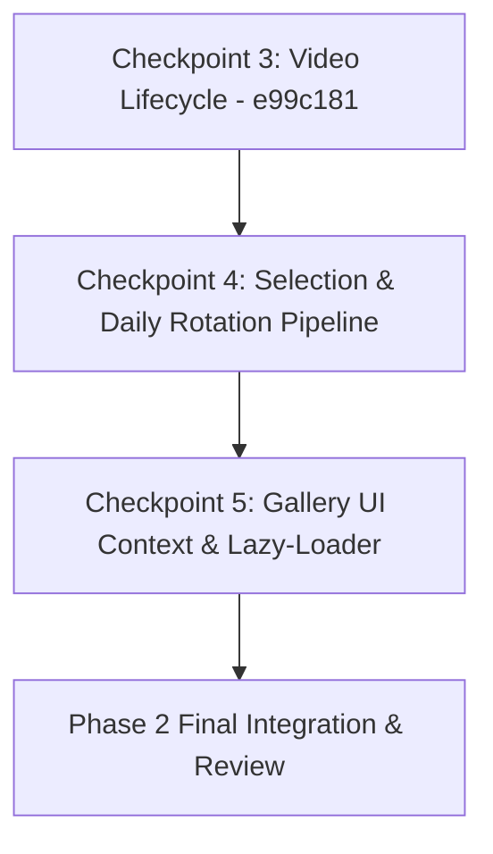

# Homebase Improvement Cycle #11 Phase 2 Remaining Wallpaper Audit
## Architecture Status, Remaining Functions, State Ownership & Next Checkpoints

> **Cycle ID**: Homebase Improvement Cycle #11 — Phase 2 Post-Checkpoint Audit  
> **Target Release**: Homebase v0.18.0  
> **Target Module**: `src/newtab/wallpaper/wallpaper-controller.js`  
> **Source Target**: `src/new-tab.js`  
> **Status**: Completed Audit & Checkpoint Planning (Zero Code Modified)  
> **Commits Integrated**:  
> - `379d22d` — Checkpoint 1: Skeleton, constants, state bridges, and pure helpers  
> - `b8c5ed4` — Checkpoint 2: Manifest & cache storage pipeline  
> - `e99c181` — Checkpoint 3: Video playback lifecycle, fallback poster & crossfade runtime  
> **Authority**: [AGENTS.md](file:///c:/Users/Administrator/Desktop/Homebase/AGENTS.md), [docs/66-cycle11-phase2-plan.md](file:///c:/Users/Administrator/Desktop/Homebase/docs/66-cycle11-phase2-plan.md), [docs/69-cycle11-phase2-extraction-order.md](file:///c:/Users/Administrator/Desktop/Homebase/docs/69-cycle11-phase2-extraction-order.md)

---

## 1. Executive Summary

Following the completion and local commit of Checkpoints 1 (`379d22d`), 2 (`b8c5ed4`), and 3 (`e99c181`), [`src/new-tab.js`](file:///c:/Users/Administrator/Desktop/Homebase/src/new-tab.js) has been reduced from **9,012 lines to 7,481 lines** (**-1,531 lines removed** across Cycle #11 Phase 2).

All core video playback, media crossfade, manifest caching, and asset storage logic now reside in [`src/newtab/wallpaper/wallpaper-controller.js`](file:///c:/Users/Administrator/Desktop/Homebase/src/newtab/wallpaper/wallpaper-controller.js) and are exposed via `window.HomebaseWallpaperController`.

This audit analyzes the remaining wallpaper-related responsibilities still located in `src/new-tab.js` to establish:
1. Exact list and line numbers of remaining wallpaper functions.
2. Remaining shared state variables and UI element references.
3. Strict classification of every element (Safe to extract / Requires manual browser verification / Should remain as orchestration).
4. Recommendation and decomposition for the next checkpoint(s).

---

## 2. Current Architecture Status

### A. Line Count Trajectory

| Checkpoint | Scope | `src/new-tab.js` Lines | Lines Removed | Module Line Count |
| :--- | :--- | :---: | :---: | :---: |
| **Baseline** | Before Phase 2 start | 9,012 | — | 0 |
| **Checkpoint 1** (`379d22d`) | Skeleton, constants, private state, pure helpers | 8,435 | -577 | 370 |
| **Checkpoint 2** (`b8c5ed4`) | Manifest & Cache Storage Pipeline | 8,204 | -231 | 751 |
| **Checkpoint 3** (`e99c181`) | Video Playback, Crossfade & Application | 7,481 | -723 | 1,444 |
| **Remaining** | Selection, Daily Rotation & Gallery UI Context | 7,481 | *(est. ~480)* | *(est. ~1,900)* |

---

## 3. Audit of Remaining Wallpaper Responsibilities in `src/new-tab.js`

### A. Remaining Wallpaper Functions

| # | Function | Location in `new-tab.js` | Lines | Description / Callers |
| :---: | :--- | :---: | :---: | :--- |
| **1** | `buildFallbackSelection(selectedAt)` | L576–L596 | 21 | Pure selection factory generating `{ id: 'fallback', videoUrl: 'assets/fallback.mp4', posterUrl: 'assets/fallback.webp', ... }`. Called by `primeWallpaperBackground`, `ensureDailyWallpaper`, `setWallpaperTypePreference`. |
| **2** | `rebuildCurrentSelectionFromGallery()` | L756–L769 | 14 | Reconstructs video and poster URLs for `currentWallpaperSelection` using `getGalleryUrlsOrNull()`. Called by `settings-ui.js` upon saving settings. |
| **3** | `pickNextWallpaper(manifest)` | L772–L832 | 61 | Shuffles manifest IDs, pulls next ID from pool via `getWallpaperPool()` / `setWallpaperPool()`, caches poster via `cacheAsset()`, and updates selection in storage. Called by `primeWallpaperBackground` and `ensureDailyWallpaper`. |
| **4** | `schedulePendingDailyRotationAttempt()` | L841–L908 | 68 | Schedules `DAILY_ROTATION_SEEN_DELAY_MS` (8s) timer to trigger `ensureDailyWallpaper(true)` when tab becomes active and rotation is due. |
| **5** | `ensureDailyWallpaper(forceNext = false)` | L911–L1090 | 180 | Core daily rotation orchestrator. Checks rotation state, validates day stamp change, picks next wallpaper, hydrates selection, respects battery optimization, applies wallpaper via `applyWallpaperByType()`, and schedules async video caching. |
| **6** | `loadWallpaperTypePreference()` | L7297–L7313 | 17 | Reads `getWallpaperTypePreferenceStorage()`, updates `wallpaperTypePreference`, and syncs DOM controls (`#gallery-wallpaper-type-toggle`, `#app-wallpaper-type-select`). |
| **7** | `loadCurrentWallpaperSelection()` | L7317–L7333 | 17 | Reads `getWallpaperSelection()` from storage and hydrates with cached object URLs. |
| **8** | `getWallpaperTypePreference()` | L7337–L7347 | 11 | Async getter ensuring preference is loaded from storage if null. |
| **9** | `setWallpaperTypePreference(type)` | L7351–L7396 | 46 | Sets preference, persists to storage, updates current selection if missing, hydrates, and calls `applyWallpaperByType(hydrated, next)`. |
| **10** | `ensureGalleryUi()` | L462–L474 | 13 | Dynamically lazy-loads `newtab/styles/gallery.css` and `newtab/wallpaper/gallery-ui.js`. |
| **11** | `createGalleryContext()` | L476–L532 | 57 | Prepares multi-method communication and storage bridge object passed to `HomebaseGallery.open()`. |
| **12** | `notifyGalleryUiLoadFailure(err)` | L534–L542 | 9 | Fallback error handler presenting custom alert if gallery fails to load. |
| **13** | `openWallpaperGallery(triggerSource)` | L544–L555 | 12 | Coordinates `ensureGalleryUi()` and opens the gallery modal with `createGalleryContext()`. |

---

### B. Remaining Wallpaper State Variables & DOM References

| Variable / Element | Location in `new-tab.js` | Current Scope | Usage & Cross-Script Readers/Writers |
| :--- | :---: | :--- | :--- |
| `dailyRotationPreference` | L1616 | Module top-level (`let`) | Read/written by `settings-ui.js`, `createGalleryContext()`, and `syncAppSettingsForm()`. Default: `true`. |
| `initialWallpaperState` | L1617 | Module top-level (`let`) | Snapshot `{ type, quality, daily }` initialized and checked in `settings-ui.js` to detect whether user changed wallpaper preferences. |
| `nextWallpaperBtn` | L1295 | DOM ref (`#dock-next-wallpaper-btn`) | Used by `dock-navigation.js` to trigger `ensureDailyWallpaper(true)`. |
| `wallpaperTypeToggle` | L1351 | DOM ref (`#gallery-wallpaper-type-toggle`) | Checkbox in gallery header for video/static toggle. Synced by `loadWallpaperTypePreference()` and `settings-ui.js`. |
| `wallpaperQualityToggle` | L1352 | DOM ref (`#gallery-wallpaper-quality-toggle`) | Checkbox in gallery header for high/low quality toggle. |
| `galleryDailyToggle` | L1354 | DOM ref (`#gallery-daily-toggle`) | Checkbox in gallery header for daily rotation toggle. |
| `appDailyToggle` | L1343 | DOM ref (`#app-daily-toggle`) | Toggle in settings modal. |
| `appWallpaperTypeSelect` | L1345 | DOM ref (`#app-wallpaper-type-select`) | Select in settings modal. |
| `appWallpaperQualitySelect` | L1347 | DOM ref (`#app-wallpaper-quality-select`) | Select in settings modal. |

---

### C. Remaining Orchestration Blocks (Startup & Visibility)

| Block | Location in `new-tab.js` | Lines | Description |
| :--- | :---: | :---: | :--- |
| `primeWallpaperBackground()` | L604–L675 | 72 | Immediate synchronous startup IIFE. Evaluates immediately when `new-tab.js` loads, checks rotation, loads fallback or cached poster, and sets document background before DOM ready. |
| `initializePage()` wallpaper startup | L6215–L6225 | 11 | Calls `getWallpaperTypePreference()`, records startup perf, calls `waitForWallpaperReady(currentWallpaperSelection, type)`. |
| `initializePage()` gallery warmup | L6274–L6278 | 5 | Schedules idle task `warmGalleryPosterHydration()`. |
| `initializePage()` idle rotation | L6556–L6558 | 3 | Schedules idle task `ensureDailyWallpaper().catch(() => {})`. |
| `visibilitychange` listener | L7400–L7440 | 41 | Pauses videos on tab hidden; resumes playback on tab visible and refocuses `#search-input`. |

---

## 4. Responsibility Classification

### Category 1: Safe to Extract
*Logic that has zero direct hardware/media playback coupling and can be fully verified with static checks, syntax checks, and automated unit tests.*

1. **`buildFallbackSelection(selectedAt)`**: Pure object factory.
2. **`rebuildCurrentSelectionFromGallery()`**: Pure URL mapper using existing controller helpers.
3. **`pickNextWallpaper(manifest)`**: Storage-backed shuffle algorithm and asset cache prefetcher.
4. **`schedulePendingDailyRotationAttempt()`**: Lightweight timer scheduling.
5. **`loadWallpaperTypePreference()`**: Storage reader and DOM input value sync.
6. **`loadCurrentWallpaperSelection()`**: Storage reader and object URL hydration.
7. **`getWallpaperTypePreference()`**: Async getter.
8. **`ensureGalleryUi()`**: Dynamic script/style loader.
9. **`notifyGalleryUiLoadFailure(err)`**: Error alert presenter.

---

### Category 2: Requires Manual Browser Verification
*Logic that interacts with visible screen rendering, DOM modal lifecycles, user interactions, or media transitions.*

1. **`ensureDailyWallpaper(forceNext)`**:
   - Directly executes wallpaper changes, updates storage, and calls `applyWallpaperByType()`.
   - Driven by user clicking the dock "Next wallpaper" button.
   - **Verification Required**: Test dock button click, rotation debounce, day stamp comparison, and visual transition to next wallpaper.
2. **`setWallpaperTypePreference(type)`**:
   - Toggles between video and static modes.
   - Immediately re-hydrates and re-applies current wallpaper, altering DOM video tags.
   - **Verification Required**: Test switching from video to static and back in settings; verify video stops/starts correctly.
3. **`createGalleryContext()` & `openWallpaperGallery(triggerSource)`**:
   - Bridges 30+ methods to the dynamically injected `gallery-ui.js`.
   - Opens full-screen gallery modal.
   - **Verification Required**: Click dock gallery button; verify modal opens, cards render, favorites toggle, and applying a wallpaper from gallery works without errors.

---

### Category 3: Should Remain in `src/new-tab.js` as Orchestration
*Core dashboard startup orchestration, synchronous startup guards, or multi-domain coordination that MUST NOT move.*

1. **`primeWallpaperBackground()` (L604–L675)**:
   - Synchronous IIFE executing instantly at script parse time to prevent blank white flash before DOMContentLoaded.
   - **Decision**: Remains in `src/new-tab.js`. Will call `HomebaseWallpaperController` methods (`pickNextWallpaper`, `hydrateWallpaperSelection`, `setWallpaperFallbackPoster`, `applyWallpaperBackground`).
2. **`initializePage()` Startup Sequence (L6215–L6225, L6274–L6278, L6556–L6558)**:
   - Coordinates critical startup phases, parallel storage promises, ready flip, and idle hydration.
   - **Decision**: Remains in `src/new-tab.js`. Calls `HomebaseWallpaperController.getWallpaperTypePreference()`, `HomebaseWallpaperController.waitForWallpaperReady()`, etc.
3. **`visibilitychange` Event Listener (L7400–L7440)**:
   - Pauses/resumes background videos in tandem with `#search-input` focus and modal guards.
   - **Decision**: Remains in `src/new-tab.js`.
4. **DOM Element Constants (`nextWallpaperBtn`, `wallpaperTypeToggle`, `appDailyToggle`, etc.)**:
   - Remain in `new-tab.js` with DOM references passed or queried on demand by controller methods.

---

## 5. Proposed Breakdown for Next Checkpoint(s)

To maintain stability and adhere to the owner's incremental workflow, the remaining extraction is divided into two distinct checkpoints:

### Checkpoint 4: Selection Resolution, Preference Management & Daily Rotation Runtime
**Target**: Extract selection resolution, preference storage sync, and the daily rotation engine into `wallpaper-controller.js`.

- **Functions to Move**:
  1. `buildFallbackSelection(selectedAt)`
  2. `rebuildCurrentSelectionFromGallery()`
  3. `pickNextWallpaper(manifest)`
  4. `schedulePendingDailyRotationAttempt()`
  5. `loadWallpaperTypePreference()`
  6. `loadCurrentWallpaperSelection()`
  7. `getWallpaperTypePreference()`
  8. `setWallpaperTypePreference(type)`
  9. `ensureDailyWallpaper(forceNext)`
- **State to Bridge**:
  - `dailyRotationPreference` (add getter/setter and `window` bridge)
- **Wrappers in `src/new-tab.js`**:
  - Keep backward-compatibility aliases on `window` and lightweight wrappers where callers (`primeWallpaperBackground`, `settings-ui.js`, `dock-navigation.js`) require them.
- **Estimated Line Reduction in `src/new-tab.js`**: ~380 lines (bringing `new-tab.js` to ~7,100 lines).
- **Manual Browser Verification**: **REQUIRED** (dock next wallpaper button, daily rotation trigger, video/static mode toggle).

### Checkpoint 5: Gallery UI Lifecycle & Context Integration
**Target**: Extract gallery lazy-loading and context construction into `wallpaper-controller.js`.

- **Functions to Move**:
  1. `ensureGalleryUi()`
  2. `notifyGalleryUiLoadFailure(err)`
  3. `createGalleryContext()`
  4. `openWallpaperGallery(triggerSource)`
- **Wrappers in `src/new-tab.js`**:
  - Expose `window.openWallpaperGallery` and `window.createGalleryContext` for dock and settings callers.
- **Estimated Line Reduction in `src/new-tab.js`**: ~100 lines (bringing `new-tab.js` to ~7,000 lines).
- **Manual Browser Verification**: **REQUIRED** (click dock gallery button, verify modal opening and thumbnail rendering).

---

## 6. Recommendation for Next Step

**Proceed with Checkpoint 4 (Selection Resolution, Preference Management & Daily Rotation Pipeline).**

### Why Checkpoint 4 First:
1. Completes the autonomous wallpaper engine: manifest + cache (CP2) -> video playback (CP3) -> selection & rotation (CP4).
2. Allows `primeWallpaperBackground()` in `src/new-tab.js` to cleanly call all selection and rotation functions directly from `HomebaseWallpaperController`.
3. Isolates all daily rotation, timer, and preference persistence logic before extracting the UI gallery modal layer (CP5).

---

*Audit complete. Zero code modified. No commits or pushes performed. Awaiting owner review and decision on proceeding with Checkpoint 4.*
