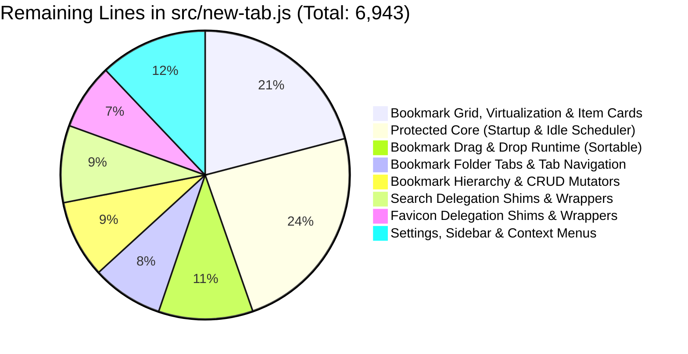
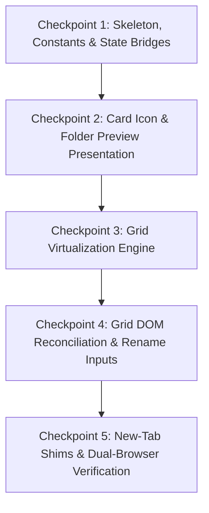

# Homebase Improvement Cycle #11 Phase 3 — Architecture Audit

> **Cycle ID**: Homebase Improvement Cycle #11 — Phase 3 Architecture Audit  
> **Target Release**: Homebase v0.18.0  
> **Baseline Commit**: `dbcbaa9` ("Extract wallpaper gallery UI context and lazy loader")  
> **Remote Status**: Synchronized with `origin/development` (`dbcbaa91dd5cad4c54cc5409de43c46753c9091e`)  
> **Authority**: [AGENTS.md](file:///c:/Users/Administrator/Desktop/Homebase/AGENTS.md), [docs/64-cycle11-plan.md](file:///c:/Users/Administrator/Desktop/Homebase/docs/64-cycle11-plan.md), [docs/74-cycle11-phase2-completion-report.md](file:///c:/Users/Administrator/Desktop/Homebase/docs/74-cycle11-phase2-completion-report.md)

---

## 1. Executive Summary & Repository Snapshot

Phase 2 of Cycle #11 accomplished a major architectural breakthrough by completely decomposing the wallpaper subsystem out of [src/new-tab.js](file:///c:/Users/Administrator/Desktop/Homebase/src/new-tab.js) into [src/newtab/wallpaper/wallpaper-controller.js](file:///c:/Users/Administrator/Desktop/Homebase/src/newtab/wallpaper/wallpaper-controller.js). Across five carefully sequenced checkpoints, `src/new-tab.js` was reduced by **-2,070 lines (-23.0%)** without breaking backward compatibility or introducing bundlers.

### Current Baseline Metrics

| Metric | Phase 1 Baseline | Phase 2 Conclusion | Net Change |
|---|:---:|:---:|:---:|
| **`src/new-tab.js` Line Count** | 9,012 lines | **6,943 lines** | **-2,069 lines (-23.0%)** |
| **`src/new-tab.js` Function Count** | 234 functions | **182 functions** | **-52 functions (-22.2%)** |
| **Extracted Wallpaper Module** | 0 lines | **1,936 lines** | +1,936 lines |
| **Deferred Local Scripts** | 52 scripts | **53 scripts** | +1 script |
| **Dynamic Top-Level Declarations** | 1,077 declarations | **1,077 declarations** | 0 collisions |
| **Unit Test Suite (`npm test`)** | 330 passing | **337 passing** | +7 tests |
| **Browser Runtime Compatibility** | Headless skip | **Chrome 147 & Firefox 156 Verified** | 0 console errors |

The working tree is completely clean and synchronized with `origin/development`.

---

## 2. Quantitative Analysis of Remaining `src/new-tab.js`

A detailed structural analysis of the remaining 6,943 lines of `src/new-tab.js` reveals the following breakdown:

- **Total Lines**: 6,943 lines (LF)
- **Empty / Whitespace Lines**: 2,583 lines (37.2%)
- **Comment Lines**: 308 lines (4.4%)
- **Executable Code Lines**: 4,052 lines (58.4%)
- **Top-Level Declared Functions**: 182 functions

### Top 25 Largest Remaining Functions in `src/new-tab.js`

| Rank | Function Name | Line Range | Line Span | Primary Responsibility |
|:---:|---|:---:|:---:|---|
| 1 | `initializePage` | L5765–L6450 | **686 lines** | Master startup orchestration, settings hydration, DOM wiring |
| 2 | `createFolderTabs` | L4157–L4604 | **448 lines** | Folder tab DOM generation, active state tracking, scroll triggers |
| 3 | `renderBookmarkIconInto` | L2335–L2569 | **235 lines** | Card icon rendering & favicon fallback pipeline integration |
| 4 | `showGridItemRenameInput` | L3927–L4092 | **166 lines** | Inline rename input creation, keyboard handlers, validation |
| 5 | `renderBookmarkGrid` | L3474–L3621 | **148 lines** | Grid container reconciliation, virtualization pass, DOM diffing |
| 6 | `deleteBookmarkOrFolder` | L2709–L2837 | **129 lines** | Recursive deletion confirmation, storage mutation, undo stack |
| 7 | `processIdleTasks` | L113–L235 | **123 lines** | Priority idle task scheduler queue processor |
| 8 | `handleGridDrop` | L1911–L2033 | **123 lines** | Sortable drop handler for bookmark grid items |
| 9 | `handleTabDrop` | L2139–L2259 | **121 lines** | Sortable drop handler for bookmark folder tabs |
| 10 | `updateVirtualGrid` | L3078–L3195 | **118 lines** | Virtualization viewport windowing and element pooling |
| 11 | `renderFolderIconInto` | L2571–L2680 | **110 lines** | Folder preview card icon generation (mini 2x2 grid) |
| 12 | `showEditInput` | L3817–L3915 | **99 lines** | Inline URL / Title editing modal trigger |
| 13 | `handleGridMove` | L1702–L1798 | **97 lines** | Sortable move validator and drop target highlighting |
| 14 | `scheduleIdleChunkedTask` | L284–L376 | **93 lines** | Generator-style chunked work scheduler yielding to main thread |
| 15 | `setupGridSortable` | L1606–L1688 | **83 lines** | Vendor Sortable.js initialization on bookmark grid |
| 16 | `loadBookmarks` | L4714–L4796 | **83 lines** | Bookmark data fetching and cache hydration |
| 17 | `setupTabsSortable` | L2051–L2127 | **77 lines** | Vendor Sortable.js initialization on folder tabs bar |
| 18 | `handleGridDragPointerMove` | L1802–L1870 | **69 lines** | Edge scrolling during drag operations |
| 19 | `initVirtualizer` | L3358–L3418 | **61 lines** | Viewport virtualizer state and resize observer initialization |
| 20 | `applyPerformanceModeState` | L4963–L5014 | **52 lines** | Global performance toggle dispatcher |
| 21 | `setupBookmarkFolderAddTooltip`| L4106–L4155 | **50 lines** | Folder tab tooltip initialization |
| 22 | `setupHomebaseRootListeners` | L4836–L4885 | **50 lines** | `chrome.bookmarks` change listener bindings |
| 23 | `setupSearch` | L5373–L5422 | **50 lines** | Search input listeners & debounce setup |
| 24 | `updateSidebarCollapseState` | L571–L619 | **49 lines** | Sidebar expand/collapse animation coordinator |
| 25 | `createNewBookmarkFolder` | L3631–L3677 | **47 lines** | Bookmark folder creation & tree insertion |

---

## 3. Domain Map of `src/new-tab.js`

The remaining code in `src/new-tab.js` clusters into **eight major functional domains**:

### Detailed Domain Matrix

| Domain | Line Range | Lines | Functions Involved | Dependencies | Shared State | Runtime Risk |
|---|:---:|:---:|---|---|---|:---:|
| **1. Protected Core & Idle Scheduler** | L1–L460, L5757–L6450 | **1,647** | `runWhenIdle`, `processIdleTasks`, `scheduleIdleTask`, `scheduleIdleChunkedTask`, `initializePage` | Core DOM, requestIdleCallback, perf marks | Global startup queues, perf markers | **CRITICAL** (Protected by `AGENTS.md`) |
| **2. Bookmark Grid & Virtualization** | L2335–L2708, L3078–L3625, L3626–L4156 | **1,453** | `renderBookmarkIconInto`, `renderFolderIconInto`, `renderBookmark`, `updateVirtualGrid`, `renderBookmarkGrid`, `initVirtualizer`, `disableVirtualizer`, `createNodeForVirtualizer`, `patchActiveGridMetadataItems`, `showEditInput`, `showGridItemRenameInput` | `HomebaseFaviconPipeline`, `HomebaseBookmarkStorage`, DOM `#bookmarks-grid` | `virtualizerState`, `currentFolderId`, DOM pools | **HIGH** (Primary visual surface) |
| **3. Bookmark Drag & Drop Runtime** | L1601–L2334 | **734** | `setupGridSortable`, `handleGridMove`, `handleGridDragPointerMove`, `clearTabDropHighlight`, `moveItemInLocalTree`, `handleGridDrop`, `setupTabsSortable`, `handleTabDrop` | `Sortable.min.js`, `#bookmarks-grid`, `#bookmark-folder-tabs` | `isGridDragging`, `gridSortable`, `tabsSortable` | **VERY HIGH** (Pointer events, visual reorder) |
| **4. Bookmark Folder Tabs Bar** | L4157–L4710 | **554** | `createFolderTabs` (448 lines), `processBookmarks`, `loadBookmarkMetadata`, `loadFolderMetadata`, `loadLastUsedFolderId`, `setLastUsedFolderId` | `bookmark-tabs-scroll.js`, `#bookmark-folder-tabs`, storage | `currentFolderId`, `folderPathHistory` | **MEDIUM** (Navigation, tab scrolling) |
| **5. Bookmark Tree Hierarchy & CRUD** | L1365–L1600, L2709–L3077 | **605** | `getBookmarkTree`, `ensureFolder`, `ensureBookmark`, `findChildFolderByTitle`, `deleteBookmarkOrFolder`, `findBookmarkNodeById`, `updateNodeInTree` | `chrome.bookmarks` / `browser.bookmarks`, `HomebaseBookmarkStorage` | In-memory bookmark tree cache | **MEDIUM-HIGH** (Data integrity) |
| **6. Search Shims & Forwarding Stubs** | L5083–L5682 | **600** | ~50 forwarding wrappers: `setupSearch`, `renderSearchEngineSelector`, `executeSearch`, `handleSearchInput`, `fetchSearchSuggestions`, `applySearchEngineConfig` | `HomebaseSearchUiController`, `HomebaseSearchInteractionController` | `searchEngines`, `currentSearchEngine` | **LOW** (Forwarding facades) |
| **7. Favicon Shims & Forwarding Stubs** | L736–L1247 | **512** | ~27 forwarding wrappers: `setFaviconResolved`, `getFaviconResolvedEntry`, `enqueueFaviconTask`, `loadFaviconObjectUrlIntoImage` | `HomebaseFaviconPipeline` | Global cache stubs | **LOW** (Forwarding facades) |
| **8. Settings, Sidebar & Context Menus** | L461–L735, L4888–L5082, L6451–L6943 | **838** | `updateSidebarCollapseState`, `applyPerformanceModeState`, `openFolderFromContext`, `openBookmarkInNewTab` | `HomebaseContextMenuController`, `HomebaseDialogController` | Sidebar state, context menu targets | **LOW-MEDIUM** (Context triggers) |

---

## 4. Evaluation and Ranking of Extraction Candidates

To ensure safe, high-impact progression, candidates are evaluated across six architectural criteria:
1. **Line Reduction Potential**: Direct reduction in `src/new-tab.js` line count.
2. **Coupling Complexity**: Entanglement with other remaining sub-systems.
3. **Regression Risk**: Likelihood of breaking existing user flows.
4. **Browser API Dependency**: Exposure to browser-specific quirks (`chrome.*` vs `browser.*`).
5. **Test Coverage**: Existing unit test and static check capability.
6. **Manual Verification Burden**: Requirement for interactive browser testing.

### Candidate Comparison Matrix

| Candidate | Line Potential | Coupling | Risk | API Dependency | Test Coverage | Verification Burden | Overall Rank |
|---|:---:|:---:|:---:|:---:|:---:|:---:|:---:|
| **Candidate A: Bookmark Grid Rendering & Virtualization** | **~1,450 lines** | Medium | High | Low (DOM, Layout) | Medium | Visual pass required | **#1 (Recommended for Phase 3)** |
| **Candidate B: Bookmark Folder Tabs & Tab Navigation** | **~550 lines** | Medium | Medium | Low (`chrome.storage`) | Medium | Tab click pass | **#2 (Candidate for Phase 4A)** |
| **Candidate C: Bookmark Drag & Drop (Sortable)** | **~730 lines** | Very High | Very High | Low (Sortable, DOM) | Low | Complex manual drag pass | **#3 (Candidate for Phase 4B)** |
| **Candidate D: Search Delegation Cleanup** | **~450 lines** | Low | Low | Zero (Already modular) | High | Automated | **#4 (Candidate for Phase 5)** |
| **Candidate E: Favicon Shims Cleanup** | **~300 lines** | Low | Low | Zero (Already modular) | High | Automated | **#5 (Candidate for Phase 5)** |
| **Startup Orchestration (`initializePage`)** | ~1,650 lines | Critical | Extreme | High (Extension lifecycle) | High | Full release pass | **DO NOT EXTRACT (Protected)** |

---

## 5. Architectural Recommendation for Cycle #11 Phase 3

### Target: **Bookmark Grid Rendering, Virtualization, and Item Presentation Runtime**

#### Why Candidate A is the Optimal Next Target:
1. **Dominant Monolith Volume**:
   The Bookmark Subsystem accounts for **52.4%** of the entire remaining monolith. Extracting Grid Rendering & Virtualization eliminates **~1,450 lines** in one cohesive phase, driving `src/new-tab.js` below **5,500 lines**.
2. **Clean Architectural Abstraction**:
   Grid rendering has a well-defined boundary: it takes an array of bookmark nodes (from storage or memory tree) and mounts them into the DOM (`#bookmarks-grid`).
   - Input: Bookmark data items, folder ID, search query filter.
   - Output: Virtualized DOM row/card elements, icon hydration calls to `window.HomebaseFaviconPipeline`.
3. **Decoupling Sortable.js**:
   By extracting Grid Rendering first, Sortable.js drag-and-drop can be cleanly attached via lifecycle hooks (`onGridRendered`) rather than being intertwined with grid DOM creation.
4. **Preserved Invariants**:
   - `Sortable.min.js` remains untouched in `src/assets/js/`.
   - `src/new-tab.js` preserves top-level startup orchestration and event binding.
   - Script order remains classic `<script defer>`.

---

## 6. Proposed Cycle #11 Phase 3 Plan

### Target Module
- **File**: `src/newtab/bookmarks/bookmark-grid-controller.js`
- **Global Controller**: `window.HomebaseBookmarkGridController`
- **Script Order**: Load before `src/new-tab.js`, after `bookmark-storage.js` and `Sortable.min.js`.

### Incremental Checkpoint Breakdown

#### Checkpoint 1: Skeleton, Constants, and State Bridges
- Create `src/newtab/bookmarks/bookmark-grid-controller.js`.
- Register script in `src/new-tab.html`.
- Move pure constants: grid item dimension ratios, virtualization buffer rows, default colors.
- Establish state bridges for `virtualizerState`, `currentFolderId`.
- Automated validation: `check-newtab-static.mjs` (0 collisions), `npm test`.

#### Checkpoint 2: Card Icon & Folder Preview Presentation Engine
- Move `renderBookmarkIconInto(container, bookmark, ...)` (235 lines).
- Move `renderFolderIconInto(container, folder, ...)` (110 lines).
- Move `renderBookmark(node)` (29 lines).
- Wire icon hydration with `window.HomebaseFaviconPipeline`.
- Retain delegation wrappers in `src/new-tab.js`.

#### Checkpoint 3: Grid Virtualization Engine
- Move `initVirtualizer()`, `disableVirtualizer()`.
- Move `updateVirtualGrid(itemsToRender, options)`.
- Move `createNodeForVirtualizer()`, `getIconKeyForNode()`, `updateElementData()`.
- Move element pooling and visible viewport calculation logic.

#### Checkpoint 4: Grid DOM Reconciliation & In-Grid Input Handling
- Move `renderBookmarkGrid(itemsToRender, options)` (148 lines).
- Move `patchActiveGridMetadataItems()`, `findRenderedGridItemById()`.
- Move `showEditInput()`, `showGridItemRenameInput()`.
- Expose hooks for Sortable re-attachment (`setupGridSortable`).

#### Checkpoint 5: Startup Facades & Dual-Browser Manual Verification
- Replace extracted functions in `src/new-tab.js` with thin delegation facades to `HomebaseBookmarkGridController`.
- Verify 0 duplicate declarations via `check-newtab-static.mjs`.
- Run full unit tests (`npm test`).
- Execute real browser manual verification (Chrome unpacked & Firefox temporary extension).
- Ensure 0 console errors, 0 layout regressions, and smooth scrolling.

---

## 7. Rules & Guardrails for Phase 3

In strict adherence to [AGENTS.md](file:///c:/Users/Administrator/Desktop/Homebase/AGENTS.md):
- **DO NOT** convert files to ES modules.
- **DO NOT** introduce bundlers or build steps.
- **DO NOT** add new external dependencies.
- **DO NOT** modify `initializePage`, idle scheduler, or startup wrappers in `src/new-tab.js`.
- **DO NOT** modify protected files: `src/preload.js`, `src/instant_load.js`, `manifests/`, `dist/`.
- Ensure all moved declarations are removed from `src/new-tab.js` to prevent global lexical scope collisions.
- Execute automated AST static check before and after every commit.

---

## 8. Status & Approval Request

Phase 3 Architecture Audit is **COMPLETE**.

No source code has been modified. No files have been staged or committed.

Awaiting owner review and explicit approval of the Phase 3 Architecture Plan before proceeding to implementation.
