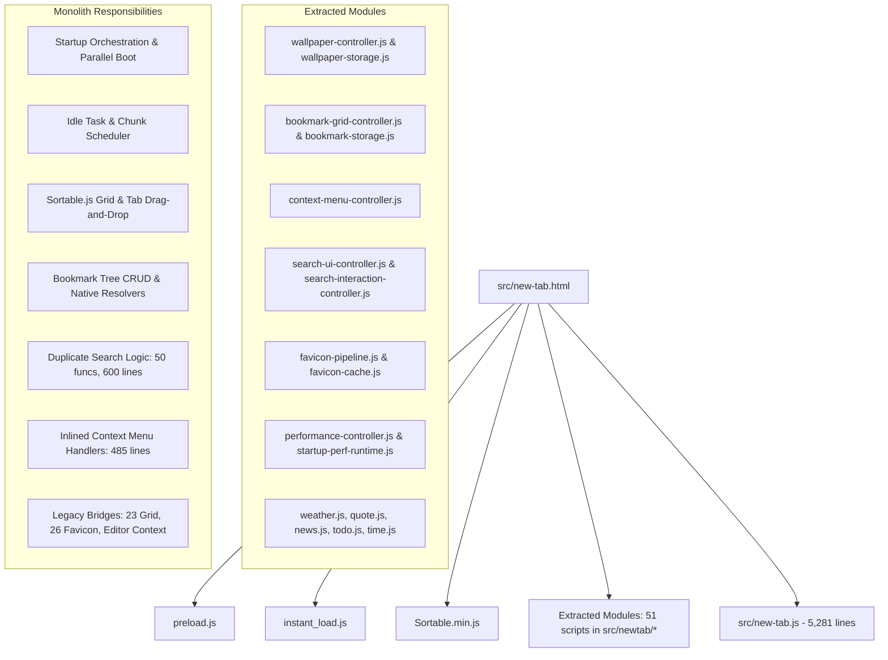
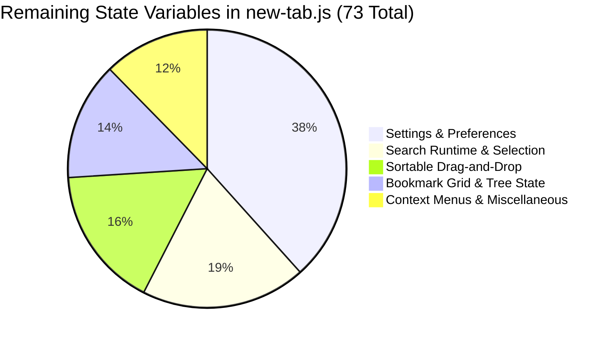
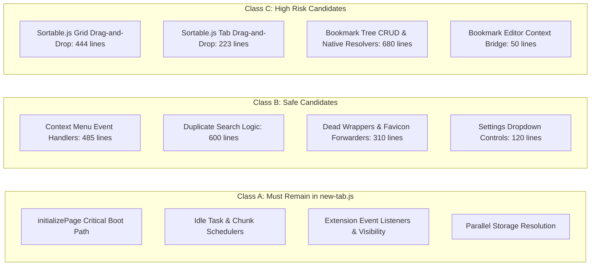
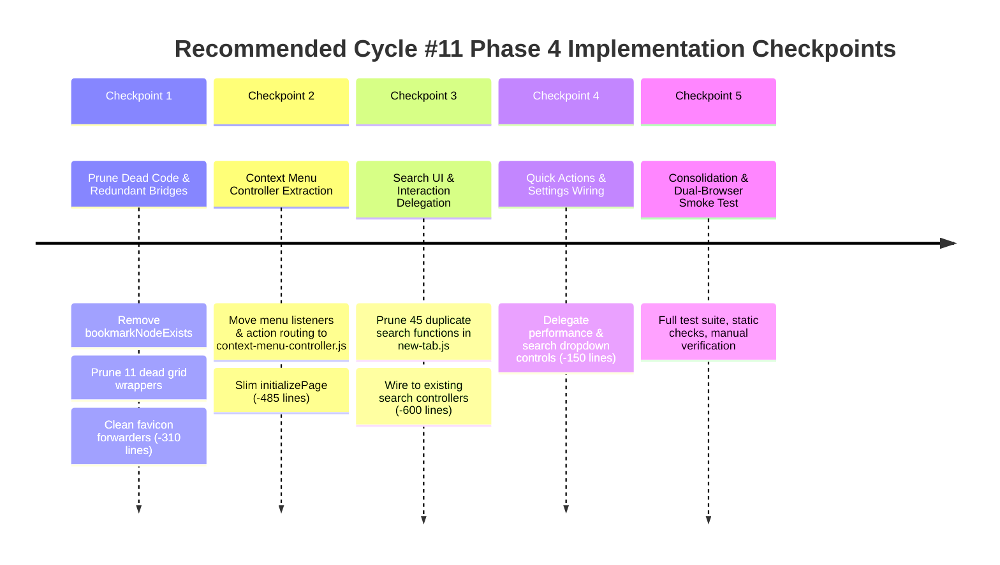

# Homebase Improvement Cycle #11 Phase 4 — Architecture Audit

> **Cycle ID**: Homebase Improvement Cycle #11 — Phase 4 Architecture Audit  
> **Target Release**: Homebase v0.19.0  
> **Baseline Commit**: `2b43637` ("Finalize bookmark grid checkpoint documentation")  
> **Remote Status**: Synchronized with `origin/development` (`2b43637`)  
> **Authority**: [AGENTS.md](file:///c:/Users/Administrator/Desktop/Homebase/AGENTS.md), [docs/64-cycle11-plan.md](file:///c:/Users/Administrator/Desktop/Homebase/docs/64-cycle11-plan.md), [docs/85-cycle11-phase3-checkpoint5-report.md](file:///c:/Users/Administrator/Desktop/Homebase/docs/85-cycle11-phase3-checkpoint5-report.md)

---

## Executive Summary & Progression Baseline

Homebase Improvement Cycle #11 has systematically transformed the monolithic new-tab architecture through phased, zero-regression modular extractions:
1. **Cycle #11 Phase 2 (Wallpaper Controller)**: Decomposed the entire wallpaper subsystem (video playback, canvas postering, daily rotation, manifest caching, and gallery UI context) out of [src/new-tab.js](file:///c:/Users/Administrator/Desktop/Homebase/src/new-tab.js) into [src/newtab/wallpaper/wallpaper-controller.js](file:///c:/Users/Administrator/Desktop/Homebase/src/newtab/wallpaper/wallpaper-controller.js).
2. **Cycle #11 Phase 3 (Bookmark Grid Controller)**: Decomposed bookmark rendering, folder card presentation, grid virtualization, DOM reconciliation, inline item renaming, and folder tabs navigation runtime into [src/newtab/bookmarks/bookmark-grid-controller.js](file:///c:/Users/Administrator/Desktop/Homebase/src/newtab/bookmarks/bookmark-grid-controller.js).

Across Phases 2 and 3, [src/new-tab.js](file:///c:/Users/Administrator/Desktop/Homebase/src/new-tab.js) was reduced from **9,012 lines down to 5,281 lines** — an aggregate reduction of **-3,731 lines (-41.4%)**, while maintaining 100% compatibility across Chrome and Firefox without bundling or ES module breakage.

### Line Count Progression

| Milestone | Total Lines | Executable Lines | Blank / Comment | Net Delta | Cumulative % Reduction |
|---|:---:|:---:|:---:|:---:|:---:|
| **Pre-Cycle #11 Baseline** | 9,012 | ~5,620 | ~3,392 | Baseline | Baseline |
| **Post-Phase 2 (Wallpaper)** | 6,942 | ~4,260 | ~2,682 | -2,070 lines | -23.0% |
| **Post-Phase 3 (Bookmark Grid)** | **5,281** | **3,136** | **2,145** | **-1,661 lines** | **-41.4%** |

---

## Current Architecture

Homebase operates as a dual-browser extension loaded via classic deferred scripts (`<script defer>`) sharing the global execution context. All modules execute in strict load order defined in [src/new-tab.html](file:///c:/Users/Administrator/Desktop/Homebase/src/new-tab.html), where [src/new-tab.js](file:///c:/Users/Administrator/Desktop/Homebase/src/new-tab.js) is the 55th and final script executed.

---

## Remaining new-tab.js Domains

A comprehensive structural audit of [src/new-tab.js](file:///c:/Users/Administrator/Desktop/Homebase/src/new-tab.js) reveals 15 functional segments spanning 5,281 lines:

| Domain Index | Segment Description | Line Range | Total Lines | Executable | Blank / Comment | Status / Extraction Potential |
|:---:|---|:---:|:---:|:---:|:---:|---|
| **1** | Core Elements, Fast Mirrors & Idle Task Scheduler | L1–461 | 461 | 255 | 206 | **Must Remain** (Startup orchestration & idle queue) |
| **2** | Wallpaper Gallery UI Lifecycle & Sidebar State | L462–622 | 161 | 61 | 100 | **Mixed** (Sidebar state remains; background prime IIFE is startup) |
| **3** | Video Manifest Legacy Comments & Tab Scroll Listeners | L623–735 | 113 | 35 | 78 | **Mixed** (Tab scroll wiring remains; dead comments can be pruned) |
| **4** | Favicon Cache Wrappers & Legacy Bridges | L736–1230 | 495 | 292 | 203 | **Safe Candidate** (26 forwarders to `HomebaseFaviconPipeline`) |
| **5** | Bookmark Editor Lazy Loading & Context Bridge | L1231–1352 | 122 | 102 | 20 | **High Risk Bridge** (Orchestrates editor modal context) |
| **6** | Bookmark Tree Resolvers & Root Folder Discovery | L1353–1582 | 230 | 181 | 49 | **Safe/Moderate Candidate** (`BookmarkTreeService`) |
| **7** | Grid Drag-and-Drop Handlers (Sortable.js) | L1583–2026 | 444 | 232 | 212 | **High Risk** (Touch drag events, DOM reorder animation) |
| **8** | Tab Drag-and-Drop Handlers (Sortable.js) | L2027–2249 | 223 | 82 | 141 | **High Risk** (Tab reordering, active tab drop target) |
| **9** | Bookmark CRUD, Tree Mutations, Storage & Root Listeners | L2250–3225 | 976 | 611 | 365 | **Mixed** (23 legacy grid bridges are safe; native CRUD is moderate) |
| **10** | Quick Actions Bar & Settings Dropdown Wiring | L3226–3420 | 195 | 144 | 51 | **Safe Candidate** (Performance & search engine selectors) |
| **11** | Search Bar Wiring, Engine Selector & Suggestions | L3421–4020 | 600 | 417 | 183 | **Safe Candidate** (Duplicate logic: 45/50 funcs exist in search controllers) |
| **12** | Dock Navigation & Firefox Container Multi-Open | L4021–4086 | 66 | 17 | 49 | **Mixed** (`openFolderAll` is native container logic) |
| **13** | Startup Orchestration (`initializePage` Critical Boot) | L4087–4461 | 375 | 311 | 64 | **Must Remain** (Extension boot sequence & parallel loading) |
| **14** | Inlined Context Menus (Bookmarks, Tabs, Folders, Grid) | L4462–4946 | 485 | 295 | 190 | **Safe Candidate** (Inlined inside `initializePage`, duplicates `ContextMenuController`) |
| **15** | Global Storage Changes, Window Lifecycle & Tail Handlers | L4947–5281 | 335 | 98 | 237 | **Must Remain** (Storage event listener, visibilitychange, window load) |

---

## Function Size Analysis

[src/new-tab.js](file:///c:/Users/Administrator/Desktop/Homebase/src/new-tab.js) currently contains **184 top-level functions** (including top-level arrow assignments) and **13 inner helper functions** directly declared inside `initializePage()`.

### Top 25 Largest Functions by Line Count

| Rank | Function Name | Line Range | Line Count | Domain / Purpose | Classification |
|:---:|---|:---:|:---:|---|---|
| **1** | `initializePage` | L4104–4946 | **843 lines** | Master startup orchestration & inlined context menus | **Must Remain** (core) / **Safe** (inlined menus) |
| **2** | `deleteBookmarkOrFolder` | L2330–2458 | **129 lines** | Native recursive bookmark deletion & UI prompt | Safe Candidate (`BookmarkTreeService`) |
| **3** | `processIdleTasks` | L113–235 | **123 lines** | Startup idle queue processing engine | **Must Remain** |
| **4** | `handleGridDrop` | L1899–2021 | **123 lines** | Sortable.js grid drop reconciliation & tree move | High Risk Candidate |
| **5** | `handleTabDrop` | L2127–2247 | **121 lines** | Sortable.js tab drop reconciliation & native move | High Risk Candidate |
| **6** | `handleGridMove` | L1690–1786 | **97 lines** | Sortable.js move validation & folder hover timing | High Risk Candidate |
| **7** | `scheduleIdleChunkedTask` | L284–376 | **93 lines** | Chunked background task scheduler | **Must Remain** |
| **8** | `setupGridSortable` | L1594–1676 | **83 lines** | Sortable.js initialization on bookmarks grid | High Risk Candidate |
| **9** | `loadBookmarks` | L3052–3134 | **83 lines** | Root discovery, tree loading & initial render dispatch | High Risk Candidate (Startup timing) |
| **10** | `setupTabsSortable` | L2039–2115 | **77 lines** | Sortable.js initialization on folder tabs | High Risk Candidate |
| **11** | `handleGridDragPointerMove`| L1790–1858 | **69 lines** | Throttled pointer tracking over tabs during drag | High Risk Candidate |
| **12** | `applyPerformanceModeState`| L3301–3352 | **52 lines** | Toggles glass, animations, and virtualizer runtime | Safe Candidate (`PerformanceController`) |
| **13** | `setupHomebaseRootListeners`| L3174–3223 | **50 lines** | Native bookmarks event listener setup | High Risk Candidate |
| **14** | `setupSearch` | L3711–3760 | **50 lines** | Search input & form event attachment | Safe Candidate (`SearchUiController`) |
| **15** | `updateSidebarCollapseState`| L571–619 | **49 lines** | Responsive sidebar collapse & layout sync | Safe Candidate |
| **16** | `createBookmarkEditorContext`| L1250–1298 | **49 lines** | Context bridge passed to lazy `bookmark-editor.js` | High Risk Candidate (Cross-controller bridge) |
| **17** | `scheduleIdleTask` | L238–282 | **45 lines** | RequestIdleCallback fallback scheduler | **Must Remain** |
| **18** | `createNewBookmarkFolder` | L2699–2743 | **45 lines** | Native folder creation & UI tab sync | Safe Candidate (`BookmarkTreeService`) |
| **19** | `handlePasteBookmark` | L2766–2809 | **44 lines** | Clipboard URL parsing & bookmark insertion | Safe Candidate (`BookmarkTreeService`) |
| **20** | `populateDefaultEngineSelectControl` | L3355–3397 | **43 lines** | Settings dropdown options builder | Safe Candidate (`SearchEngineSettings`) |
| **21** | `getBookmarkTree` | L1515–1555 | **41 lines** | Native bookmark tree query with caching | Safe Candidate (`BookmarkTreeService`) |
| **22** | `createHomebaseFolder` | L3006–3044 | **39 lines** | Fallback Homebase root folder creation | Safe Candidate (`BookmarkTreeService`) |
| **23** | `openFolderAll` | L4045–4083 | **39 lines** | Native tab creation for all folder children | High Risk Candidate (Browser API lifecycle) |
| **24** | `loadStylesheetOnce` | L408–441 | **34 lines** | Dynamic CSS link injector | Safe Candidate (`Utils`) |
| **25** | `setupHomebaseRootControls`| L3140–3172 | **33 lines** | Settings button visibility & folder picker hook | Safe Candidate |

---

## State Ownership Analysis

An audit of top-level `let` and `var` statements in [src/new-tab.js](file:///c:/Users/Administrator/Desktop/Homebase/src/new-tab.js) identified **73 state variables**. These break down into five distinct categories:

### Critical State Duplication & Desynchronization Risks

1. **`currentGridFolderNode` & Navigation State**:
   - **Problem**: `currentGridFolderNode` is declared in [src/new-tab.js](file:///c:/Users/Administrator/Desktop/Homebase/src/new-tab.js#L748) and also managed internally in [src/newtab/bookmarks/bookmark-grid-controller.js](file:///c:/Users/Administrator/Desktop/Homebase/src/newtab/bookmarks/bookmark-grid-controller.js).
   - **Precedent Bug**: As investigated in `docs/87-cycle11-phase3-edit-dialog-rename-bug-analysis.md`, when the user navigates folders in the grid, the controller updates its internal state while `new-tab.js` retains stale/null state. While the editor context bridge now queries `window.HomebaseBookmarkGridController.getCurrentGridFolderNode()`, the variable in `new-tab.js` remains a duplicate hazard.
2. **Search Runtime State Duplication**:
   - **Variables**: `currentSelectionIndex`, `currentSectionIndex`, `selectionExplicit`, `lastSelectedText`, `userIsTyping`, `latestSearchToken`, `lastBookmarkHtml`, `lastSuggestionHtml`, `searchNavigationLocked`, `isBookmarkGridPointerOver`.
   - **Problem**: These 10 variables in [src/new-tab.js](file:///c:/Users/Administrator/Desktop/Homebase/src/new-tab.js#L3629-L3649) are **100% duplicated** in [src/newtab/search/search-interaction-controller.js](file:///c:/Users/Administrator/Desktop/Homebase/src/newtab/search/search-interaction-controller.js). Both scripts track typing state and selection pointers concurrently.
3. **Context Menu Target State**:
   - **Variables**: `currentContextItemId`, `currentContextIsFolder`, `currentContextSourceTile`.
   - **Problem**: Duplicated with `_contextData` in [src/newtab/core/context-menu-controller.js](file:///c:/Users/Administrator/Desktop/Homebase/src/newtab/core/context-menu-controller.js). Both attempt to track the active item being right-clicked.
4. **Favicon Resolution State**:
   - **Variables**: `faviconIntersectionObserver`, `FAVICON_SIZE_PX`, `FAVICON_CACHE_NAME`.
   - **Problem**: `HomebaseFaviconPipeline` already owns the observer, cache limits, and in-flight tasks. The declarations in `new-tab.js` are redundant legacy scaffolding.

---

## Dead Code, Orphan Functions & Stale Bridges

The audit identified several categories of dead code and redundant bridges in [src/new-tab.js](file:///c:/Users/Administrator/Desktop/Homebase/src/new-tab.js):

### 1. Completely Dead / Orphan Functions (0 Callers Workspace-Wide)
- **`bookmarkNodeExists(id)`** (L1363–1372, 10 lines): Never referenced anywhere in `src/new-tab.js`, nor called by any other file or HTML markup.
- **`debugFavicon(event, details)`** (L980–982, 3 lines): Empty no-op stub left behind when the favicon pipeline was extracted.

### 2. Stale Bookmark Grid Bridges (0 Internal Callers in `new-tab.js`, 0 External Callers)
Following the Phase 3 extraction, 23 wrapper functions were left in `new-tab.js` to delegate to `window.HomebaseBookmarkGridController`. **11 of these wrappers have ZERO callers** inside `new-tab.js` and ZERO callers across all other scripts in the repository:
- `ensureBookmarkFallback(wrapper, fallbackLetter)` (L2298)
- `clearBookmarkImages(wrapper)` (L2304)
- `renderBookmark(bookmarkNode)` (L2322)
- `autoResizeTextarea(textarea)` (L2472)
- `renderBookmarkFolder(folderNode)` (L2480)
- `createBackButton(parentId)` (L2595)
- `createNodeForVirtualizer(node)` (L2601)
- `metadataEntriesEqual(previousEntry, nextEntry)` (L2620)
- `updateVirtualGrid()` (L2648)
- `initVirtualizer(allItems)` (L2654)
- `setupBookmarkFolderAddTooltip(addButton, addTooltip)` (L2915)

### 3. Redundant Favicon Forwarders (Lines 984–1230, 2279–2296)
26 functions exist in `new-tab.js` that do nothing more than check `window.HomebaseFaviconPipeline` and forward the call (e.g., `setFaviconResolved`, `getFaviconResolvedEntry`, `notifyFaviconWaiters`, `runNextFaviconTask`, `xhrFetchBlob`, `testFaviconCandidateUrl`, `buildFaviconCandidates`). These consume **~280 lines** of boilerplate.

### 4. Massive Inlined Context Menu Logic inside `initializePage()` (Lines 4462–4946)
While [src/newtab/core/context-menu-controller.js](file:///c:/Users/Administrator/Desktop/Homebase/src/newtab/core/context-menu-controller.js) was created earlier to provide `HomebaseContextMenuController.reposition()` and `.hide()`, almost **485 lines of DOM event listeners, action routing, and duplicate menu positioning logic** remain inlined directly inside `initializePage()` in `src/new-tab.js`.

---

## Extraction Candidates

### Classification Schema

### Detailed Evaluation of Class B & Class C Candidates

| Candidate Name | Line Range | Lines | Risk Level | Existing Target Controller | Architectural Benefit |
|---|:---:|:---:|:---:|---|---|
| **Candidate 1: Context Menu Event Routing & Unification** | L4462–4946 | **~485 lines** | **Low to Moderate** | [src/newtab/core/context-menu-controller.js](file:///c:/Users/Administrator/Desktop/Homebase/src/newtab/core/context-menu-controller.js) | Unifies fragmented right-click handling; slashes `initializePage()` size from 843 to ~360 lines; cleans up global DOM pollution. |
| **Candidate 2: Stale Bridges & Dead Code Pruning** | L970–1230, L2298–2660 | **~310 lines** | **Low** | None (pruning / direct routing) | Eliminates 11 dead grid wrappers, 1 orphan function (`bookmarkNodeExists`), and 26 trivial favicon forwarders. Zero risk. |
| **Candidate 3: Search UI & Interaction Delegation** | L3421–4020 | **~600 lines** | **Moderate** | [src/newtab/search/search-ui-controller.js](file:///c:/Users/Administrator/Desktop/Homebase/src/newtab/search/search-ui-controller.js) & [search-interaction-controller.js](file:///c:/Users/Administrator/Desktop/Homebase/src/newtab/search/search-interaction-controller.js) | Eliminates 45 duplicate functions; prevents desynchronization between new-tab search state and extracted search controllers. |
| **Candidate 4: Sortable.js Drag-and-Drop Runtime** | L1583–2249 | **~667 lines** | **High** | [src/newtab/bookmarks/bookmark-dnd-controller.js](file:///c:/Users/Administrator/Desktop/Homebase/src/newtab/bookmarks/bookmark-grid-controller.js) (new) | Isolates drag-and-drop mechanics; complex DOM event timing and Sortable.js animation synchronization. |
| **Candidate 5: Bookmark Tree CRUD & Native Storage Service** | L1353–1582, L2250–2590, L2699–2880 | **~680 lines** | **High** | [src/newtab/bookmarks/bookmark-tree-service.js](file:///c:/Users/Administrator/Desktop/Homebase/src/newtab/bookmarks/bookmark-storage.js) (new) | Decomposes recursive tree lookups, native mutations (`browser.bookmarks.*`), and root discovery. Touches native browser APIs. |

---

## Risk Matrix

| Risk Dimension | Context Menu Unification (Candidate 1) | Dead Bridge Pruning (Candidate 2) | Search Controller Delegation (Candidate 3) | Sortable Drag & Drop (Candidate 4) | Bookmark Tree CRUD (Candidate 5) |
|---|:---:|:---:|:---:|:---:|:---:|
| **Browser API Sensitivity** | Low | Low | Low (Fetch queries) | Moderate (tab moves) | **High** (`browser.bookmarks.*`) |
| **Startup Timing Impact** | **None** (Deferred click/contextmenu) | **None** | Low (hydrated in idle queue) | None (after grid render) | **High** (Blocks initial render) |
| **Cross-Script Clashes** | Low | **Zero** | Moderate (global search vars) | High (global drag state) | High (global tree cache) |
| **Firefox Compatibility** | Low | Low | Low | Moderate (drag ghosting) | High (Firefox container tabs) |
| **Regression Severity** | Low (Menu popup offset) | Low | Moderate (Search input focus) | High (Broken reordering) | **Critical** (Lost bookmarks/data) |
| **Overall Risk Rating** | **LOW-MODERATE** | **VERY LOW** | **MODERATE** | **HIGH** | **HIGH** |

---

## Recommended Phase 4 Roadmap

Based on dependency analysis, risk stratification, and ROI, **Cycle #11 Phase 4 should focus on Unifying Context Menu Management and Pruning Dead Scaffolding / Redundant Bridges**, followed by Search Controller Delegation.

### Checkpoint Breakdown

#### Checkpoint 1: Dead Code Pruning & Redundant Bridge Consolidation
- **Target**: Remove `bookmarkNodeExists`, prune 11 dead grid wrappers, and route remaining 12 wrappers directly to `window.HomebaseBookmarkGridController`. Clean up 26 legacy favicon pass-through functions.
- **Estimated Reduction**: **~310 lines**
- **Risk Level**: **Very Low** (0 logic or timing changes; strictly removes unused wrappers and dead stubs).

#### Checkpoint 2: Context Menu Unification & Action Routing Extraction
- **Target**: Move inlined context menu listeners and action routing (lines 4462–4946) from `initializePage()` into [src/newtab/core/context-menu-controller.js](file:///c:/Users/Administrator/Desktop/Homebase/src/newtab/core/context-menu-controller.js).
- **Target Module**: `window.HomebaseContextMenuController.attachListeners({ ... })`
- **Estimated Reduction**: **~485 lines**
- **Risk Level**: **Low to Moderate** (DOM right-click and action dispatching; verified via UI clicks).

#### Checkpoint 3: Search UI & Interaction Delegation
- **Target**: Prune the 50 duplicate search functions in [src/new-tab.js](file:///c:/Users/Administrator/Desktop/Homebase/src/new-tab.js#L3421-L4020) and fully delegate search lifecycle to `HomebaseSearchUiController` and `HomebaseSearchInteractionController`.
- **Estimated Reduction**: **~600 lines**
- **Risk Level**: **Moderate** (Touches search box input, keyboard navigation, and suggestion dropdown).

#### Checkpoint 4: Quick Actions Bar & Settings Dropdown Cleanup
- **Target**: Clean up residual settings wiring and performance mode toggle logic in lines 3226–3420.
- **Estimated Reduction**: **~150 lines**
- **Risk Level**: **Low**

#### Checkpoint 5: Architecture Consolidation & Verification
- **Target**: Comprehensive verification across Chrome and Firefox, static collision checks, line count milestones, documentation finalization.

---

## Projected Phase 4 Architectural Impact

| Metric | Current State (Post-Phase 3) | Target State (Post-Phase 4) | Cumulative Delta |
|---|:---:|:---:|:---:|
| **`src/new-tab.js` Total Lines** | 5,281 | **~3,736 lines** | **-1,545 lines (-29.3%)** |
| **`initializePage()` Size** | 843 lines | **~358 lines** | **-485 lines (-57.5%)** |
| **Total Remaining Functions** | 184 functions | **~105 functions** | **-79 functions (-42.9%)** |
| **Net Reduction vs Monolith** | -3,731 lines (-41.4%) | **-5,276 lines (-58.5%)** | Monolith cut by **>58%** |

---

## Phase 4 Kickoff Recommendation

- **Recommended First Checkpoint**: **Checkpoint 1 — Dead Code Pruning & Redundant Bridge Consolidation** (pruning dead wrappers, orphan functions, and redundant favicon forwarders).
- **Estimated Line Reduction for First Checkpoint**: **~310 lines**
- **Expected Risk Level**: **Very Low**

> [!IMPORTANT]
> **Owner Approval Required**: In accordance with [AGENTS.md](file:///c:/Users/Administrator/Desktop/Homebase/AGENTS.md) Continuity Guide, no source files have been modified. Implementation of Cycle #11 Phase 4 will commence only upon explicit owner approval.
