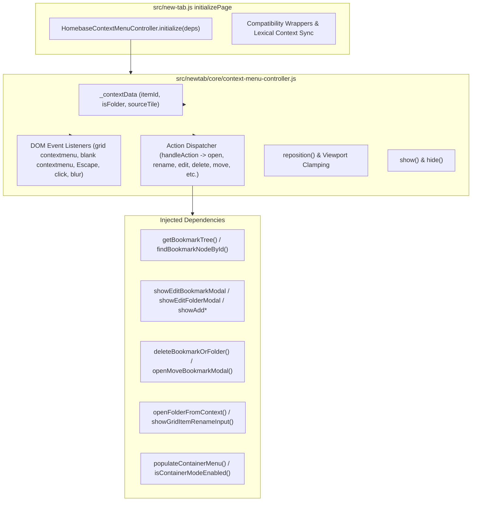

# Homebase Improvement Cycle #11 Phase 4 Checkpoint 2 — Implementation Plan
## Context Menu Unification & Action Routing Extraction

> **Cycle ID**: Homebase Improvement Cycle #11 — Phase 4 Checkpoint 2  
> **Target Release**: Homebase v0.19.0  
> **Target Files**:  
> - `src/newtab/core/context-menu-controller.js`  
> - `src/new-tab.js`  
> - `tests/unit/context-menu-controller.test.mjs`  
> **Authority**: [AGENTS.md](file:///c:/Users/Administrator/Desktop/Homebase/AGENTS.md), [docs/88-cycle11-phase4-audit.md](file:///c:/Users/Administrator/Desktop/Homebase/docs/88-cycle11-phase4-audit.md), [docs/90-cycle11-phase4-checkpoint1-report.md](file:///c:/Users/Administrator/Desktop/Homebase/docs/90-cycle11-phase4-checkpoint1-report.md)

---

## 1. Context & Objectives

Following Checkpoint 1, where 34 dead functions and redundant shims were pruned (-227 lines net), [src/new-tab.js](file:///c:/Users/Administrator/Desktop/Homebase/src/new-tab.js) stands at 5,054 lines.

As identified in the Phase 4 Architecture Audit ([docs/88-cycle11-phase4-audit.md](file:///c:/Users/Administrator/Desktop/Homebase/docs/88-cycle11-phase4-audit.md)), almost **485 lines** of inlined context menu listeners, positioning logic, and action routing remain embedded inside `initializePage()` in [src/new-tab.js](file:///c:/Users/Administrator/Desktop/Homebase/src/new-tab.js#L4235-L4710). While [src/newtab/core/context-menu-controller.js](file:///c:/Users/Administrator/Desktop/Homebase/src/newtab/core/context-menu-controller.js) exists and provides viewport clamping and show/hide state, `initializePage()` still contains duplicate menu management logic, fragmented right-click event handling, and inlined button click switches.

### Checkpoint 2 Objectives:
1. **Unify Context Menu Runtime in `src/newtab/core/context-menu-controller.js`**:
   - Centralize context target tracking (`itemId`, `isFolder`, `sourceTile`).
   - Implement action routing handlers for grid folders (`open`, `open-all`, `rename`, `edit`, `delete`, `move`), bookmark icons (`rename`, `edit`, `delete`, `move`, `open-new-tab`), and blank surface menus (`create-bookmark`, `create-folder`, `manage`, `paste`, `sort-name`).
   - Centralize DOM event listeners:
     - Bookmark grid item right-click (`bookmarksGrid` `contextmenu`)
     - Blank surface right-click (`document` `contextmenu`)
     - Menu item button action dispatching (`gridFolderMenu`, `iconContextMenu`, `gridBlankMenu`)
     - Outside click & blur dismissal
     - Keyboard dismissal (`Escape` key)
2. **Refactor `initializePage()` in `src/new-tab.js`**:
   - Replace the ~475-line inlined context menu block with clean dependency-injected initialization: `window.HomebaseContextMenuController.initialize(deps)`.
   - Preserve page-level clipboard paste listener (`document.addEventListener('paste', ...)`).
   - Maintain backward-compatibility bridges and synchronize lexical state variables (`currentContextItemId`, `currentContextIsFolder`, `currentContextSourceTile`).
3. **Preserve High-Risk Boundaries**:
   - No changes to bookmark storage logic, bookmark tree mutations, or editor save flows.
   - All modal openers and tree mutation functions remain in their respective owners and are passed via dependency injection or resolved defensively.
   - Protected files (`src/preload.js`, `src/instant_load.js`, `manifests/`, `dist/`) remain untouched.

---

## 2. Dependency & Architectural Boundaries

### Injected Dependencies (`deps`):
- `getBookmarkTree`: `() => bookmarkTree`
- `findBookmarkNodeById`: `(root, id) => findBookmarkNodeById(root, id)`
- `openFolderFromContext`: `(folderId) => openFolderFromContext(folderId)`
- `openFolderAll`: `(folderId) => openFolderAll(folderId)`
- `showGridItemRenameInput`: `(item, node) => showGridItemRenameInput(item, node)`
- `showEditFolderModal`: `(folderNode) => showEditFolderModal(folderNode)`
- `showEditBookmarkModal`: `(bookmarkId) => showEditBookmarkModal(bookmarkId)`
- `deleteBookmarkOrFolder`: `(id, isFolder, sourceTile) => deleteBookmarkOrFolder(id, isFolder, sourceTile)`
- `openMoveBookmarkModal`: `(id, isFolder) => openMoveBookmarkModal(id, isFolder)`
- `openBookmarkInNewTab`: `(bookmarkId) => openBookmarkInNewTab(bookmarkId)`
- `showAddBookmarkModal`: `() => showAddBookmarkModal()`
- `showAddFolderModal`: `() => showAddFolderModal()`
- `handlePasteBookmark`: `() => handlePasteBookmark()`
- `sortCurrentFolderByName`: `() => sortCurrentFolderByName()`
- `populateContainerMenu`: `(id, isFolder) => populateContainerMenu(id, isFolder)`
- `isContainerModeEnabled`: `() => Boolean(appContainerModePreference)`
- `onContextChanged`: `(data) => { currentContextItemId = data.itemId; currentContextIsFolder = data.isFolder; currentContextSourceTile = data.sourceTile; }`

---

## 3. Implementation Steps

1. **Enhance `src/newtab/core/context-menu-controller.js`**:
   - Store injected dependencies in internal `_deps`.
   - Implement default action handlers in `_defaultActionHandlers` for all standard menu actions (`open`, `open-all`, `rename`, `edit`, `delete`, `move`, `open-new-tab`, `create-bookmark`, `create-folder`, `manage`, `paste`, `sort-name`), allowing custom handlers registered via `registerActionHandler` to take priority.
   - Implement `attachEventListeners(options)` method:
     - Window `click` and `blur` dismissal
     - Window `keydown` Escape key dismissal
     - Stopping click propagation on menus
     - `#bookmarks-grid` `contextmenu` listener with container menu coordination
     - Blank surface `document` `contextmenu` listener skipping interactive elements
     - Menu button click dispatching for `#bookmark-grid-folder-menu`, `#bookmark-icon-menu`, and `#bookmark-grid-blank-menu`
   - Update `initialize(options)` to store dependencies and invoke `attachEventListeners`.
   - Ensure all DOM lookups are safely guarded so existing unit tests (which run in a mock DOM environment) continue to pass without error.

2. **Refactor `src/new-tab.js`**:
   - In `initializePage()`, replace lines 4235–4710 (the 475-line context menu block) with a clean call to `window.HomebaseContextMenuController.initialize(deps)`.
   - Retain page-level keyboard clipboard paste listener (`document.addEventListener('paste', ...)`).
   - Retain thin compatibility shims:
     - `hideAllContextMenus`: Delegates to `window.HomebaseContextMenuController.hide()`.
     - `positionContextMenuInViewport`: Delegates to `window.HomebaseContextMenuController.reposition()`.
     - `ensureMenuMountedToBody`: Delegates to `window.HomebaseContextMenuController.ensureMenuMountedToBody()`.
   - Maintain top-level state variables (`currentContextItemId`, `currentContextIsFolder`, `currentContextSourceTile`) synchronized via `onContextChanged` callback.

3. **Update Unit Tests in `tests/unit/context-menu-controller.test.mjs`**:
   - Verify all 7 existing tests pass unchanged.
   - Add unit tests for:
     - Escape key dismissal
     - Default action routing (`open`, `rename`, `edit`, `delete`, `move`, `open-new-tab`, `create-bookmark`, `create-folder`, `paste`, `sort-name`)
     - Context change notification callback (`onContextChanged`)
     - Blank grid right-click filtering

4. **Run Full Verification Suite**:
   - `node --check src/newtab/core/context-menu-controller.js`
   - `node --check src/new-tab.js`
   - `node scripts/check-newtab-static.mjs`
   - `node scripts/smoke-newtab-file.mjs`
   - `npm.cmd test`
   - `npm.cmd run build`
   - `git diff --check`
   - `git diff src/preload.js src/instant_load.js manifests/ dist/`

5. **Generate Checkpoint 2 Report**:
   - Create `docs/92-cycle11-phase4-checkpoint2-report.md`.
