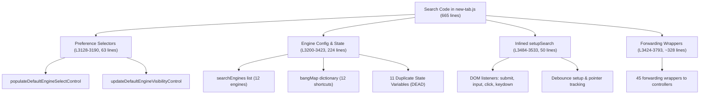

# Homebase Improvement Cycle #11 Phase 4 Checkpoint 3 — Migration Plan
## Search UI & Interaction Delegation Extraction

> **Cycle ID**: Homebase Improvement Cycle #11 — Phase 4 Checkpoint 3  
> **Target Release**: Homebase v0.19.0  
> **Baseline Commit**: `6061a98` ("Extract context menu controller and action routing")  
> **Status**: Proposed — Awaiting Owner Approval  
> **Authority**: [AGENTS.md](file:///c:/Users/Administrator/Desktop/Homebase/AGENTS.md), [docs/88-cycle11-phase4-audit.md](file:///c:/Users/Administrator/Desktop/Homebase/docs/88-cycle11-phase4-audit.md)

---

## 1. Executive Summary & Objective

In Checkpoint 1 and Checkpoint 2 of Phase 4, `src/new-tab.js` was reduced from **5,281 lines down to 4,711 lines** (-570 lines net), pruning dead bookmark/favicon code and extracting the inlined context menu controller.

**Checkpoint 3 Target**: Extract the remaining search UI wiring, search input event listeners, keyboard navigation, result click routing, and prune duplicate search state variables and forwarding wrappers from [src/new-tab.js](file:///c:/Users/Administrator/Desktop/Homebase/src/new-tab.js), delegating ownership cleanly to:
- [src/newtab/search/search-ui-controller.js](file:///c:/Users/Administrator/Desktop/Homebase/src/newtab/search/search-ui-controller.js) (`window.HomebaseSearchUiController`)
- [src/newtab/search/search-interaction-controller.js](file:///c:/Users/Administrator/Desktop/Homebase/src/newtab/search/search-interaction-controller.js) (`window.HomebaseSearchInteractionController`)

### Key Quantitative Goals:
1. **Reduce [src/new-tab.js](file:///c:/Users/Administrator/Desktop/Homebase/src/new-tab.js)** by approximately **350–400 lines** (from 4,711 lines to ~4,320 lines).
2. **Prune 11 stale/duplicate state variables** (`currentSelectionIndex`, `currentSectionIndex`, `selectionExplicit`, `lastSelectedText`, `userIsTyping`, `latestSearchToken`, `lastBookmarkHtml`, `lastSuggestionHtml`, `searchNavigationLocked`, `isBookmarkGridPointerOver`, `bookmarkGridPointerListenersAttached`).
3. **Prune 37 redundant forwarding wrappers** with zero external callers.
4. **Retain 7 essential backward-compatibility shims** (`updateSearchUI`, `hideSearchResultsPanel`, `clearSearchUI`, `cycleSearchEngine`, `setSearchSuggestionsPreference`, `getSafeEnabledSearchEngineId`, `applySearchEngineConfig`) that have active callers in [src/newtab/settings/settings-ui.js](file:///c:/Users/Administrator/Desktop/Homebase/src/newtab/settings/settings-ui.js), [src/newtab/settings/search-engine-settings.js](file:///c:/Users/Administrator/Desktop/Homebase/src/newtab/settings/search-engine-settings.js), or storage event handlers in `new-tab.js`.
5. **Zero behavioral regressions**, zero changes to startup boot sequence, and zero changes to protected files.

---

## 2. Current Search Responsibilities in `src/new-tab.js`

An in-depth code audit of lines 3128–3793 in [src/new-tab.js](file:///c:/Users/Administrator/Desktop/Homebase/src/new-tab.js) reveals the following breakdown:



### A. Dead / Stale State Variables (11 Variables)
The following variables declared in [src/new-tab.js](file:///c:/Users/Administrator/Desktop/Homebase/src/new-tab.js) (lines 3402–3422) are exact duplicates of internal state variables in `search-interaction-controller.js`. They are neither read nor written by any other active logic in `new-tab.js`:
- `currentSelectionIndex`
- `currentSectionIndex`
- `selectionExplicit`
- `lastSelectedText`
- `userIsTyping`
- `latestSearchToken`
- `lastBookmarkHtml`
- `lastSuggestionHtml`
- `searchNavigationLocked`
- `isBookmarkGridPointerOver`
- `bookmarkGridPointerListenersAttached`

### B. Inlined Listener Wiring in `setupSearch()`
In [src/new-tab.js](file:///c:/Users/Administrator/Desktop/Homebase/src/new-tab.js) (lines 3484–3533), `setupSearch()` currently:
1. Calls `window.HomebaseSearchUiController.initialize()`
2. Calls `window.HomebaseSearchInteractionController.initialize()` (without `bindEvents: true`)
3. Manually instantiates `debounce(handleSearchInput, 120)`
4. Manually attaches event listeners to `#search-form`, `#search-input`, `#search-results-panel`, and `document` keydown
5. Manually wires pointer tracking via `setupBookmarkGridPointerTracking()`

All of this wiring is already implemented inside `search-interaction-controller.js` under `initialize({ bindEvents: true })`.

---

## 3. Existing Module Capabilities

Homebase already has a dedicated suite of search modules located under `src/newtab/search/`:

| Module | Lines | Size | Capabilities |
|---|:---:|:---:|---|
| **[search-ui-controller.js](file:///c:/Users/Administrator/Desktop/Homebase/src/newtab/search/search-ui-controller.js)** | 789 | 24.6 KB | Engine selector rendering, icon injection, selector positioning, wheel/keyboard cycling (`cycleSearchEngine`), preference loading/saving, widget reveal, active engine management. |
| **[search-interaction-controller.js](file:///c:/Users/Administrator/Desktop/Homebase/src/newtab/search/search-interaction-controller.js)** | 1,871 | 66.8 KB | Input parsing, debouncing/cancellation, math evaluation (`evaluateMath`), unit conversion (`evaluateUnits`), bookmark search filtering, bang shortcuts (`!yt`, `!ddg`, etc.), async suggestion queries (`fetchSuggestions`), browser history query, selection navigation (ArrowUp, ArrowDown, Tab, Shift+Tab), mouse hover sync, item activation (`Enter`), modal open/search execution, favicon hydration. |
| **[search-storage.js](file:///c:/Users/Administrator/Desktop/Homebase/src/newtab/search/search-storage.js)** | 393 | 13.5 KB | Canonical storage adapter for `currentSearchEngineId`, `appSearchDefaultEngine`, `appSearchRememberEngine`, `searchEnginesConfig`, and fast-search localStorage mirror. |
| **[search-utils.js](file:///c:/Users/Administrator/Desktop/Homebase/src/newtab/search/search-utils.js)** | 290 | 4.9 KB | Mathematical parsing and unit conversion logic; URL structure detection (`isLikelyUrl`). |
| **[search-suggestion-cache.js](file:///c:/Users/Administrator/Desktop/Homebase/src/newtab/search/search-suggestion-cache.js)** | 34 | 1.0 KB | In-memory LRU suggestion cache with TTL expiration. |

---

## 4. Extraction Boundary & Delegation Architecture

### A. Responsibilities Delegated to `search-interaction-controller.js`
1. **Event Binding**:
   - `search-interaction-controller.js`'s `initialize({ bindEvents: true, debounceWait: 120 })` will own:
     - Form submit: `handleSubmit(e)`
     - Debounced input: `debounce(handleInput, 120)`
     - Input click stop propagation: `e.stopPropagation()`
     - Results panel mousedown and click routing
     - Results panel click stop propagation: `e.stopPropagation()`
     - Document keydown navigation: `handleKeydown(e)`
     - Global typing quick-focus: focusing `#search-input` on printable keydown
     - Pointer tracking on bookmark grid: `setupBookmarkGridPointerTracking()`
2. **Debounce Management**:
   - Encapsulated within `search-interaction-controller.js`, with proper cleanup on `destroy()` and `beforeunload`.

### B. Responsibilities Retained in `src/new-tab.js`
1. **Startup Orchestration**:
   - `startup:setupSearch` idle task definition and performance measurement (`setupSearchSafe`).
   - Delegated `setupSearch()` implementation:
     ```javascript
     async function setupSearch() {
       if (window.HomebaseSearchUiController && typeof window.HomebaseSearchUiController.initialize === 'function') {
         await window.HomebaseSearchUiController.initialize();
       }
       if (window.HomebaseSearchInteractionController && typeof window.HomebaseSearchInteractionController.initialize === 'function') {
         await window.HomebaseSearchInteractionController.initialize({ bindEvents: true });
       }
     }
     ```
2. **Canonical Engine Catalog**:
   - `let searchEngines = [ ... ];` remains declared in `new-tab.js` and synchronized via `window.searchEngines = searchEngines` for backward compatibility with `search-engine-settings.js` and `search-ui-controller.js`.
3. **Preferences & Settings UI Controls**:
   - `populateDefaultEngineSelectControl()` and `updateDefaultEngineVisibilityControl()` stay in `new-tab.js` (or lightweight settings bridge).
   - Storage change listener handling for `APP_SEARCH_DEFAULT_ENGINE_KEY`, `currentSearchEngineId`, etc.

---

## 5. Function Disposition Table (Detailed Analysis)

| Function | Line in `new-tab.js` | Callers Outside Definition | Target Action | Rationale |
|---|:---:|---|:---:|---|
| `buildSearchEngineIconContent` | L3424 | None | **PRUNE** | Implemented & exported in `search-ui-controller.js` |
| `ensureEngineIconExists` | L3430 | None | **PRUNE** | Implemented & exported in `search-ui-controller.js` |
| `updateSearchSelectorPosition` | L3436 | None | **PRUNE** | Implemented & exported in `search-ui-controller.js` |
| `renderSearchEngineSelector` | L3442 | None | **PRUNE** | Implemented & exported in `search-ui-controller.js` |
| `populateSearchOptions` | L3448 | None | **PRUNE** | Implemented & exported in `search-ui-controller.js` |
| `updateSearchUI` | L3454 | `settings-ui.js`, `search-engine-settings.js`, `new-tab.js` storage | **RETAIN SHIM** | Active external callers rely on top-level function |
| `preconnectToSearchEngine` | L3460 | None | **PRUNE** | Handled inside `search-ui-controller.js` |
| `clearSearchUI` | L3466 | `search-interaction-controller.js` fallback | **RETAIN SHIM** | Defensive fallback in interaction controller |
| `hideSearchResultsPanel` | L3472 | `search-interaction-controller.js` fallback | **RETAIN SHIM** | Defensive fallback in interaction controller |
| `cycleSearchEngine` | L3478 | `search-interaction-controller.js` fallback | **RETAIN SHIM** | Defensive fallback in interaction controller |
| `setupSearch` | L3484 | `startup:setupSearch` idle task | **REFACTOR** | Simplify to clean 6-line controller orchestrator |
| `handleSearchChange` | L3535 | None | **PRUNE** | Wired directly in `search-ui-controller.js` |
| `openSearchUrl` | L3543 | None | **PRUNE** | Handled inside `search-interaction-controller.js` |
| `executeSearch` | L3549 | None | **PRUNE** | Handled inside `search-interaction-controller.js` |
| `isSearchKeyboardContext` | L3555 | None | **PRUNE** | Handled inside `search-interaction-controller.js` |
| `isBookmarkGridScrollKey` | L3562 | None | **PRUNE** | Handled inside `search-interaction-controller.js` |
| `isSearchInputEmptyAndPassive` | L3569 | None | **PRUNE** | Handled inside `search-interaction-controller.js` |
| `getBookmarkScrollContainer` | L3576 | None | **PRUNE** | Handled inside `search-interaction-controller.js` |
| `isPointerOverBookmarkGrid` | L3583 | None | **PRUNE** | Handled inside `search-interaction-controller.js` |
| `scrollBookmarkGridForKey` | L3590 | None | **PRUNE** | Handled inside `search-interaction-controller.js` |
| `setupBookmarkGridPointerTracking` | L3596 | None | **PRUNE** | Handled inside `search-interaction-controller.js` |
| `getCurrentSectionItems` | L3602 | None | **PRUNE** | Handled inside `search-interaction-controller.js` |
| `removeSelectionClasses` | L3609 | None | **PRUNE** | Handled inside `search-interaction-controller.js` |
| `clearAllSelections` | L3615 | None | **PRUNE** | Handled inside `search-interaction-controller.js` |
| `syncSearchInputWithItem` | L3621 | None | **PRUNE** | Handled inside `search-interaction-controller.js` |
| `getResultLabelText` | L3627 | None | **PRUNE** | Handled inside `search-interaction-controller.js` |
| `selectItem` | L3634 | None | **PRUNE** | Handled inside `search-interaction-controller.js` |
| `attachHoverSync` | L3640 | None | **PRUNE** | Handled inside `search-interaction-controller.js` |
| `moveSection` | L3646 | None | **PRUNE** | Handled inside `search-interaction-controller.js` |
| `getSelectedResult` | L3652 | None | **PRUNE** | Handled inside `search-interaction-controller.js` |
| `getSelectionSnapshot` | L3658 | None | **PRUNE** | Handled inside `search-interaction-controller.js` |
| `handleSearch` | L3666 | `setupSearch` inline | **PRUNE** | Delegated to `search-interaction-controller.js` |
| `handleSearchResultMouseDown` | L3672 | `setupSearch` inline | **PRUNE** | Delegated to `search-interaction-controller.js` |
| `handleSearchResultClick` | L3678 | `setupSearch` inline | **PRUNE** | Delegated to `search-interaction-controller.js` |
| `handleSearchKeydown` | L3684 | `setupSearch` inline | **PRUNE** | Delegated to `search-interaction-controller.js` |
| `restoreSelectionAfterFilter` | L3690 | None | **PRUNE** | Handled inside `search-interaction-controller.js` |
| `maybeAutoSelectSuggestion` | L3696 | None | **PRUNE** | Handled inside `search-interaction-controller.js` |
| `applySelectionToCurrentResults` | L3703 | None | **PRUNE** | Handled inside `search-interaction-controller.js` |
| `isStaleSearch` | L3709 | None | **PRUNE** | Handled inside `search-interaction-controller.js` |
| `abortSuggestionFetch` | L3716 | None | **PRUNE** | Handled inside `search-interaction-controller.js` |
| `clearExternalSuggestionResults` | L3722 | None | **PRUNE** | Handled inside `search-interaction-controller.js` |
| `setSearchSuggestionsPreference` | L3728 | `settings-ui.js`, `new-tab.js` storage | **RETAIN SHIM** | Active external caller in `settings-ui.js` |
| `applySearchEngineConfig` | L3738 | `new-tab.js` storage listener | **RETAIN SHIM** | Storage listener invokes on config sync |
| `getSafeEnabledSearchEngineId` | L3745 | `new-tab.js` lines 3132, 4419, 4454 | **RETAIN SHIM** | Used by default engine select dropdown |
| `loadSearchEnginePreferences` | L3752 | None | **PRUNE** | Called inside `search-ui-controller.js.initialize()` |
| `fetchSearchSuggestions` | L3761 | None | **PRUNE** | Handled inside `search-interaction-controller.js` |
| `getBangSuggestions` | L3768 | None | **PRUNE** | Handled inside `search-interaction-controller.js` |
| `updatePanelVisibility` | L3776 | None | **PRUNE** | Handled inside `search-interaction-controller.js` |
| `hydrateSearchResultFavicons` | L3782 | None | **PRUNE** | Handled inside `search-interaction-controller.js` |
| `handleSearchInput` | L3788 | `setupSearch` inline | **PRUNE** | Delegated to `search-interaction-controller.js` |

**Net Pruning Summary**:
- **Pruned from `new-tab.js`**: 37 functions + 11 dead state variables + `resultSections` + `bangMap` (~350–400 lines)
- **Retained Shims in `new-tab.js`**: 7 functions (`updateSearchUI`, `hideSearchResultsPanel`, `clearSearchUI`, `cycleSearchEngine`, `setSearchSuggestionsPreference`, `getSafeEnabledSearchEngineId`, `applySearchEngineConfig`) + refactored `setupSearch()`.

---

## 6. State Bridge & Integration Enhancements

To ensure 100% behavioral parity when `HomebaseSearchInteractionController.initialize({ bindEvents: true })` runs:

1. **Debounced Input in Controller**:
   Enhance `search-interaction-controller.js` `initialize()` to attach a debounced handler using `debounce` from `src/newtab/core/utils.js`:
   ```javascript
   const debouncedInput = typeof debounce === 'function' ? debounce(handleInput, 120) : handleInput;
   input.addEventListener('input', debouncedInput);
   ```
2. **Click Propagation Stoppage**:
   Ensure `searchInput.addEventListener('click', (e) => e.stopPropagation())` and `panel.addEventListener('click', (e) => e.stopPropagation())` are attached within `attachEventListeners()`.
3. **Global Quick-Focus Keydown**:
   Add global keydown handler in `search-interaction-controller.js` when `bindEvents: true`:
   ```javascript
   document.addEventListener('keydown', (e) => {
     if (e.target && (e.target.tagName === 'INPUT' || e.target.tagName === 'TEXTAREA' || e.target.isContentEditable)) return;
     if (e.ctrlKey || e.metaKey || e.altKey) return;
     if (e.key.length > 1) return;
     const input = getSearchInput();
     if (input) input.focus();
   });
   ```
4. **Clean Teardown**:
   Cancel pending debounce timers on `destroy()` and `beforeunload`.

---

## 7. Risk Assessment & Mitigations

| Risk | Impact | Probability | Mitigation Strategy |
|---|:---:|:---:|---|
| **External Callers Breaking** | High | Low | Conducted comprehensive repository-wide grep for all 50 function names. Retained 7 shims with active callers. |
| **Debounce Regressions** | Medium | Low | Use exact 120ms wait time and `debounce()` from `utils.js`. |
| **Startup Race Conditions** | High | Low | Keep `startup:setupSearch` idle task wrapper in `new-tab.js`. Controllers load prior to `new-tab.js`. |
| **Global Declaration Collision** | High | Low | Remove declarations from `new-tab.js` and verify with `node scripts/check-newtab-static.mjs`. |
| **Protected File Modification** | Critical | None | Strictly avoid touching `src/preload.js`, `src/instant_load.js`, `manifests/`, or `dist/`. |

---

## 8. Verification Strategy & Gates

Upon owner approval of this plan:
1. Implement debouncing and full event wiring in [src/newtab/search/search-interaction-controller.js](file:///c:/Users/Administrator/Desktop/Homebase/src/newtab/search/search-interaction-controller.js).
2. Prune redundant wrappers, dead state variables, and rewire `setupSearch()` in [src/new-tab.js](file:///c:/Users/Administrator/Desktop/Homebase/src/new-tab.js).
3. Update/extend [tests/unit/search-interaction-controller.test.mjs](file:///c:/Users/Administrator/Desktop/Homebase/tests/unit/search-interaction-controller.test.mjs).
4. Run full verification sequence:
   ```powershell
   node --check src/newtab/search/search-interaction-controller.js
   node --check src/new-tab.js
   node scripts/check-newtab-static.mjs
   node scripts/smoke-newtab-file.mjs
   npm.cmd test
   npm.cmd run build
   git diff --check
   git diff src/preload.js src/instant_load.js manifests/ dist/
   ```
5. Execute live browser search checklist (query typing, debounce, math calculation, suggestions, bang shortcuts, keyboard navigation, outside click dismissal).
6. Create `docs/94-cycle11-phase4-checkpoint3-report.md`.
7. Await owner review. (Do NOT commit or push).
