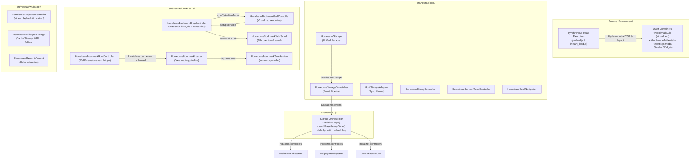

# Homebase System Architecture

**Document:** `docs/architecture/ARCHITECTURE.md`  
**Status:** Living System Specification  
**Version Alignment:** Homebase `v0.17.0+`  

---

## 1. High-Level System Architecture

Homebase is designed around a modular controller-service pattern operating entirely in client-side WebExtension environments without external runtime servers or build-time bundlers.



---

## 2. Execution Pipeline & Script Ordering

### 2.1 The `<script defer>` Execution Model
Homebase scripts are loaded using standard `<script defer>` tags in [`src/new-tab.html`](file:///c:/Users/Administrator/Desktop/Homebase/src/new-tab.html). 

Key mechanical properties:
1. **Deferred Execution**: Scripts download asynchronously in parallel during HTML parsing, but execute sequentially in the exact order they appear in the HTML document.
2. **Execution Timing**: Execution begins immediately after document parsing completes, before `DOMContentLoaded` fires.
3. **Shared Execution Context**: All deferred scripts execute in the **same top-level global execution context**. They share both the global object (`window`) and the global lexical declarative environment record.

### 2.2 Global Lexical Scope Invariant
Because scripts share the global lexical scope, a top-level `const` or `let` declaration in one script cannot be re-declared in any subsequent script:

$$\text{Script A: } \texttt{const foo = 1;} \quad \Longrightarrow \quad \text{Script B: } \texttt{const foo = 2;} \quad \Longrightarrow \quad \textbf{Uncaught SyntaxError}$$

To guarantee zero collisions across 63+ deferred scripts:
- Extracted domain modules encapsulate internal state within closures or IIFEs.
- Public controller APIs are exported on `window` (e.g., `window.HomebaseBookmarkDragController = ...`).
- Automated scanner [`scripts/check-newtab-static.mjs`](file:///c:/Users/Administrator/Desktop/Homebase/scripts/check-newtab-static.mjs) parses all deferred scripts on every test run to statically prove 0 lexical collisions across all declarations.

---

## 3. Subsystem Domain Separation

### 3.1 Bookmark Subsystem
The bookmark subsystem manages all interactions with native browser bookmarks:
- **`HomebaseBookmarkDragController`** ([`bookmark-drag-controller.js`](file:///c:/Users/Administrator/Desktop/Homebase/src/newtab/bookmarks/bookmark-drag-controller.js)):
  - Canonical owner of SortableJS configuration for both grid tiles and folder tabs.
  - Manages pointermove raycasting, folder hover locking, and drop dispatches.
  - Optimistically updates in-memory tree models and invokes `browser.bookmarks.move`.
- **`HomebaseBookmarkGridController`** ([`bookmark-grid-controller.js`](file:///c:/Users/Administrator/Desktop/Homebase/src/newtab/bookmarks/bookmark-grid-controller.js)):
  - Generates bookmark tile DOM elements, manages virtualized rows, and provides grid click delegation.
- **`HomebaseBookmarkLoader`** ([`bookmark-loader-service.js`](file:///c:/Users/Administrator/Desktop/Homebase/src/newtab/bookmarks/bookmark-loader-service.js)):
  - Fetches browser bookmark trees, determines the root display folder, and parses user metadata.
- **`HomebaseBookmarkTreeService`** ([`bookmark-tree-service.js`](file:///c:/Users/Administrator/Desktop/Homebase/src/newtab/bookmarks/bookmark-tree-service.js)):
  - Stores and traverses the in-memory hierarchical tree representation.

### 3.2 Storage & State Management
Homebase implements a layered storage architecture:
1. **`HomebaseStorage` Facade** ([`storage-service.js`](file:///c:/Users/Administrator/Desktop/Homebase/src/newtab/core/storage-service.js)):
   - Unified interface abstracting `browser.storage.local` across Chrome and Firefox.
   - Supports atomic batch writes (`setMany`), key removals, and diagnostic snapshots.
   - Schema versioning (`CURRENT_SCHEMA_VERSION = 1`) with automated migration handling.
2. **`HostStorageAdapter`** ([`host-storage-adapter.js`](file:///c:/Users/Administrator/Desktop/Homebase/src/newtab/core/host-storage-adapter.js)):
   - Synchronizes critical preferences to synchronous `localStorage` mirrors (`fast-time-format`, `fast-widget-order`, `fast-show-sidebar`) to allow `preload.js` and `instant_load.js` to render without awaiting async storage APIs.
3. **`HomebaseStorageDispatcher`** ([`storage-dispatcher.js`](file:///c:/Users/Administrator/Desktop/Homebase/src/newtab/core/storage-dispatcher.js)):
   - Event pipeline broadcasting storage alterations to registered listeners without tight coupling.

### 3.3 Wallpaper Subsystem
- **`HomebaseWallpaperController`** ([`wallpaper-controller.js`](file:///c:/Users/Administrator/Desktop/Homebase/src/newtab/wallpaper/wallpaper-controller.js)):
  - Manages background video rendering, smooth crossfading, daily rotation checks, and gallery integration.
- **`HomebaseWallpaperStorage`** ([`wallpaper-storage.js`](file:///c:/Users/Administrator/Desktop/Homebase/src/newtab/wallpaper/wallpaper-storage.js)):
  - Interacts with Cache Storage API (`wallpaper-assets`) to store downloaded MP4 video blobs and poster image blobs offline.

---

## 4. Monolith Deconstruction Roadmap

[`src/new-tab.js`](file:///c:/Users/Administrator/Desktop/Homebase/src/new-tab.js) was historically a 4,341-line monolith housing all application logic. Through disciplined cycles of extraction, it has been systematically decentralized:

```text
Historical Baseline:   4,341 lines (Monolith)
End of Cycle 11:       1,842 lines (Decomposed settings, search, storage, widgets)
End of Cycle 12:       1,148 lines (Extracted complete Bookmark Drag & Drop subsystem)
Target for Cycle 13:   < 400 lines (Pure Startup Orchestration Coordinator)
```

In its target final state, `src/new-tab.js` will contain **zero domain business logic** and will act solely as the high-level startup choreographer (`initializePage()`), coordinating phase transitions and top-level lifecycle events.

---

## 5. Cross-Browser Compatibility Matrix

Homebase strictly adheres to WebExtension standard APIs:
- Chrome Web Store MV3 uses `chrome.*` APIs with standard background page rules.
- Firefox AMO MV3 uses `browser.*` APIs with Gecko ID declaration and container tabs (`contextualIdentities`).
- API normalization is performed via `const browser = window.browser || window.chrome;` or dedicated adapters (`getBrowserApi()`).
