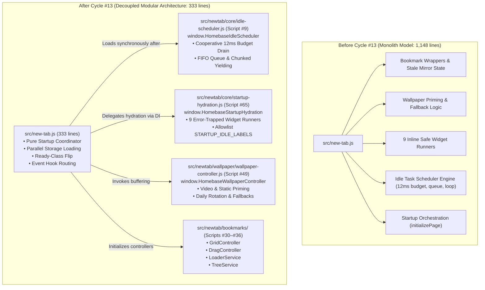

# Homebase Cycle #13 — Final Closure Summary: Monolith Deconstruction & Core Startup Architecture

**Document:** `docs/cycles/cycle-13/cycle-13-final-summary.md`  
**Date:** October 11, 2026  
**Status:** COMPLETE & SEALED  
**Cycle Target:** Transform `src/new-tab.js` from legacy monolith (1,148 lines) into a lean Startup Orchestrator (< 400 lines)  
**Final Size of `src/new-tab.js`:** **333 lines**  
**Total Cycle #13 Net Reduction:** **-815 lines (-71.0%)**  
**Target Milestone:** < 400 lines (achieved and surpassed by 67 lines)  
**Test Suite Status:** 367 / 367 passing (100%), 0 collisions across 65 scripts  

---

## 1. Original Problem Statement

At the commencement of **Cycle #13**, [`src/new-tab.js`](file:///c:/Users/Administrator/Desktop/Homebase/src/new-tab.js) was a **1,148-line legacy monolith**. While earlier cycles (Cycles #10–#12) had extracted domain controllers for Settings, Search, and Bookmarks, `new-tab.js` retained significant architectural debt:

1. **Stale Compatibility Bridges & Ghost State**: Residual wrapper functions (`loadBookmarks`, `renderBookmarksGrid`, `renderBookmarkTabs`) and unread mirror state variables (`isDraggingTabs`, `draggedBookmarkId`, `lastRenderedBookmarkTree`) persisted from prior extractions.
2. **Wallpaper Startup Coupling**: Wallpaper background startup priming (`primeWallpaperBackground`, ~72 lines) was marooned inside `new-tab.js` instead of its canonical domain controller [`wallpaper-controller.js`](file:///c:/Users/Administrator/Desktop/Homebase/src/newtab/wallpaper/wallpaper-controller.js).
3. **Monolithic Hydration Registry**: 9 individual dashboard widget setup runners (`loadCachedWeatherSafe`, `buildQuoteIndexSafe`, `setupSearchSafe`, etc., ~211 lines) were inline closures inside `initializePage()`, creating tight couplings to widget DOM structures and storage keys.
4. **Script-Order Dependency Inversions**: A complete cooperative idle scheduler engine (~286 lines) was embedded at lines 25–310 of `new-tab.js`. Because `new-tab.js` executes last as Script #65, earlier modules like `wallpaper-controller.js` (Script #49) and `news.js` (Script #64) had to use awkward defensive checks (`typeof scheduleIdleTask === 'function' ? ... : window.scheduleIdleTask`) to avoid runtime crashes.
5. **Loss of Orchestrator Focus**: Top-level boot coordination was buried underneath hundreds of lines of scheduler math, queue management, and widget error trapping.

**Cycle #13 Strategic Objective:**  
Deconstruct the monolith and establish `src/new-tab.js` purely as the **Startup Orchestration Coordinator** (< 400 lines) with zero domain logic, single canonical ownership per subsystem, and byte-for-byte preservation of the sub-100ms Startup Contract.

---

## 2. Phase-by-Phase Execution Summary

Cycle #13 followed the strict 7-step collaborative lifecycle (`Audit → Plan → Approve → Implement → Verify → Commit → Push`):

```text
Cycle #13 Phase Roadmap & Net Line Progression:
┌────────────────────────────────────────────────────────────────────────┐
│ Baseline: 1,148 lines (Monolithic new-tab.js)                           │
├───────────────┬──────────────────────────────────────────┬─────────────┤
│ Phase 1       │ Architecture Audit & Roadmap Planning   │ 1,148 lines │
│ Phase 2       │ Bookmark Bridges & State Pruning         │   925 lines │ (-223 lines)
│ Phase 3       │ Wallpaper Startup Priming Extraction     │   853 lines │ (-72 lines)
│ Phase 4       │ Startup Hydration Task Registry Extraction│  642 lines │ (-211 lines)
│ Phase 5       │ Idle Task Scheduler Subsystem Extraction │   356 lines │ (-286 lines)
│ Phase 6       │ Final Orchestrator Polish & Audit        │   333 lines │ (-23 lines)
└───────────────┴──────────────────────────────────────────┴─────────────┘
Total Net Reduction: -815 lines (-71.0%)
```

### Phase 2: Bookmark Bridges & State Pruning (`commit dc83823`)
- **Action**: Audited and pruned legacy wrapper functions (`loadBookmarks`, `renderBookmarkTabs`, `renderBookmarksGrid`, `initTabsScrollController`, `updateBookmarkTabOverflow`) and dead mirror variables (`lastRenderedBookmarkTree`, `draggedBookmarkId`, `isDraggingTabs`).
- **Routing**: Updated 12 consumer call-sites across 8 files to interface directly with `HomebaseBookmarkLoader`, `HomebaseBookmarkTreeService`, and `HomebaseBookmarkDragController`.
- **Result**: `src/new-tab.js` reduced from 1,148 to **925 lines** (-223 lines).

### Phase 3: Wallpaper Startup Priming Extraction (`commits 62fc42f`, `20bac7a`)
- **Action**: Atomically relocated `primeWallpaperBackground()` and daily rotation checks into [`src/newtab/wallpaper/wallpaper-controller.js`](file:///c:/Users/Administrator/Desktop/Homebase/src/newtab/wallpaper/wallpaper-controller.js).
- **Result**: `src/new-tab.js` reduced from 925 to **853 lines** (-72 lines).

### Phase 4: Startup Hydration Task Registry Extraction (`commit 299315b`)
- **Action**: Created [`src/newtab/core/startup-hydration.js`](file:///c:/Users/Administrator/Desktop/Homebase/src/newtab/core/startup-hydration.js) (+263 lines) exporting `window.HomebaseStartupHydration`.
- **Transferred**: Allowlist `STARTUP_IDLE_LABELS` and all 9 error-contained widget runners (`Weather`, `Quote`, `News`, `Todo`, `Search`, `App Launcher`).
- **Dependency Boundary**: Clean dependency injection for `scheduleTask` and `getStartupPhase`.
- **Result**: `src/new-tab.js` reduced from 853 to **642 lines** (-211 lines).

### Phase 5: Idle Task Scheduler Extraction (`commits 7e7ef9c`, `4718bfa`)
- **Action**: Created [`src/newtab/core/idle-scheduler.js`](file:///c:/Users/Administrator/Desktop/Homebase/src/newtab/core/idle-scheduler.js) (+187 lines) exporting `window.HomebaseIdleScheduler` with compatibility bindings on `window`.
- **Transferred**: `runWhenIdle`, `IDLE_TASK_BUDGET_MS` (12ms), `idleTaskQueue`, `idleTaskLabels`, `idleTaskScheduled`, `processIdleTasks`, `scheduleIdleTask`, `scheduleIdleChunkedTask`, and queue diagnostic accessors.
- **Script Ordering**: Positioned as Script #9 in `src/new-tab.html`, guaranteeing that all downstream feature modules have synchronous access to `scheduleIdleTask`.
- **Result**: `src/new-tab.js` reduced from 642 to **356 lines** (-286 lines), crossing the `< 400 lines` milestone.

### Phase 6: Final Orchestrator Polish & Audit (`commit 25d6c6b`)
- **Action**: Pruned dead variable `suggestionAbortController`, eliminated redundant 12-line favicon delegation bridge by directly exporting `resolveFaviconForImageTarget` in `favicon-pipeline.js`, and removed obsolete empty comments.
- **Result**: `src/new-tab.js` brought to its final canonical state of **333 lines** (-23 lines).

---

## 3. Architecture Before vs After Comparison



---

## 4. Final Subsystem Ownership Map

Every functional domain in Homebase now possesses **one canonical owner**:

| Subsystem Domain | Canonical File | Export Mechanism | Primary Responsibilities |
|---|---|---|---|
| **Startup Orchestrator** | [`src/new-tab.js`](file:///c:/Users/Administrator/Desktop/Homebase/src/new-tab.js) | Script #66 (Last Deferred) | Top-level lifecycle coordination, parallel storage loading, instant ready-state class flip (<50ms), and background dispatch. |
| **Idle Task Scheduler** | [`src/newtab/core/idle-scheduler.js`](file:///c:/Users/Administrator/Desktop/Homebase/src/newtab/core/idle-scheduler.js) | `window.HomebaseIdleScheduler` (Script #9) | Cooperative 12ms slice budget, FIFO queue drainage, label deduplication, generator chunked worker, and `setTimeout` fallback. |
| **Startup Hydration Registry** | [`src/newtab/core/startup-hydration.js`](file:///c:/Users/Administrator/Desktop/Homebase/src/newtab/core/startup-hydration.js) | `window.HomebaseStartupHydration` (Script #65) | Safe error-trapped widget setup runners (Weather, News, Quote, Todo, Search, Launcher), allowlist validation, and timing markers. |
| **Wallpaper Controller** | [`src/newtab/wallpaper/wallpaper-controller.js`](file:///c:/Users/Administrator/Desktop/Homebase/src/newtab/wallpaper/wallpaper-controller.js) | `window.HomebaseWallpaperController` (Script #49) | Video/static wallpaper presentation, startup background priming, fallback poster apply, and daily rotation. |
| **Bookmark Loader Service** | [`src/newtab/bookmarks/bookmark-loader-service.js`](file:///c:/Users/Administrator/Desktop/Homebase/src/newtab/bookmarks/bookmark-loader-service.js) | `window.HomebaseBookmarkLoader` (Script #36) | WebExtension bookmark tree fetching, root display folder resolution, and user metadata persistence. |
| **Bookmark Grid Controller** | [`src/newtab/bookmarks/bookmark-grid-controller.js`](file:///c:/Users/Administrator/Desktop/Homebase/src/newtab/bookmarks/bookmark-grid-controller.js) | `window.HomebaseBookmarkGridController` (Script #30) | Virtualized tile rendering, DOM layout, grid click delegation, and active folder state. |
| **Bookmark Drag Controller** | [`src/newtab/bookmarks/bookmark-drag-controller.js`](file:///c:/Users/Administrator/Desktop/Homebase/src/newtab/bookmarks/bookmark-drag-controller.js) | `window.HomebaseBookmarkDragController` (Script #31) | SortableJS drag lifecycle, pointer raycasting, folder hover locking, and tile/tab move dispatch. |
| **Bookmark Tree Service** | [`src/newtab/bookmarks/bookmark-tree-service.js`](file:///c:/Users/Administrator/Desktop/Homebase/src/newtab/bookmarks/bookmark-tree-service.js) | `window.HomebaseBookmarkTreeService` (Script #28) | In-memory tree model, node lookups by ID, and parent-child hierarchy navigation. |
| **Favicon Pipeline** | [`src/newtab/core/favicon-pipeline.js`](file:///c:/Users/Administrator/Desktop/Homebase/src/newtab/core/favicon-pipeline.js) | `window.HomebaseFaviconPipeline` (Script #24) | High-performance favicon resolution, object URL caching, candidate probing, and observer lifecycle. |
| **Storage Facade & Dispatcher** | [`src/newtab/core/storage-service.js`](file:///c:/Users/Administrator/Desktop/Homebase/src/newtab/core/storage-service.js), [`storage-dispatcher.js`](file:///c:/Users/Administrator/Desktop/Homebase/src/newtab/core/storage-dispatcher.js) | `HomebaseStorage`, `HomebaseStorageDispatcher` (Scripts #22, #32) | Unified MV3 storage access, schema versioning, batch writes (`setMany`), and cross-tab storage change broadcasting. |

---

## 5. Quantitative Metrics & Milestone Achievement

```text
========================================================================
                     CYCLE #13 LINE COUNT EVOLUTION
========================================================================
  Baseline (Cycle 13 Start)       : 1,148 lines (Monolith)
  Phase 2 (Bookmark Cleanup)      :   925 lines (-223 lines, -19.4%)
  Phase 3 (Wallpaper Priming)     :   853 lines ( -72 lines,  -6.3%)
  Phase 4 (Hydration Registry)    :   642 lines (-211 lines, -18.4%)
  Phase 5 (Idle Scheduler)        :   356 lines (-286 lines, -24.9%)
  Phase 6 (Final Polish)          :   333 lines ( -23 lines,  -2.0%)
------------------------------------------------------------------------
  Total Cycle #13 Net Reduction   :  -815 lines (-71.0%)
  Target Milestone (< 400 lines)  :  EXCEEDED (333 lines final, +67 margin)
========================================================================
```

---

## 6. Verification Evidence

The entire repository state after Cycle #13 was subjected to multi-stage automated verification:

| Verification Suite | Tool / Command | Result | Evidence / Details |
|---|---|:---:|---|
| **Syntax Validation** | `node --check <all-scripts>` | **PASS** | 0 syntax errors across all 65 JavaScript files. |
| **Static Declaration Scanner** | `node scripts/check-newtab-static.mjs` | **PASS** | 65 deferred local scripts checked, 44 key extracted modules verified, 0 collisions across 866 unique declarations. |
| **Automated Unit Tests** | `npm.cmd test` (Stage 3 `node:test`) | **PASS** | 367 / 367 unit tests passing across all domain suites. |
| **Browser Smoke Test** | `npm.cmd test` (Stage 4 `smoke-newtab-file.mjs`) | **PASS** | Headless Edge browser launched, all DOM surfaces mounted, core controllers verified, 0 ReferenceError exceptions. |
| **Dual Distribution Build** | `npm.cmd run build` | **PASS** | Clean builds for Chrome (`dist/chrome`) and Firefox (`dist/firefox`). |
| **Protected Files Invariant** | `git diff src/preload.js src/instant_load.js manifests/ dist/` | **PASS** | Completely empty output (zero modifications to protected core files). |

---

## 7. Lessons Learned & Architectural Patterns

### 7.1 The Atomic Extraction Rule
Because Homebase executes scripts via classic `<script defer>` without bundlers, all deferred scripts share a single top-level declarative environment record. The static scanner (`check-newtab-static.mjs`) uses Acorn to detect depth-0 declaration collisions.  
- **Lesson:** Moving a depth-0 symbol from `new-tab.js` to an extracted file cannot be split into separate "add" and "remove" commits. The addition to the new module and removal from `new-tab.js` must occur **in a single atomic step**.
- **Best Practice:** Always encapsulate extracted modules inside an IIFE `(function () { 'use strict'; ... })();` so internal variables reside at depth 1, exposing only canonical namespace objects on `window`.

### 7.2 Ownership-First Refactoring
- **Lesson:** Line reduction must never be treated as the primary goal; it is merely a secondary measurement. True architecture quality comes from **single canonical ownership per subsystem**.
- When extracting code, prioritize complete domain boundary isolation over arbitrary line pruning.

### 7.3 Dependency Boundary Validation & Injection
- **Lesson:** Extracted modules must never cling to ambient private variables in `new-tab.js`. Passing dependencies explicitly via options objects (`options.scheduleTask`, `options.getStartupPhase`) keeps modules testable in isolation and avoids hidden coupling.

### 7.4 Script Execution Hierarchy Order
- **Lesson:** Loading the cooperative scheduler early (`idle-scheduler.js` as Script #9) resolves historic script-order dependency inversions. Downstream controllers can safely access `scheduleIdleTask` during script evaluation without complex defensive fallbacks.

---

## 8. Future Recommendations & Maintenance Rules

### 8.1 What Should NOT Be Extracted
The following responsibilities must remain permanently in [`src/new-tab.js`](file:///c:/Users/Administrator/Desktop/Homebase/src/new-tab.js):
- **`initializePage()`**: This is the top-level orchestrator. Moving it would simply create an artificial duplicate orchestrator.
- **`markPageReadyOnce()`**: Directly coordinates the synchronous CSS ready class flip.
- **`handleNewTabStorageChange()`**: Cross-cutting storage event dispatcher that routes updates across multiple subsystems.
- **`DOMContentLoaded` & `window.load` Listeners**: Global document-level lifecycle anchors.

### 8.2 Maintenance Rules for Future Modules
1. **Always wrap first-party modules in IIFEs** to prevent depth-0 Acorn collision errors.
2. **Export public APIs through `window.<CanonicalNamespace>`** (e.g. `window.HomebaseIdleScheduler`).
3. **Register new modules in `src/new-tab.html`** in strict dependency order before `src/new-tab.js`.
4. **Register new modules in `scripts/check-newtab-static.mjs`** (`keyExtractedModulePaths`).
5. **Preserve the Startup Contract**: `initializePage()` must never `await` non-critical widget hydration before calling `markPageReadyOnce()`.

---

## 9. Conclusion

**Cycle #13 is officially complete and verified.**  
Homebase now features a modular, high-performance, and maintainable architecture with a lean **333-line Startup Orchestrator**, 100% green tests, and zero static collisions.
