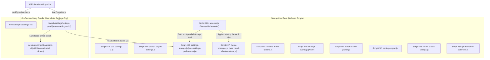

# Cycle #14 Phase 1: Settings Panel Modularization Planning Audit

**Document:** `docs/cycles/cycle-14/phase-1-settings-audit.md`  
**Date:** October 11, 2026  
**Status:** COMPLETE (Planning Audit)  
**Target Milestone:** Homebase `v0.18.0`  
**Focus Subsystem:** Settings Subsystem (`src/newtab/settings/` & `src/newtab/styles/settings.css`)

---

## Executive Summary

Following the successful completion of **Cycle #13**, which deconstructed the `src/new-tab.js` legacy monolith into a lean 333-line Startup Orchestrator, **Cycle #14** addresses the remaining high-debt subsystem: the **Settings Architecture**.

Historically, settings management in Homebase evolved along two parallel, overlapping paths:
1. **`src/newtab/settings/settings-ui.js`** (1,697 lines): An oversized modal UI controller containing inline DOM scraping, raw storage batches, What's New markdown parsing, Pro Tips filtering, and modal lifecycle logic.
2. **`src/newtab/settings/settings-preferences.js`** (1,257 lines): A monolithic state manager containing duplicate form-saving logic, DOM element mapping, fast-mirror persistence, and 34 loose global property bridges.

Together with 9 other satellites in `src/newtab/settings/`, the settings domain spans **6,752 lines of code** across 11 files. While functional and protected by 367 passing unit tests, the subsystem suffers from **split canonical ownership**, **dual form-saving implementations**, and **entangled startup vs. lazy-loaded responsibilities**.

This audit provides the foundational blueprint for modularizing the settings architecture into a clean, decoupled system with zero UI regressions, zero storage migrations, and byte-for-byte backward API compatibility.

---

## 1. Current Ownership Analysis

### 1.1 Inventory of Existing Settings Files

The current settings subsystem consists of 11 files in `src/newtab/settings/` totaling 6,752 lines, plus external touchpoints across core runtime files:

| File | Lines | Bytes | Execution Mode | Current Canonical Responsibilities |
|---|:---:|:---:|:---:|---|
| [`settings-ui.js`](file:///c:/Users/Administrator/Desktop/Homebase/src/newtab/settings/settings-ui.js) | 1,697 | 65.6 KB | **Lazy On-Demand** (`loadScriptOnce`) | Modal lifecycle, navigation tab routing, What's New changelog parsing, Pro Tips dynamic rendering, Privacy section injection, Diagnostics bridge, Feedback actions, Widget Sortable setup, and **inline form scraping & saving batch**. |
| [`settings-preferences.js`](file:///c:/Users/Administrator/Desktop/Homebase/src/newtab/settings/settings-preferences.js) | 1,257 | 50.3 KB | **Startup Deferred** (Script #46) | In-memory `settingsState`, `defaultSettingsState`, `SETTINGS_KEYS`, startup storage loading (`load()`), form hydration (`sync()`), **duplicate storage saving (`save()`)**, multi-tab `storage.onChanged` handler, 34 loose global property bridges. |
| [`diagnostic-ui.js`](file:///c:/Users/Administrator/Desktop/Homebase/src/newtab/settings/diagnostic-ui.js) | 1,110 | 41.3 KB | **Lazy On-Demand** (via `settings-ui.js`) | Developer debug and storage diagnostics panel, health audit cards, privacy-redacted storage viewer, clipboard report exporter. |
| [`material-color-picker.js`](file:///c:/Users/Administrator/Desktop/Homebase/src/newtab/settings/material-color-picker.js) | 726 | 16.6 KB | **Startup Deferred** (Script #50) | Material Design color picker popup (`#material-picker-modal`), palette swatch generation, anchor positioning for bookmark styling triggers. |
| [`backup-import.js`](file:///c:/Users/Administrator/Desktop/Homebase/src/newtab/settings/backup-import.js) | 631 | 22.4 KB | **Startup Deferred** (Script #52) | JSON backup schema validation, 2-phase transactional import with atomic rollback, settings export, fast mirror synchronization. |
| [`search-engine-settings.js`](file:///c:/Users/Administrator/Desktop/Homebase/src/newtab/settings/search-engine-settings.js) | 414 | 11.5 KB | **Startup Deferred** (Script #44) | Search engines modal (`#search-engines-modal`), engine list SortableJS reordering, enable/disable toggles, default engine select control population. |
| [`performance-controller.js`](file:///c:/Users/Administrator/Desktop/Homebase/src/newtab/settings/performance-controller.js) | 375 | 14.6 KB | **Startup Deferred** (Script #54) | Performance Mode (`appPerformanceMode`), `fast-performance-mode` mirror, DOM class toggling, runtime suppression of glass and grid animations. |
| [`visual-effects-settings.js`](file:///c:/Users/Administrator/Desktop/Homebase/src/newtab/settings/visual-effects-settings.js) | 200 | 7.7 KB | **Startup Deferred** (Script #53) | Grid animation modal (`#animation-settings-modal`), glassmorphism modal (`#glass-settings-modal`), hover previews with reflow replay. |
| [`sub-settings-ui.js`](file:///c:/Users/Administrator/Desktop/Homebase/src/newtab/settings/sub-settings-ui.js) | 139 | 3.1 KB | **Startup Deferred** (Script #16) | Collapsible sub-settings accordion transitions (`ensureSubSettingsInner`, `setSubSettingsExpanded`), color trigger indicator styling, widget settings UI sync. |
| [`visual-effects-runtime.js`](file:///c:/Users/Administrator/Desktop/Homebase/src/newtab/settings/visual-effects-runtime.js) | 132 | 4.4 KB | **Startup Deferred** (Script #47) | Background dim overlay injection (`applyBackgroundDim`), dynamic `<style id="dynamic-glass-style">`, dynamic `<style id="dynamic-grid-animation">`. |
| [`cinema-mode-runtime.js`](file:///c:/Users/Administrator/Desktop/Homebase/src/newtab/settings/cinema-mode-runtime.js) | 71 | 2.2 KB | **Startup Deferred** (Script #48) | Inactivity timer (8 seconds), activity listeners (`mousemove`, `keydown`, `click`), auto-dimming cinema mode toggling. |

### 1.2 External Touchpoints Outside `src/newtab/settings/`

| File | Location | Settings Touchpoint / Coupling |
|---|---|---|
| [`src/new-tab.html`](file:///c:/Users/Administrator/Desktop/Homebase/src/new-tab.html) | Lines 2950–3310 | Static HTML templates for `#app-settings-modal`, `#widget-sub-settings`, `#animation-settings-modal`, `#glass-settings-modal`, `#material-picker-modal`, `#search-engines-modal`. |
| [`src/new-tab.js`](file:///c:/Users/Administrator/Desktop/Homebase/src/new-tab.js) | Lines 63–133 | Startup orchestration: calls `HomebaseSettingsPreferences.initialize()`, parallel `load()`, `sync()`, `setupAnimationSettings()`, `setupGlassSettings()`, `setupMaterialColorPicker()`, `setupSearchEnginesModal()`. |
| [`src/newtab/core/dock-navigation.js`](file:///c:/Users/Administrator/Desktop/Homebase/src/newtab/core/dock-navigation.js) | Lines 47–70 | `setupLazySettingsButton()`: click listener on `#main-settings-btn` dynamically loads `newtab/styles/settings.css` and `newtab/settings/settings-ui.js`, then awaits `SettingsUI.open()`. |
| [`src/newtab/core/storage-dispatcher.js`](file:///c:/Users/Administrator/Desktop/Homebase/src/newtab/core/storage-dispatcher.js) | Lines 85–96 | Dispatches extension `browser.storage.onChanged` events directly to `window.HomebaseSettingsPreferences.handleStorageChange(changes, areaName)`. |
| [`src/newtab/core/host-storage-adapter.js`](file:///c:/Users/Administrator/Desktop/Homebase/src/newtab/core/host-storage-adapter.js) | Lines 1–180 | Manages synchronous localStorage mirror writes (`fast-time-format`, `fast-bg-dim`, `fast-show-sidebar`, `fast-performance-mode`, `fast-widget-order`). |
| [`src/preload.js`](file:///c:/Users/Administrator/Desktop/Homebase/src/preload.js) | Lines 40–120 | Synchronous `<head>` execution reading fast mirrors before DOM render. |

### 1.3 Duplicate Responsibilities & Architectural Smells

1. **Dual Save Implementations**:
   - `settings-ui.js` (lines 1420–1666) maintains its own 240-line `saveBtn.addEventListener('click', async () => { ... })` block. It directly inspects DOM elements, extracts raw inputs, assembles a `settingsBatch` dictionary, and executes `HomebaseStorage.setMany(settingsBatch)`.
   - `settings-preferences.js` (lines 793–857) implements `saveAppSettings(updates)`, which *also* accepts an object of updates, updates internal state, and executes `HomebaseStorage.setMany(storageBatch)`.
   - *Risk*: Disconnected save flows risk updating persistent storage without updating in-memory `settingsState`, or vice versa.
2. **Dual DOM Element Scraping**:
   - `settings-preferences.js` defines `SETTINGS_ELEMENT_IDS` (26 IDs) and lazy resolver `getSettingsElements()`.
   - `settings-ui.js` ignores `getSettingsElements()` and executes 37 distinct inline `document.getElementById(...)` queries.
3. **Dual Fast-Mirror Writes**:
   - Both `settings-ui.js` and `settings-preferences.js` independently call `localStorage.setItem('fast-bg-dim', ...)` and `localStorage.setItem('fast-show-sidebar', ...)`.
4. **Scattered Visual Runtime Ownership**:
   - Visual styling runtime logic is fragmented across `visual-effects-runtime.js` (`applyBackgroundDim`, `applyGlassStyle`, `applyGridAnimation`), `visual-effects-settings.js` (preview modals), `performance-controller.js` (disabling glass/animations), and `settings-preferences.js` (reading stored styles at startup).
5. **Monolithic Responsibility Overload in `settings-ui.js`**:
   - A single file simultaneously acts as a modal presentation manager, a markdown document parser (What's New changelog), a dynamic rules engine (Pro Tips targeting), an integration bridge (Diagnostics and Feedback), and a persistence engine.

---

## 2. Dependency Map

### 2.1 Complete Storage Key Inventory (42 Keys)

Homebase settings operate across three storage categories:
- **Asynchronous Extension Storage (`browser.storage.local` via `HomebaseStorage`)**: 34 persistent keys.
- **Synchronous Mirror Storage (`localStorage`)**: 5 fast keys for sub-100ms first paint.
- **Transient / UI Storage (`localStorage`)**: 3 auxiliary keys.

```text
SETTINGS STORAGE SCHEMA (42 Keys)
├── Persistent Extension Storage (HomebaseStorage / browser.storage.local)
│   ├── General & Appearance
│   │   ├── appTimeFormatPreference         ('12-hour' | '24-hour')
│   │   ├── appBackgroundDim                (0–90 integer)
│   │   ├── appGlassStylePref               ('original' | 'frosted' | 'minimal' | ...)
│   │   ├── appGridAnimationPref            ('default' | 'slide-up' | 'scale' | ...)
│   │   ├── appGridAnimationSpeed           (0.1–1.0 float seconds)
│   │   └── appGridAnimationEnabled         (boolean)
│   ├── Layout & Widgets
│   │   ├── appShowSidebar                  (boolean)
│   │   ├── appShowWeather                  (boolean)
│   │   ├── appShowQuote                    (boolean)
│   │   ├── appShowNews                     (boolean)
│   │   ├── appShowTodo                     (boolean)
│   │   ├── appNewsSource                   ('aljazeera' | 'bbc' | ...)
│   │   └── widgetOrderPreference           (JSON array of widget IDs)
│   ├── Bookmarks Presentation & Behavior
│   │   ├── appBookmarkOpenNewTab           (boolean)
│   │   ├── appBookmarkTextBg               (boolean)
│   │   ├── appBookmarkTextBgColor          (hex string)
│   │   ├── appBookmarkTextBgOpacity        (0.0–1.0 float)
│   │   ├── appBookmarkTextBgBlur           (integer px)
│   │   ├── appBookmarkFallbackColor        (hex string)
│   │   └── appBookmarkFolderColor          (hex string)
│   ├── Search Integration
│   │   ├── appSearchOpenNewTab             (boolean)
│   │   ├── appSearchRememberEngine         (boolean)
│   │   ├── appSearchDefaultEngine          (string engine ID)
│   │   ├── currentSearchEngineId           (string engine ID)
│   │   ├── appSearchMath                   (boolean)
│   │   ├── appSearchShowHistory            (boolean)
│   │   └── appSearchSuggestionsEnabled     (boolean)
│   ├── Wallpaper Controls
│   │   ├── wallpaperTypePreference         ('video' | 'static')
│   │   ├── wallpaperQualityPreference      ('high' | 'low')
│   │   ├── dailyWallpaperEnabled           (boolean)
│   │   └── currentWallpaperSelection       (object metadata)
│   ├── Tabs & Lifecycle
│   │   ├── appMaxTabsCount                 (integer)
│   │   ├── appAutoCloseMinutes             (integer)
│   │   └── appSingletonMode                (boolean)
│   ├── Containers (Firefox Only)
│   │   ├── appContainerMode                (boolean)
│   │   └── appContainerNewTab              (boolean)
│   └── Performance & Diagnostics
│       ├── appPerformanceMode              (boolean)
│       ├── appBatteryOptimization          (boolean)
│       ├── appCinemaMode                   (boolean)
│       └── debugPerfOverlay                (boolean)
├── Synchronous Head Mirrors (localStorage — fast-*)
│   ├── fast-time-format                    ('12-hour' | '24-hour')
│   ├── fast-bg-dim                         (string integer '0'–'90')
│   ├── fast-show-sidebar                   ('1' | '0')
│   ├── fast-performance-mode               ('1' | '0')
│   └── fast-widget-order                   (JSON array string)
└── Transient / UI State (localStorage)
    ├── lastSeenWhatsNewVersion             (semver string)
    ├── latestKnownWhatsNewVersion          (semver string)
    └── homebaseTipsDisabled                ('true' | 'false')
```

### 2.2 Global & Window Bindings Inventory

The settings subsystem currently exports the following interfaces on `window`:

| Export Identifier | Exporting File | Consumer Files | Lifecycle / Scope |
|---|---|---|---|
| `window.SettingsUI` | `settings-ui.js` | `dock-navigation.js` | Lazy on-demand; exports `{ init, open, ensureFeedbackDiagnosticButton }`. |
| `window.HomebaseSettingsPreferences` | `settings-preferences.js` | `new-tab.js`, `storage-dispatcher.js`, unit tests | Startup deferred; exports `{ keys, state, initialize, load, save, sync, handleStorageChange, get, set, getAll, getElements }`. |
| `window.HomebaseSettingsPreferenceController` | `settings-preferences.js` | Alias to `HomebaseSettingsPreferences` | Backward compatibility alias. |
| `window.HomebasePerformanceController` | `performance-controller.js` | `new-tab.js`, `wallpaper-controller.js` | Startup deferred; controls performance mode overrides. |
| `window.HomebaseSearchEngineSettings` | `search-engine-settings.js` | `new-tab.js`, `settings-ui.js` | Startup deferred; controls search engine dialog. |
| `window.HomebaseBackup` | `backup-import.js` | `settings-ui.js`, unit tests | Startup deferred; export/import transaction engine. |
| `window.HomebaseDiagnosticUI` | `diagnostic-ui.js` | `settings-ui.js` | Lazy on-demand; developer debug panel rendering. |
| `window.setupWidgetOrderSortable` | `settings-ui.js` | `dock-navigation.js` | Global function for SortableJS initialization. |
| `window.showCustomDialog` | `settings-ui.js` | `backup-import.js`, `bookmark-editor-adapter.js` | Global custom alert modal display. |
| `window.loadAppSettingsFromStorage` | `settings-preferences.js` | `new-tab.js` | Legacy wrapper for `HomebaseSettingsPreferences.load()`. |
| `window.syncAppSettingsForm` | `settings-preferences.js` | `new-tab.js` | Legacy wrapper for `HomebaseSettingsPreferences.sync()`. |
| `window.isPerformanceModeEnabled` | `performance-controller.js` | 12 files across bookmarks, widgets, search, wallpaper | Global helper check. |
| `window.populateDefaultEngineSelectControl` | `search-engine-settings.js` | `settings-ui.js` | Search options updater. |
| `window.updateDefaultEngineVisibilityControl` | `search-engine-settings.js` | `settings-ui.js` | Search options updater. |

### 2.3 Loose Global Preference Accessor Consumer Map

The 34 property bridges defined via `Object.defineProperty(window, ...)` route directly to `HomebaseSettingsPreferences.state`. The complete consumer map verified by static analysis across `src/`:

```text
PREFERENCE ACCESSOR CONSUMERS (Direct window.* property access):
├── appTimeFormatPreference
│   └── src/newtab/widgets/time.js, src/newtab/core/storage-service.js, src/newtab/core/schema-validator.js
├── appBackgroundDimPreference
│   └── src/newtab/settings/visual-effects-runtime.js, src/newtab/settings/settings-ui.js
├── appShowSidebarPreference
│   └── src/newtab/widgets/widget-visibility.js, src/newtab/widgets/news.js, src/newtab/widgets/quote.js, src/newtab/settings/sub-settings-ui.js
├── appShowWeatherPreference
│   └── src/newtab/widgets/widget-visibility.js, src/newtab/widgets/weather.js, src/newtab/settings/sub-settings-ui.js
├── appShowQuotePreference
│   └── src/newtab/widgets/widget-visibility.js, src/newtab/widgets/quote.js, src/newtab/settings/sub-settings-ui.js
├── appShowNewsPreference
│   └── src/newtab/widgets/widget-visibility.js, src/newtab/widgets/news.js, src/newtab/settings/sub-settings-ui.js
├── appShowTodoPreference
│   └── src/newtab/widgets/widget-visibility.js, src/newtab/widgets/todo.js, src/newtab/settings/sub-settings-ui.js
├── appNewsSourcePreference
│   └── src/newtab/widgets/news.js
├── appMaxTabsPreference & appAutoClosePreference
│   └── src/newtab/core/tab-lifecycle.js
├── appSingletonModePreference
│   └── src/newtab/settings/settings-ui.js
├── appSearchOpenNewTabPreference, appSearchMathPreference, appSearchShowHistoryPreference, appSearchSuggestionsPreference
│   └── src/newtab/search/search-interaction-controller.js, src/newtab/search/search-ui-controller.js
├── appSearchRememberEnginePreference & appSearchDefaultEnginePreference
│   └── src/newtab/settings/search-engine-settings.js, src/newtab/search/search-interaction-controller.js
├── appContainerModePreference & appContainerNewTabPreference
│   └── src/newtab/integrations/firefox-containers.js, src/newtab/core/context-menu-controller.js
├── appBookmarkOpenNewTabPreference
│   └── src/newtab/bookmarks/bookmark-grid-controller.js, src/newtab/bookmarks/bookmark-action-controller.js
├── appBookmarkTextBgPreference, appBookmarkTextBgColorPreference, appBookmarkTextBgOpacityPreference, appBookmarkTextBgBlurPreference
│   └── src/newtab/bookmarks/bookmark-style-runtime.js, src/newtab/settings/material-color-picker.js
├── appBookmarkFallbackColorPreference & appBookmarkFolderColorPreference
│   └── src/newtab/bookmarks/bookmark-editor-adapter.js, src/newtab/bookmarks/bookmark-grid-controller.js, src/newtab/settings/material-color-picker.js
├── appGridAnimationPreference, appGridAnimationSpeedPreference, appGridAnimationEnabledPreference
│   └── src/newtab/settings/visual-effects-runtime.js, src/newtab/settings/visual-effects-settings.js, src/newtab/bookmarks/bookmark-grid-controller.js
├── appGlassStylePreference
│   └── src/newtab/settings/visual-effects-runtime.js, src/newtab/settings/visual-effects-settings.js
├── appPerformanceModePreference
│   └── src/newtab/settings/performance-controller.js, src/newtab/bookmarks/bookmark-grid-controller.js, src/newtab/wallpaper/wallpaper-controller.js
├── debugPerfOverlayPreference
│   └── src/newtab/core/perf-report.js, src/newtab/core/startup-perf-runtime.js
└── appCinemaModePreference
    └── src/newtab/settings/cinema-mode-runtime.js
```

### 2.4 Event Listeners Inventory

1. **DOM Events in Settings UI**:
   - `click` on `#main-settings-btn`: triggers lazy loading of `settings.css` and `settings-ui.js` via `dock-navigation.js`.
   - `click` on `#app-settings-nav button`: switches active tab section.
   - `click` on `#app-settings-save`: triggers bulk persistence and modal close.
   - `click` on `#app-settings-close`, `#app-settings-cancel`: closes modal without saving changes.
   - `keydown` on `document`: listens for `Escape` to close `#app-settings-modal`.
   - `click` on `#app-settings-modal`: closes modal when clicking outside content backdrop.
   - `change` on form inputs: updates live previews (dim slider, text blur slider, etc.).
2. **Browser Storage Events**:
   - `browser.storage.onChanged` listener in `storage-dispatcher.js`: routes updates directly to `HomebaseSettingsPreferences.handleStorageChange(changes, areaName)`.
3. **Runtime Event Listeners**:
   - `mousemove`, `keydown`, `click` on `window` in `cinema-mode-runtime.js`: resets cinema timer.

---

## 3. Extraction Proposal & Target Architecture

### 3.1 Design Goals
1. **Single Canonical Owner**: Eliminate split ownership between `settings-ui.js` and `settings-preferences.js`.
2. **Preserve Two-Phase Startup Boundary**: Keep heavy presentation, markdown parsing, and diagnostic components lazy-loaded, while preserving fast in-memory preference hydration on cold boot.
3. **Single Transactional Persistence Pipeline**: Unify the form save handler into `settings-storage.js`, removing duplicate save code.
4. **Cohesive Domain Subsystem**: Establish clear boundaries for theme styling, event routing, presentation views, and storage.

### 3.2 Target Directory Structure: `src/newtab/settings/`

```text
src/newtab/settings/
├── settings-controller.js       # [NEW] Canonical Subsystem Orchestrator & Public Facade (window.SettingsUI)
├── settings-panel.js            # [NEW] Lazy-Loaded Modal UI Views, Navigation, & Sub-Sections
├── settings-storage.js          # [NEW] Authoritative Preference State, Defaults, Schemas, & Batch IO
├── theme-manager.js             # [NEW] Visual Themes (Glass, Background Dim, Grid Animations Runtime)
├── settings-events.js           # [NEW] Multi-Tab Storage Synchronization & Settings Event Pipeline
│
├── backup-import.js             # [RETAINED] Satellite: JSON Backup Validation & Transactional Restore
├── diagnostic-ui.js             # [RETAINED] Satellite: Developer Debug & Diagnostics UI (Lazy)
├── search-engine-settings.js    # [RETAINED] Satellite: Search Engines Modal & Order Management
├── material-color-picker.js     # [RETAINED] Satellite: Palette Grid & Color Trigger Positioning
├── performance-controller.js    # [RETAINED] Satellite: Low-Power Mode & Visual Overrides
├── sub-settings-ui.js           # [RETAINED] Satellite: Accordion Animations & Sub-Setting Expanders
└── cinema-mode-runtime.js       # [RETAINED] Satellite: Inactivity Timer & Fullscreen Dimming
```

### 3.3 Proposed Module Responsibility Breakdown

#### Module 1: `settings-storage.js` (State & Persistence)
- **Role**: Single authoritative owner of preference definitions, in-memory state, schemas, and persistence.
- **Transferred Responsibilities**:
  - `SETTINGS_KEYS` and all 34 individual storage key string constants.
  - `defaultSettingsState` (canonical baseline values).
  - Mutable `settingsState` store.
  - `load()`: Queries `HomebaseStorage.getMany(preferenceKeys)`, triggers schema migrations, updates `settingsState`.
  - `save(updates)`: Single unified atomic batch writer (`HomebaseStorage.setMany`), updating internal state, persistent storage, and synchronous mirrors (`fast-bg-dim`, `fast-show-sidebar`, `fast-time-format`, `fast-performance-mode`).
  - Compatibility bridges: Defines getter/setters on `window` for `appTimeFormatPreference`, etc., and publishes constants on `window`.
  - Exports: `window.HomebaseSettingsStorage` (with backward compatibility alias `window.HomebaseSettingsPreferences`).
- **Loading Mode**: **Startup Deferred** (replaces `settings-preferences.js` in `src/new-tab.html`).

#### Module 2: `theme-manager.js` (Visual Themes & Dynamic Styling)
- **Role**: Canonical owner of visual effects, styling runtime, and dynamic stylesheet injection.
- **Transferred Responsibilities**:
  - Absorbs logic from `visual-effects-runtime.js`:
    - `applyBackgroundDim(value)`: Injects/updates `#background-dim-overlay` and `--bg-dim-opacity`.
    - `applyGlassStyle(styleId)`: Injects/updates `<style id="dynamic-glass-style">`.
    - `applyGridAnimation(key)`: Injects/updates `<style id="dynamic-grid-animation">`.
    - `applyGridAnimationSpeed(seconds)`, `applyGridAnimationEnabled(enabled)`.
  - Coordinates with `material-color-picker.js` for bookmark color triggers.
  - Integrates with `performance-controller.js` to suppress visual effects when performance mode is active.
  - Exports: `window.HomebaseThemeManager`.
- **Loading Mode**: **Startup Deferred**.

#### Module 3: `settings-events.js` (Multi-Tab Sync & Event Pipeline)
- **Role**: Canonical listener and dispatcher for storage alterations and cross-component updates.
- **Transferred Responsibilities**:
  - Multi-tab storage change handler: `handleSettingsStorageChange(changes, areaName)`.
  - Notifies active dashboard components on change (`applyTimeFormatPreference`, `applySidebarVisibility`, `setWeatherPreference`, `setQuotePreference`, `setNewsPreference`, `setTodoPreference`, `applyBookmarkFallbackColor`, `applyBookmarkFolderColor`).
  - Dispatches custom event notifications when preferences update so components can react without tight coupling.
  - Exports: `window.HomebaseSettingsEvents`.
- **Loading Mode**: **Startup Deferred**.

#### Module 4: `settings-panel.js` (Modal Presentation Views & Navigation)
- **Role**: Presentation manager for the settings modal DOM and its auxiliary sections.
- **Transferred Responsibilities**:
  - Navigation tab routing (`#app-settings-nav`): tab switching, active class toggling, section visibility.
  - Form hydration: Populates all form controls from `HomebaseSettingsStorage.state`.
  - Form harvesting: Reads input values from DOM form controls into a structured update payload for `HomebaseSettingsStorage.save()`.
  - Section managers:
    - What's New renderer (`renderWhatsNewSection`, changelog markdown parser, nav badge updater).
    - Pro Tips dynamic renderer (`renderProTipsSection`, setting filter evaluator).
    - Feedback section actions (`handleFeedbackAction`, diagnostic copy button injection).
    - Privacy policy section dynamic injection.
    - Diagnostics tab activation (delegating to lazy `HomebaseDiagnosticUI`).
  - Modal UX: Focus trapping, Escape key handler, outside backdrop click handler.
  - Exports: `window.HomebaseSettingsPanel`.
- **Loading Mode**: **Lazy On-Demand** (loaded dynamically when the settings cog is clicked).

#### Module 5: `settings-controller.js` (Subsystem Orchestrator & Public Facade)
- **Role**: High-level orchestrator providing the unified public API for the settings subsystem.
- **Transferred Responsibilities**:
  - Exposes the canonical `window.SettingsUI` interface (`init`, `open`, `ensureFeedbackDiagnosticButton`).
  - Coordinates lazy-loading of `settings-panel.js` and `settings.css` when requested.
  - Bridges `SettingsUI.open()` calls to `HomebaseSettingsPanel.open()`.
  - Coordinates post-save lifecycle actions (`updateSearchUI`, `applyWallpaperByType`, `handleSingletonMode`, `ensureDailyWallpaper`, `manageHomebaseTabs`).
  - Exports: `window.SettingsUI` and `window.HomebaseSettingsController`.
- **Loading Mode**: **Startup Deferred** (lightweight facade stub) or **Lazy On-Demand** entrypoint.

### 3.4 Target Script Loading Sequence in `src/new-tab.html`



---

## 4. Migration Rules & Constraints

To ensure zero regressions across all 367 automated unit tests and dual-browser production builds, the migration must strictly comply with the following 5 rules:

### Rule 1: No Functional Changes
- All existing configuration behaviors, default values, validation ranges (e.g. background dim 0–90), and toggles must behave identically.
- No new features, settings, or UX behavior changes may be introduced during modularization.

### Rule 2: No UI Changes
- The HTML structure of `#app-settings-modal`, modal styling in `settings.css`, animations, transitions, and tab navigation must remain visually and geometrically identical.
- CSS classes, IDs, data attributes, and modal transitions must not be altered.

### Rule 3: No Storage Migration
- The storage schema version (`CURRENT_SCHEMA_VERSION = 1`) remains unchanged.
- All 34 persistent keys and 5 synchronous mirror keys must retain their exact character-for-character names and serialization formats.
- Storage writes must remain compatible with both `HomebaseStorage` and raw `browser.storage.local`.

### Rule 4: 100% Backward API Preservation
- The following existing globals must continue to exist and operate identically:
  - `window.SettingsUI`: `{ init, open, ensureFeedbackDiagnosticButton }`
  - `window.HomebaseSettingsPreferences`: `{ keys, state, initialize, load, save, sync, handleStorageChange, ... }`
  - `window.HomebaseSettingsPreferenceController`: alias to `HomebaseSettingsPreferences`
  - Global function bridges: `loadAppSettingsFromStorage()`, `syncAppSettingsForm()`, `setupWidgetOrderSortable()`, `showCustomDialog()`.
  - All 34 getter/setter bridges on `window` (`appTimeFormatPreference`, `appBackgroundDimPreference`, etc.).

### Rule 5: Strict Global Scope Non-Collision
- Extracted scripts must wrap their internal variables within IIFEs or closures.
- Zero top-level `const` or `let` declaration collisions across all deferred scripts, statically proven by `scripts/check-newtab-static.mjs`.

---

## 5. Risk Analysis & Mitigation Matrix

| Risk Domain | Specific Identified Risk | Impact Severity | Concrete Mitigation Strategy |
|---|---|:---:|---|
| **Load-Order** | `new-tab.js` runs `HomebaseSettingsPreferences.initialize()` and `load()` at startup before user opens settings. If state storage is moved into lazy-loaded files, startup will crash with `TypeError`. | **CRITICAL** | Keep `settings-storage.js` in the **Startup Deferred** execution list in `src/new-tab.html`. Only the modal UI views (`settings-panel.js`) remain lazy-loaded. |
| **Load-Order** | `dock-navigation.js` has a hardcoded path: `await loadScriptOnce('newtab/settings/settings-ui.js');`. Renaming or deleting this file would break the dock settings cog. | **CRITICAL** | Maintain `newtab/settings/settings-ui.js` as the canonical lazy-load entrypoint (or create a transparent re-export bridge) so `loadScriptOnce('newtab/settings/settings-ui.js')` continues to resolve cleanly. |
| **Static Checks** | `scripts/check-newtab-static.mjs` contains hardcoded validation arrays checking for `newtab/settings/settings-ui.js` and `newtab/settings/settings-preferences.js`. Removing them would fail Stage 2 static checks. | **HIGH** | Update `check-newtab-static.mjs` synchronously in the migration plan to validate new modular paths and register legacy paths in `movedPathChecks`. |
| **State Sync** | Dual save elimination: Removing the save handler from `settings-ui.js` could accidentally drop post-save side effects (`updateSearchUI`, `applyWallpaperByType`, `handleSingletonMode`). | **HIGH** | Consolidate the post-save pipeline into `settings-controller.js` / `settings-storage.js` with explicit lifecycle hooks executing each side effect in order. |
| **Fast Mirrors** | Changing settings in the UI could update `browser.storage.local` but fail to update synchronous `localStorage` fast mirrors (`fast-bg-dim`, `fast-time-format`, etc.), causing UI flicker on subsequent tab open. | **HIGH** | Enforce all writes to go through `HomebaseSettingsStorage.save()`, which atomically writes both persistent storage and `localStorage` mirrors in a single batch. |
| **Unit Test Breakage** | `tests/unit/settings-storage.test.mjs` directly reads `src/newtab/settings/settings-preferences.js` and `src/newtab/settings/settings-ui.js` using `fs.readFileSync` and executes them in Node VM contexts. | **HIGH** | Ensure extracted modules preserve export contracts and update test scripts to load the new modules in the VM context without removing assertions. |
| **Declaration Collisions** | Extracting `SETTINGS_KEYS` or `defaultSettingsState` into a new file while retaining legacy bridges could cause top-level `SyntaxError: Identifier has already been declared`. | **CRITICAL** | Encapsulate new modules in IIFEs or namespaces. Do not expose loose top-level `const` or `let` variables; bind public interfaces exclusively to `window.*`. |

---

## 6. Phased Verification & Governance Plan

Cycle #14 will strictly follow the established 7-step collaborative lifecycle:
$$\text{Audit} \longrightarrow \text{Plan} \longrightarrow \text{Approval} \longrightarrow \text{Implement} \longrightarrow \text{Verify} \longrightarrow \text{Commit} \longrightarrow \text{Push}$$

### 6.1 Planned Phases for Cycle #14

```text
CYCLE #14 ROADMAP: SETTINGS PANEL MODULARIZATION
├── Phase 1: Planning Audit & Architecture Map (THIS DOCUMENT)
├── Phase 2: Core Storage & State Engine Decoupling (settings-storage.js)
├── Phase 3: Theme Manager & Visual Runtime Extraction (theme-manager.js)
├── Phase 4: Settings Events & Multi-Tab Sync Extraction (settings-events.js)
├── Phase 5: Settings Panel Presentation Decomposition (settings-panel.js)
├── Phase 6: Subsystem Orchestrator & Final Cleanup (settings-controller.js)
└── Phase 7: Cycle Closure & Milestone Verification
```

### 6.2 Mandatory 5-Step Verification Toolchain

Every implementation phase in Cycle #14 must achieve 100% pass marks on:

```powershell
# 1. Syntax check all modified and new JavaScript files
node --check src/newtab/settings/*.js

# 2. Static cross-script collision scan & load order check
node scripts/check-newtab-static.mjs

# 3. 4-Stage automated unit test suite (367 tests + browser smoke test)
npm.cmd test

# 4. Dual-browser production distribution build
npm.cmd run build

# 5. Protected file zero-modification verification
git diff src/preload.js src/instant_load.js manifests/ dist/
```

### 6.3 Gate Criteria for Cycle #14 Completion
1. Zero syntax errors across all JavaScript files.
2. Zero declaration collisions across all deferred and lazy scripts.
3. 367 / 367 unit tests passing on `node:test`.
4. Headless browser smoke test passes with zero console warnings or errors.
5. Dual Chrome and Firefox distribution packages build cleanly.
6. Protected files (`preload.js`, `instant_load.js`, manifests, dist) remain untouched.
7. Settings modal opens cleanly via dock click, saves all preferences without error, and synchronizes across open tabs in real time.

---

*End of Cycle #14 Phase 1 Planning Audit.*
